PCA and DAPC
================
Lia Baumann
2024-06-04

## 1. PCA

``` r
#uncorrected PCA with allMarkersOnly dataset
setPop(myData_genind_allMarkersOnly) <- ~Pop
x.pops_allMarkersOnly <- tab(myData_genind_allMarkersOnly,
                             freq=TRUE, NA.method="mean")

pca.pops.allMarkersOnly <- dudi.pca(x.pops_allMarkersOnly,center=TRUE,scale=FALSE, nf=3, scannf=FALSE)
s.label(pca.pops.allMarkersOnly$li)
```

<!-- -->

``` r
#looking at first two axes:
s.class(pca.pops.allMarkersOnly$li,fac=pop(myData_genind_allMarkersOnly),col=transp(funky(15),0.6),axesel=FALSE,cstar=0,cpoint=3)
add.scatter.eig(pca.pops.allMarkersOnly$eig[1:50],3,1,2, ratio=.17)
```

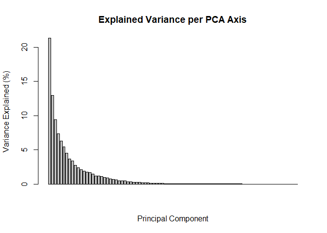<!-- -->

``` r
#looking at 2 and 3 axis:
s.class(pca.pops.allMarkersOnly$li, fac=pop(myData_genind_allMarkersOnly),
xax=2, yax=3, col=transp(funky(15),.6),
axesel=FALSE, cstar=0, cpoint=3)
add.scatter.eig(pca.pops.allMarkersOnly$eig[1:50],3,2,3, ratio=.2)
```

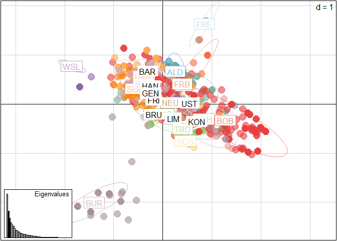<!-- -->

``` r
#emf(file="pca.allMarkersOnly.emf")
#s.class(pca.pops.allMarkersOnly$li, fac=pop(myData_genind_allMarkersOnly),
 #       col=funky(15))
#dev.off()

#check after removal of outliers:
setPop(myData_genind_aMO_noOutliers) <- ~Pop
x.pops_allMarkersOnly_noOutliers <- tab(myData_genind_aMO_noOutliers,
                             freq=TRUE, NA.method="mean")

pca.pops.aMO.noOutliers <- dudi.pca(x.pops_allMarkersOnly_noOutliers,center=TRUE,scale=FALSE, nf=3, scannf=FALSE)
s.label(pca.pops.aMO.noOutliers$li)
```

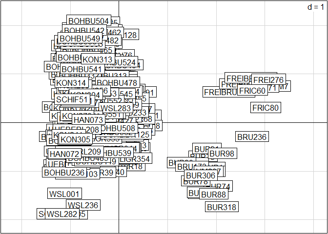<!-- -->

``` r
#looking at first two axes:
s.class(pca.pops.aMO.noOutliers$li,fac=pop(myData_genind_aMO_noOutliers),col=transp(funky(15),0.6),axesel=FALSE,cstar=0,cpoint=3)
add.scatter.eig(pca.pops.aMO.noOutliers$eig[1:50],3,1,2, ratio=.17)
```

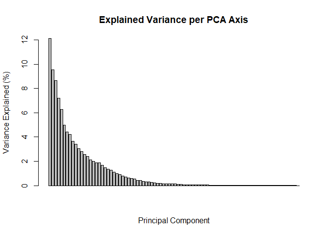<!-- -->

``` r
#looking at 2 and 3 axis:
s.class(pca.pops.aMO.noOutliers$li, fac=pop(myData_genind_aMO_noOutliers),
xax=2, yax=3, col=transp(funky(15),.6),
axesel=FALSE, cstar=0, cpoint=3)
add.scatter.eig(pca.pops.aMO.noOutliers$eig[1:50],3,2,3, ratio=.2)
```

<!-- -->

``` r
#clonecorrected PCA  with samplingYear
setPop(cc_myData_genind_allMarkersOnly_SY) <- ~Pop
x.pops_cc.SY <- tab(cc_myData_genind_allMarkersOnly_SY,
                    freq=TRUE, NA.method="mean")
pca.pops_cc.SY <- dudi.pca(df = x.pops_cc.SY,
                           center = TRUE, scale = FALSE, scannf = FALSE, nf = 3)
#looking at first two axes:
s.class(pca.pops_cc.SY$li,
        fac=pop(cc_myData_genind_allMarkersOnly_SY),
        col=transp(funky(15),0.6),axesel=FALSE,cstar=0,cpoint=3)
add.scatter.eig(pca.pops_cc.SY$eig[1:50],3,1,2, ratio=.17)
```

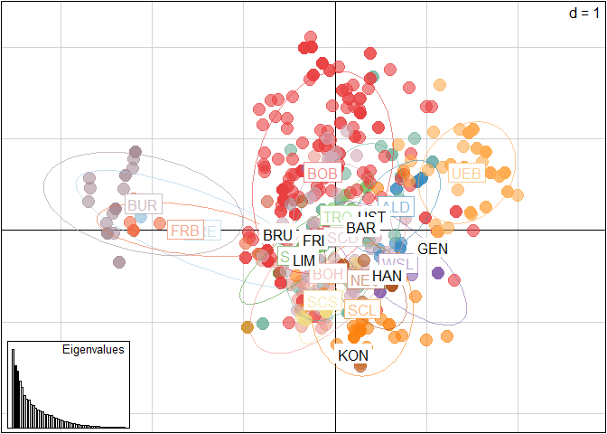<!-- -->

``` r
#looking at 2 and 3 axis:
s.class(pca.pops_cc.SY$li, fac=pop(cc_myData_genind_allMarkersOnly_SY),
xax=2, yax=3, col=transp(funky(15),.6),
axesel=FALSE, cstar=0, cpoint=3)
add.scatter.eig(pca.pops_cc.SY$eig[1:50],3,2,3, ratio=.2)
```

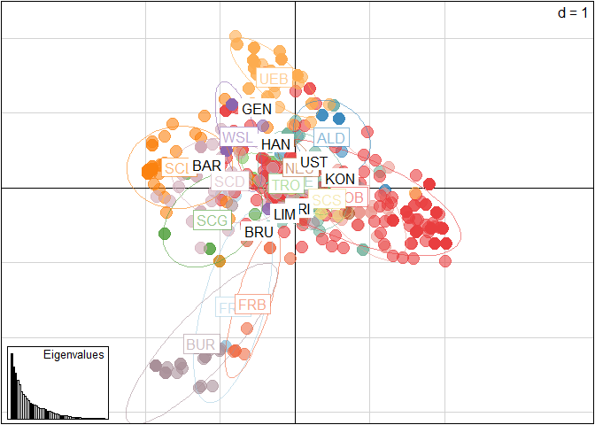<!-- -->

``` r
#emf(file="pca.cc.allMarkersOnly_SY.emf")
#s.class(pca.pops_cc.SY$li,
#        fac=pop(cc_myData_genind_allMarkersOnly_SY),
#        col=funky(15))
#dev.off()

#check after removal of outliers:
setPop(cc_myData_genind_aMO_noOutliers) <- ~Pop
x.pops.cc_allMarkersOnly_noOutliers <- tab(cc_myData_genind_aMO_noOutliers,
                             freq=TRUE, NA.method="mean")

pca.pops.cc.aMO.noOutliers <- dudi.pca(x.pops.cc_allMarkersOnly_noOutliers,center=TRUE,scale=FALSE, nf=3, scannf=FALSE)
s.label(pca.pops.cc.aMO.noOutliers$li)
```

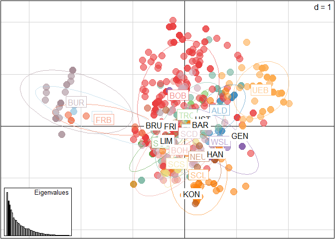<!-- -->

``` r
#looking at first two axes:
s.class(pca.pops.cc.aMO.noOutliers$li,fac=pop(cc_myData_genind_aMO_noOutliers),col=transp(funky(15),0.6),axesel=FALSE,cstar=0,cpoint=3)
add.scatter.eig(pca.pops.cc.aMO.noOutliers$eig[1:50],3,1,2, ratio=.17)
```

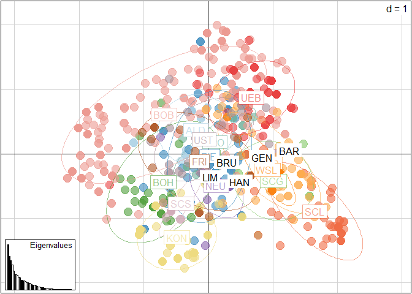<!-- -->

``` r
#looking at 2 and 3 axis:
s.class(pca.pops.cc.aMO.noOutliers$li, fac=pop(cc_myData_genind_aMO_noOutliers),
xax=2, yax=3, col=transp(funky(15),.6),
axesel=FALSE, cstar=0, cpoint=3)
add.scatter.eig(pca.pops.cc.aMO.noOutliers$eig[1:50],3,2,3, ratio=.2)
```

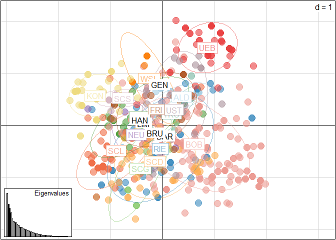<!-- -->

``` r
#clonecorrected PCA  with TruffleYear
setPop(cc_myData_genind_allMarkersOnly_TY) <- ~Pop
x.pops_cc.TY <- tab(cc_myData_genind_allMarkersOnly_TY,
                    freq=TRUE, NA.method="mean")
pca.pops_cc.TY <- dudi.pca(df = x.pops_cc.TY,
                           center = TRUE, scale = FALSE, scannf = FALSE, nf = 3)
#looking at first two axes:
s.class(pca.pops_cc.TY$li,
        fac=pop(cc_myData_genind_allMarkersOnly_TY),
        col=transp(funky(15),0.6),axesel=FALSE,cstar=0,cpoint=3)
add.scatter.eig(pca.pops_cc.TY$eig[1:50],3,1,2, ratio=.17)
```

<!-- -->

``` r
#looking at 2 and 3 axis:
s.class(pca.pops_cc.TY$li, fac=pop(cc_myData_genind_allMarkersOnly_TY),
xax=2, yax=3, col=transp(funky(15),.6),
axesel=FALSE, cstar=0, cpoint=3)
add.scatter.eig(pca.pops_cc.TY$eig[1:50],3,2,3, ratio=.2)
```

<!-- -->

``` r
#emf(file="pca.cc.allMarkersOnly_TY.emf")
#s.class(pca.pops_cc.TY_2$li,
#        fac=pop(cc_myData_genind_allMarkersOnly_TY),
#        col=funky(15))
#dev.off()

#plot(pca.pops_cc.TY$li, col=
```

# 2. DAPC

DAPC was pioneered by Jombart and colleagues (Jombart et al., 2010) and
can be used to infer the number of clusters of genetically related
individuals. In this multivariate statistical approach variance in the
sample is partitioned into a between-group and within- group component,
in an effort to maximize discrimination between groups. In DAPC, data is
first transformed using a principal components analysis (PCA) and
subsequently clusters are identified using discriminant analysis (DA).
This tutorial is based on the vignette written by Thibaut Jombart. We
encourage the user to explore this vignette further. The vignette can
also be opened within R by executing adegenetTutorial(“dapc”)

``` r
setPop(myData_genind_allMarkersOnly) <- ~Pop
dapc.allMarkers <- dapc(myData_genind_allMarkersOnly, var.contrib = TRUE, scale = FALSE, n.pca = 30, n.da = nPop(myData_genind_allMarkersOnly) - 1)
scatter(dapc.allMarkers, cell = 0, pch = 18:23, cstar = 0, mstree = TRUE, lwd = 2, lty = 2)
```

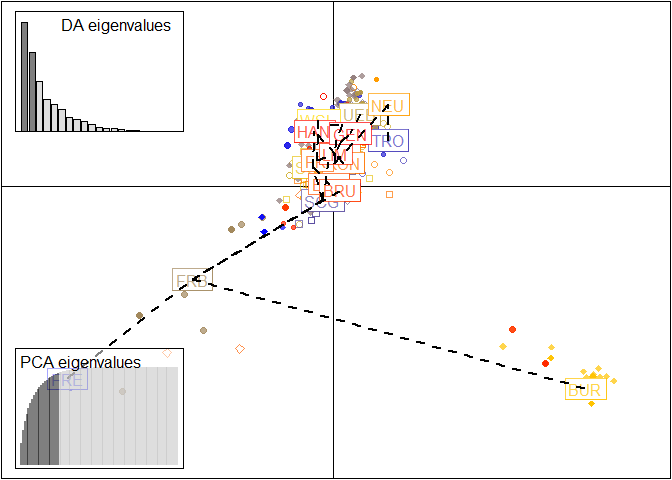<!-- -->

``` r
#BUR, FRB and FRE are separated from the cluster by their second axis (y) --> genetically distinct
#look at the DAPC without these populations:
setPop(myData_genind_aMO_noOutliers) <- ~Pop
dapc.allMarkers_noOutliers <- dapc(myData_genind_aMO_noOutliers, var.contrib = TRUE, scale = FALSE, n.pca = 30, n.da = nPop(myData_genind_aMO_noOutliers) - 1)
scatter(dapc.allMarkers_noOutliers, cell = 0, pch = 18:23, cstar = 0, mstree = TRUE, lwd = 2, lty = 2)
```

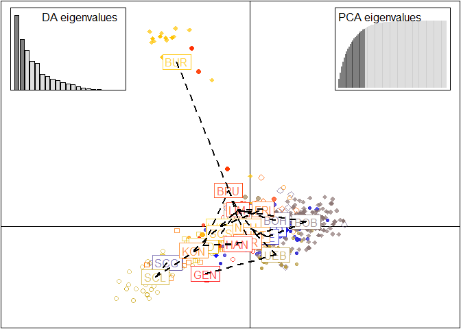<!-- -->

``` r
#and clonecorrected without outliers:
setPop(cc_myData_genind_aMO_noOutliers) <- ~Pop
dapc.cc.allMarkers_noOutliers <- dapc(cc_myData_genind_aMO_noOutliers, var.contrib = TRUE, scale = FALSE, n.pca = 30, n.da = nPop(cc_myData_genind_aMO_noOutliers) - 1)
scatter(dapc.cc.allMarkers_noOutliers, cell = 0, pch = 18:23, cstar = 0, mstree = TRUE, lwd = 2, lty = 2)
```

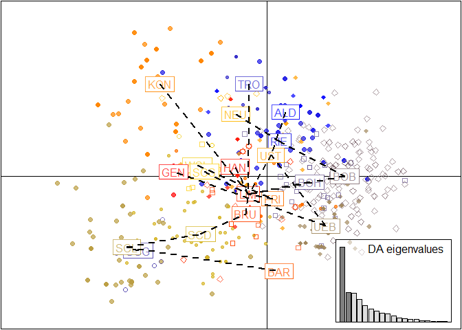<!-- -->
