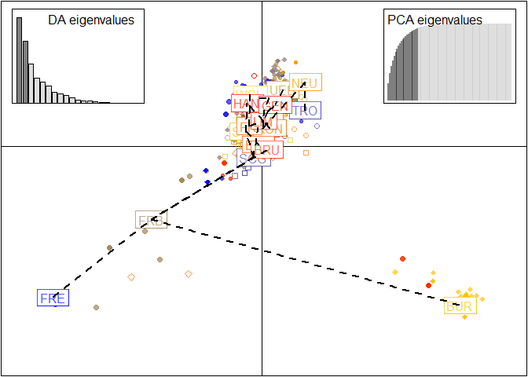

PCA and DAPC
================
Lia Baumann
2024-06-04

## 1. PCA

``` r
#uncorrected PCA with allMarkersOnly dataset
setPop(myData_genind_allMarkersOnly) <- ~Pop
x.pops_allMarkersOnly <- tab(myData_genind_allMarkersOnly,
                             freq=TRUE, NA.method="mean")

pca.pops.allMarkersOnly <- dudi.pca(x.pops_allMarkersOnly,center=TRUE,scale=FALSE, nf=3, scannf=FALSE)
s.label(pca.pops.allMarkersOnly$li)
```

<!-- -->

``` r
# Calculate explained variance for each PCA axis
explained_variance <- pca.pops.allMarkersOnly$eig / sum(pca.pops.allMarkersOnly$eig) * 100
barplot(explained_variance, main = "Explained Variance per PCA Axis", xlab = "Principal Component", ylab = "Variance Explained (%)")
```

<!-- -->

``` r
#looking at first two axes:
s.class(pca.pops.allMarkersOnly$li,fac=pop(myData_genind_allMarkersOnly),col=transp(funky(15),0.6),axesel=FALSE,cstar=0,cpoint=3)
add.scatter.eig(pca.pops.allMarkersOnly$eig[1:50],3,1,2, ratio=.17)
```

<!-- -->

``` r
#looking at 2 and 3 axis:
s.class(pca.pops.allMarkersOnly$li, fac=pop(myData_genind_allMarkersOnly),
xax=2, yax=3, col=transp(funky(15),.6),
axesel=FALSE, cstar=0, cpoint=3)
add.scatter.eig(pca.pops.allMarkersOnly$eig[1:50],3,2,3, ratio=.2)
```

<!-- -->

``` r
#emf(file="pca.allMarkersOnly.emf")
#s.class(pca.pops.allMarkersOnly$li, fac=pop(myData_genind_allMarkersOnly),
 #       col=funky(15))
#dev.off()


#clonecorrected PCA  with samplingYear
setPop(cc_myData_genind_allMarkersOnly_SY) <- ~Pop
x.pops_cc.SY <- tab(cc_myData_genind_allMarkersOnly_SY,
                    freq=TRUE, NA.method="mean")
pca.pops_cc.SY <- dudi.pca(df = x.pops_cc.SY,
                           center = TRUE, scale = FALSE, scannf = FALSE, nf = 3)

# Calculate explained variance for each PCA axis
cc.explained_variance <- pca.pops_cc.SY$eig / sum(pca.pops_cc.SY$eig) * 100
barplot(cc.explained_variance, main = "Explained Variance per PCA Axis", xlab = "Principal Component", ylab = "Variance Explained (%)")
```

<!-- -->

``` r
#looking at first two axes:
s.class(pca.pops_cc.SY$li,
        fac=pop(cc_myData_genind_allMarkersOnly_SY),
        col=transp(funky(15),0.6),axesel=FALSE,cstar=0,cpoint=3)
add.scatter.eig(pca.pops_cc.SY$eig[1:50],3,1,2, ratio=.17)
```

<!-- -->

``` r
#looking at 2 and 3 axis:
s.class(pca.pops_cc.SY$li, fac=pop(cc_myData_genind_allMarkersOnly_SY),
xax=2, yax=3, col=transp(funky(15),.6),
axesel=FALSE, cstar=0, cpoint=3)
add.scatter.eig(pca.pops_cc.SY$eig[1:50],3,2,3, ratio=.2)
```

<!-- -->

``` r
#emf(file="pca.cc.allMarkersOnly_SY.emf")
#s.class(pca.pops_cc.SY$li,
#        fac=pop(cc_myData_genind_allMarkersOnly_SY),
#        col=funky(15))
#dev.off()


#clonecorrected PCA  with TruffleYear
setPop(cc_myData_genind_allMarkersOnly_TY) <- ~Pop
x.pops_cc.TY <- tab(cc_myData_genind_allMarkersOnly_TY,
                    freq=TRUE, NA.method="mean")
pca.pops_cc.TY <- dudi.pca(df = x.pops_cc.TY,
                           center = TRUE, scale = FALSE, scannf = FALSE, nf = 3)
#looking at first two axes:
s.class(pca.pops_cc.TY$li,
        fac=pop(cc_myData_genind_allMarkersOnly_TY),
        col=transp(funky(15),0.6),axesel=FALSE,cstar=0,cpoint=3)
add.scatter.eig(pca.pops_cc.TY$eig[1:50],3,1,2, ratio=.17)
```

<!-- -->

``` r
#looking at 2 and 3 axis:
s.class(pca.pops_cc.TY$li, fac=pop(cc_myData_genind_allMarkersOnly_TY),
xax=2, yax=3, col=transp(funky(15),.6),
axesel=FALSE, cstar=0, cpoint=3)
add.scatter.eig(pca.pops_cc.TY$eig[1:50],3,2,3, ratio=.2)
```

<!-- -->

``` r
#emf(file="pca.cc.allMarkersOnly_TY.emf")
#s.class(pca.pops_cc.TY_2$li,
#        fac=pop(cc_myData_genind_allMarkersOnly_TY),
#        col=funky(15))
#dev.off()

#plot(pca.pops_cc.TY$li, col=
```

# 2. DAPC

DAPC was pioneered by Jombart and colleagues (Jombart et al., 2010) and
can be used to infer the number of clusters of genetically related
individuals. In this multivariate statistical approach variance in the
sample is partitioned into a between-group and within- group component,
in an effort to maximize discrimination between groups. In DAPC, data is
first transformed using a principal components analysis (PCA) and
subsequently clusters are identified using discriminant analysis (DA).
This tutorial is based on the vignette written by Thibaut Jombart. We
encourage the user to explore this vignette further. The vignette can
also be opened within R by executing adegenetTutorial or
<https://adegenet.r-forge.r-project.org/files/tutorial-dapc.pdf>

Usual approaches such as Principal Component Analysis (PCA) or Principal
Coordinates Analysis (PCoA / MDS) focus on V AR(X) (–\> total variance =
(variance between groups) + (variance within groups)). That is, they
only describe the global diversity, possibly overlooking differences
between groups. On the contrary, DAPC optimizes variances between groups
while minimizing variances within groups: it seeks synthetic variables,
the discriminant functions, which show differences between groups as
best as possible while minimizing variation within clusters.

The trade-off between power of discrimination and over-fitting can be
measured by the ascore, which is simply the difference between the
proportion of successful reassignment of the analysis (observed
discrimination) and values obtained using random groups (random
discrimination). It can be seen as the proportion of successful
reassignment corrected for the number of retained PCs. It is implemented
by a.score, which relies on repeating the DAPC analysis using randomized
groups, and computing a-scores for each group, as well as the average
a-score

``` r
setPop(myData_genind_allMarkersOnly) <- ~Pop
dapc2 <- dapc(myData_genind_allMarkersOnly, n.da=100, n.pca=10)
temp <- a.score(dapc2)
names(temp)
```

    ## [1] "tab"       "pop.score" "mean"

``` r
temp$pop.score
```

    ##         FRE         ALD         RIE         TRO         SCG         BOH 
    ##  0.95607477  0.87096774  0.56451613  0.97058824  1.00000000  0.65750000 
    ##         BOB         FRB         UEB         SCL         SCD         WSL 
    ## -0.01934732  0.46153846  0.95424837  0.86868687  0.81000000  0.94063604 
    ##         BUR         SCS         NEU         UST         KON         FRI 
    ##  0.96233184  0.96046512  0.78125000  0.68571429  0.85754717  0.96666667 
    ##         BAR         BRU         LIM         HAN         GEN 
    ##  0.90000000  0.71910112  0.73935185  0.44615385  0.90000000

``` r
temp$mean
```

    ## [1] 0.7806083

``` r
dapc2 <- dapc(myData_genind_allMarkersOnly, n.da=100, n.pca=50)
temp <- optim.a.score(dapc2)
```

<!-- -->

``` r
#optimal score is 21 PCAs

#now the same corrected
setPop(cc_myData_genind_allMarkersOnly_SY) <- ~Pop
cc.dapc2 <- dapc(cc_myData_genind_allMarkersOnly_SY, n.da=100, n.pca=10)
temp <- a.score(cc.dapc2)
names(temp)
```

    ## [1] "tab"       "pop.score" "mean"

``` r
temp$pop.score
```

    ##         FRE         ALD         RIE         TRO         SCG         BOH 
    ##  0.78571429  0.66666667  0.62407407  0.90000000  0.85555556  0.75151515 
    ##         BOB         FRB         UEB         SCL         SCD         WSL 
    ## -0.08507463 -0.02000000  0.94339623  0.84583333  0.74791667  0.83076923 
    ##         BUR         SCS         NEU         UST         KON         FRI 
    ##  0.87500000  0.75555556  0.85714286  0.26086957  0.95000000  0.74000000 
    ##         BAR         BRU         LIM         HAN         GEN 
    ##  0.70000000 -0.01666667  0.20833333  0.28461538  0.80000000

``` r
temp$mean
```

    ## [1] 0.6200529

``` r
cc.dapc2 <- dapc(cc_myData_genind_allMarkersOnly_SY, n.da=100, n.pca=50)
temp <- optim.a.score(cc.dapc2)
```

<!-- -->

``` r
temp
```

    ## $pop.score
    ## $pop.score$`1`
    ##        FRE        ALD        RIE        TRO        SCG        BOH        BOB 
    ##  0.0000000  0.0000000  0.0000000  0.0000000  0.0000000  0.0000000 -0.1691542 
    ##        FRB        UEB        SCL        SCD        WSL        BUR        SCS 
    ##  0.0000000  0.3962264  0.7500000  0.2916667  0.0000000  0.0000000  0.0000000 
    ##        NEU        UST        KON        FRI        BAR        BRU        LIM 
    ##  0.0000000  0.0000000  0.0000000  0.0000000  0.0000000  0.0000000  0.0000000 
    ##        HAN        GEN 
    ##  0.0000000  0.0000000 
    ## 
    ## $pop.score$`5`
    ##          FRE          ALD          RIE          TRO          SCG          BOH 
    ##  0.642857143  0.666666667  0.555555556  0.400000000  0.188888889  0.603030303 
    ##          BOB          FRB          UEB          SCL          SCD          WSL 
    ## -0.164179104  0.000000000  0.905660377  0.791666667  0.520833333  0.846153846 
    ##          BUR          SCS          NEU          UST          KON          FRI 
    ##  0.871875000  0.888888889  0.000000000  0.039130435  0.883333333  0.300000000 
    ##          BAR          BRU          LIM          HAN          GEN 
    ##  0.000000000  0.000000000  0.125000000 -0.007692308  0.000000000 
    ## 
    ## $pop.score$`10`
    ##         FRE         ALD         RIE         TRO         SCG         BOH 
    ##  0.78571429  0.66666667  0.62407407  0.88000000  0.86666667  0.74848485 
    ##         BOB         FRB         UEB         SCL         SCD         WSL 
    ## -0.08407960  0.00000000  0.94150943  0.85416667  0.74166667  0.84615385 
    ##         BUR         SCS         NEU         UST         KON         FRI 
    ##  0.87500000  0.75555556  0.85714286  0.24347826  0.94833333  0.75000000 
    ##         BAR         BRU         LIM         HAN         GEN 
    ##  0.60000000 -0.01666667  0.20833333  0.30769231  0.78000000 
    ## 
    ## $pop.score$`15`
    ##         FRE         ALD         RIE         TRO         SCG         BOH 
    ##  0.77142857  0.66190476  0.65555556  0.89000000  0.73333333  0.74242424 
    ##         BOB         FRB         UEB         SCL         SCD         WSL 
    ## -0.05024876  0.21000000  0.95094340  0.76041667  0.81458333  0.82307692 
    ##         BUR         SCS         NEU         UST         KON         FRI 
    ##  0.85937500  0.74444444  0.85000000  0.68695652  0.88500000  0.78500000 
    ##         BAR         BRU         LIM         HAN         GEN 
    ##  0.10000000 -0.01666667  0.44583333  0.65384615  0.76000000 
    ## 
    ## $pop.score$`20`
    ##        FRE        ALD        RIE        TRO        SCG        BOH        BOB 
    ## 0.56428571 0.78571429 0.74814815 0.90000000 0.72222222 0.73333333 0.01094527 
    ##        FRB        UEB        SCL        SCD        WSL        BUR        SCS 
    ## 0.42000000 0.93207547 0.73958333 0.83333333 0.81538462 0.82812500 0.70000000 
    ##        NEU        UST        KON        FRI        BAR        BRU        LIM 
    ## 0.88571429 0.76521739 0.90833333 0.80000000 0.10000000 0.21111111 0.33333333 
    ##        HAN        GEN 
    ## 0.90769231 0.62000000 
    ## 
    ## $pop.score$`25`
    ##        FRE        ALD        RIE        TRO        SCG        BOH        BOB 
    ## 0.57857143 0.83333333 0.67407407 0.90000000 0.66666667 0.70000000 0.08059701 
    ##        FRB        UEB        SCL        SCD        WSL        BUR        SCS 
    ## 0.76000000 0.90943396 0.70000000 0.83750000 0.71538462 0.80937500 0.77777778 
    ##        NEU        UST        KON        FRI        BAR        BRU        LIM 
    ## 0.84285714 0.76521739 0.87833333 0.77000000 0.00000000 0.39444444 0.32500000 
    ##        HAN        GEN 
    ## 0.77692308 0.58000000 
    ## 
    ## $pop.score$`30`
    ##       FRE       ALD       RIE       TRO       SCG       BOH       BOB       FRB 
    ## 0.4928571 0.8523810 0.6796296 0.8300000 0.6555556 0.6181818 0.1502488 0.7300000 
    ##       UEB       SCL       SCD       WSL       BUR       SCS       NEU       UST 
    ## 0.8566038 0.6854167 0.7916667 0.7076923 0.7812500 0.6888889 0.7857143 0.7521739 
    ##       KON       FRI       BAR       BRU       LIM       HAN       GEN 
    ## 0.8566667 0.7350000 0.0000000 0.5000000 0.4583333 0.8615385 0.4800000 
    ## 
    ## $pop.score$`35`
    ##       FRE       ALD       RIE       TRO       SCG       BOH       BOB       FRB 
    ## 0.4857143 0.8142857 0.6574074 0.8200000 0.7111111 0.6666667 0.1706468 0.6400000 
    ##       UEB       SCL       SCD       WSL       BUR       SCS       NEU       UST 
    ## 0.8830189 0.6750000 0.7916667 0.7076923 0.8000000 0.6666667 0.7928571 0.6521739 
    ##       KON       FRI       BAR       BRU       LIM       HAN       GEN 
    ## 0.8566667 0.6950000 0.0000000 0.5277778 0.4416667 0.8384615 0.4600000 
    ## 
    ## $pop.score$`40`
    ##       FRE       ALD       RIE       TRO       SCG       BOH       BOB       FRB 
    ## 0.6142857 0.6714286 0.6222222 0.7800000 0.5555556 0.6424242 0.2497512 0.5500000 
    ##       UEB       SCL       SCD       WSL       BUR       SCS       NEU       UST 
    ## 0.8528302 0.6958333 0.8041667 0.6384615 0.7781250 0.5111111 0.7142857 0.6565217 
    ##       KON       FRI       BAR       BRU       LIM       HAN       GEN 
    ## 0.8066667 0.6050000 0.0000000 0.4888889 0.4500000 0.7692308 0.4200000 
    ## 
    ## $pop.score$`45`
    ##       FRE       ALD       RIE       TRO       SCG       BOH       BOB       FRB 
    ## 0.7071429 0.5047619 0.6407407 0.8400000 0.6000000 0.6545455 0.2318408 0.5600000 
    ##       UEB       SCL       SCD       WSL       BUR       SCS       NEU       UST 
    ## 0.8226415 0.6833333 0.7979167 0.5461538 0.7781250 0.4333333 0.8000000 0.6304348 
    ##       KON       FRI       BAR       BRU       LIM       HAN       GEN 
    ## 0.8450000 0.6550000 0.0000000 0.4722222 0.4083333 0.5461538 0.5600000 
    ## 
    ## $pop.score$`50`
    ##       FRE       ALD       RIE       TRO       SCG       BOH       BOB       FRB 
    ## 0.6428571 0.4333333 0.6092593 0.6800000 0.6444444 0.6060606 0.2835821 0.4800000 
    ##       UEB       SCL       SCD       WSL       BUR       SCS       NEU       UST 
    ## 0.8433962 0.7062500 0.7666667 0.6846154 0.7531250 0.4222222 0.6500000 0.6043478 
    ##       KON       FRI       BAR       BRU       LIM       HAN       GEN 
    ## 0.8283333 0.6300000 0.0000000 0.4722222 0.4000000 0.5538462 0.6000000 
    ## 
    ## 
    ## $mean
    ##          1          5         10         15         20         25         30 
    ## 0.05516256 0.39381170 0.61651707 0.63987856 0.66367620 0.66415171 0.64999125 
    ##         35         40         45         50 
    ## 0.64149914 0.60333866 0.59642085 0.57802443 
    ## 
    ## $pred
    ## $pred$x
    ##  [1]  1  2  3  4  5  6  7  8  9 10 11 12 13 14 15 16 17 18 19 20 21 22 23 24 25
    ## [26] 26 27 28 29 30 31 32 33 34 35 36 37 38 39 40 41 42 43 44 45 46 47 48 49 50
    ## 
    ## $pred$y
    ##  [1] 0.05516256 0.14642393 0.23505112 0.31839632 0.39381170 0.45910743
    ##  [7] 0.51392568 0.55836660 0.59253034 0.61651707 0.63084755 0.63772505
    ## [13] 0.63977346 0.63961667 0.63987856 0.64257799 0.64731374 0.65307953
    ## [19] 0.65886910 0.66367620 0.66670572 0.66800727 0.66784161 0.66646950
    ## [25] 0.66415171 0.66116890 0.65788131 0.65466908 0.65191235 0.64999125
    ## [31] 0.64908812 0.64859406 0.64770235 0.64560628 0.64149914 0.63490043
    ## [37] 0.62663448 0.61785184 0.60970305 0.60333866 0.59957216 0.59786886
    ## [43] 0.59735703 0.59716494 0.59642085 0.59444596 0.59133310 0.58736805
    ## [49] 0.58283657 0.57802443
    ## 
    ## 
    ## $best
    ## [1] 22

``` r
#optimal score is 30 PCAs and increasing with increasing number of runs
```

``` r
# Idea: to find the optimal number of clusters, we use k-means, which will maximise the variance between groups (B(X)).
# Therefore we run k-means sequentially with rising numbers of k and compare it with the Bayesian Information Criterion BIC where we will choose the clustering solution corresponding to the lowest BIC.
# First, a PCA is performed but no information is lost due to keeping the principal components and therefore all variation in the original data. The analysis will go faster if we reduce the number of PCs to be retained, though.
# Clusters can be identified using find.clusters() which will first run the PCA and then the kmeans()

# Route 1: uncorrected AllMarkersOnly
setPop(myData_genind_allMarkersOnly) <- ~Pop
grp <- find.clusters(myData_genind_allMarkersOnly, max.n.clust=6, max.n.pca=40, n.pca=21)
```

<!-- -->

    ## Choose the number of clusters (>=2):

``` r
#no clear model exists, the more the merrier but it's not very useful / more than 30 PCAs retained don't give a lot more information so we keep it at 30 for the moment
table(pop(myData_genind_allMarkersOnly), grp$grp)
```

    ##      
    ##         1
    ##   FRE 214
    ##   ALD  62
    ##   RIE  62
    ##   TRO  34
    ##   SCG  15
    ##   BOH  40
    ##   BOB 429
    ##   FRB  13
    ##   UEB 153
    ##   SCL  99
    ##   SCD 100
    ##   WSL 283
    ##   BUR 223
    ##   SCS  43
    ##   NEU  32
    ##   UST  35
    ##   KON 212
    ##   FRI 120
    ##   BAR   1
    ##   BRU 178
    ##   LIM 216
    ##   HAN  65
    ##   GEN  10

``` r
table.value(table(pop(myData_genind_allMarkersOnly), grp$grp), col.lab=paste("inf", 1:6),
row.lab=paste("ori", 1:6))
```

<!-- -->

``` r
#this looks horrible and I don't understand it at all

# Route 2: corrected AllMarkersOnly
setPop(cc_myData_genind_allMarkersOnly_SY) <- ~Pop
cc_grp <- find.clusters(cc_myData_genind_allMarkersOnly_SY, max.n.clust=6, max.n.pca=40, n.pca=26)
```

<!-- -->

    ## Choose the number of clusters (>=2):

``` r
#no clear model exists, the more the merrier but it's not very useful
table(pop(cc_myData_genind_allMarkersOnly_SY), cc_grp$grp)
```

    ##      
    ##         1
    ##   FRE  14
    ##   ALD  21
    ##   RIE  54
    ##   TRO  10
    ##   SCG   9
    ##   BOH  33
    ##   BOB 201
    ##   FRB  10
    ##   UEB  53
    ##   SCL  48
    ##   SCD  48
    ##   WSL  13
    ##   BUR  32
    ##   SCS   9
    ##   NEU  14
    ##   UST  23
    ##   KON  60
    ##   FRI  20
    ##   BAR   1
    ##   BRU  18
    ##   LIM  24
    ##   HAN  13
    ##   GEN   5

``` r
table.value(table(pop(cc_myData_genind_allMarkersOnly_SY), cc_grp$grp), col.lab=paste("inf", 1:6),
row.lab=paste("ori", 1:6))
```

<!-- -->

DAPC aims to provide an efficient description of genetic clusters using
a few synthetic variables. These are constructed as linear combinations
of the original variables (alleles) which have the largest between-group
variance and the smallest within-group variance. Coefficients of the
alleles used in the linear combination are called loadings, while the
synthetic variables are themselves referred to as discriminant
functions. While these are different from the admixture coefficients of
software like STRUCTURE, they can still be interpreted as proximities of
individuals to the different clusters. Membership probabilities also
provide indications of how clear-cut genetic clusters are. Loose
clusters will result in fairly flat distributions of membership
probabilities of individuals across clusters, pointing to possible
admixture. Lastly, using the allele loadings, it is possible to
represent new individuals (which have not participated to the analysis)
onto the factorial planes, and derive membership probabilities as welll.
Such individuals are referred to as supplementary individuals.

``` r
#uncorrected AllMarkersOnly, only visualising the DAPC only preset clusters
setPop(myData_genind_allMarkersOnly) <- ~Pop
dapc.allMarkers <- dapc(myData_genind_allMarkersOnly,var.contrib = TRUE, scale = FALSE, n.pca = 21, n.da = nPop(myData_genind_allMarkersOnly) - 1)
scatter(dapc.allMarkers, cell = 0, pch = 18:23, cstar = 0, mstree = TRUE, lwd = 2, lty = 2, scree.pca=TRUE,posi.pca="topright", scree.da=TRUE, posi.da="top")
```

<!-- -->

``` r
# corrected AllMarkersOnly without presetting clusters
setPop(cc_myData_genind_allMarkersOnly_SY) <- ~Pop
cc.dapc.allMarkers <- dapc(cc_myData_genind_allMarkersOnly_SY,var.contrib = TRUE, scale = FALSE, n.pca = 21, n.da = nPop(cc_myData_genind_allMarkersOnly_SY) - 1)
scatter(cc.dapc.allMarkers, cell = 0, pch = 18:23, cstar = 0, mstree = TRUE, lwd = 2, lty = 2, scree.pca=TRUE,posi.pca="topright", scree.da=TRUE, posi.da="top")
```

<!-- -->

``` r
#clonecorrected  AllMarkersOnly
setPop(cc_myData_genind_allMarkersOnly_SY) <- ~Pop
cc_dapc.allMarkers <- dapc(cc_myData_genind_allMarkersOnly_SY, var.contrib = TRUE, scale = FALSE, n.pca = 23, n.da = nPop(cc_myData_genind_allMarkersOnly_SY) - 1)
scatter(cc_dapc.allMarkers, cell = 0, pch = 18:23, cstar = 0, mstree = TRUE, lwd = 2, lty = 2, scree.pca=TRUE,posi.pca="bottomleft", scree.da=TRUE, posi.da="top")
```

<!-- -->
