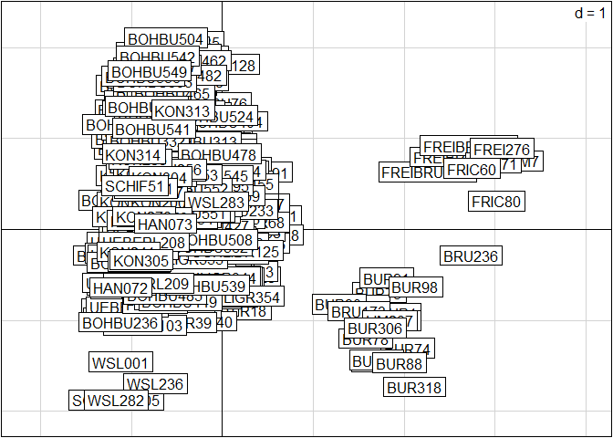

PCA
================
Lia Baumann
2024-06-04

## PCA

from
<https://www.molecularecologist.com/2015/07/30/pca-of-multilocus-genotypes-in-r/>

``` r
library(scatterplot3d)
library(rgl)
library(tidyverse)
library(readxl)
library(knitr)
T_all <- read_excel("Tuaest_Master_genMonit_haploid_MP_Mai2024.xlsx")
cc_FullTable_Tuaest_allMarkersOnly <- read.csv("C:/Users/liaba/OneDrive - Eidg. Forschungsanstalt WSL/R/truffles/cc_TUAEST_ALLMARKERSONLY_HWE.csv")
T_all <- separate_wider_delim(T_all,Code_Analyses2, delim="_", names = c("Code","Yr"))
T_all_withMLGs_allMarkersOnly <- inner_join(T_all,cc_FullTable_Tuaest_allMarkersOnly,by=c("Code"="Sample")) %>%
  select(Code, MLG, Site_1_abrev, truffle_year, Sampling_year, Sampling_date, aest06_1.x, aest07_1.x, aest15_1.x, aest26_1.x, aest28_1.x, aest35_1.x, aest36_1.x, aest01_1.x, aest10_1.x, aest18_1.x, aest24_1.x, aest25_1.x, aest29_1.x, aest31_1.x)

T_all_allMarkersOnly.pca<-prcomp(T_all_withMLGs_allMarkersOnly[,7:20], center=TRUE,scale.=TRUE)
pcs123<-T_all_allMarkersOnly.pca$x[,1:3]
WSL<-grep("WSL",T_all_withMLGs_allMarkersOnly$Site_1_abrev)
BUR<-grep("BUR",T_all_withMLGs_allMarkersOnly$Site_1_abrev)
BRU<-grep("BRU",T_all_withMLGs_allMarkersOnly$Site_1_abrev)
SCG<-grep("SCG",T_all_withMLGs_allMarkersOnly$Site_1_abrev)

p<-scatterplot3d(pcs123[WSL,1],pcs123[WSL,2],pcs123[WSL,3],color=c("red"),
                 pch=20,xlab="PC1",ylab="PC2",zlab="PC3",
                 xlim=c(min(pcs123[,1]),max(pcs123[,1])),
                 ylim=c(min(pcs123[,2]),max(pcs123[,2])),
                 zlim=c(min(pcs123[,3]),max(pcs123[,3])))

p$points3d(pcs123[BUR,1],pcs123[BUR,2], pcs123[BUR,3],col=c("blue"),pch=20)
p$points3d(pcs123[BRU,1],pcs123[BRU,2], pcs123[BRU,3],col=c("maroon"),pch=20)
p$points3d(pcs123[SCG,1],pcs123[SCG,2], pcs123[SCG,3],col=c("green"),pch=20)
legend(p$xyz.convert(-80, 20, -10), col= c("red","blue","maroon","green"), bg="white", pch=c(20,20,20,20), yjust=0,
  legend = c("WSL", "BUR", "BRU", "SCG"), cex = 1.1)
```

<!-- -->

## 3. PCA

``` r
#uncorrected PCA with allMarkersOnly dataset
setPop(myData_genind_allMarkersOnly) <- ~Pop
x.pops_allMarkersOnly <- tab(myData_genind_allMarkersOnly,
                             freq=TRUE, NA.method="mean")

pca.pops.allMarkersOnly <- dudi.pca(x.pops_allMarkersOnly,center=TRUE,scale=FALSE, nf=3, scannf=FALSE)
s.label(pca.pops.allMarkersOnly$li)
```

<!-- -->

``` r
#looking at first two axes:
s.class(pca.pops.allMarkersOnly$li,fac=pop(myData_genind_allMarkersOnly),col=transp(funky(15),0.6),axesel=FALSE,cstar=0,cpoint=3)
add.scatter.eig(pca.pops.allMarkersOnly$eig[1:50],3,1,2, ratio=.17)
```

<!-- -->

``` r
#looking at 2 and 3 axis:
s.class(pca.pops.allMarkersOnly$li, fac=pop(myData_genind_allMarkersOnly),
xax=2, yax=3, col=transp(funky(15),.6),
axesel=FALSE, cstar=0, cpoint=3)
add.scatter.eig(pca.pops.allMarkersOnly$eig[1:50],3,2,3, ratio=.2)
```

<!-- -->

``` r
#emf(file="pca.allMarkersOnly.emf")
#s.class(pca.pops.allMarkersOnly$li, fac=pop(myData_genind_allMarkersOnly),
 #       col=funky(15))
#dev.off()

#clonecorrected PCA  with samplingYear
setPop(cc_myData_genind_allMarkersOnly_SY) <- ~Pop
x.pops_cc.SY <- tab(cc_myData_genind_allMarkersOnly_SY,
                    freq=TRUE, NA.method="mean")
pca.pops_cc.SY <- dudi.pca(df = x.pops_cc.SY,
                           center = TRUE, scale = FALSE, scannf = FALSE, nf = 3)
#looking at first two axes:
s.class(pca.pops_cc.SY$li,
        fac=pop(cc_myData_genind_allMarkersOnly_SY),
        col=transp(funky(15),0.6),axesel=FALSE,cstar=0,cpoint=3)
add.scatter.eig(pca.pops_cc.SY$eig[1:50],3,1,2, ratio=.17)
```

<!-- -->

``` r
#looking at 2 and 3 axis:
s.class(pca.pops_cc.SY$li, fac=pop(cc_myData_genind_allMarkersOnly_SY),
xax=2, yax=3, col=transp(funky(15),.6),
axesel=FALSE, cstar=0, cpoint=3)
add.scatter.eig(pca.pops_cc.SY$eig[1:50],3,2,3, ratio=.2)
```

<!-- -->

``` r
#emf(file="pca.cc.allMarkersOnly_SY.emf")
#s.class(pca.pops_cc.SY$li,
#        fac=pop(cc_myData_genind_allMarkersOnly_SY),
#        col=funky(15))
#dev.off()

#clonecorrected PCA  with TruffleYear
setPop(cc_myData_genind_allMarkersOnly_TY) <- ~Pop
x.pops_cc.TY <- tab(cc_myData_genind_allMarkersOnly_TY,
                    freq=TRUE, NA.method="mean")
pca.pops_cc.TY <- dudi.pca(df = x.pops_cc.TY,
                           center = TRUE, scale = FALSE, scannf = FALSE, nf = 3)
#looking at first two axes:
s.class(pca.pops_cc.TY$li,
        fac=pop(cc_myData_genind_allMarkersOnly_TY),
        col=transp(funky(15),0.6),axesel=FALSE,cstar=0,cpoint=3)
add.scatter.eig(pca.pops_cc.TY$eig[1:50],3,1,2, ratio=.17)
```

<!-- -->

``` r
#looking at 2 and 3 axis:
s.class(pca.pops_cc.TY$li, fac=pop(cc_myData_genind_allMarkersOnly_TY),
xax=2, yax=3, col=transp(funky(15),.6),
axesel=FALSE, cstar=0, cpoint=3)
add.scatter.eig(pca.pops_cc.TY$eig[1:50],3,2,3, ratio=.2)
```

<!-- -->

``` r
#emf(file="pca.cc.allMarkersOnly_TY.emf")
#s.class(pca.pops_cc.TY_2$li,
#        fac=pop(cc_myData_genind_allMarkersOnly_TY),
#        col=funky(15))
#dev.off()

#plot(pca.pops_cc.TY$li, col=
```
