## Genetic information

Erklärung der Datenherkunft:

1.  myData = Daten_Genalex.csv

Aus myData werden danach alle missing (NA) gefiltert:

Tuaest_allMarkersOnly \<- myData %\>% missingno("geno", cutoff = 0)


```r
setPop(Tuaest_allMarkersOnly) <- ~Pop
poppr_withoutNA <- poppr(Tuaest_allMarkersOnly)
kable(select(poppr_withoutNA,Pop,N,MLG,eMLG,SE,H,G,lambda,E.5,Hexp,Ia,rbarD))
```


|Pop   |    N| MLG|     eMLG|        SE|         H|         G|    lambda|       E.5|      Hexp|         Ia|     rbarD|
|:-----|----:|---:|--------:|---------:|---------:|---------:|---------:|---------:|---------:|----------:|---------:|
|FRE   |  214|   6| 1.539399| 0.6722074| 0.3010990|  1.121406| 0.1082627| 0.3455497| 0.0674671|  9.8312168| 0.8435767|
|ALD   |   62|  12| 4.094020| 1.1922532| 1.4301026|  2.310096| 0.5671176| 0.4120929| 0.1400242|  3.6838855| 0.3652128|
|RIE   |   62|  39| 9.175120| 0.8155850| 3.5065466| 28.264706| 0.9646202| 0.8432482| 0.4263051|  0.8823601| 0.0778223|
|TRO   |   34|   6| 3.539940| 0.9044355| 1.1637449|  2.312000| 0.5674740| 0.5958486| 0.1529157|  2.4640775| 0.3408221|
|SCG   |   15|   6| 5.138861| 0.7032333| 1.6170532|  4.411765| 0.7733333| 0.8448681| 0.2891156|  2.2825279| 0.2888403|
|BOH   |   40|  27| 8.363669| 1.1159864| 3.0081359| 12.903226| 0.9225000| 0.6183617| 0.2779304|  1.3529540| 0.1363888|
|BOB   |  429| 125| 8.053505| 1.2226228| 3.7299217| 16.156703| 0.9381062| 0.3726217| 0.3379152|  2.1478566| 0.1899626|
|FRB   |   13|   7| 5.846154| 0.7692308| 1.7118451|  4.567568| 0.7810651| 0.7859511| 0.5064103|  6.0738307| 0.4700290|
|UEB   |  153|  29| 6.165380| 1.2801106| 2.4477034|  6.814847| 0.8532616| 0.5505564| 0.1454126|  0.7315988| 0.0909901|
|SCL   |   99|  39| 6.359011| 1.3989524| 2.6490635|  6.114161| 0.8364453| 0.3891822| 0.1762376|  2.2112657| 0.2492060|
|SCD   |  100|  40| 6.000809| 1.4565731| 2.5226599|  4.163197| 0.7598000| 0.2759798| 0.2686003|  2.5489256| 0.2569022|
|WSL   |  283|   4| 1.300608| 0.5021267| 0.1679418|  1.066190| 0.0620809| 0.3619560| 0.0144994|  4.2811571| 0.5055186|
|BUR   |  223|  19| 3.898280| 0.9326109| 1.5637569|  3.503276| 0.7145529| 0.6628151| 0.2315650|  4.7673727| 0.4420210|
|SCS   |   42|   6| 2.190476| 0.9047313| 0.5566229|  1.283843| 0.2210884| 0.3811146| 0.0505226|  3.9530106| 0.4511154|
|NEU   |   32|   6| 3.119230| 0.9106796| 0.9606248|  1.835125| 0.4550781| 0.5176412| 0.1031106|  2.5052006| 0.3431153|
|UST   |   35|  22| 8.356705| 1.0497898| 2.8767637| 13.764045| 0.9273469| 0.7617272| 0.3733493|  1.1158778| 0.0960655|
|KON   |  212|  25| 5.421408| 1.2057463| 2.1288833|  5.213921| 0.8082058| 0.5690278| 0.2292319|  1.2911268| 0.1186808|
|FRI   |  120|  11| 3.802453| 0.9470008| 1.4376132|  3.138622| 0.6813889| 0.6661060| 0.2952481|  4.2495522| 0.3842205|
|BAR   |    1|   1| 1.000000| 0.0000000| 0.0000000|  1.000000| 0.0000000|       NaN|       NaN|         NA|        NA|
|BRU   |  178|  12| 2.962104| 0.9294881| 1.0212038|  1.836541| 0.4554980| 0.4708833| 0.4326432| 12.1705207| 0.9362151|
|LIM   |  216|  15| 3.771861| 0.9168608| 1.4707184|  3.179501| 0.6854853| 0.6501392| 0.4155131|  5.1943548| 0.4137422|
|HAN   |   65|   7| 4.054125| 0.7804336| 1.4532618|  3.494624| 0.7138462| 0.7612424| 0.2884272|  2.1145302| 0.2207899|
|GEN   |   10|   2| 2.000000| 0.0000000| 0.3250830|  1.219512| 0.1800000| 0.5714298| 0.0857143|  5.0000000| 1.0000000|
|SCHIF |    1|   1| 1.000000| 0.0000000| 0.0000000|  1.000000| 0.0000000|       NaN|       NaN|         NA|        NA|
|Total | 2639| 449| 8.910634| 0.9757313| 4.5410836| 34.529314| 0.9710391| 0.3613369| 0.6444092|  3.0044991| 0.2324626|

Info zur Tabelle: N = Number of individuals, MLG = Number of multilocus
genotypes, eMLG = number of expected MLG at the smallest sample size \>=
10 based on rarefaction SE = Standard error based on eMLG, H =
Shannon-Wiener Index of MLG diversity G = Stoddart & Taylor's Index of
MLG diversity lambda = Simpsons index, E.5 = Evenness, Hexp = Neis
Expected Heterozygosity Ia = Index of association, rbarD = stand. Index
of association

-- Wegen der wenigen Samples habe ich SCHIF und BAR danach ausgelassen.
–

## Persistence over the years (MLG per population)

1.  Import der klonkorrigierten Datei "cc_TUAEST_ALLMARKERSONLY", welche
    mit MLGSim generiert wurde (enthält Sample, MLG, PSex sowie die
    Marker):

cc_FullTable_Tuaest_allMarkersOnly \<-
read.csv("C:/Users/liaba/OneDrive - Eidg. Forschungsanstalt
WSL/R/truffles/cc_TUAEST_ALLMARKERSONLY_HWE.csv")

2.  MLG Duplikate werden entfernt

cc_distinctMLGs_allMarkersOnly \<-
cc_FullTable_Tuaest_allMarkersOnly[!duplicated(cc_FullTable_Tuaest_allMarkersOnly\$MLG),]

3.  T_all kommt aus der Masterliste
    Tuaest_Master_genMonit_haploid_MP_Mai2024.xlsx

Hier wird zuerst die Spalte "Code_Analyses2" vom Jahr separiert, und
danach verjoint, damit die MLGs zusammen mit den Sample-Informationen
verfügbar sind:

T_all \<- separate_wider_delim(T_all,Code_Analyses2, delim="\_", names =
c("Code","Yr"))

T_all_withMLGs_allMarkersOnly \<-
inner_join(T_all,cc_FullTable_Tuaest_allMarkersOnly,by=c("Code"="Sample"))
%\>% select(Code, MLG, Site_1_abrev, truffle_year,
Sampling_year,Sampling_date)

4.  Nun können wir damit die Grafiken generieren:

## Looking at persistence over years

Der erste Plot ist interaktiv (kann auch alle interaktiv machen, bei
Bedarf).

--\> bei LIM und BRU kommen die MLGs doppelt vor bzw. an beiden Orten...
sollte man diese vielleicht zusammen nehmen?


```r
ggplotly(ggplot(subset(T_all_withMLGs_allMarkersOnly, Site_1_abrev %in% "BOB"),aes(Sampling_year,MLG)) + geom_point() + geom_line(aes(group=MLG)) +
  labs(title ="Interactive distribution of MLGs in BOB (Bohlingen Buche) over the years") + scale_x_continuous(breaks=2010:2023))
```

```{=html}
<div class="plotly html-widget html-fill-item" id="htmlwidget-889557aefe6acfdd32b8" style="width:672px;height:480px;"></div>
<script type="application/json" data-for="htmlwidget-889557aefe6acfdd32b8">{"x":{"data":[{"x":[2011,2011,2011,2011,2011,2011,2012,2012,2012,2012,2012,2012,2012,2012,2012,2012,2012,2012,2012,2012,2012,2012,2012,2012,2012,2012,2012,2012,2012,2012,2012,2012,2012,2012,2012,2012,2012,2012,2012,2012,2012,2012,2013,2013,2013,2013,2013,2013,2013,2013,2013,2013,2013,2013,2013,2013,2013,2013,2013,2013,2013,2013,2013,2013,2013,2013,2013,2013,2013,2013,2013,2013,2013,2013,2013,2013,2013,2013,2013,2013,2013,2013,2013,2013,2013,2013,2013,2013,2013,2013,2013,2013,2014,2014,2014,2014,2014,2014,2014,2014,2014,2014,2014,2014,2014,2014,2014,2014,2014,2014,2014,2014,2014,2014,2014,2014,2014,2014,2014,2014,2014,2014,2015,2015,2015,2015,2015,2015,2015,2015,2015,2015,2015,2015,2015,2015,2015,2015,2016,2016,2016,2016,2016,2016,2016,2016,2016,2016,2016,2016,2016,2016,2016,2016,2016,2016,2016,2016,2016,2016,2016,2016,2016,2016,2016,2016,2016,2016,2016,2016,2016,2016,2016,2016,2016,2016,2016,2016,2016,2016,2016,2016,2016,2016,2016,2016,2016,2016,2016,2016,2016,2017,2017,2017,2017,2017,2017,2017,2017,2017,2017,2017,2017,2017,2017,2017,2017,2017,2017,2017,2017,2017,2017,2017,2017,2017,2017,2017,2017,2017,2017,2017,2017,2017,2017,2017,2017,2017,2017,2017,2017,2017,2017,2017,2017,2017,2017,2017,2017,2017,2017,2017,2017,2017,2017,2017,2017,2017,2017,2017,2017,2017,2017,2017,2017,2017,2017,2017,2017,2017,2017,2017,2017,2017,2017,2017,2017,2017,2017,2017,2017,2017,2017,2017,2017,2017,2017,2017,2017,2017,2017,2017,2017,2017,2017,2017,2017,2017,2017,2017,2017,2017,2017,2017,2017,2017,2017,2017,2017,2017,2017,2017,2017,2017,2017,2017,2017,2017,2017,2017,2017,2017,2017,2017,2017,2017,2017,2017,2017,2017,2017,2017,2017,2017,2017,2017,2017,2017,2017,2017,2017,2017,2017,2017,2017,2017,2018,2018,2018,2018,2018,2018,2018,2018,2018,2018,2018,2018,2018,2018,2018,2018,2018,2018,2018,2018,2018,2018,2018,2018,2018,2018,2018,2018,2018,2018,2018,2018,2018,2018,2018,2018,2018,2018,2018,2018,2018,2018,2018,2018,2018,2018,2018,2018,2018,2018,2018,2018,2018,2018,2018,2018,2018,2018,2018,2018,2018,2018,2018,2018,2018,2019,2019,2019,2019,2019,2019,2019,2019,2019,2019,2019,2019,2019,2019,2019,2019,2019,2019,2019,2019,2019,2019,2019,2019,2019,2019,2019,2019],"y":[117,117,105,106,124,33,112,117,53,62,117,117,117,120,105,118,117,117,117,118,106,117,117,117,24,111,106,14,106,117,117,117,13,9,61,98,97,106,117,44,67,106,61,117,2,105,112,52,113,105,8,46,113,29,29,39,23,123,112,117,66,115,118,105,69,106,42,100,117,112,113,113,74,115,117,118,30,113,28,117,117,118,73,117,117,113,118,118,125,42,82,72,86,36,103,18,90,57,117,113,1,37,117,110,106,117,105,59,15,114,105,4,116,117,113,113,17,51,3,122,118,38,74,118,85,76,117,21,30,48,96,106,27,49,67,112,29,112,113,117,117,108,2,106,2,113,117,117,113,115,92,117,106,113,113,113,113,107,106,117,106,106,2,42,91,113,117,62,117,22,28,44,117,88,106,112,91,117,62,108,19,83,77,87,50,99,66,77,28,66,77,105,105,117,117,117,118,113,106,117,113,117,105,117,117,117,117,106,30,117,118,29,105,105,105,117,106,117,113,117,60,105,117,42,55,113,112,113,42,113,106,105,81,93,108,58,35,113,117,42,117,105,117,113,118,105,105,105,113,113,102,113,112,117,95,117,106,117,113,117,113,117,54,42,106,61,113,105,29,101,118,117,105,118,118,113,112,104,5,94,71,32,42,42,113,66,113,42,79,66,113,65,105,117,54,64,118,113,70,113,41,117,79,61,42,106,117,42,66,113,28,112,30,117,32,61,45,79,117,83,63,61,106,117,62,64,45,117,117,109,56,40,89,42,55,55,113,42,66,77,113,45,77,105,42,109,84,42,117,31,113,118,20,87,117,11,117,117,105,11,118,87,30,119,6,68,6,99,28,61,118,78,11,113,62,10,112,112,26,61,99,6,113,99,117,117,117,67,12,80,34,7,119,117,99,25,113,105,113,105,6,41,102,113,89,42,41,41,113,16,112,105,5,47,75,41,104,112,55,41,121,113,113,113,113,115,41,5,43],"text":["Sampling_year: 2011<br />MLG: MLG81","Sampling_year: 2011<br />MLG: MLG81","Sampling_year: 2011<br />MLG: MLG67","Sampling_year: 2011<br />MLG: MLG68","Sampling_year: 2011<br />MLG: MLG93","Sampling_year: 2011<br />MLG: MLG217","Sampling_year: 2012<br />MLG: MLG76","Sampling_year: 2012<br />MLG: MLG81","Sampling_year: 2012<br />MLG: MLG302","Sampling_year: 2012<br />MLG: MLG378","Sampling_year: 2012<br />MLG: MLG81","Sampling_year: 2012<br />MLG: MLG81","Sampling_year: 2012<br />MLG: MLG81","Sampling_year: 2012<br />MLG: MLG86","Sampling_year: 2012<br />MLG: MLG67","Sampling_year: 2012<br />MLG: MLG82","Sampling_year: 2012<br />MLG: MLG81","Sampling_year: 2012<br />MLG: MLG81","Sampling_year: 2012<br />MLG: MLG81","Sampling_year: 2012<br />MLG: MLG82","Sampling_year: 2012<br />MLG: MLG68","Sampling_year: 2012<br />MLG: MLG81","Sampling_year: 2012<br />MLG: MLG81","Sampling_year: 2012<br />MLG: MLG81","Sampling_year: 2012<br />MLG: MLG192","Sampling_year: 2012<br />MLG: MLG75","Sampling_year: 2012<br />MLG: MLG68","Sampling_year: 2012<br />MLG: MLG159","Sampling_year: 2012<br />MLG: MLG68","Sampling_year: 2012<br />MLG: MLG81","Sampling_year: 2012<br />MLG: MLG81","Sampling_year: 2012<br />MLG: MLG81","Sampling_year: 2012<br />MLG: MLG118","Sampling_year: 2012<br />MLG: MLG109","Sampling_year: 2012<br />MLG: MLG377","Sampling_year: 2012<br />MLG: MLG59","Sampling_year: 2012<br />MLG: MLG55","Sampling_year: 2012<br />MLG: MLG68","Sampling_year: 2012<br />MLG: MLG81","Sampling_year: 2012<br />MLG: MLG237","Sampling_year: 2012<br />MLG: MLG382","Sampling_year: 2012<br />MLG: MLG68","Sampling_year: 2013<br />MLG: MLG377","Sampling_year: 2013<br />MLG: MLG81","Sampling_year: 2013<br />MLG: MLG102","Sampling_year: 2013<br />MLG: MLG67","Sampling_year: 2013<br />MLG: MLG76","Sampling_year: 2013<br />MLG: MLG301","Sampling_year: 2013<br />MLG: MLG77","Sampling_year: 2013<br />MLG: MLG67","Sampling_year: 2013<br />MLG: MLG108","Sampling_year: 2013<br />MLG: MLG239","Sampling_year: 2013<br />MLG: MLG77","Sampling_year: 2013<br />MLG: MLG197","Sampling_year: 2013<br />MLG: MLG197","Sampling_year: 2013<br />MLG: MLG232","Sampling_year: 2013<br />MLG: MLG191","Sampling_year: 2013<br />MLG: MLG92","Sampling_year: 2013<br />MLG: MLG76","Sampling_year: 2013<br />MLG: MLG81","Sampling_year: 2013<br />MLG: MLG381","Sampling_year: 2013<br />MLG: MLG79","Sampling_year: 2013<br />MLG: MLG82","Sampling_year: 2013<br />MLG: MLG67","Sampling_year: 2013<br />MLG: MLG410","Sampling_year: 2013<br />MLG: MLG68","Sampling_year: 2013<br />MLG: MLG235","Sampling_year: 2013<br />MLG: MLG60","Sampling_year: 2013<br />MLG: MLG81","Sampling_year: 2013<br />MLG: MLG76","Sampling_year: 2013<br />MLG: MLG77","Sampling_year: 2013<br />MLG: MLG77","Sampling_year: 2013<br />MLG: MLG420","Sampling_year: 2013<br />MLG: MLG79","Sampling_year: 2013<br />MLG: MLG81","Sampling_year: 2013<br />MLG: MLG82","Sampling_year: 2013<br />MLG: MLG198","Sampling_year: 2013<br />MLG: MLG77","Sampling_year: 2013<br />MLG: MLG196","Sampling_year: 2013<br />MLG: MLG81","Sampling_year: 2013<br />MLG: MLG81","Sampling_year: 2013<br />MLG: MLG82","Sampling_year: 2013<br />MLG: MLG419","Sampling_year: 2013<br />MLG: MLG81","Sampling_year: 2013<br />MLG: MLG81","Sampling_year: 2013<br />MLG: MLG77","Sampling_year: 2013<br />MLG: MLG82","Sampling_year: 2013<br />MLG: MLG82","Sampling_year: 2013<br />MLG: MLG94","Sampling_year: 2013<br />MLG: MLG235","Sampling_year: 2013<br />MLG: MLG428","Sampling_year: 2013<br />MLG: MLG418","Sampling_year: 2014<br />MLG: MLG435","Sampling_year: 2014<br />MLG: MLG222","Sampling_year: 2014<br />MLG: MLG64","Sampling_year: 2014<br />MLG: MLG166","Sampling_year: 2014<br />MLG: MLG445","Sampling_year: 2014<br />MLG: MLG37","Sampling_year: 2014<br />MLG: MLG81","Sampling_year: 2014<br />MLG: MLG77","Sampling_year: 2014<br />MLG: MLG101","Sampling_year: 2014<br />MLG: MLG223","Sampling_year: 2014<br />MLG: MLG81","Sampling_year: 2014<br />MLG: MLG74","Sampling_year: 2014<br />MLG: MLG68","Sampling_year: 2014<br />MLG: MLG81","Sampling_year: 2014<br />MLG: MLG67","Sampling_year: 2014<br />MLG: MLG374","Sampling_year: 2014<br />MLG: MLG16","Sampling_year: 2014<br />MLG: MLG78","Sampling_year: 2014<br />MLG: MLG67","Sampling_year: 2014<br />MLG: MLG104","Sampling_year: 2014<br />MLG: MLG80","Sampling_year: 2014<br />MLG: MLG81","Sampling_year: 2014<br />MLG: MLG77","Sampling_year: 2014<br />MLG: MLG77","Sampling_year: 2014<br />MLG: MLG165","Sampling_year: 2014<br />MLG: MLG30","Sampling_year: 2014<br />MLG: MLG103","Sampling_year: 2014<br />MLG: MLG90","Sampling_year: 2014<br />MLG: MLG82","Sampling_year: 2014<br />MLG: MLG231","Sampling_year: 2015<br />MLG: MLG420","Sampling_year: 2015<br />MLG: MLG82","Sampling_year: 2015<br />MLG: MLG434","Sampling_year: 2015<br />MLG: MLG422","Sampling_year: 2015<br />MLG: MLG81","Sampling_year: 2015<br />MLG: MLG189","Sampling_year: 2015<br />MLG: MLG198","Sampling_year: 2015<br />MLG: MLG28","Sampling_year: 2015<br />MLG: MLG54","Sampling_year: 2015<br />MLG: MLG68","Sampling_year: 2015<br />MLG: MLG195","Sampling_year: 2015<br />MLG: MLG29","Sampling_year: 2015<br />MLG: MLG382","Sampling_year: 2015<br />MLG: MLG76","Sampling_year: 2015<br />MLG: MLG197","Sampling_year: 2015<br />MLG: MLG76","Sampling_year: 2016<br />MLG: MLG77","Sampling_year: 2016<br />MLG: MLG81","Sampling_year: 2016<br />MLG: MLG81","Sampling_year: 2016<br />MLG: MLG70","Sampling_year: 2016<br />MLG: MLG102","Sampling_year: 2016<br />MLG: MLG68","Sampling_year: 2016<br />MLG: MLG102","Sampling_year: 2016<br />MLG: MLG77","Sampling_year: 2016<br />MLG: MLG81","Sampling_year: 2016<br />MLG: MLG81","Sampling_year: 2016<br />MLG: MLG77","Sampling_year: 2016<br />MLG: MLG79","Sampling_year: 2016<br />MLG: MLG48","Sampling_year: 2016<br />MLG: MLG81","Sampling_year: 2016<br />MLG: MLG68","Sampling_year: 2016<br />MLG: MLG77","Sampling_year: 2016<br />MLG: MLG77","Sampling_year: 2016<br />MLG: MLG77","Sampling_year: 2016<br />MLG: MLG77","Sampling_year: 2016<br />MLG: MLG69","Sampling_year: 2016<br />MLG: MLG68","Sampling_year: 2016<br />MLG: MLG81","Sampling_year: 2016<br />MLG: MLG68","Sampling_year: 2016<br />MLG: MLG68","Sampling_year: 2016<br />MLG: MLG102","Sampling_year: 2016<br />MLG: MLG235","Sampling_year: 2016<br />MLG: MLG447","Sampling_year: 2016<br />MLG: MLG77","Sampling_year: 2016<br />MLG: MLG81","Sampling_year: 2016<br />MLG: MLG378","Sampling_year: 2016<br />MLG: MLG81","Sampling_year: 2016<br />MLG: MLG190","Sampling_year: 2016<br />MLG: MLG196","Sampling_year: 2016<br />MLG: MLG237","Sampling_year: 2016<br />MLG: MLG81","Sampling_year: 2016<br />MLG: MLG438","Sampling_year: 2016<br />MLG: MLG68","Sampling_year: 2016<br />MLG: MLG76","Sampling_year: 2016<br />MLG: MLG447","Sampling_year: 2016<br />MLG: MLG81","Sampling_year: 2016<br />MLG: MLG378","Sampling_year: 2016<br />MLG: MLG70","Sampling_year: 2016<br />MLG: MLG169","Sampling_year: 2016<br />MLG: MLG429","Sampling_year: 2016<br />MLG: MLG423","Sampling_year: 2016<br />MLG: MLG436","Sampling_year: 2016<br />MLG: MLG3","Sampling_year: 2016<br />MLG: MLG6","Sampling_year: 2016<br />MLG: MLG381","Sampling_year: 2016<br />MLG: MLG423","Sampling_year: 2016<br />MLG: MLG196","Sampling_year: 2016<br />MLG: MLG381","Sampling_year: 2016<br />MLG: MLG423","Sampling_year: 2017<br />MLG: MLG67","Sampling_year: 2017<br />MLG: MLG67","Sampling_year: 2017<br />MLG: MLG81","Sampling_year: 2017<br />MLG: MLG81","Sampling_year: 2017<br />MLG: MLG81","Sampling_year: 2017<br />MLG: MLG82","Sampling_year: 2017<br />MLG: MLG77","Sampling_year: 2017<br />MLG: MLG68","Sampling_year: 2017<br />MLG: MLG81","Sampling_year: 2017<br />MLG: MLG77","Sampling_year: 2017<br />MLG: MLG81","Sampling_year: 2017<br />MLG: MLG67","Sampling_year: 2017<br />MLG: MLG81","Sampling_year: 2017<br />MLG: MLG81","Sampling_year: 2017<br />MLG: MLG81","Sampling_year: 2017<br />MLG: MLG81","Sampling_year: 2017<br />MLG: MLG68","Sampling_year: 2017<br />MLG: MLG198","Sampling_year: 2017<br />MLG: MLG81","Sampling_year: 2017<br />MLG: MLG82","Sampling_year: 2017<br />MLG: MLG197","Sampling_year: 2017<br />MLG: MLG67","Sampling_year: 2017<br />MLG: MLG67","Sampling_year: 2017<br />MLG: MLG67","Sampling_year: 2017<br />MLG: MLG81","Sampling_year: 2017<br />MLG: MLG68","Sampling_year: 2017<br />MLG: MLG81","Sampling_year: 2017<br />MLG: MLG77","Sampling_year: 2017<br />MLG: MLG81","Sampling_year: 2017<br />MLG: MLG376","Sampling_year: 2017<br />MLG: MLG67","Sampling_year: 2017<br />MLG: MLG81","Sampling_year: 2017<br />MLG: MLG235","Sampling_year: 2017<br />MLG: MLG367","Sampling_year: 2017<br />MLG: MLG77","Sampling_year: 2017<br />MLG: MLG76","Sampling_year: 2017<br />MLG: MLG77","Sampling_year: 2017<br />MLG: MLG235","Sampling_year: 2017<br />MLG: MLG77","Sampling_year: 2017<br />MLG: MLG68","Sampling_year: 2017<br />MLG: MLG67","Sampling_year: 2017<br />MLG: MLG427","Sampling_year: 2017<br />MLG: MLG49","Sampling_year: 2017<br />MLG: MLG70","Sampling_year: 2017<br />MLG: MLG371","Sampling_year: 2017<br />MLG: MLG219","Sampling_year: 2017<br />MLG: MLG77","Sampling_year: 2017<br />MLG: MLG81","Sampling_year: 2017<br />MLG: MLG235","Sampling_year: 2017<br />MLG: MLG81","Sampling_year: 2017<br />MLG: MLG67","Sampling_year: 2017<br />MLG: MLG81","Sampling_year: 2017<br />MLG: MLG77","Sampling_year: 2017<br />MLG: MLG82","Sampling_year: 2017<br />MLG: MLG67","Sampling_year: 2017<br />MLG: MLG67","Sampling_year: 2017<br />MLG: MLG67","Sampling_year: 2017<br />MLG: MLG77","Sampling_year: 2017<br />MLG: MLG77","Sampling_year: 2017<br />MLG: MLG63","Sampling_year: 2017<br />MLG: MLG77","Sampling_year: 2017<br />MLG: MLG76","Sampling_year: 2017<br />MLG: MLG81","Sampling_year: 2017<br />MLG: MLG51","Sampling_year: 2017<br />MLG: MLG81","Sampling_year: 2017<br />MLG: MLG68","Sampling_year: 2017<br />MLG: MLG81","Sampling_year: 2017<br />MLG: MLG77","Sampling_year: 2017<br />MLG: MLG81","Sampling_year: 2017<br />MLG: MLG77","Sampling_year: 2017<br />MLG: MLG81","Sampling_year: 2017<br />MLG: MLG317","Sampling_year: 2017<br />MLG: MLG235","Sampling_year: 2017<br />MLG: MLG68","Sampling_year: 2017<br />MLG: MLG377","Sampling_year: 2017<br />MLG: MLG77","Sampling_year: 2017<br />MLG: MLG67","Sampling_year: 2017<br />MLG: MLG197","Sampling_year: 2017<br />MLG: MLG62","Sampling_year: 2017<br />MLG: MLG82","Sampling_year: 2017<br />MLG: MLG81","Sampling_year: 2017<br />MLG: MLG67","Sampling_year: 2017<br />MLG: MLG82","Sampling_year: 2017<br />MLG: MLG82","Sampling_year: 2017<br />MLG: MLG77","Sampling_year: 2017<br />MLG: MLG76","Sampling_year: 2017<br />MLG: MLG65","Sampling_year: 2017<br />MLG: MLG105","Sampling_year: 2017<br />MLG: MLG5","Sampling_year: 2017<br />MLG: MLG413","Sampling_year: 2017<br />MLG: MLG204","Sampling_year: 2017<br />MLG: MLG235","Sampling_year: 2017<br />MLG: MLG235","Sampling_year: 2017<br />MLG: MLG77","Sampling_year: 2017<br />MLG: MLG381","Sampling_year: 2017<br />MLG: MLG77","Sampling_year: 2017<br />MLG: MLG235","Sampling_year: 2017<br />MLG: MLG425","Sampling_year: 2017<br />MLG: MLG381","Sampling_year: 2017<br />MLG: MLG77","Sampling_year: 2017<br />MLG: MLG380","Sampling_year: 2017<br />MLG: MLG67","Sampling_year: 2017<br />MLG: MLG81","Sampling_year: 2017<br />MLG: MLG317","Sampling_year: 2017<br />MLG: MLG38","Sampling_year: 2017<br />MLG: MLG82","Sampling_year: 2017<br />MLG: MLG77","Sampling_year: 2017<br />MLG: MLG411","Sampling_year: 2017<br />MLG: MLG77","Sampling_year: 2017<br />MLG: MLG234","Sampling_year: 2017<br />MLG: MLG81","Sampling_year: 2017<br />MLG: MLG425","Sampling_year: 2017<br />MLG: MLG377","Sampling_year: 2017<br />MLG: MLG235","Sampling_year: 2017<br />MLG: MLG68","Sampling_year: 2017<br />MLG: MLG81","Sampling_year: 2017<br />MLG: MLG235","Sampling_year: 2017<br />MLG: MLG381","Sampling_year: 2017<br />MLG: MLG77","Sampling_year: 2017<br />MLG: MLG196","Sampling_year: 2017<br />MLG: MLG76","Sampling_year: 2017<br />MLG: MLG198","Sampling_year: 2017<br />MLG: MLG81","Sampling_year: 2017<br />MLG: MLG204","Sampling_year: 2017<br />MLG: MLG377","Sampling_year: 2017<br />MLG: MLG238","Sampling_year: 2017<br />MLG: MLG425","Sampling_year: 2017<br />MLG: MLG81","Sampling_year: 2017<br />MLG: MLG429","Sampling_year: 2017<br />MLG: MLG379","Sampling_year: 2017<br />MLG: MLG377","Sampling_year: 2017<br />MLG: MLG68","Sampling_year: 2017<br />MLG: MLG81","Sampling_year: 2017<br />MLG: MLG378","Sampling_year: 2017<br />MLG: MLG38","Sampling_year: 2017<br />MLG: MLG238","Sampling_year: 2017<br />MLG: MLG81","Sampling_year: 2017<br />MLG: MLG81","Sampling_year: 2017<br />MLG: MLG73","Sampling_year: 2017<br />MLG: MLG368","Sampling_year: 2017<br />MLG: MLG233","Sampling_year: 2017<br />MLG: MLG444","Sampling_year: 2017<br />MLG: MLG235","Sampling_year: 2017<br />MLG: MLG367","Sampling_year: 2017<br />MLG: MLG367","Sampling_year: 2018<br />MLG: MLG77","Sampling_year: 2018<br />MLG: MLG235","Sampling_year: 2018<br />MLG: MLG381","Sampling_year: 2018<br />MLG: MLG423","Sampling_year: 2018<br />MLG: MLG77","Sampling_year: 2018<br />MLG: MLG238","Sampling_year: 2018<br />MLG: MLG423","Sampling_year: 2018<br />MLG: MLG67","Sampling_year: 2018<br />MLG: MLG235","Sampling_year: 2018<br />MLG: MLG73","Sampling_year: 2018<br />MLG: MLG431","Sampling_year: 2018<br />MLG: MLG235","Sampling_year: 2018<br />MLG: MLG81","Sampling_year: 2018<br />MLG: MLG199","Sampling_year: 2018<br />MLG: MLG77","Sampling_year: 2018<br />MLG: MLG82","Sampling_year: 2018<br />MLG: MLG188","Sampling_year: 2018<br />MLG: MLG436","Sampling_year: 2018<br />MLG: MLG81","Sampling_year: 2018<br />MLG: MLG116","Sampling_year: 2018<br />MLG: MLG81","Sampling_year: 2018<br />MLG: MLG81","Sampling_year: 2018<br />MLG: MLG67","Sampling_year: 2018<br />MLG: MLG116","Sampling_year: 2018<br />MLG: MLG82","Sampling_year: 2018<br />MLG: MLG436","Sampling_year: 2018<br />MLG: MLG198","Sampling_year: 2018<br />MLG: MLG85","Sampling_year: 2018<br />MLG: MLG106","Sampling_year: 2018<br />MLG: MLG4","Sampling_year: 2018<br />MLG: MLG106","Sampling_year: 2018<br />MLG: MLG6","Sampling_year: 2018<br />MLG: MLG196","Sampling_year: 2018<br />MLG: MLG377","Sampling_year: 2018<br />MLG: MLG82","Sampling_year: 2018<br />MLG: MLG424","Sampling_year: 2018<br />MLG: MLG116","Sampling_year: 2018<br />MLG: MLG77","Sampling_year: 2018<br />MLG: MLG378","Sampling_year: 2018<br />MLG: MLG112","Sampling_year: 2018<br />MLG: MLG76","Sampling_year: 2018<br />MLG: MLG76","Sampling_year: 2018<br />MLG: MLG194","Sampling_year: 2018<br />MLG: MLG377","Sampling_year: 2018<br />MLG: MLG6","Sampling_year: 2018<br />MLG: MLG106","Sampling_year: 2018<br />MLG: MLG77","Sampling_year: 2018<br />MLG: MLG6","Sampling_year: 2018<br />MLG: MLG81","Sampling_year: 2018<br />MLG: MLG81","Sampling_year: 2018<br />MLG: MLG81","Sampling_year: 2018<br />MLG: MLG382","Sampling_year: 2018<br />MLG: MLG117","Sampling_year: 2018<br />MLG: MLG426","Sampling_year: 2018<br />MLG: MLG218","Sampling_year: 2018<br />MLG: MLG107","Sampling_year: 2018<br />MLG: MLG85","Sampling_year: 2018<br />MLG: MLG81","Sampling_year: 2018<br />MLG: MLG6","Sampling_year: 2018<br />MLG: MLG193","Sampling_year: 2018<br />MLG: MLG77","Sampling_year: 2018<br />MLG: MLG67","Sampling_year: 2018<br />MLG: MLG77","Sampling_year: 2018<br />MLG: MLG67","Sampling_year: 2018<br />MLG: MLG106","Sampling_year: 2019<br />MLG: MLG234","Sampling_year: 2019<br />MLG: MLG63","Sampling_year: 2019<br />MLG: MLG77","Sampling_year: 2019<br />MLG: MLG444","Sampling_year: 2019<br />MLG: MLG235","Sampling_year: 2019<br />MLG: MLG234","Sampling_year: 2019<br />MLG: MLG234","Sampling_year: 2019<br />MLG: MLG77","Sampling_year: 2019<br />MLG: MLG161","Sampling_year: 2019<br />MLG: MLG76","Sampling_year: 2019<br />MLG: MLG67","Sampling_year: 2019<br />MLG: MLG105","Sampling_year: 2019<br />MLG: MLG261","Sampling_year: 2019<br />MLG: MLG421","Sampling_year: 2019<br />MLG: MLG234","Sampling_year: 2019<br />MLG: MLG65","Sampling_year: 2019<br />MLG: MLG76","Sampling_year: 2019<br />MLG: MLG367","Sampling_year: 2019<br />MLG: MLG234","Sampling_year: 2019<br />MLG: MLG89","Sampling_year: 2019<br />MLG: MLG77","Sampling_year: 2019<br />MLG: MLG77","Sampling_year: 2019<br />MLG: MLG77","Sampling_year: 2019<br />MLG: MLG77","Sampling_year: 2019<br />MLG: MLG79","Sampling_year: 2019<br />MLG: MLG234","Sampling_year: 2019<br />MLG: MLG105","Sampling_year: 2019<br />MLG: MLG236"],"type":"scatter","mode":"markers","marker":{"autocolorscale":false,"color":"rgba(0,0,0,1)","opacity":1,"size":5.6692913385826778,"symbol":"circle","line":{"width":1.8897637795275593,"color":"rgba(0,0,0,1)"}},"hoveron":"points","showlegend":false,"xaxis":"x","yaxis":"y","hoverinfo":"text","frame":null},{"x":[2014,null,2013,2016,2016,2016,null,2014,null,2014,null,2017,2019,2019,null,2018,2018,2018,2018,null,2018,null,2013,null,2012,null,2018,null,2018,2018,2018,null,2018,null,2012,null,2012,null,2014,null,2019,null,2014,null,2014,null,2016,null,2018,null,2015,null,2016,null,2013,null,2012,null,2018,null,2018,null,2015,null,2013,2016,2016,2017,2018,null,2013,2013,2015,2017,2017,null,2013,2015,2017,2017,2018,null,2018,null,2017,2017,null,2011,null,2018,null,2017,null,2014,null,2014,null,2014,null,2013,null,2017,null,2017,2019,2019,2019,2019,2019,2019,null,2013,2013,2016,2017,2017,2017,2017,2017,2017,2017,2017,2017,2017,2018,2018,2018,2019,null,2019,null,2012,2016,null,2017,2017,2018,null,2013,null,2019,null,2015,null,2015,null,2016,null,2014,null,2013,null,2012,null,2017,2017,null,2017,2017,2017,2019,null,2017,null,2014,null,2017,null,2014,null,2017,null,2012,2013,2017,2017,2017,2017,2018,2018,null,2012,2016,2016,2017,2018,null,2017,null,2017,2017,null,2017,null,2013,2016,2016,2017,2017,2017,2018,null,2012,2015,2018,null,2018,null,2013,null,2017,null,2017,null,2013,null,2013,null,2013,2015,null,2019,null,2015,null,2016,2016,2016,2018,2018,null,2018,null,2017,2017,2017,null,2018,null,2017,null,2013,null,2016,2017,null,2018,null,2015,null,2014,null,2016,2018,2018,null,2016,null,2017,2019,null,2014,null,2016,2016,null,2016,null,2017,null,2017,null,2017,null,2015,null,2012,null,2012,null,2016,2018,2018,2018,2018,null,2013,null,2017,null,2017,2019,null,2014,null,2017,2019,null,2011,2012,2013,2013,2013,2014,2014,2017,2017,2017,2017,2017,2017,2017,2017,2017,2017,2017,2017,2017,2017,2017,2018,2018,2018,2018,2019,null,2011,2012,2012,2012,2012,2012,2013,2014,2015,2016,2016,2016,2016,2016,2016,2017,2017,2017,2017,2017,2017,2017,2017,null,2016,null,2016,2016,2017,null,2017,2018,null,2014,null,2012,null,2012,2013,2013,2013,2015,2015,2016,2017,2017,2017,2017,2018,2018,2019,2019,null,2013,2013,2013,2013,2013,2013,2014,2014,2014,2016,2016,2016,2016,2016,2016,2016,2016,2017,2017,2017,2017,2017,2017,2017,2017,2017,2017,2017,2017,2017,2017,2017,2017,2017,2017,2017,2017,2017,2018,2018,2018,2018,2018,2018,2018,2019,2019,2019,2019,2019,2019,null,2014,null,2013,2013,2016,2019,null,2014,null,2011,2011,2012,2012,2012,2012,2012,2012,2012,2012,2012,2012,2012,2012,2012,2012,2013,2013,2013,2013,2013,2013,2013,2013,2014,2014,2014,2014,2015,2016,2016,2016,2016,2016,2016,2016,2016,2016,2016,2017,2017,2017,2017,2017,2017,2017,2017,2017,2017,2017,2017,2017,2017,2017,2017,2017,2017,2017,2017,2017,2017,2017,2017,2017,2017,2017,2017,2017,2017,2017,2018,2018,2018,2018,2018,2018,2018,2018,null,2012,2012,2013,2013,2013,2013,2013,2014,2015,2017,2017,2017,2017,2017,2017,2017,2018,2018,2018,null,2018,2018,null,2012,null,2019,null,2014,null,2013,null,2011,null,2013],"y":[1,null,2,2,2,2,null,3,null,4,null,5,5,5,null,6,6,6,6,null,7,null,8,null,9,null,10,null,11,11,11,null,12,null,13,null,14,null,15,null,16,null,17,null,18,null,19,null,20,null,21,null,22,null,23,null,24,null,25,null,26,null,27,null,28,28,28,28,28,null,29,29,29,29,29,null,30,30,30,30,30,null,31,null,32,32,null,33,null,34,null,35,null,36,null,37,null,38,null,39,null,40,null,41,41,41,41,41,41,41,null,42,42,42,42,42,42,42,42,42,42,42,42,42,42,42,42,42,null,43,null,44,44,null,45,45,45,null,46,null,47,null,48,null,49,null,50,null,51,null,52,null,53,null,54,54,null,55,55,55,55,null,56,null,57,null,58,null,59,null,60,null,61,61,61,61,61,61,61,61,null,62,62,62,62,62,null,63,null,64,64,null,65,null,66,66,66,66,66,66,66,null,67,67,67,null,68,null,69,null,70,null,71,null,72,null,73,null,74,74,null,75,null,76,null,77,77,77,77,77,null,78,null,79,79,79,null,80,null,81,null,82,null,83,83,null,84,null,85,null,86,null,87,87,87,null,88,null,89,89,null,90,null,91,91,null,92,null,93,null,94,null,95,null,96,null,97,null,98,null,99,99,99,99,99,null,100,null,101,null,102,102,null,103,null,104,104,null,105,105,105,105,105,105,105,105,105,105,105,105,105,105,105,105,105,105,105,105,105,105,105,105,105,105,105,null,106,106,106,106,106,106,106,106,106,106,106,106,106,106,106,106,106,106,106,106,106,106,106,null,107,null,108,108,108,null,109,109,null,110,null,111,null,112,112,112,112,112,112,112,112,112,112,112,112,112,112,112,null,113,113,113,113,113,113,113,113,113,113,113,113,113,113,113,113,113,113,113,113,113,113,113,113,113,113,113,113,113,113,113,113,113,113,113,113,113,113,113,113,113,113,113,113,113,113,113,113,113,113,113,null,114,null,115,115,115,115,null,116,null,117,117,117,117,117,117,117,117,117,117,117,117,117,117,117,117,117,117,117,117,117,117,117,117,117,117,117,117,117,117,117,117,117,117,117,117,117,117,117,117,117,117,117,117,117,117,117,117,117,117,117,117,117,117,117,117,117,117,117,117,117,117,117,117,117,117,117,117,117,117,117,117,117,117,117,117,117,117,null,118,118,118,118,118,118,118,118,118,118,118,118,118,118,118,118,118,118,118,null,119,119,null,120,null,121,null,122,null,123,null,124,null,125],"text":["Sampling_year: 2014<br />MLG: MLG101<br />MLG: MLG101",null,"Sampling_year: 2013<br />MLG: MLG102<br />MLG: MLG102","Sampling_year: 2016<br />MLG: MLG102<br />MLG: MLG102","Sampling_year: 2016<br />MLG: MLG102<br />MLG: MLG102","Sampling_year: 2016<br />MLG: MLG102<br />MLG: MLG102",null,"Sampling_year: 2014<br />MLG: MLG103<br />MLG: MLG103",null,"Sampling_year: 2014<br />MLG: MLG104<br />MLG: MLG104",null,"Sampling_year: 2017<br />MLG: MLG105<br />MLG: MLG105","Sampling_year: 2019<br />MLG: MLG105<br />MLG: MLG105","Sampling_year: 2019<br />MLG: MLG105<br />MLG: MLG105",null,"Sampling_year: 2018<br />MLG: MLG106<br />MLG: MLG106","Sampling_year: 2018<br />MLG: MLG106<br />MLG: MLG106","Sampling_year: 2018<br />MLG: MLG106<br />MLG: MLG106","Sampling_year: 2018<br />MLG: MLG106<br />MLG: MLG106",null,"Sampling_year: 2018<br />MLG: MLG107<br />MLG: MLG107",null,"Sampling_year: 2013<br />MLG: MLG108<br />MLG: MLG108",null,"Sampling_year: 2012<br />MLG: MLG109<br />MLG: MLG109",null,"Sampling_year: 2018<br />MLG: MLG112<br />MLG: MLG112",null,"Sampling_year: 2018<br />MLG: MLG116<br />MLG: MLG116","Sampling_year: 2018<br />MLG: MLG116<br />MLG: MLG116","Sampling_year: 2018<br />MLG: MLG116<br />MLG: MLG116",null,"Sampling_year: 2018<br />MLG: MLG117<br />MLG: MLG117",null,"Sampling_year: 2012<br />MLG: MLG118<br />MLG: MLG118",null,"Sampling_year: 2012<br />MLG: MLG159<br />MLG: MLG159",null,"Sampling_year: 2014<br />MLG: MLG16<br />MLG: MLG16",null,"Sampling_year: 2019<br />MLG: MLG161<br />MLG: MLG161",null,"Sampling_year: 2014<br />MLG: MLG165<br />MLG: MLG165",null,"Sampling_year: 2014<br />MLG: MLG166<br />MLG: MLG166",null,"Sampling_year: 2016<br />MLG: MLG169<br />MLG: MLG169",null,"Sampling_year: 2018<br />MLG: MLG188<br />MLG: MLG188",null,"Sampling_year: 2015<br />MLG: MLG189<br />MLG: MLG189",null,"Sampling_year: 2016<br />MLG: MLG190<br />MLG: MLG190",null,"Sampling_year: 2013<br />MLG: MLG191<br />MLG: MLG191",null,"Sampling_year: 2012<br />MLG: MLG192<br />MLG: MLG192",null,"Sampling_year: 2018<br />MLG: MLG193<br />MLG: MLG193",null,"Sampling_year: 2018<br />MLG: MLG194<br />MLG: MLG194",null,"Sampling_year: 2015<br />MLG: MLG195<br />MLG: MLG195",null,"Sampling_year: 2013<br />MLG: MLG196<br />MLG: MLG196","Sampling_year: 2016<br />MLG: MLG196<br />MLG: MLG196","Sampling_year: 2016<br />MLG: MLG196<br />MLG: MLG196","Sampling_year: 2017<br />MLG: MLG196<br />MLG: MLG196","Sampling_year: 2018<br />MLG: MLG196<br />MLG: MLG196",null,"Sampling_year: 2013<br />MLG: MLG197<br />MLG: MLG197","Sampling_year: 2013<br />MLG: MLG197<br />MLG: MLG197","Sampling_year: 2015<br />MLG: MLG197<br />MLG: MLG197","Sampling_year: 2017<br />MLG: MLG197<br />MLG: MLG197","Sampling_year: 2017<br />MLG: MLG197<br />MLG: MLG197",null,"Sampling_year: 2013<br />MLG: MLG198<br />MLG: MLG198","Sampling_year: 2015<br />MLG: MLG198<br />MLG: MLG198","Sampling_year: 2017<br />MLG: MLG198<br />MLG: MLG198","Sampling_year: 2017<br />MLG: MLG198<br />MLG: MLG198","Sampling_year: 2018<br />MLG: MLG198<br />MLG: MLG198",null,"Sampling_year: 2018<br />MLG: MLG199<br />MLG: MLG199",null,"Sampling_year: 2017<br />MLG: MLG204<br />MLG: MLG204","Sampling_year: 2017<br />MLG: MLG204<br />MLG: MLG204",null,"Sampling_year: 2011<br />MLG: MLG217<br />MLG: MLG217",null,"Sampling_year: 2018<br />MLG: MLG218<br />MLG: MLG218",null,"Sampling_year: 2017<br />MLG: MLG219<br />MLG: MLG219",null,"Sampling_year: 2014<br />MLG: MLG222<br />MLG: MLG222",null,"Sampling_year: 2014<br />MLG: MLG223<br />MLG: MLG223",null,"Sampling_year: 2014<br />MLG: MLG231<br />MLG: MLG231",null,"Sampling_year: 2013<br />MLG: MLG232<br />MLG: MLG232",null,"Sampling_year: 2017<br />MLG: MLG233<br />MLG: MLG233",null,"Sampling_year: 2017<br />MLG: MLG234<br />MLG: MLG234","Sampling_year: 2019<br />MLG: MLG234<br />MLG: MLG234","Sampling_year: 2019<br />MLG: MLG234<br />MLG: MLG234","Sampling_year: 2019<br />MLG: MLG234<br />MLG: MLG234","Sampling_year: 2019<br />MLG: MLG234<br />MLG: MLG234","Sampling_year: 2019<br />MLG: MLG234<br />MLG: MLG234","Sampling_year: 2019<br />MLG: MLG234<br />MLG: MLG234",null,"Sampling_year: 2013<br />MLG: MLG235<br />MLG: MLG235","Sampling_year: 2013<br />MLG: MLG235<br />MLG: MLG235","Sampling_year: 2016<br />MLG: MLG235<br />MLG: MLG235","Sampling_year: 2017<br />MLG: MLG235<br />MLG: MLG235","Sampling_year: 2017<br />MLG: MLG235<br />MLG: MLG235","Sampling_year: 2017<br />MLG: MLG235<br />MLG: MLG235","Sampling_year: 2017<br />MLG: MLG235<br />MLG: MLG235","Sampling_year: 2017<br />MLG: MLG235<br />MLG: MLG235","Sampling_year: 2017<br />MLG: MLG235<br />MLG: MLG235","Sampling_year: 2017<br />MLG: MLG235<br />MLG: MLG235","Sampling_year: 2017<br />MLG: MLG235<br />MLG: MLG235","Sampling_year: 2017<br />MLG: MLG235<br />MLG: MLG235","Sampling_year: 2017<br />MLG: MLG235<br />MLG: MLG235","Sampling_year: 2018<br />MLG: MLG235<br />MLG: MLG235","Sampling_year: 2018<br />MLG: MLG235<br />MLG: MLG235","Sampling_year: 2018<br />MLG: MLG235<br />MLG: MLG235","Sampling_year: 2019<br />MLG: MLG235<br />MLG: MLG235",null,"Sampling_year: 2019<br />MLG: MLG236<br />MLG: MLG236",null,"Sampling_year: 2012<br />MLG: MLG237<br />MLG: MLG237","Sampling_year: 2016<br />MLG: MLG237<br />MLG: MLG237",null,"Sampling_year: 2017<br />MLG: MLG238<br />MLG: MLG238","Sampling_year: 2017<br />MLG: MLG238<br />MLG: MLG238","Sampling_year: 2018<br />MLG: MLG238<br />MLG: MLG238",null,"Sampling_year: 2013<br />MLG: MLG239<br />MLG: MLG239",null,"Sampling_year: 2019<br />MLG: MLG261<br />MLG: MLG261",null,"Sampling_year: 2015<br />MLG: MLG28<br />MLG: MLG28",null,"Sampling_year: 2015<br />MLG: MLG29<br />MLG: MLG29",null,"Sampling_year: 2016<br />MLG: MLG3<br />MLG: MLG3",null,"Sampling_year: 2014<br />MLG: MLG30<br />MLG: MLG30",null,"Sampling_year: 2013<br />MLG: MLG301<br />MLG: MLG301",null,"Sampling_year: 2012<br />MLG: MLG302<br />MLG: MLG302",null,"Sampling_year: 2017<br />MLG: MLG317<br />MLG: MLG317","Sampling_year: 2017<br />MLG: MLG317<br />MLG: MLG317",null,"Sampling_year: 2017<br />MLG: MLG367<br />MLG: MLG367","Sampling_year: 2017<br />MLG: MLG367<br />MLG: MLG367","Sampling_year: 2017<br />MLG: MLG367<br />MLG: MLG367","Sampling_year: 2019<br />MLG: MLG367<br />MLG: MLG367",null,"Sampling_year: 2017<br />MLG: MLG368<br />MLG: MLG368",null,"Sampling_year: 2014<br />MLG: MLG37<br />MLG: MLG37",null,"Sampling_year: 2017<br />MLG: MLG371<br />MLG: MLG371",null,"Sampling_year: 2014<br />MLG: MLG374<br />MLG: MLG374",null,"Sampling_year: 2017<br />MLG: MLG376<br />MLG: MLG376",null,"Sampling_year: 2012<br />MLG: MLG377<br />MLG: MLG377","Sampling_year: 2013<br />MLG: MLG377<br />MLG: MLG377","Sampling_year: 2017<br />MLG: MLG377<br />MLG: MLG377","Sampling_year: 2017<br />MLG: MLG377<br />MLG: MLG377","Sampling_year: 2017<br />MLG: MLG377<br />MLG: MLG377","Sampling_year: 2017<br />MLG: MLG377<br />MLG: MLG377","Sampling_year: 2018<br />MLG: MLG377<br />MLG: MLG377","Sampling_year: 2018<br />MLG: MLG377<br />MLG: MLG377",null,"Sampling_year: 2012<br />MLG: MLG378<br />MLG: MLG378","Sampling_year: 2016<br />MLG: MLG378<br />MLG: MLG378","Sampling_year: 2016<br />MLG: MLG378<br />MLG: MLG378","Sampling_year: 2017<br />MLG: MLG378<br />MLG: MLG378","Sampling_year: 2018<br />MLG: MLG378<br />MLG: MLG378",null,"Sampling_year: 2017<br />MLG: MLG379<br />MLG: MLG379",null,"Sampling_year: 2017<br />MLG: MLG38<br />MLG: MLG38","Sampling_year: 2017<br />MLG: MLG38<br />MLG: MLG38",null,"Sampling_year: 2017<br />MLG: MLG380<br />MLG: MLG380",null,"Sampling_year: 2013<br />MLG: MLG381<br />MLG: MLG381","Sampling_year: 2016<br />MLG: MLG381<br />MLG: MLG381","Sampling_year: 2016<br />MLG: MLG381<br />MLG: MLG381","Sampling_year: 2017<br />MLG: MLG381<br />MLG: MLG381","Sampling_year: 2017<br />MLG: MLG381<br />MLG: MLG381","Sampling_year: 2017<br />MLG: MLG381<br />MLG: MLG381","Sampling_year: 2018<br />MLG: MLG381<br />MLG: MLG381",null,"Sampling_year: 2012<br />MLG: MLG382<br />MLG: MLG382","Sampling_year: 2015<br />MLG: MLG382<br />MLG: MLG382","Sampling_year: 2018<br />MLG: MLG382<br />MLG: MLG382",null,"Sampling_year: 2018<br />MLG: MLG4<br />MLG: MLG4",null,"Sampling_year: 2013<br />MLG: MLG410<br />MLG: MLG410",null,"Sampling_year: 2017<br />MLG: MLG411<br />MLG: MLG411",null,"Sampling_year: 2017<br />MLG: MLG413<br />MLG: MLG413",null,"Sampling_year: 2013<br />MLG: MLG418<br />MLG: MLG418",null,"Sampling_year: 2013<br />MLG: MLG419<br />MLG: MLG419",null,"Sampling_year: 2013<br />MLG: MLG420<br />MLG: MLG420","Sampling_year: 2015<br />MLG: MLG420<br />MLG: MLG420",null,"Sampling_year: 2019<br />MLG: MLG421<br />MLG: MLG421",null,"Sampling_year: 2015<br />MLG: MLG422<br />MLG: MLG422",null,"Sampling_year: 2016<br />MLG: MLG423<br />MLG: MLG423","Sampling_year: 2016<br />MLG: MLG423<br />MLG: MLG423","Sampling_year: 2016<br />MLG: MLG423<br />MLG: MLG423","Sampling_year: 2018<br />MLG: MLG423<br />MLG: MLG423","Sampling_year: 2018<br />MLG: MLG423<br />MLG: MLG423",null,"Sampling_year: 2018<br />MLG: MLG424<br />MLG: MLG424",null,"Sampling_year: 2017<br />MLG: MLG425<br />MLG: MLG425","Sampling_year: 2017<br />MLG: MLG425<br />MLG: MLG425","Sampling_year: 2017<br />MLG: MLG425<br />MLG: MLG425",null,"Sampling_year: 2018<br />MLG: MLG426<br />MLG: MLG426",null,"Sampling_year: 2017<br />MLG: MLG427<br />MLG: MLG427",null,"Sampling_year: 2013<br />MLG: MLG428<br />MLG: MLG428",null,"Sampling_year: 2016<br />MLG: MLG429<br />MLG: MLG429","Sampling_year: 2017<br />MLG: MLG429<br />MLG: MLG429",null,"Sampling_year: 2018<br />MLG: MLG431<br />MLG: MLG431",null,"Sampling_year: 2015<br />MLG: MLG434<br />MLG: MLG434",null,"Sampling_year: 2014<br />MLG: MLG435<br />MLG: MLG435",null,"Sampling_year: 2016<br />MLG: MLG436<br />MLG: MLG436","Sampling_year: 2018<br />MLG: MLG436<br />MLG: MLG436","Sampling_year: 2018<br />MLG: MLG436<br />MLG: MLG436",null,"Sampling_year: 2016<br />MLG: MLG438<br />MLG: MLG438",null,"Sampling_year: 2017<br />MLG: MLG444<br />MLG: MLG444","Sampling_year: 2019<br />MLG: MLG444<br />MLG: MLG444",null,"Sampling_year: 2014<br />MLG: MLG445<br />MLG: MLG445",null,"Sampling_year: 2016<br />MLG: MLG447<br />MLG: MLG447","Sampling_year: 2016<br />MLG: MLG447<br />MLG: MLG447",null,"Sampling_year: 2016<br />MLG: MLG48<br />MLG: MLG48",null,"Sampling_year: 2017<br />MLG: MLG49<br />MLG: MLG49",null,"Sampling_year: 2017<br />MLG: MLG5<br />MLG: MLG5",null,"Sampling_year: 2017<br />MLG: MLG51<br />MLG: MLG51",null,"Sampling_year: 2015<br />MLG: MLG54<br />MLG: MLG54",null,"Sampling_year: 2012<br />MLG: MLG55<br />MLG: MLG55",null,"Sampling_year: 2012<br />MLG: MLG59<br />MLG: MLG59",null,"Sampling_year: 2016<br />MLG: MLG6<br />MLG: MLG6","Sampling_year: 2018<br />MLG: MLG6<br />MLG: MLG6","Sampling_year: 2018<br />MLG: MLG6<br />MLG: MLG6","Sampling_year: 2018<br />MLG: MLG6<br />MLG: MLG6","Sampling_year: 2018<br />MLG: MLG6<br />MLG: MLG6",null,"Sampling_year: 2013<br />MLG: MLG60<br />MLG: MLG60",null,"Sampling_year: 2017<br />MLG: MLG62<br />MLG: MLG62",null,"Sampling_year: 2017<br />MLG: MLG63<br />MLG: MLG63","Sampling_year: 2019<br />MLG: MLG63<br />MLG: MLG63",null,"Sampling_year: 2014<br />MLG: MLG64<br />MLG: MLG64",null,"Sampling_year: 2017<br />MLG: MLG65<br />MLG: MLG65","Sampling_year: 2019<br />MLG: MLG65<br />MLG: MLG65",null,"Sampling_year: 2011<br />MLG: MLG67<br />MLG: MLG67","Sampling_year: 2012<br />MLG: MLG67<br />MLG: MLG67","Sampling_year: 2013<br />MLG: MLG67<br />MLG: MLG67","Sampling_year: 2013<br />MLG: MLG67<br />MLG: MLG67","Sampling_year: 2013<br />MLG: MLG67<br />MLG: MLG67","Sampling_year: 2014<br />MLG: MLG67<br />MLG: MLG67","Sampling_year: 2014<br />MLG: MLG67<br />MLG: MLG67","Sampling_year: 2017<br />MLG: MLG67<br />MLG: MLG67","Sampling_year: 2017<br />MLG: MLG67<br />MLG: MLG67","Sampling_year: 2017<br />MLG: MLG67<br />MLG: MLG67","Sampling_year: 2017<br />MLG: MLG67<br />MLG: MLG67","Sampling_year: 2017<br />MLG: MLG67<br />MLG: MLG67","Sampling_year: 2017<br />MLG: MLG67<br />MLG: MLG67","Sampling_year: 2017<br />MLG: MLG67<br />MLG: MLG67","Sampling_year: 2017<br />MLG: MLG67<br />MLG: MLG67","Sampling_year: 2017<br />MLG: MLG67<br />MLG: MLG67","Sampling_year: 2017<br />MLG: MLG67<br />MLG: MLG67","Sampling_year: 2017<br />MLG: MLG67<br />MLG: MLG67","Sampling_year: 2017<br />MLG: MLG67<br />MLG: MLG67","Sampling_year: 2017<br />MLG: MLG67<br />MLG: MLG67","Sampling_year: 2017<br />MLG: MLG67<br />MLG: MLG67","Sampling_year: 2017<br />MLG: MLG67<br />MLG: MLG67","Sampling_year: 2018<br />MLG: MLG67<br />MLG: MLG67","Sampling_year: 2018<br />MLG: MLG67<br />MLG: MLG67","Sampling_year: 2018<br />MLG: MLG67<br />MLG: MLG67","Sampling_year: 2018<br />MLG: MLG67<br />MLG: MLG67","Sampling_year: 2019<br />MLG: MLG67<br />MLG: MLG67",null,"Sampling_year: 2011<br />MLG: MLG68<br />MLG: MLG68","Sampling_year: 2012<br />MLG: MLG68<br />MLG: MLG68","Sampling_year: 2012<br />MLG: MLG68<br />MLG: MLG68","Sampling_year: 2012<br />MLG: MLG68<br />MLG: MLG68","Sampling_year: 2012<br />MLG: MLG68<br />MLG: MLG68","Sampling_year: 2012<br />MLG: MLG68<br />MLG: MLG68","Sampling_year: 2013<br />MLG: MLG68<br />MLG: MLG68","Sampling_year: 2014<br />MLG: MLG68<br />MLG: MLG68","Sampling_year: 2015<br />MLG: MLG68<br />MLG: MLG68","Sampling_year: 2016<br />MLG: MLG68<br />MLG: MLG68","Sampling_year: 2016<br />MLG: MLG68<br />MLG: MLG68","Sampling_year: 2016<br />MLG: MLG68<br />MLG: MLG68","Sampling_year: 2016<br />MLG: MLG68<br />MLG: MLG68","Sampling_year: 2016<br />MLG: MLG68<br />MLG: MLG68","Sampling_year: 2016<br />MLG: MLG68<br />MLG: MLG68","Sampling_year: 2017<br />MLG: MLG68<br />MLG: MLG68","Sampling_year: 2017<br />MLG: MLG68<br />MLG: MLG68","Sampling_year: 2017<br />MLG: MLG68<br />MLG: MLG68","Sampling_year: 2017<br />MLG: MLG68<br />MLG: MLG68","Sampling_year: 2017<br />MLG: MLG68<br />MLG: MLG68","Sampling_year: 2017<br />MLG: MLG68<br />MLG: MLG68","Sampling_year: 2017<br />MLG: MLG68<br />MLG: MLG68","Sampling_year: 2017<br />MLG: MLG68<br />MLG: MLG68",null,"Sampling_year: 2016<br />MLG: MLG69<br />MLG: MLG69",null,"Sampling_year: 2016<br />MLG: MLG70<br />MLG: MLG70","Sampling_year: 2016<br />MLG: MLG70<br />MLG: MLG70","Sampling_year: 2017<br />MLG: MLG70<br />MLG: MLG70",null,"Sampling_year: 2017<br />MLG: MLG73<br />MLG: MLG73","Sampling_year: 2018<br />MLG: MLG73<br />MLG: MLG73",null,"Sampling_year: 2014<br />MLG: MLG74<br />MLG: MLG74",null,"Sampling_year: 2012<br />MLG: MLG75<br />MLG: MLG75",null,"Sampling_year: 2012<br />MLG: MLG76<br />MLG: MLG76","Sampling_year: 2013<br />MLG: MLG76<br />MLG: MLG76","Sampling_year: 2013<br />MLG: MLG76<br />MLG: MLG76","Sampling_year: 2013<br />MLG: MLG76<br />MLG: MLG76","Sampling_year: 2015<br />MLG: MLG76<br />MLG: MLG76","Sampling_year: 2015<br />MLG: MLG76<br />MLG: MLG76","Sampling_year: 2016<br />MLG: MLG76<br />MLG: MLG76","Sampling_year: 2017<br />MLG: MLG76<br />MLG: MLG76","Sampling_year: 2017<br />MLG: MLG76<br />MLG: MLG76","Sampling_year: 2017<br />MLG: MLG76<br />MLG: MLG76","Sampling_year: 2017<br />MLG: MLG76<br />MLG: MLG76","Sampling_year: 2018<br />MLG: MLG76<br />MLG: MLG76","Sampling_year: 2018<br />MLG: MLG76<br />MLG: MLG76","Sampling_year: 2019<br />MLG: MLG76<br />MLG: MLG76","Sampling_year: 2019<br />MLG: MLG76<br />MLG: MLG76",null,"Sampling_year: 2013<br />MLG: MLG77<br />MLG: MLG77","Sampling_year: 2013<br />MLG: MLG77<br />MLG: MLG77","Sampling_year: 2013<br />MLG: MLG77<br />MLG: MLG77","Sampling_year: 2013<br />MLG: MLG77<br />MLG: MLG77","Sampling_year: 2013<br />MLG: MLG77<br />MLG: MLG77","Sampling_year: 2013<br />MLG: MLG77<br />MLG: MLG77","Sampling_year: 2014<br />MLG: MLG77<br />MLG: MLG77","Sampling_year: 2014<br />MLG: MLG77<br />MLG: MLG77","Sampling_year: 2014<br />MLG: MLG77<br />MLG: MLG77","Sampling_year: 2016<br />MLG: MLG77<br />MLG: MLG77","Sampling_year: 2016<br />MLG: MLG77<br />MLG: MLG77","Sampling_year: 2016<br />MLG: MLG77<br />MLG: MLG77","Sampling_year: 2016<br />MLG: MLG77<br />MLG: MLG77","Sampling_year: 2016<br />MLG: MLG77<br />MLG: MLG77","Sampling_year: 2016<br />MLG: MLG77<br />MLG: MLG77","Sampling_year: 2016<br />MLG: MLG77<br />MLG: MLG77","Sampling_year: 2016<br />MLG: MLG77<br />MLG: MLG77","Sampling_year: 2017<br />MLG: MLG77<br />MLG: MLG77","Sampling_year: 2017<br />MLG: MLG77<br />MLG: MLG77","Sampling_year: 2017<br />MLG: MLG77<br />MLG: MLG77","Sampling_year: 2017<br />MLG: MLG77<br />MLG: MLG77","Sampling_year: 2017<br />MLG: MLG77<br />MLG: MLG77","Sampling_year: 2017<br />MLG: MLG77<br />MLG: MLG77","Sampling_year: 2017<br />MLG: MLG77<br />MLG: MLG77","Sampling_year: 2017<br />MLG: MLG77<br />MLG: MLG77","Sampling_year: 2017<br />MLG: MLG77<br />MLG: MLG77","Sampling_year: 2017<br />MLG: MLG77<br />MLG: MLG77","Sampling_year: 2017<br />MLG: MLG77<br />MLG: MLG77","Sampling_year: 2017<br />MLG: MLG77<br />MLG: MLG77","Sampling_year: 2017<br />MLG: MLG77<br />MLG: MLG77","Sampling_year: 2017<br />MLG: MLG77<br />MLG: MLG77","Sampling_year: 2017<br />MLG: MLG77<br />MLG: MLG77","Sampling_year: 2017<br />MLG: MLG77<br />MLG: MLG77","Sampling_year: 2017<br />MLG: MLG77<br />MLG: MLG77","Sampling_year: 2017<br />MLG: MLG77<br />MLG: MLG77","Sampling_year: 2017<br />MLG: MLG77<br />MLG: MLG77","Sampling_year: 2017<br />MLG: MLG77<br />MLG: MLG77","Sampling_year: 2017<br />MLG: MLG77<br />MLG: MLG77","Sampling_year: 2018<br />MLG: MLG77<br />MLG: MLG77","Sampling_year: 2018<br />MLG: MLG77<br />MLG: MLG77","Sampling_year: 2018<br />MLG: MLG77<br />MLG: MLG77","Sampling_year: 2018<br />MLG: MLG77<br />MLG: MLG77","Sampling_year: 2018<br />MLG: MLG77<br />MLG: MLG77","Sampling_year: 2018<br />MLG: MLG77<br />MLG: MLG77","Sampling_year: 2018<br />MLG: MLG77<br />MLG: MLG77","Sampling_year: 2019<br />MLG: MLG77<br />MLG: MLG77","Sampling_year: 2019<br />MLG: MLG77<br />MLG: MLG77","Sampling_year: 2019<br />MLG: MLG77<br />MLG: MLG77","Sampling_year: 2019<br />MLG: MLG77<br />MLG: MLG77","Sampling_year: 2019<br />MLG: MLG77<br />MLG: MLG77","Sampling_year: 2019<br />MLG: MLG77<br />MLG: MLG77",null,"Sampling_year: 2014<br />MLG: MLG78<br />MLG: MLG78",null,"Sampling_year: 2013<br />MLG: MLG79<br />MLG: MLG79","Sampling_year: 2013<br />MLG: MLG79<br />MLG: MLG79","Sampling_year: 2016<br />MLG: MLG79<br />MLG: MLG79","Sampling_year: 2019<br />MLG: MLG79<br />MLG: MLG79",null,"Sampling_year: 2014<br />MLG: MLG80<br />MLG: MLG80",null,"Sampling_year: 2011<br />MLG: MLG81<br />MLG: MLG81","Sampling_year: 2011<br />MLG: MLG81<br />MLG: MLG81","Sampling_year: 2012<br />MLG: MLG81<br />MLG: MLG81","Sampling_year: 2012<br />MLG: MLG81<br />MLG: MLG81","Sampling_year: 2012<br />MLG: MLG81<br />MLG: MLG81","Sampling_year: 2012<br />MLG: MLG81<br />MLG: MLG81","Sampling_year: 2012<br />MLG: MLG81<br />MLG: MLG81","Sampling_year: 2012<br />MLG: MLG81<br />MLG: MLG81","Sampling_year: 2012<br />MLG: MLG81<br />MLG: MLG81","Sampling_year: 2012<br />MLG: MLG81<br />MLG: MLG81","Sampling_year: 2012<br />MLG: MLG81<br />MLG: MLG81","Sampling_year: 2012<br />MLG: MLG81<br />MLG: MLG81","Sampling_year: 2012<br />MLG: MLG81<br />MLG: MLG81","Sampling_year: 2012<br />MLG: MLG81<br />MLG: MLG81","Sampling_year: 2012<br />MLG: MLG81<br />MLG: MLG81","Sampling_year: 2012<br />MLG: MLG81<br />MLG: MLG81","Sampling_year: 2013<br />MLG: MLG81<br />MLG: MLG81","Sampling_year: 2013<br />MLG: MLG81<br />MLG: MLG81","Sampling_year: 2013<br />MLG: MLG81<br />MLG: MLG81","Sampling_year: 2013<br />MLG: MLG81<br />MLG: MLG81","Sampling_year: 2013<br />MLG: MLG81<br />MLG: MLG81","Sampling_year: 2013<br />MLG: MLG81<br />MLG: MLG81","Sampling_year: 2013<br />MLG: MLG81<br />MLG: MLG81","Sampling_year: 2013<br />MLG: MLG81<br />MLG: MLG81","Sampling_year: 2014<br />MLG: MLG81<br />MLG: MLG81","Sampling_year: 2014<br />MLG: MLG81<br />MLG: MLG81","Sampling_year: 2014<br />MLG: MLG81<br />MLG: MLG81","Sampling_year: 2014<br />MLG: MLG81<br />MLG: MLG81","Sampling_year: 2015<br />MLG: MLG81<br />MLG: MLG81","Sampling_year: 2016<br />MLG: MLG81<br />MLG: MLG81","Sampling_year: 2016<br />MLG: MLG81<br />MLG: MLG81","Sampling_year: 2016<br />MLG: MLG81<br />MLG: MLG81","Sampling_year: 2016<br />MLG: MLG81<br />MLG: MLG81","Sampling_year: 2016<br />MLG: MLG81<br />MLG: MLG81","Sampling_year: 2016<br />MLG: MLG81<br />MLG: MLG81","Sampling_year: 2016<br />MLG: MLG81<br />MLG: MLG81","Sampling_year: 2016<br />MLG: MLG81<br />MLG: MLG81","Sampling_year: 2016<br />MLG: MLG81<br />MLG: MLG81","Sampling_year: 2016<br />MLG: MLG81<br />MLG: MLG81","Sampling_year: 2017<br />MLG: MLG81<br />MLG: MLG81","Sampling_year: 2017<br />MLG: MLG81<br />MLG: MLG81","Sampling_year: 2017<br />MLG: MLG81<br />MLG: MLG81","Sampling_year: 2017<br />MLG: MLG81<br />MLG: MLG81","Sampling_year: 2017<br />MLG: MLG81<br />MLG: MLG81","Sampling_year: 2017<br />MLG: MLG81<br />MLG: MLG81","Sampling_year: 2017<br />MLG: MLG81<br />MLG: MLG81","Sampling_year: 2017<br />MLG: MLG81<br />MLG: MLG81","Sampling_year: 2017<br />MLG: MLG81<br />MLG: MLG81","Sampling_year: 2017<br />MLG: MLG81<br />MLG: MLG81","Sampling_year: 2017<br />MLG: MLG81<br />MLG: MLG81","Sampling_year: 2017<br />MLG: MLG81<br />MLG: MLG81","Sampling_year: 2017<br />MLG: MLG81<br />MLG: MLG81","Sampling_year: 2017<br />MLG: MLG81<br />MLG: MLG81","Sampling_year: 2017<br />MLG: MLG81<br />MLG: MLG81","Sampling_year: 2017<br />MLG: MLG81<br />MLG: MLG81","Sampling_year: 2017<br />MLG: MLG81<br />MLG: MLG81","Sampling_year: 2017<br />MLG: MLG81<br />MLG: MLG81","Sampling_year: 2017<br />MLG: MLG81<br />MLG: MLG81","Sampling_year: 2017<br />MLG: MLG81<br />MLG: MLG81","Sampling_year: 2017<br />MLG: MLG81<br />MLG: MLG81","Sampling_year: 2017<br />MLG: MLG81<br />MLG: MLG81","Sampling_year: 2017<br />MLG: MLG81<br />MLG: MLG81","Sampling_year: 2017<br />MLG: MLG81<br />MLG: MLG81","Sampling_year: 2017<br />MLG: MLG81<br />MLG: MLG81","Sampling_year: 2017<br />MLG: MLG81<br />MLG: MLG81","Sampling_year: 2017<br />MLG: MLG81<br />MLG: MLG81","Sampling_year: 2017<br />MLG: MLG81<br />MLG: MLG81","Sampling_year: 2017<br />MLG: MLG81<br />MLG: MLG81","Sampling_year: 2017<br />MLG: MLG81<br />MLG: MLG81","Sampling_year: 2017<br />MLG: MLG81<br />MLG: MLG81","Sampling_year: 2018<br />MLG: MLG81<br />MLG: MLG81","Sampling_year: 2018<br />MLG: MLG81<br />MLG: MLG81","Sampling_year: 2018<br />MLG: MLG81<br />MLG: MLG81","Sampling_year: 2018<br />MLG: MLG81<br />MLG: MLG81","Sampling_year: 2018<br />MLG: MLG81<br />MLG: MLG81","Sampling_year: 2018<br />MLG: MLG81<br />MLG: MLG81","Sampling_year: 2018<br />MLG: MLG81<br />MLG: MLG81","Sampling_year: 2018<br />MLG: MLG81<br />MLG: MLG81",null,"Sampling_year: 2012<br />MLG: MLG82<br />MLG: MLG82","Sampling_year: 2012<br />MLG: MLG82<br />MLG: MLG82","Sampling_year: 2013<br />MLG: MLG82<br />MLG: MLG82","Sampling_year: 2013<br />MLG: MLG82<br />MLG: MLG82","Sampling_year: 2013<br />MLG: MLG82<br />MLG: MLG82","Sampling_year: 2013<br />MLG: MLG82<br />MLG: MLG82","Sampling_year: 2013<br />MLG: MLG82<br />MLG: MLG82","Sampling_year: 2014<br />MLG: MLG82<br />MLG: MLG82","Sampling_year: 2015<br />MLG: MLG82<br />MLG: MLG82","Sampling_year: 2017<br />MLG: MLG82<br />MLG: MLG82","Sampling_year: 2017<br />MLG: MLG82<br />MLG: MLG82","Sampling_year: 2017<br />MLG: MLG82<br />MLG: MLG82","Sampling_year: 2017<br />MLG: MLG82<br />MLG: MLG82","Sampling_year: 2017<br />MLG: MLG82<br />MLG: MLG82","Sampling_year: 2017<br />MLG: MLG82<br />MLG: MLG82","Sampling_year: 2017<br />MLG: MLG82<br />MLG: MLG82","Sampling_year: 2018<br />MLG: MLG82<br />MLG: MLG82","Sampling_year: 2018<br />MLG: MLG82<br />MLG: MLG82","Sampling_year: 2018<br />MLG: MLG82<br />MLG: MLG82",null,"Sampling_year: 2018<br />MLG: MLG85<br />MLG: MLG85","Sampling_year: 2018<br />MLG: MLG85<br />MLG: MLG85",null,"Sampling_year: 2012<br />MLG: MLG86<br />MLG: MLG86",null,"Sampling_year: 2019<br />MLG: MLG89<br />MLG: MLG89",null,"Sampling_year: 2014<br />MLG: MLG90<br />MLG: MLG90",null,"Sampling_year: 2013<br />MLG: MLG92<br />MLG: MLG92",null,"Sampling_year: 2011<br />MLG: MLG93<br />MLG: MLG93",null,"Sampling_year: 2013<br />MLG: MLG94<br />MLG: MLG94"],"type":"scatter","mode":"lines","line":{"width":1.8897637795275593,"color":"rgba(0,0,0,1)","dash":"solid"},"hoveron":"points","showlegend":false,"xaxis":"x","yaxis":"y","hoverinfo":"text","frame":null}],"layout":{"margin":{"t":43.762557077625573,"r":7.3059360730593621,"b":40.182648401826491,"l":60.639269406392714},"plot_bgcolor":"rgba(255,255,255,1)","paper_bgcolor":"rgba(255,255,255,1)","font":{"color":"rgba(0,0,0,1)","family":"","size":14.611872146118724},"title":{"text":"Interactive distribution of MLGs in BOB (Bohlingen Buche) over the years","font":{"color":"rgba(0,0,0,1)","family":"","size":17.534246575342465},"x":0,"xref":"paper"},"xaxis":{"domain":[0,1],"automargin":true,"type":"linear","autorange":false,"range":[2010.5999999999999,2019.4000000000001],"tickmode":"array","ticktext":["2011","2012","2013","2014","2015","2016","2017","2018","2019"],"tickvals":[2011,2012,2013,2014,2015,2016,2017,2018,2019],"categoryorder":"array","categoryarray":["2011","2012","2013","2014","2015","2016","2017","2018","2019"],"nticks":null,"ticks":"outside","tickcolor":"rgba(51,51,51,1)","ticklen":3.6529680365296811,"tickwidth":0.66417600664176002,"showticklabels":true,"tickfont":{"color":"rgba(77,77,77,1)","family":"","size":11.68949771689498},"tickangle":-0,"showline":false,"linecolor":null,"linewidth":0,"showgrid":true,"gridcolor":"rgba(235,235,235,1)","gridwidth":0.66417600664176002,"zeroline":false,"anchor":"y","title":{"text":"Sampling_year","font":{"color":"rgba(0,0,0,1)","family":"","size":14.611872146118724}},"hoverformat":".2f"},"yaxis":{"domain":[0,1],"automargin":true,"type":"linear","autorange":false,"range":[0.40000000000000002,125.59999999999999],"tickmode":"array","ticktext":["MLG101","MLG102","MLG103","MLG104","MLG105","MLG106","MLG107","MLG108","MLG109","MLG112","MLG116","MLG117","MLG118","MLG159","MLG16","MLG161","MLG165","MLG166","MLG169","MLG188","MLG189","MLG190","MLG191","MLG192","MLG193","MLG194","MLG195","MLG196","MLG197","MLG198","MLG199","MLG204","MLG217","MLG218","MLG219","MLG222","MLG223","MLG231","MLG232","MLG233","MLG234","MLG235","MLG236","MLG237","MLG238","MLG239","MLG261","MLG28","MLG29","MLG3","MLG30","MLG301","MLG302","MLG317","MLG367","MLG368","MLG37","MLG371","MLG374","MLG376","MLG377","MLG378","MLG379","MLG38","MLG380","MLG381","MLG382","MLG4","MLG410","MLG411","MLG413","MLG418","MLG419","MLG420","MLG421","MLG422","MLG423","MLG424","MLG425","MLG426","MLG427","MLG428","MLG429","MLG431","MLG434","MLG435","MLG436","MLG438","MLG444","MLG445","MLG447","MLG48","MLG49","MLG5","MLG51","MLG54","MLG55","MLG59","MLG6","MLG60","MLG62","MLG63","MLG64","MLG65","MLG67","MLG68","MLG69","MLG70","MLG73","MLG74","MLG75","MLG76","MLG77","MLG78","MLG79","MLG80","MLG81","MLG82","MLG85","MLG86","MLG89","MLG90","MLG92","MLG93","MLG94"],"tickvals":[1,2,3,4,5,6,7,8,9,10,11,12,13,14,15,16,17,18,19,20,21,22,23,24,25,26,27,28,29,30,31,32.000000000000007,33,34,35,36,37,38,39,40,41,42,43,44,45,46,47,48,49,50,51,52,53,54,55,56,57,58,59,60,61,62,63.000000000000007,64,65,66,67,68,69,70,71,72,73,74,75,76,77,78,79,80,81,82,83,84,85,86,87,88,89,90,91,92,93,94,95,96,97,98,99,100,101,102,103,104,105,106,107,108,109,110,111,112,113,114,115,116,117,118,119,120,121,122,123,124,125],"categoryorder":"array","categoryarray":["MLG101","MLG102","MLG103","MLG104","MLG105","MLG106","MLG107","MLG108","MLG109","MLG112","MLG116","MLG117","MLG118","MLG159","MLG16","MLG161","MLG165","MLG166","MLG169","MLG188","MLG189","MLG190","MLG191","MLG192","MLG193","MLG194","MLG195","MLG196","MLG197","MLG198","MLG199","MLG204","MLG217","MLG218","MLG219","MLG222","MLG223","MLG231","MLG232","MLG233","MLG234","MLG235","MLG236","MLG237","MLG238","MLG239","MLG261","MLG28","MLG29","MLG3","MLG30","MLG301","MLG302","MLG317","MLG367","MLG368","MLG37","MLG371","MLG374","MLG376","MLG377","MLG378","MLG379","MLG38","MLG380","MLG381","MLG382","MLG4","MLG410","MLG411","MLG413","MLG418","MLG419","MLG420","MLG421","MLG422","MLG423","MLG424","MLG425","MLG426","MLG427","MLG428","MLG429","MLG431","MLG434","MLG435","MLG436","MLG438","MLG444","MLG445","MLG447","MLG48","MLG49","MLG5","MLG51","MLG54","MLG55","MLG59","MLG6","MLG60","MLG62","MLG63","MLG64","MLG65","MLG67","MLG68","MLG69","MLG70","MLG73","MLG74","MLG75","MLG76","MLG77","MLG78","MLG79","MLG80","MLG81","MLG82","MLG85","MLG86","MLG89","MLG90","MLG92","MLG93","MLG94"],"nticks":null,"ticks":"outside","tickcolor":"rgba(51,51,51,1)","ticklen":3.6529680365296811,"tickwidth":0.66417600664176002,"showticklabels":true,"tickfont":{"color":"rgba(77,77,77,1)","family":"","size":11.68949771689498},"tickangle":-0,"showline":false,"linecolor":null,"linewidth":0,"showgrid":true,"gridcolor":"rgba(235,235,235,1)","gridwidth":0.66417600664176002,"zeroline":false,"anchor":"x","title":{"text":"MLG","font":{"color":"rgba(0,0,0,1)","family":"","size":14.611872146118724}},"hoverformat":".2f"},"shapes":[{"type":"rect","fillcolor":"transparent","line":{"color":"rgba(51,51,51,1)","width":0.66417600664176002,"linetype":"solid"},"yref":"paper","xref":"paper","x0":0,"x1":1,"y0":0,"y1":1}],"showlegend":false,"legend":{"bgcolor":"rgba(255,255,255,1)","bordercolor":"transparent","borderwidth":1.8897637795275593,"font":{"color":"rgba(0,0,0,1)","family":"","size":11.68949771689498}},"hovermode":"closest","barmode":"relative"},"config":{"doubleClick":"reset","modeBarButtonsToAdd":["hoverclosest","hovercompare"],"showSendToCloud":false},"source":"A","attrs":{"61d872af42b7":{"x":{},"y":{},"type":"scatter"},"61d85c9d31c":{"x":{},"y":{}}},"cur_data":"61d872af42b7","visdat":{"61d872af42b7":["function (y) ","x"],"61d85c9d31c":["function (y) ","x"]},"highlight":{"on":"plotly_click","persistent":false,"dynamic":false,"selectize":false,"opacityDim":0.20000000000000001,"selected":{"opacity":1},"debounce":0},"shinyEvents":["plotly_hover","plotly_click","plotly_selected","plotly_relayout","plotly_brushed","plotly_brushing","plotly_clickannotation","plotly_doubleclick","plotly_deselect","plotly_afterplot","plotly_sunburstclick"],"base_url":"https://plot.ly"},"evals":[],"jsHooks":[]}</script>
```

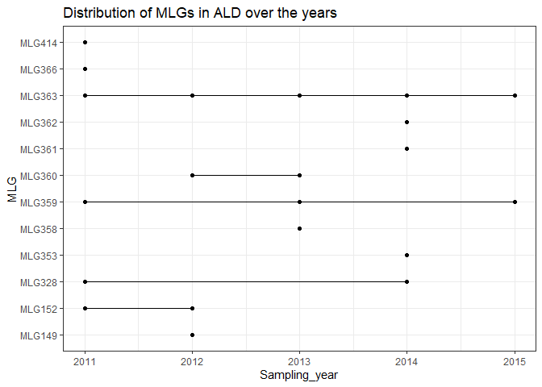<!-- -->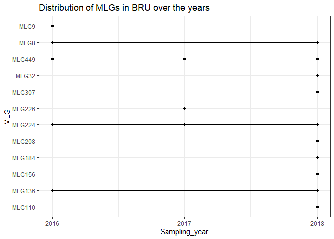<!-- -->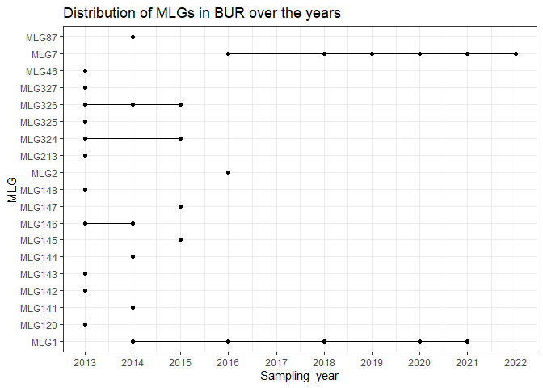<!-- -->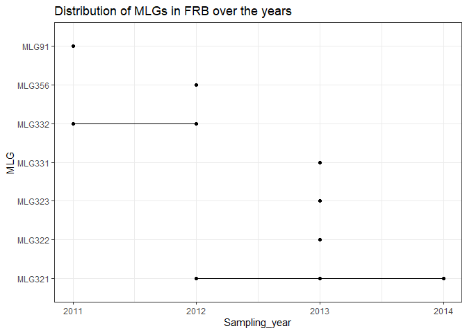<!-- -->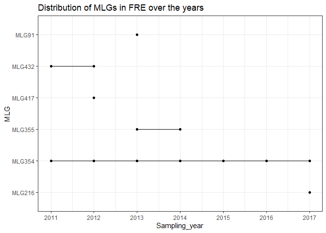<!-- -->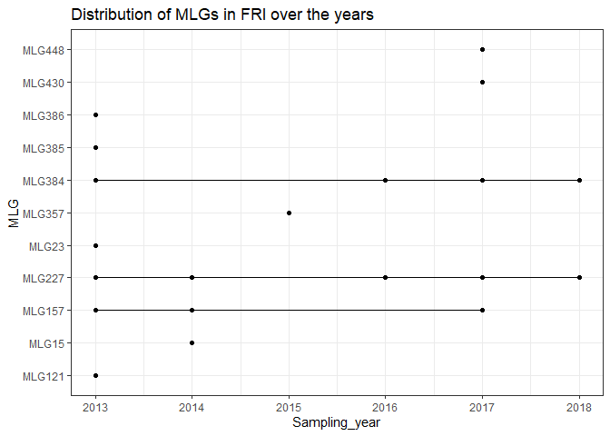<!-- -->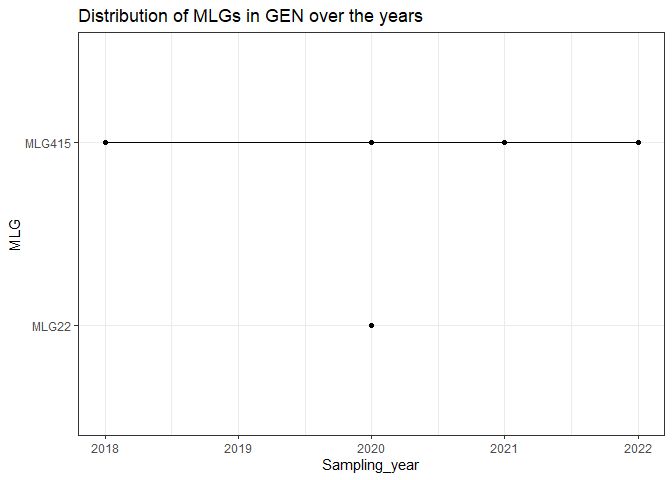<!-- -->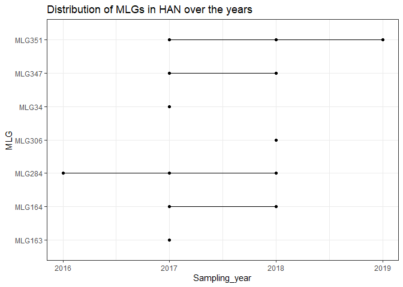<!-- -->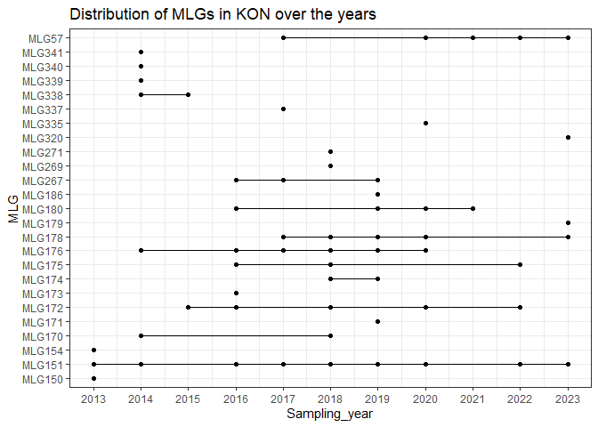<!-- -->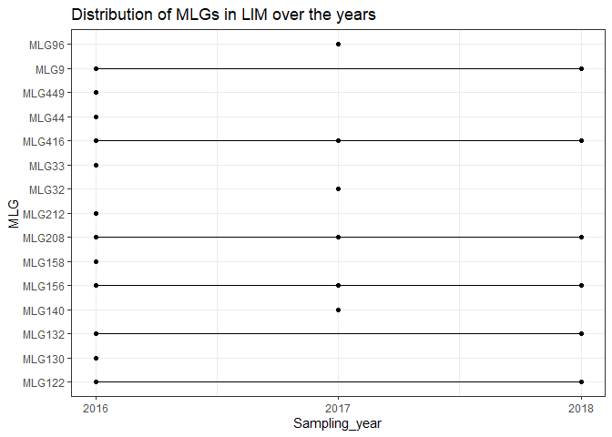<!-- -->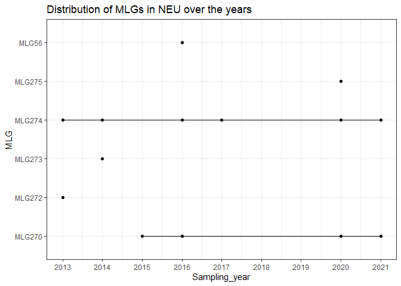<!-- -->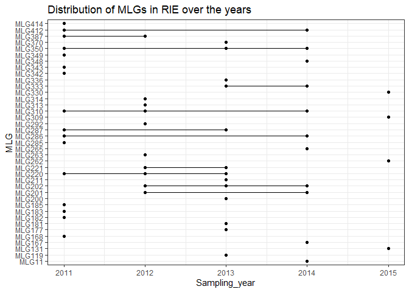<!-- -->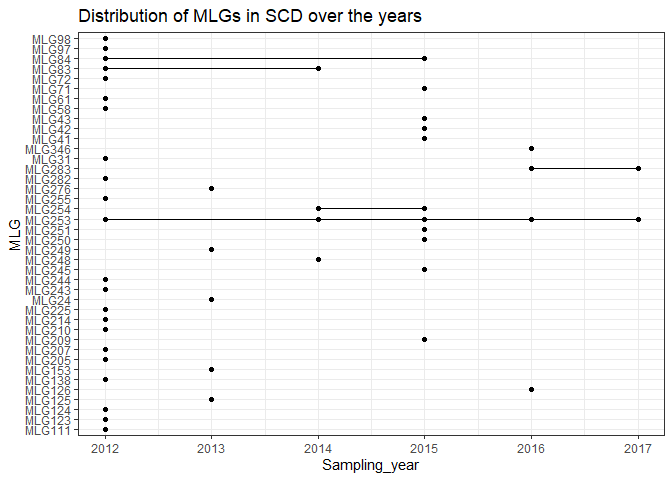<!-- -->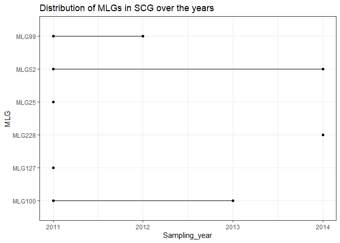<!-- -->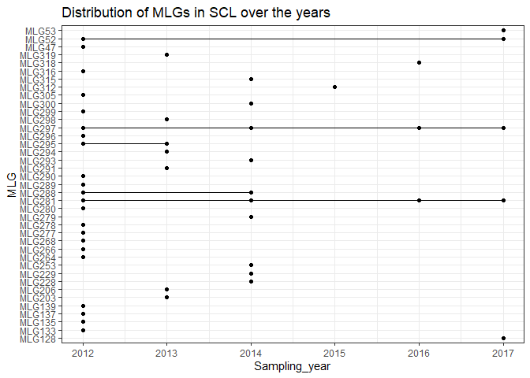<!-- -->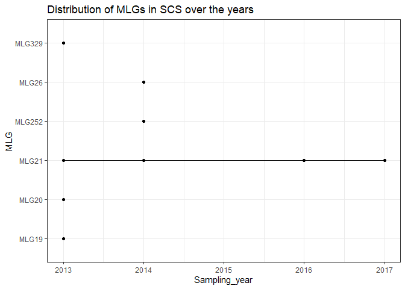<!-- -->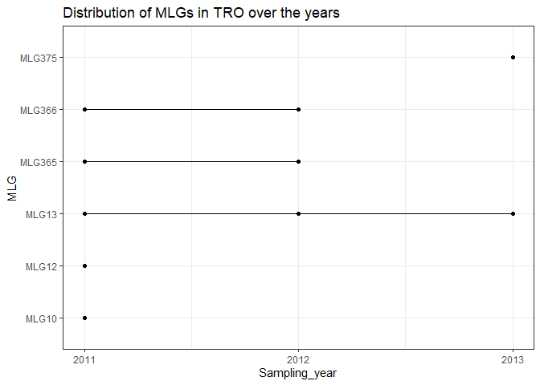<!-- -->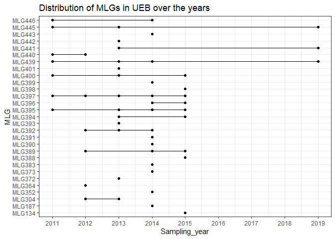<!-- -->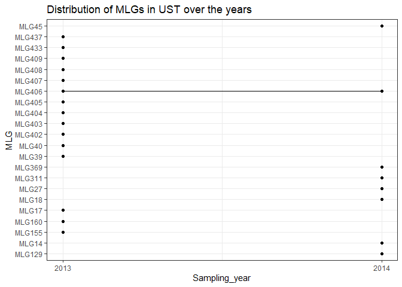<!-- -->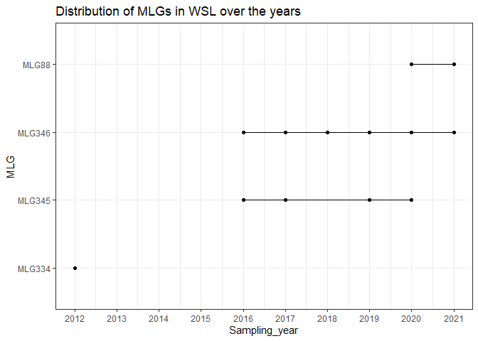<!-- -->
