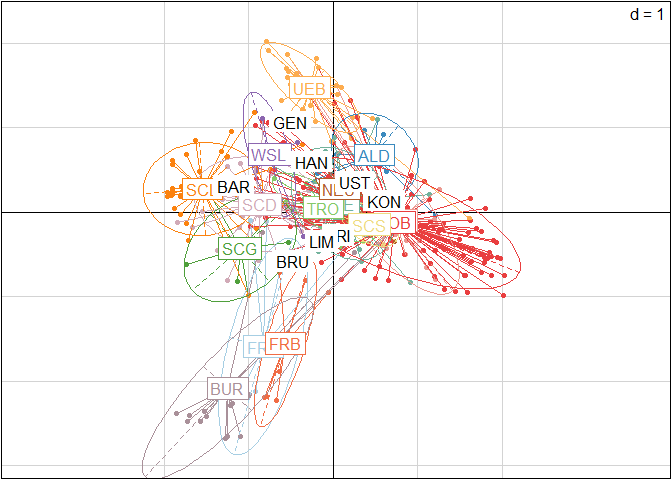

Presentation2024
================
Lia Baumann
2024-07-10

## Nei’s Genetic diversity

### myData_genind_allMarkersOnly locus table mean over all data

``` r
setPop(myData_genind_allMarkersOnly) <- ~Pop/SamplingYear
locus_table(myData_genind_allMarkersOnly, lev="genotype")
```

    ##           summary
    ## locus      genotype   1-D  Hexp Evenness
    ##   aest06_1     7.00  0.67  0.67     0.66
    ##   aest07_1     6.00  0.64  0.64     0.74
    ##   aest15_1     3.00  0.36  0.36     0.60
    ##   aest26_1    11.00  0.77  0.77     0.86
    ##   aest28_1    21.00  0.82  0.82     0.79
    ##   aest35_1     7.00  0.47  0.47     0.64
    ##   aest36_1     7.00  0.57  0.57     0.80
    ##   aest01_1     7.00  0.74  0.74     0.79
    ##   aest10_1     7.00  0.77  0.77     0.87
    ##   aest18_1     5.00  0.73  0.73     0.89
    ##   aest24_1     7.00  0.55  0.55     0.53
    ##   aest25_1     5.00  0.57  0.57     0.73
    ##   aest29_1     9.00  0.69  0.69     0.78
    ##   aest31_1     7.00  0.67  0.67     0.80
    ##   mean         7.79  0.64  0.64     0.75

### myData_genind_allMarkersOnly locus table per Population (Strata: Population / SamplingYear)

``` r
setPop(myData_genind_allMarkersOnly) <- ~Pop/SamplingYear

# create a data frame and transpose the result;
# use sapply to iterate over all populations calculated by seppop.
# then use the locus_table function on the level Genotype

locus_table_SY <- data.frame(t(
  sapply(seppop(myData_genind_allMarkersOnly),
    function(ls) poppr::locus_table(ls,lev="genotype"))))

# choose only the columns corresponding to Hexp values and rename them with their loci

locus_table_SY_hexp <- 
  select(locus_table_SY, X31:X45) %>%
  rename(aest06_1=X31,aest07_1=X32, aest15_1=X33, aest26_1=X34,aest28_1=X35, aest35_1=X36, aest36_1=X37, aest01_1=X38, aest10_1=X39, aest18_1=X40, aest24_1=X41, aest25_1=X42, aest29_1=X43, aest31_1=X44, mean=X45) %>%
  tibble::rownames_to_column("Pop") %>%
  separate(.,Pop,sep="_", into=c("Pop","SamplingYear"))
                                      
#check with one population:
#locus_table(myData_genind_AllMarkersOnly, lev="genotype",population="UEB_2015")
#looks good

kable(locus_table_SY_hexp)
```

| Pop | SamplingYear | aest06_1 | aest07_1 | aest15_1 | aest26_1 | aest28_1 | aest35_1 | aest36_1 | aest01_1 | aest10_1 | aest18_1 | aest24_1 | aest25_1 | aest29_1 | aest31_1 | mean |
|:---|:---|---:|---:|---:|---:|---:|---:|---:|---:|---:|---:|---:|---:|---:|---:|---:|
| FRE | 2011 | 0.2571429 | 0.2571429 | 0.2571429 | 0.0000000 | 0.2571429 | 0.0000000 | 0.2571429 | 0.0000000 | 0.2571429 | 0.2571429 | 0.2571429 | 0.2571429 | 0.2571429 | 0.2571429 | 0.2020408 |
| ALD | 2011 | 0.3731884 | 0.1594203 | 0.0000000 | 0.3913043 | 0.3007246 | 0.0000000 | 0.0833333 | 0.1630435 | 0.3043478 | 0.2898551 | 0.0000000 | 0.0000000 | 0.0833333 | 0.0833333 | 0.1594203 |
| RIE | 2011 | 0.6081871 | 0.1052632 | 0.0000000 | 0.6608187 | 0.6491228 | 0.0000000 | 0.0000000 | 0.4853801 | 0.7017544 | 0.7192982 | 0.6081871 | 0.4912281 | 0.2807018 | 0.5029240 | 0.4152047 |
| TRO | 2011 | 0.4583333 | 0.0000000 | 0.0000000 | 0.0000000 | 0.0000000 | 0.2333333 | 0.4583333 | 0.2333333 | 0.0000000 | 0.4583333 | 0.4583333 | 0.0000000 | 0.0000000 | 0.0000000 | 0.1642857 |
| SCG | 2011 | 0.0000000 | 0.0000000 | 0.0000000 | 0.8055556 | 0.5555556 | 0.0000000 | 0.2222222 | 0.5000000 | 0.0000000 | 0.7222222 | 0.0000000 | 0.5000000 | 0.3888889 | 0.5000000 | 0.2996032 |
| BOH | 2011 | 0.1818182 | 0.5454545 | 0.0000000 | 0.6000000 | 0.4909091 | 0.1818182 | 0.0000000 | 0.4363636 | 0.5090909 | 0.4727273 | 0.0000000 | 0.0000000 | 0.0000000 | 0.6181818 | 0.2883117 |
| BOB | 2011 | 0.0000000 | 0.3333333 | 0.0000000 | 0.5333333 | 0.8000000 | 0.0000000 | 0.0000000 | 0.0000000 | 0.0000000 | 0.6000000 | 0.3333333 | 0.5333333 | 0.5333333 | 0.5333333 | 0.3000000 |
| FRB | 2011 | 0.5000000 | 0.0000000 | 0.0000000 | 0.5000000 | 0.0000000 | 0.5000000 | 0.0000000 | 0.0000000 | 0.0000000 | 0.0000000 | 0.0000000 | 0.5000000 | 0.0000000 | 0.5000000 | 0.1785714 |
| UEB | 2011 | 0.0000000 | 0.4615385 | 0.0000000 | 0.0000000 | 0.0000000 | 0.0000000 | 0.4330484 | 0.0000000 | 0.2706553 | 0.0000000 | 0.0000000 | 0.0000000 | 0.5014245 | 0.0000000 | 0.1190476 |
| ALD | 2012 | 0.3030303 | 0.0000000 | 0.0000000 | 0.3030303 | 0.3030303 | 0.3181818 | 0.0000000 | 0.0000000 | 0.3030303 | 0.3030303 | 0.0000000 | 0.0000000 | 0.0000000 | 0.0000000 | 0.1309524 |
| TRO | 2012 | 0.5333333 | 0.0000000 | 0.0000000 | 0.0000000 | 0.0000000 | 0.2000000 | 0.5333333 | 0.0000000 | 0.0000000 | 0.5333333 | 0.5333333 | 0.0000000 | 0.0000000 | 0.0000000 | 0.1666667 |
| FRE | 2012 | 0.1894737 | 0.1894737 | 0.1894737 | 0.0000000 | 0.1947368 | 0.0000000 | 0.1894737 | 0.0000000 | 0.1894737 | 0.1894737 | 0.1894737 | 0.1894737 | 0.1894737 | 0.1894737 | 0.1492481 |
| RIE | 2012 | 0.1818182 | 0.1818182 | 0.0000000 | 0.7454545 | 0.7454545 | 0.0000000 | 0.1818182 | 0.6181818 | 0.4727273 | 0.8000000 | 0.3454545 | 0.5090909 | 0.1818182 | 0.3272727 | 0.3779221 |
| SCG | 2012 | 0.0000000 | 0.0000000 | 0.0000000 | 0.0000000 | 0.0000000 | 0.0000000 | 0.0000000 | 0.0000000 | 0.0000000 | 0.0000000 | 0.0000000 | 0.0000000 | 0.0000000 | 0.0000000 | 0.0000000 |
| BOB | 2012 | 0.1571429 | 0.2031746 | 0.0000000 | 0.3761905 | 0.6492063 | 0.0000000 | 0.0000000 | 0.1571429 | 0.1079365 | 0.2555556 | 0.0555556 | 0.2857143 | 0.3222222 | 0.5412698 | 0.2222222 |
| SCL | 2012 | 0.0000000 | 0.2336720 | 0.0000000 | 0.1458636 | 0.6995646 | 0.1741655 | 0.0000000 | 0.3577649 | 0.0740203 | 0.2046444 | 0.0000000 | 0.2336720 | 0.0000000 | 0.3940493 | 0.1798155 |
| SCD | 2012 | 0.0000000 | 0.5200000 | 0.0000000 | 0.6300000 | 0.6900000 | 0.5033333 | 0.5066667 | 0.4766667 | 0.5200000 | 0.5200000 | 0.0000000 | 0.0000000 | 0.1533333 | 0.5800000 | 0.3642857 |
| UEB | 2012 | 0.3333333 | 0.7333333 | 0.0000000 | 0.0000000 | 0.0000000 | 0.0000000 | 0.6000000 | 0.3333333 | 0.7333333 | 0.0000000 | 0.0000000 | 0.0000000 | 0.5333333 | 0.0000000 | 0.2333333 |
| BOH | 2012 | 0.3846154 | 0.2820513 | 0.0000000 | 0.4615385 | 0.5000000 | 0.1538462 | 0.4615385 | 0.5641026 | 0.5128205 | 0.2820513 | 0.0000000 | 0.0000000 | 0.4102564 | 0.5897436 | 0.3287546 |
| WSL | 2012 | NaN | NaN | NaN | NaN | NaN | NaN | NaN | NaN | NaN | NaN | NaN | NaN | NaN | NaN | NaN |
| FRB | 2012 | 0.8333333 | 0.5000000 | 0.5000000 | 0.5000000 | 0.8333333 | 0.0000000 | 0.5000000 | 0.5000000 | 0.5000000 | 0.5000000 | 0.5000000 | 0.5000000 | 0.5000000 | 0.5000000 | 0.5119048 |
| ALD | 2013 | 0.0000000 | 0.0000000 | 0.0000000 | 0.2333333 | 0.0000000 | 0.4583333 | 0.0000000 | 0.0000000 | 0.0000000 | 0.1250000 | 0.0000000 | 0.0000000 | 0.1250000 | 0.1250000 | 0.0761905 |
| RIE | 2013 | 0.4250000 | 0.2333333 | 0.0000000 | 0.6916667 | 0.6750000 | 0.1250000 | 0.1250000 | 0.7083333 | 0.3416667 | 0.6916667 | 0.3416667 | 0.5000000 | 0.1250000 | 0.3250000 | 0.3791667 |
| TRO | 2013 | 0.2500000 | 0.0000000 | 0.0000000 | 0.2500000 | 0.0000000 | 0.0000000 | 0.2500000 | 0.0000000 | 0.2500000 | 0.2500000 | 0.0000000 | 0.0000000 | 0.0000000 | 0.2500000 | 0.1071429 |
| BOB | 2013 | 0.2457143 | 0.4285714 | 0.0000000 | 0.4677551 | 0.5820408 | 0.0400000 | 0.2457143 | 0.3926531 | 0.1502041 | 0.4506122 | 0.2228571 | 0.3926531 | 0.3502041 | 0.6751020 | 0.3317201 |
| SCG | 2013 | NaN | NaN | NaN | NaN | NaN | NaN | NaN | NaN | NaN | NaN | NaN | NaN | NaN | NaN | NaN |
| SCL | 2013 | 0.0000000 | 0.0000000 | 0.0000000 | 0.7142857 | 0.7142857 | 0.4761905 | 0.2857143 | 0.8095238 | 0.0000000 | 0.2857143 | 0.0000000 | 0.2857143 | 0.0000000 | 0.7142857 | 0.3061224 |
| FRE | 2013 | 0.3555556 | 0.3555556 | 0.3555556 | 0.0000000 | 0.3555556 | 0.3555556 | 0.3555556 | 0.0000000 | 0.3555556 | 0.3555556 | 0.3555556 | 0.3555556 | 0.3555556 | 0.5111111 | 0.3158730 |
| UEB | 2013 | 0.0726765 | 0.4395528 | 0.0000000 | 0.0370370 | 0.0000000 | 0.0000000 | 0.5094340 | 0.0000000 | 0.5317959 | 0.0370370 | 0.0000000 | 0.0000000 | 0.3074773 | 0.0370370 | 0.1408605 |
| FRB | 2013 | 0.5000000 | 0.5000000 | 0.5000000 | 0.5000000 | 0.8333333 | 0.5000000 | 0.5000000 | 0.5000000 | 0.6666667 | 0.5000000 | 0.0000000 | 0.5000000 | 0.8333333 | 0.5000000 | 0.5238095 |
| BUR | 2013 | 0.0000000 | 0.2288786 | 0.0921659 | 0.0317460 | 0.1807476 | 0.0921659 | 0.2058372 | 0.1515617 | 0.0921659 | 0.0624680 | 0.0624680 | 0.2078853 | 0.0931900 | 0.1797235 | 0.1200717 |
| SCS | 2013 | 0.2857143 | 0.0000000 | 0.0000000 | 0.0000000 | 0.2857143 | 0.2857143 | 0.0000000 | 0.2857143 | 0.0000000 | 0.2857143 | 0.0000000 | 0.0000000 | 0.0000000 | 0.5238095 | 0.1394558 |
| SCD | 2013 | 0.0000000 | 0.6000000 | 0.0000000 | 0.8000000 | 0.7000000 | 0.0000000 | 0.6000000 | 0.7000000 | 0.4000000 | 0.4000000 | 0.0000000 | 0.0000000 | 0.4000000 | 0.6000000 | 0.3714286 |
| BOH | 2013 | 0.0000000 | 0.5333333 | 0.0000000 | 0.6000000 | 0.3333333 | 0.3333333 | 0.5333333 | 0.0000000 | 0.5333333 | 0.3333333 | 0.0000000 | 0.0000000 | 0.0000000 | 0.3333333 | 0.2523810 |
| NEU | 2013 | 0.0000000 | 0.0000000 | 0.0000000 | 0.0000000 | 0.0000000 | 0.0000000 | 0.0000000 | 0.0000000 | 0.0000000 | 0.5000000 | 0.0000000 | 0.0000000 | 0.0000000 | 0.0000000 | 0.0357143 |
| UST | 2013 | 0.5000000 | 0.4533333 | 0.0000000 | 0.2266667 | 0.7266667 | 0.0800000 | 0.2800000 | 0.0800000 | 0.5933333 | 0.3600000 | 0.1533333 | 0.5133333 | 0.4200000 | 0.5866667 | 0.3552381 |
| KON | 2013 | 0.0000000 | 0.0000000 | 0.0000000 | 0.0000000 | 0.0000000 | 0.0000000 | 0.0000000 | 0.6666667 | 0.6666667 | 0.0000000 | 0.0000000 | 0.0000000 | 0.0000000 | 0.0000000 | 0.0952381 |
| FRI | 2013 | 0.3670588 | 0.3215686 | 0.0000000 | 0.3686275 | 0.3670588 | 0.0000000 | 0.3215686 | 0.0000000 | 0.0392157 | 0.0000000 | 0.0000000 | 0.0000000 | 0.2117647 | 0.4047059 | 0.1715406 |
| BOB | 2014 | 0.1862069 | 0.3701149 | 0.0000000 | 0.6850575 | 0.7011494 | 0.1908046 | 0.2390805 | 0.5770115 | 0.2459770 | 0.4804598 | 0.1908046 | 0.4344828 | 0.4597701 | 0.6528736 | 0.3866995 |
| RIE | 2014 | 0.5909091 | 0.1666667 | 0.0000000 | 0.7424242 | 0.8484848 | 0.0000000 | 0.0000000 | 0.6818182 | 0.7121212 | 0.7121212 | 0.6818182 | 0.5303030 | 0.3030303 | 0.6363636 | 0.4718615 |
| UEB | 2014 | 0.1095238 | 0.2031746 | 0.0000000 | 0.2095238 | 0.0000000 | 0.0000000 | 0.2460317 | 0.3222222 | 0.2984127 | 0.0555556 | 0.0555556 | 0.0000000 | 0.4269841 | 0.1571429 | 0.1488662 |
| UST | 2014 | 0.4666667 | 0.5333333 | 0.0000000 | 0.4666667 | 0.7111111 | 0.5333333 | 0.3555556 | 0.0000000 | 0.6444444 | 0.3555556 | 0.0000000 | 0.3555556 | 0.4666667 | 0.6888889 | 0.3984127 |
| SCD | 2014 | 0.0000000 | 0.4285714 | 0.0000000 | 0.4285714 | 0.0000000 | 0.0000000 | 0.4285714 | 0.6071429 | 0.4285714 | 0.4285714 | 0.0000000 | 0.0000000 | 0.0000000 | 0.2500000 | 0.2142857 |
| FRE | 2014 | 0.0000000 | 0.0000000 | 0.0000000 | 0.0000000 | 0.0000000 | 0.0000000 | 0.0000000 | 0.0000000 | 0.0000000 | 0.0000000 | 0.0000000 | 0.0000000 | 0.0000000 | 0.3888889 | 0.0277778 |
| FRB | 2014 | NaN | NaN | NaN | NaN | NaN | NaN | NaN | NaN | NaN | NaN | NaN | NaN | NaN | NaN | NaN |
| ALD | 2014 | 0.5238095 | 0.2857143 | 0.0000000 | 0.2857143 | 0.2857143 | 0.0000000 | 0.0000000 | 0.4761905 | 0.2857143 | 0.2857143 | 0.2857143 | 0.0000000 | 0.2857143 | 0.0000000 | 0.2142857 |
| FRI | 2014 | 0.0000000 | 0.5000000 | 0.0000000 | 0.6666667 | 0.5000000 | 0.0000000 | 0.0000000 | 0.5000000 | 0.5000000 | 0.5000000 | 0.5000000 | 0.0000000 | 0.6666667 | 0.5000000 | 0.3452381 |
| SCL | 2014 | 0.0000000 | 0.0000000 | 0.0000000 | 0.2282609 | 0.5507246 | 0.0833333 | 0.0000000 | 0.1630435 | 0.0833333 | 0.1594203 | 0.0000000 | 0.0833333 | 0.0833333 | 0.0833333 | 0.1084369 |
| SCS | 2014 | 0.0000000 | 0.1333333 | 0.0000000 | 0.1333333 | 0.1333333 | 0.1333333 | 0.0000000 | 0.1333333 | 0.1333333 | 0.1333333 | 0.1333333 | 0.0000000 | 0.0000000 | 0.0000000 | 0.0761905 |
| BAR | 2014 | NaN | NaN | NaN | NaN | NaN | NaN | NaN | NaN | NaN | NaN | NaN | NaN | NaN | NaN | NaN |
| SCG | 2014 | 0.0000000 | 1.0000000 | 0.0000000 | 1.0000000 | 1.0000000 | 0.0000000 | 0.0000000 | 1.0000000 | 0.0000000 | 1.0000000 | 0.0000000 | 1.0000000 | 1.0000000 | 1.0000000 | 0.5714286 |
| BOH | 2014 | 0.0000000 | 0.3555556 | 0.0000000 | 0.2000000 | 0.3555556 | 0.4666667 | 0.0000000 | 0.3555556 | 0.3555556 | 0.2000000 | 0.0000000 | 0.0000000 | 0.2000000 | 0.6000000 | 0.2206349 |
| BUR | 2014 | 0.2500000 | 0.4285714 | 0.4285714 | 0.4285714 | 0.8214286 | 0.4285714 | 0.7500000 | 0.4285714 | 0.4285714 | 0.4285714 | 0.4285714 | 0.7142857 | 0.4285714 | 0.5357143 | 0.4948980 |
| KON | 2014 | 0.5303030 | 0.0000000 | 0.0000000 | 0.5303030 | 0.0000000 | 0.3030303 | 0.1666667 | 0.4090909 | 0.0000000 | 0.1666667 | 0.4848485 | 0.0000000 | 0.0000000 | 0.0000000 | 0.1850649 |
| NEU | 2014 | 0.0000000 | 0.0000000 | 0.0000000 | 0.0000000 | 0.0000000 | 0.0000000 | 0.0000000 | 0.0000000 | 0.0000000 | 0.0000000 | 0.0000000 | 0.0000000 | 0.6666667 | 0.0000000 | 0.0476190 |
| ALD | 2015 | 0.0000000 | 0.0000000 | 0.0000000 | 0.6666667 | 0.0000000 | 0.0000000 | 0.0000000 | 0.0000000 | 0.0000000 | 0.0000000 | 0.0000000 | 0.0000000 | 0.0000000 | 0.0000000 | 0.0476190 |
| BOB | 2015 | 0.4000000 | 0.5250000 | 0.0000000 | 0.5916667 | 0.7250000 | 0.0000000 | 0.3250000 | 0.5000000 | 0.4000000 | 0.4333333 | 0.3416667 | 0.3250000 | 0.5000000 | 0.6083333 | 0.4053571 |
| KON | 2015 | 1.0000000 | 0.0000000 | 0.0000000 | 0.0000000 | 0.0000000 | 0.0000000 | 0.0000000 | 0.0000000 | 1.0000000 | 0.0000000 | 0.0000000 | 0.0000000 | 0.0000000 | 0.0000000 | 0.1428571 |
| RIE | 2015 | 0.5000000 | 0.6666667 | 0.0000000 | 0.8333333 | 1.0000000 | 0.0000000 | 0.0000000 | 0.8333333 | 0.6666667 | 0.5000000 | 0.8333333 | 0.6666667 | 0.0000000 | 0.5000000 | 0.5000000 |
| UEB | 2015 | 0.0740741 | 0.0000000 | 0.0000000 | 0.0000000 | 0.0000000 | 0.0740741 | 0.1424501 | 0.1424501 | 0.2108262 | 0.0000000 | 0.0000000 | 0.0000000 | 0.5128205 | 0.2108262 | 0.0976801 |
| FRI | 2015 | NaN | NaN | NaN | NaN | NaN | NaN | NaN | NaN | NaN | NaN | NaN | NaN | NaN | NaN | NaN |
| FRE | 2015 | 0.0000000 | 0.0000000 | 0.0000000 | 0.0000000 | 0.0000000 | 0.0000000 | 0.0000000 | 0.0000000 | 0.0000000 | 0.0000000 | 0.0000000 | 0.0000000 | 0.0000000 | 0.0000000 | 0.0000000 |
| SCD | 2015 | 0.0000000 | 0.4583333 | 0.0000000 | 0.5083333 | 0.2416667 | 0.1250000 | 0.4583333 | 0.5166667 | 0.4000000 | 0.4000000 | 0.0000000 | 0.0000000 | 0.0000000 | 0.3250000 | 0.2452381 |
| SCL | 2015 | NaN | NaN | NaN | NaN | NaN | NaN | NaN | NaN | NaN | NaN | NaN | NaN | NaN | NaN | NaN |
| BUR | 2015 | 0.0000000 | 0.5333333 | 0.0000000 | 0.0000000 | 0.5333333 | 0.0000000 | 0.5333333 | 0.5333333 | 0.0000000 | 0.0000000 | 0.0000000 | 0.5333333 | 0.0000000 | 0.6000000 | 0.2333333 |
| NEU | 2015 | NaN | NaN | NaN | NaN | NaN | NaN | NaN | NaN | NaN | NaN | NaN | NaN | NaN | NaN | NaN |
| BOB | 2016 | 0.4136430 | 0.4136430 | 0.0000000 | 0.5123367 | 0.6371553 | 0.0000000 | 0.1741655 | 0.4898403 | 0.2046444 | 0.3991292 | 0.1770682 | 0.4687954 | 0.4136430 | 0.6473149 | 0.3536699 |
| SCS | 2016 | 0.0000000 | 0.0000000 | 0.0000000 | 0.0000000 | 0.0000000 | 0.0000000 | 0.0000000 | 0.0000000 | 0.0000000 | 0.0000000 | 0.0000000 | 0.0000000 | 0.0000000 | 0.0000000 | 0.0000000 |
| BRU | 2016 | 0.2229713 | 0.2267166 | 0.2229713 | 0.2229713 | 0.2267166 | 0.1675406 | 0.2267166 | 0.2267166 | 0.2229713 | 0.2169788 | 0.2214732 | 0.2229713 | 0.1675406 | 0.2267166 | 0.2158552 |
| LIM | 2016 | 0.3153846 | 0.2754808 | 0.0903846 | 0.6264423 | 0.6403846 | 0.3591346 | 0.4711538 | 0.4024038 | 0.5062500 | 0.6144231 | 0.3197115 | 0.4134615 | 0.4125000 | 0.5480769 | 0.4282280 |
| FRE | 2016 | 0.0000000 | 0.0000000 | 0.0000000 | 0.0000000 | 0.0000000 | 0.0000000 | 0.0000000 | 0.0000000 | 0.0000000 | 0.0000000 | 0.0000000 | 0.0000000 | 0.0000000 | 0.0000000 | 0.0000000 |
| SCD | 2016 | 0.0465116 | 0.1727575 | 0.0000000 | 0.3100775 | 0.3100775 | 0.1328904 | 0.1328904 | 0.0465116 | 0.2790698 | 0.3100775 | 0.0000000 | 0.0465116 | 0.1727575 | 0.2790698 | 0.1599430 |
| SCL | 2016 | 0.0000000 | 0.0000000 | 0.0000000 | 0.0000000 | 0.6388889 | 0.0000000 | 0.0000000 | 0.0000000 | 0.0000000 | 0.0000000 | 0.0000000 | 0.0000000 | 0.0000000 | 0.0000000 | 0.0456349 |
| WSL | 2016 | 0.0000000 | 0.0000000 | 0.0000000 | 0.0000000 | 0.0000000 | 0.0000000 | 0.0000000 | 0.0000000 | 0.0000000 | 0.0000000 | 0.0677556 | 0.0000000 | 0.0000000 | 0.0677556 | 0.0096794 |
| BUR | 2016 | 0.3238095 | 0.2571429 | 0.0000000 | 0.0000000 | 0.3380952 | 0.0000000 | 0.3380952 | 0.0000000 | 0.0000000 | 0.0000000 | 0.0952381 | 0.2571429 | 0.0952381 | 0.3380952 | 0.1459184 |
| KON | 2016 | 0.0000000 | 0.0000000 | 0.0000000 | 0.5066667 | 0.0000000 | 0.2200000 | 0.0800000 | 0.2900000 | 0.0800000 | 0.0000000 | 0.3333333 | 0.0000000 | 0.0800000 | 0.0000000 | 0.1135714 |
| NEU | 2016 | 0.0000000 | 0.1333333 | 0.0000000 | 0.1333333 | 0.1333333 | 0.0000000 | 0.0000000 | 0.3619048 | 0.1333333 | 0.3428571 | 0.1333333 | 0.2476190 | 0.0000000 | 0.0000000 | 0.1156463 |
| FRI | 2016 | 0.2222222 | 0.2222222 | 0.0000000 | 0.2222222 | 0.2222222 | 0.0000000 | 0.2222222 | 0.0000000 | 0.0000000 | 0.0000000 | 0.0000000 | 0.0000000 | 0.2222222 | 0.2222222 | 0.1111111 |
| HAN | 2016 | NaN | NaN | NaN | NaN | NaN | NaN | NaN | NaN | NaN | NaN | NaN | NaN | NaN | NaN | NaN |
| HAN | 2017 | 0.4561404 | 0.0512821 | 0.0000000 | 0.3643725 | 0.4858300 | 0.0000000 | 0.4858300 | 0.4372470 | 0.3751687 | 0.0000000 | 0.1889339 | 0.4858300 | 0.5452092 | 0.3643725 | 0.3028726 |
| LIM | 2017 | 0.2924051 | 0.0731013 | 0.0000000 | 0.6338608 | 0.6458861 | 0.3240506 | 0.5063291 | 0.3085443 | 0.4443038 | 0.6325949 | 0.3085443 | 0.4351266 | 0.3085443 | 0.5186709 | 0.3879973 |
| BRU | 2017 | 0.3626374 | 0.3626374 | 0.3626374 | 0.3626374 | 0.3846154 | 0.3846154 | 0.3846154 | 0.3846154 | 0.3846154 | 0.3846154 | 0.3626374 | 0.3626374 | 0.3846154 | 0.3846154 | 0.3751962 |
| KON | 2017 | 0.1176471 | 0.1176471 | 0.0000000 | 0.5220588 | 0.1176471 | 0.0000000 | 0.1176471 | 0.3235294 | 0.2205882 | 0.1176471 | 0.4044118 | 0.0000000 | 0.0000000 | 0.1176471 | 0.1554622 |
| NEU | 2017 | 0.0000000 | 0.0000000 | 0.0000000 | 0.0000000 | 0.0000000 | 0.0000000 | 0.0000000 | 0.0000000 | 0.0000000 | 0.0000000 | 0.0000000 | 0.0000000 | 0.0000000 | 0.0000000 | 0.0000000 |
| WSL | 2017 | 0.0000000 | 0.0000000 | 0.0000000 | 0.0000000 | 0.0000000 | 0.0000000 | 0.0000000 | 0.0000000 | 0.0000000 | 0.0000000 | 0.0327869 | 0.0000000 | 0.0000000 | 0.0327869 | 0.0046838 |
| BOB | 2017 | 0.2896552 | 0.3540230 | 0.0000000 | 0.4753831 | 0.6202107 | 0.0000000 | 0.0540230 | 0.4174330 | 0.0798851 | 0.4628352 | 0.1195402 | 0.3959770 | 0.4393678 | 0.6615900 | 0.3121374 |
| SCL | 2017 | 0.0000000 | 0.6000000 | 0.0000000 | 0.6000000 | 0.4000000 | 0.0000000 | 0.0000000 | 0.4000000 | 0.0000000 | 0.6000000 | 0.0000000 | 0.6000000 | 0.0000000 | 0.8000000 | 0.2857143 |
| FRE | 2017 | 0.0408076 | 0.0408076 | 0.0408076 | 0.0000000 | 0.0408076 | 0.0408076 | 0.0000000 | 0.0408076 | 0.0408076 | 0.0408076 | 0.0408076 | 0.0408076 | 0.0408076 | 0.0000000 | 0.0320631 |
| FRI | 2017 | 0.5030166 | 0.4457014 | 0.0384615 | 0.4457014 | 0.5241327 | 0.0384615 | 0.4457014 | 0.0384615 | 0.4110106 | 0.0384615 | 0.0384615 | 0.0384615 | 0.4607843 | 0.5067873 | 0.2838289 |
| SCS | 2017 | 0.0000000 | 0.0000000 | 0.0000000 | 0.0000000 | 0.0000000 | 0.0000000 | 0.0000000 | 0.0000000 | 0.0000000 | 0.0000000 | 0.0000000 | 0.0000000 | 0.0000000 | 0.0000000 | 0.0000000 |
| SCD | 2017 | 0.0000000 | 0.0000000 | 0.0000000 | 0.6666667 | 0.6666667 | 0.6666667 | 0.6666667 | 0.0000000 | 0.6666667 | 0.6666667 | 0.0000000 | 0.0000000 | 0.0000000 | 0.6666667 | 0.3333333 |
| FRI | 2018 | 0.6666667 | 0.6666667 | 0.0000000 | 0.6666667 | 0.6666667 | 0.0000000 | 0.6666667 | 0.0000000 | 0.0000000 | 0.0000000 | 0.0000000 | 0.0000000 | 0.6666667 | 0.6666667 | 0.3333333 |
| HAN | 2018 | 0.5194805 | 0.0000000 | 0.0000000 | 0.3116883 | 0.4155844 | 0.0000000 | 0.4155844 | 0.1774892 | 0.3116883 | 0.0000000 | 0.3679654 | 0.5238095 | 0.4805195 | 0.3116883 | 0.2739641 |
| WSL | 2018 | 0.0000000 | 0.0000000 | 0.0000000 | 0.0000000 | 0.0000000 | 0.0000000 | 0.0000000 | 0.0000000 | 0.0000000 | 0.0000000 | 0.0000000 | 0.0000000 | 0.0000000 | 0.0000000 | 0.0000000 |
| BOB | 2018 | 0.4211538 | 0.4644231 | 0.0000000 | 0.5365385 | 0.6697115 | 0.0000000 | 0.0894231 | 0.4283654 | 0.1173077 | 0.5639423 | 0.2509615 | 0.4730769 | 0.4644231 | 0.6649038 | 0.3674451 |
| KON | 2018 | 0.0000000 | 0.0000000 | 0.0000000 | 0.5341463 | 0.0000000 | 0.0000000 | 0.0951220 | 0.1865854 | 0.2560976 | 0.0951220 | 0.1804878 | 0.0951220 | 0.0951220 | 0.0487805 | 0.1133275 |
| LIM | 2018 | 0.3907445 | 0.0828974 | 0.0281690 | 0.6768612 | 0.6611670 | 0.4048290 | 0.5175050 | 0.3907445 | 0.4531187 | 0.6543260 | 0.3907445 | 0.4422535 | 0.3907445 | 0.5046278 | 0.4277666 |
| BRU | 2018 | 0.5194372 | 0.6060718 | 0.5194372 | 0.6179193 | 0.6060718 | 0.5512773 | 0.5838578 | 0.6053314 | 0.5957053 | 0.5553499 | 0.5064791 | 0.5438726 | 0.5779341 | 0.6297668 | 0.5727508 |
| BUR | 2018 | 0.4991087 | 0.4991087 | 0.0000000 | 0.0000000 | 0.4991087 | 0.0000000 | 0.4991087 | 0.0000000 | 0.0000000 | 0.0000000 | 0.0000000 | 0.4991087 | 0.0000000 | 0.4991087 | 0.2139037 |
| GEN | 2018 | NaN | NaN | NaN | NaN | NaN | NaN | NaN | NaN | NaN | NaN | NaN | NaN | NaN | NaN | NaN |
| HAN | 2019 | 0.0000000 | 0.0000000 | 0.0000000 | 0.0000000 | 0.0000000 | 0.0000000 | 0.0000000 | 0.0000000 | 0.0000000 | 0.0000000 | 0.0000000 | 0.0000000 | 0.0000000 | 0.0000000 | 0.0000000 |
| WSL | 2019 | 0.0000000 | 0.0000000 | 0.0000000 | 0.0000000 | 0.0000000 | 0.0000000 | 0.0000000 | 0.0000000 | 0.0000000 | 0.0000000 | 0.0547731 | 0.0000000 | 0.0000000 | 0.0547731 | 0.0078247 |
| KON | 2019 | 0.0000000 | 0.0000000 | 0.0000000 | 0.3353846 | 0.0769231 | 0.2123077 | 0.2123077 | 0.5138462 | 0.3230769 | 0.0769231 | 0.4923077 | 0.2707692 | 0.0000000 | 0.0000000 | 0.1795604 |
| BOB | 2019 | 0.1984127 | 0.5079365 | 0.0000000 | 0.6164021 | 0.6243386 | 0.0000000 | 0.1375661 | 0.6111111 | 0.2539683 | 0.5529101 | 0.4047619 | 0.3888889 | 0.5158730 | 0.6216931 | 0.3881330 |
| BUR | 2019 | 0.0000000 | 0.0000000 | 0.0000000 | 0.0000000 | 0.0000000 | 0.0000000 | 0.0000000 | 0.0000000 | 0.0000000 | 0.0000000 | 0.0000000 | 0.0000000 | 0.0000000 | 0.0000000 | 0.0000000 |
| UEB | 2019 | 0.0000000 | 0.0000000 | 0.0000000 | 0.0000000 | 0.0000000 | 0.0000000 | 0.6666667 | 0.0000000 | 0.6666667 | 0.0000000 | 0.0000000 | 0.0000000 | 0.6666667 | 0.0000000 | 0.1428571 |
| GEN | 2020 | 0.6666667 | 0.6666667 | 0.0000000 | 0.6666667 | 0.0000000 | 0.0000000 | 0.0000000 | 0.0000000 | 0.0000000 | 0.0000000 | 0.0000000 | 0.6666667 | 0.6666667 | 0.6666667 | 0.2857143 |
| KON | 2020 | 0.0800000 | 0.3800000 | 0.0000000 | 0.2800000 | 0.3800000 | 0.1533333 | 0.0800000 | 0.5566667 | 0.5000000 | 0.0000000 | 0.6600000 | 0.0000000 | 0.0000000 | 0.3800000 | 0.2464286 |
| WSL | 2020 | 0.0273973 | 0.0273973 | 0.0000000 | 0.0273973 | 0.0273973 | 0.0273973 | 0.0273973 | 0.0273973 | 0.0273973 | 0.0000000 | 0.0273973 | 0.0000000 | 0.0000000 | 0.0273973 | 0.0195695 |
| BUR | 2020 | 0.3495032 | 0.3495032 | 0.0000000 | 0.0000000 | 0.3495032 | 0.0000000 | 0.3495032 | 0.0000000 | 0.0000000 | 0.0000000 | 0.0000000 | 0.3495032 | 0.0000000 | 0.3495032 | 0.1497871 |
| NEU | 2020 | 0.0000000 | 0.0000000 | 0.0000000 | 0.0000000 | 0.0000000 | 0.0000000 | 0.0000000 | 0.4000000 | 0.4000000 | 0.4000000 | 0.0000000 | 0.4000000 | 0.4000000 | 0.0000000 | 0.1428571 |
| WSL | 2021 | 0.5000000 | 0.5000000 | 0.0000000 | 0.5000000 | 0.5000000 | 0.5000000 | 0.5000000 | 0.5000000 | 0.5000000 | 0.0000000 | 0.0000000 | 0.0000000 | 0.0000000 | 0.0000000 | 0.2857143 |
| BUR | 2021 | 0.1000000 | 0.1000000 | 0.0000000 | 0.0000000 | 0.1000000 | 0.0000000 | 0.1000000 | 0.0000000 | 0.0000000 | 0.0000000 | 0.0000000 | 0.1000000 | 0.0000000 | 0.1000000 | 0.0428571 |
| KON | 2021 | 0.0000000 | 0.3589744 | 0.0000000 | 0.0000000 | 0.3589744 | 0.3589744 | 0.0000000 | 0.3589744 | 0.0000000 | 0.0000000 | 0.3589744 | 0.0000000 | 0.0000000 | 0.3589744 | 0.1538462 |
| NEU | 2021 | 0.0000000 | 0.0000000 | 0.0000000 | 0.0000000 | 0.0000000 | 0.0000000 | 0.0000000 | 1.0000000 | 0.0000000 | 1.0000000 | 0.0000000 | 1.0000000 | 0.0000000 | 0.0000000 | 0.2142857 |
| GEN | 2021 | NaN | NaN | NaN | NaN | NaN | NaN | NaN | NaN | NaN | NaN | NaN | NaN | NaN | NaN | NaN |
| GEN | 2022 | 0.0000000 | 0.0000000 | 0.0000000 | 0.0000000 | 0.0000000 | 0.0000000 | 0.0000000 | 0.0000000 | 0.0000000 | 0.0000000 | 0.0000000 | 0.0000000 | 0.0000000 | 0.0000000 | 0.0000000 |
| BUR | 2022 | 0.0000000 | 0.0000000 | 0.0000000 | 0.0000000 | 0.0000000 | 0.0000000 | 0.0000000 | 0.0000000 | 0.0000000 | 0.0000000 | 0.0000000 | 0.0000000 | 0.0000000 | 0.0000000 | 0.0000000 |
| KON | 2022 | 0.0000000 | 0.1818182 | 0.0000000 | 0.5090909 | 0.1818182 | 0.0000000 | 0.0000000 | 0.0000000 | 0.3272727 | 0.0000000 | 0.1818182 | 0.0000000 | 0.1818182 | 0.1818182 | 0.1246753 |
| KON | 2023 | 0.0000000 | 0.3557312 | 0.0000000 | 0.1699605 | 0.3557312 | 0.0869565 | 0.0869565 | 0.2371542 | 0.2371542 | 0.0869565 | 0.3715415 | 0.0000000 | 0.0000000 | 0.3557312 | 0.1674195 |
| SCHIF | 2016 | NaN | NaN | NaN | NaN | NaN | NaN | NaN | NaN | NaN | NaN | NaN | NaN | NaN | NaN | NaN |

``` r
locus_table_SY_hexp_pivot <- pivot_longer(locus_table_SY_hexp,cols=3:16,names_to="locus",values_to="value")

ggplot(locus_table_SY_hexp_pivot,aes(x=as.numeric(SamplingYear), y=value)) +
  geom_point(pch=20) +
  geom_smooth(method="gam", formula=y~s(x,k=2), colour="darkgreen") +
  facet_wrap(vars(Pop)) +
  theme(aspect.ratio=0.35) +
  labs(y="Nei's genetic diversity Hexp", x="Sampling year") +
  ggtitle("Nei's genetic diversity per locus, Sampling year and Population")
```

<!-- -->

### myData_genind_allMarkersOnly locus table per Population (Strata: Population / TruffleYear)

``` r
setPop(myData_genind_allMarkersOnly) <- ~Pop/TruffleYear

# create a data frame and transpose the result;
# use sapply to iterate over all populations calculated by seppop.
# then use the locus_table function on the level Genotype

locus_table_TY <- data.frame(t(
  sapply(seppop(myData_genind_allMarkersOnly),
    function(ls) poppr::locus_table(ls,lev="genotype"))))

# choose only the columns corresponding to Hexp values and rename them with their loci

locus_table_TY_hexp <- 
  select(locus_table_TY, X31:X45) %>%
  rename(aest06_1=X31,aest07_1=X32, aest15_1=X33, aest26_1=X34,aest28_1=X35, aest35_1=X36, aest36_1=X37, aest01_1=X38, aest10_1=X39, aest18_1=X40, aest24_1=X41, aest25_1=X42, aest29_1=X43, aest31_1=X44, mean=X45) %>%
    tibble::rownames_to_column("Pop") %>%
  separate(.,Pop,sep="_", into=c("Pop","TruffleYear"))
                                      
#check with one population:
#locus_table(myData_genind_AllMarkersOnly, lev="genotype",population="UEB_2015")
#looks good

kable(locus_table_TY_hexp)
```

| Pop | TruffleYear | aest06_1 | aest07_1 | aest15_1 | aest26_1 | aest28_1 | aest35_1 | aest36_1 | aest01_1 | aest10_1 | aest18_1 | aest24_1 | aest25_1 | aest29_1 | aest31_1 | mean |
|:---|:---|---:|---:|---:|---:|---:|---:|---:|---:|---:|---:|---:|---:|---:|---:|---:|
| FRE | 2010 | 0.0000000 | 0.0000000 | 0.0000000 | 0.0000000 | 0.0000000 | 0.0000000 | 0.0000000 | 0.0000000 | 0.0000000 | 0.0000000 | 0.0000000 | 0.0000000 | 0.0000000 | 0.0000000 | 0.0000000 |
| ALD | 2010 | 0.0000000 | 0.0000000 | 0.0000000 | 0.0000000 | 0.0000000 | 0.0000000 | 0.0000000 | 0.0000000 | 0.0000000 | 0.0000000 | 0.0000000 | 0.0000000 | 0.0000000 | 0.0000000 | 0.0000000 |
| RIE | 2010 | 0.3333333 | 0.0000000 | 0.0000000 | 0.7333333 | 0.6000000 | 0.0000000 | 0.0000000 | 0.3333333 | 0.7333333 | 0.3333333 | 0.3333333 | 0.6000000 | 0.6000000 | 0.5333333 | 0.3666667 |
| TRO | 2010 | 0.6000000 | 0.0000000 | 0.0000000 | 0.0000000 | 0.0000000 | 0.6000000 | 0.6000000 | 0.0000000 | 0.0000000 | 0.6000000 | 0.6000000 | 0.0000000 | 0.0000000 | 0.0000000 | 0.2142857 |
| SCG | 2010 | 0.0000000 | 0.0000000 | 0.0000000 | 0.6666667 | 0.6666667 | 0.0000000 | 0.0000000 | 0.0000000 | 0.0000000 | 0.6666667 | 0.0000000 | 0.0000000 | 0.6666667 | 0.0000000 | 0.1904762 |
| ALD | 2011 | 0.4666667 | 0.1533333 | 0.0000000 | 0.4533333 | 0.3966667 | 0.0800000 | 0.0800000 | 0.1566667 | 0.4066667 | 0.3800000 | 0.0000000 | 0.0000000 | 0.0800000 | 0.0800000 | 0.1952381 |
| BOH | 2011 | 0.1818182 | 0.5454545 | 0.0000000 | 0.6000000 | 0.4909091 | 0.1818182 | 0.0000000 | 0.4363636 | 0.5090909 | 0.4727273 | 0.0000000 | 0.0000000 | 0.0000000 | 0.6181818 | 0.2883117 |
| FRE | 2011 | 0.3947368 | 0.3947368 | 0.3947368 | 0.0000000 | 0.4157895 | 0.0000000 | 0.3947368 | 0.0000000 | 0.3947368 | 0.3947368 | 0.3947368 | 0.3947368 | 0.3947368 | 0.3947368 | 0.3116541 |
| RIE | 2011 | 0.6470588 | 0.2205882 | 0.0000000 | 0.6764706 | 0.6838235 | 0.0000000 | 0.0000000 | 0.5220588 | 0.6764706 | 0.7647059 | 0.6176471 | 0.4852941 | 0.0000000 | 0.3823529 | 0.4054622 |
| SCG | 2011 | 0.0000000 | 0.0000000 | 0.0000000 | 0.5714286 | 0.5714286 | 0.0000000 | 0.2857143 | 0.5714286 | 0.0000000 | 0.5714286 | 0.0000000 | 0.5714286 | 0.0000000 | 0.5714286 | 0.2653061 |
| BOB | 2011 | 0.1333333 | 0.2476190 | 0.0000000 | 0.4476190 | 0.7142857 | 0.0000000 | 0.0000000 | 0.1333333 | 0.0000000 | 0.3619048 | 0.1333333 | 0.4190476 | 0.4190476 | 0.5142857 | 0.2517007 |
| TRO | 2011 | 0.5000000 | 0.0000000 | 0.0000000 | 0.0000000 | 0.0000000 | 0.1250000 | 0.5000000 | 0.2333333 | 0.0000000 | 0.5000000 | 0.5000000 | 0.0000000 | 0.0000000 | 0.0000000 | 0.1684524 |
| FRB | 2011 | 0.5000000 | 0.0000000 | 0.0000000 | 0.5000000 | 0.0000000 | 0.5000000 | 0.0000000 | 0.0000000 | 0.0000000 | 0.0000000 | 0.0000000 | 0.5000000 | 0.0000000 | 0.5000000 | 0.1785714 |
| UEB | 2011 | 0.0000000 | 0.4615385 | 0.0000000 | 0.0000000 | 0.0000000 | 0.0000000 | 0.4330484 | 0.0000000 | 0.2706553 | 0.0000000 | 0.0000000 | 0.0000000 | 0.5014245 | 0.0000000 | 0.1190476 |
| SCL | 2011 | 0.0000000 | 0.6666667 | 0.0000000 | 0.0000000 | 0.6666667 | 0.0000000 | 0.0000000 | 0.0000000 | 0.0000000 | 0.6666667 | 0.0000000 | 0.0000000 | 0.0000000 | 1.0000000 | 0.2142857 |
| BOB | 2012 | 0.1984127 | 0.1984127 | 0.0000000 | 0.4047619 | 0.6746032 | 0.0000000 | 0.0000000 | 0.1375661 | 0.1375661 | 0.3201058 | 0.0714286 | 0.3042328 | 0.3492063 | 0.5740741 | 0.2407407 |
| FRE | 2012 | 0.0000000 | 0.0000000 | 0.0000000 | 0.0000000 | 0.0000000 | 0.0000000 | 0.0000000 | 0.0000000 | 0.0000000 | 0.0000000 | 0.0000000 | 0.0000000 | 0.0000000 | 0.0000000 | 0.0000000 |
| SCL | 2012 | 0.0000000 | 0.2117647 | 0.0000000 | 0.1513725 | 0.7050980 | 0.1803922 | 0.0000000 | 0.3976471 | 0.0768627 | 0.1803922 | 0.0000000 | 0.2415686 | 0.0000000 | 0.3450980 | 0.1778711 |
| SCD | 2012 | 0.0000000 | 0.5200000 | 0.0000000 | 0.6300000 | 0.6900000 | 0.5033333 | 0.5066667 | 0.4766667 | 0.5200000 | 0.5200000 | 0.0000000 | 0.0000000 | 0.1533333 | 0.5800000 | 0.3642857 |
| UEB | 2012 | 0.1818182 | 0.4727273 | 0.0000000 | 0.0000000 | 0.0000000 | 0.0000000 | 0.4727273 | 0.1818182 | 0.7090909 | 0.1818182 | 0.0000000 | 0.0000000 | 0.3272727 | 0.0000000 | 0.1805195 |
| BOH | 2012 | 0.3846154 | 0.2820513 | 0.0000000 | 0.4615385 | 0.5000000 | 0.1538462 | 0.4615385 | 0.5641026 | 0.5128205 | 0.2820513 | 0.0000000 | 0.0000000 | 0.4102564 | 0.5897436 | 0.3287546 |
| WSL | 2012 | NaN | NaN | NaN | NaN | NaN | NaN | NaN | NaN | NaN | NaN | NaN | NaN | NaN | NaN | NaN |
| ALD | 2012 | 0.0000000 | 0.0000000 | 0.0000000 | 0.1538462 | 0.0000000 | 0.2820513 | 0.0000000 | 0.0000000 | 0.0000000 | 0.0000000 | 0.0000000 | 0.0000000 | 0.0000000 | 0.0000000 | 0.0311355 |
| RIE | 2012 | 0.2637363 | 0.0000000 | 0.0000000 | 0.7912088 | 0.7142857 | 0.0000000 | 0.1428571 | 0.7142857 | 0.4835165 | 0.7802198 | 0.2747253 | 0.5274725 | 0.1428571 | 0.3626374 | 0.3712716 |
| FRB | 2012 | 0.8000000 | 0.6000000 | 0.6000000 | 0.6000000 | 0.8000000 | 0.0000000 | 0.7000000 | 0.4000000 | 0.6000000 | 0.6000000 | 0.4000000 | 0.6000000 | 0.6000000 | 0.6000000 | 0.5642857 |
| SCG | 2012 | 0.0000000 | 0.0000000 | 0.0000000 | 0.0000000 | 0.0000000 | 0.0000000 | 0.6666667 | 0.0000000 | 0.0000000 | 0.0000000 | 0.0000000 | 0.0000000 | 0.0000000 | 0.0000000 | 0.0476190 |
| TRO | 2012 | 0.2820513 | 0.0000000 | 0.0000000 | 0.1538462 | 0.0000000 | 0.0000000 | 0.2820513 | 0.0000000 | 0.1538462 | 0.2820513 | 0.1538462 | 0.0000000 | 0.0000000 | 0.1538462 | 0.1043956 |
| BOB | 2013 | 0.2571628 | 0.4647100 | 0.0000000 | 0.5178197 | 0.6177498 | 0.0733753 | 0.2830189 | 0.4689029 | 0.1740042 | 0.4947589 | 0.2075472 | 0.3913347 | 0.3913347 | 0.6729560 | 0.3581911 |
| UEB | 2013 | 0.1015038 | 0.4398496 | 0.0000000 | 0.1015038 | 0.0000000 | 0.0000000 | 0.5087719 | 0.0350877 | 0.4956140 | 0.0350877 | 0.0350877 | 0.0000000 | 0.3853383 | 0.0689223 | 0.1576262 |
| BUR | 2013 | 0.0000000 | 0.2288786 | 0.0921659 | 0.0317460 | 0.1807476 | 0.0921659 | 0.2058372 | 0.1515617 | 0.0921659 | 0.0624680 | 0.0624680 | 0.2078853 | 0.0931900 | 0.1797235 | 0.1200717 |
| FRE | 2013 | 0.3272727 | 0.3272727 | 0.3272727 | 0.0000000 | 0.3272727 | 0.3272727 | 0.3272727 | 0.0000000 | 0.3272727 | 0.3272727 | 0.3272727 | 0.3272727 | 0.3272727 | 0.4727273 | 0.2909091 |
| SCL | 2013 | 0.0000000 | 0.0000000 | 0.0000000 | 0.6428571 | 0.6785714 | 0.4285714 | 0.2500000 | 0.7857143 | 0.0000000 | 0.2500000 | 0.0000000 | 0.2500000 | 0.0000000 | 0.6785714 | 0.2831633 |
| SCS | 2013 | 0.2857143 | 0.0000000 | 0.0000000 | 0.0000000 | 0.2857143 | 0.2857143 | 0.0000000 | 0.2857143 | 0.0000000 | 0.2857143 | 0.0000000 | 0.0000000 | 0.0000000 | 0.5238095 | 0.1394558 |
| SCD | 2013 | 0.0000000 | 0.4761905 | 0.0000000 | 0.7619048 | 0.7142857 | 0.0000000 | 0.5714286 | 0.6666667 | 0.5714286 | 0.5714286 | 0.0000000 | 0.0000000 | 0.2857143 | 0.4761905 | 0.3639456 |
| BOH | 2013 | 0.0000000 | 0.5333333 | 0.0000000 | 0.6000000 | 0.3333333 | 0.3333333 | 0.5333333 | 0.0000000 | 0.5333333 | 0.3333333 | 0.0000000 | 0.0000000 | 0.0000000 | 0.3333333 | 0.2523810 |
| NEU | 2013 | 0.0000000 | 0.0000000 | 0.0000000 | 0.0000000 | 0.0000000 | 0.0000000 | 0.0000000 | 0.0000000 | 0.0000000 | 0.5000000 | 0.0000000 | 0.0000000 | 0.0000000 | 0.0000000 | 0.0357143 |
| UST | 2013 | 0.4947090 | 0.4523810 | 0.0000000 | 0.2037037 | 0.7116402 | 0.0714286 | 0.2539683 | 0.0714286 | 0.5582011 | 0.3253968 | 0.1375661 | 0.5079365 | 0.4761905 | 0.5608466 | 0.3446712 |
| KON | 2013 | 0.0000000 | 0.0000000 | 0.0000000 | 0.0000000 | 0.0000000 | 0.0000000 | 0.0000000 | 0.6666667 | 0.6666667 | 0.0000000 | 0.0000000 | 0.0000000 | 0.0000000 | 0.0000000 | 0.0952381 |
| ALD | 2013 | 0.0000000 | 0.0000000 | 0.0000000 | 0.1818182 | 0.0000000 | 0.5090909 | 0.0000000 | 0.3272727 | 0.0000000 | 0.1818182 | 0.1818182 | 0.0000000 | 0.1818182 | 0.1818182 | 0.1246753 |
| RIE | 2013 | 0.4102564 | 0.2820513 | 0.0000000 | 0.6794872 | 0.7564103 | 0.1538462 | 0.1538462 | 0.6923077 | 0.4102564 | 0.7179487 | 0.4615385 | 0.5128205 | 0.1538462 | 0.5256410 | 0.4221612 |
| FRI | 2013 | 0.3823529 | 0.3401207 | 0.0000000 | 0.3883861 | 0.3823529 | 0.0000000 | 0.3401207 | 0.0000000 | 0.0384615 | 0.0000000 | 0.0000000 | 0.0000000 | 0.2081448 | 0.4193062 | 0.1785176 |
| FRB | 2013 | 0.0000000 | 0.0000000 | 0.0000000 | 0.0000000 | 0.5000000 | 0.5000000 | 0.0000000 | 0.5000000 | 0.5000000 | 0.0000000 | 0.0000000 | 0.0000000 | 0.5000000 | 0.0000000 | 0.1785714 |
| UEB | 2014 | 0.0987179 | 0.1423077 | 0.0000000 | 0.0974359 | 0.0000000 | 0.0500000 | 0.1846154 | 0.3282051 | 0.2717949 | 0.0000000 | 0.0000000 | 0.0000000 | 0.3576923 | 0.1423077 | 0.1195055 |
| FRE | 2014 | 0.0000000 | 0.0000000 | 0.0000000 | 0.0000000 | 0.0000000 | 0.0000000 | 0.0000000 | 0.0000000 | 0.0000000 | 0.0000000 | 0.0000000 | 0.0000000 | 0.0000000 | 0.4285714 | 0.0306122 |
| SCS | 2014 | 0.0000000 | 0.1333333 | 0.0000000 | 0.1333333 | 0.1333333 | 0.1333333 | 0.0000000 | 0.1333333 | 0.1333333 | 0.1333333 | 0.1333333 | 0.0000000 | 0.0000000 | 0.0000000 | 0.0761905 |
| BAR | 2014 | NaN | NaN | NaN | NaN | NaN | NaN | NaN | NaN | NaN | NaN | NaN | NaN | NaN | NaN | NaN |
| SCL | 2014 | 0.0000000 | 0.0000000 | 0.0000000 | 0.2467532 | 0.4761905 | 0.0909091 | 0.0000000 | 0.0909091 | 0.0909091 | 0.1731602 | 0.0000000 | 0.0909091 | 0.0909091 | 0.0909091 | 0.1029685 |
| SCG | 2014 | 0.0000000 | 1.0000000 | 0.0000000 | 1.0000000 | 1.0000000 | 0.0000000 | 0.0000000 | 1.0000000 | 0.0000000 | 1.0000000 | 0.0000000 | 1.0000000 | 1.0000000 | 1.0000000 | 0.5714286 |
| BOB | 2014 | 0.2390805 | 0.3310345 | 0.0000000 | 0.6459770 | 0.6712644 | 0.1287356 | 0.2390805 | 0.4965517 | 0.2873563 | 0.4390805 | 0.1908046 | 0.3701149 | 0.4344828 | 0.6597701 | 0.3666667 |
| BOH | 2014 | 0.0000000 | 0.3555556 | 0.0000000 | 0.2000000 | 0.3555556 | 0.4666667 | 0.0000000 | 0.3555556 | 0.3555556 | 0.2000000 | 0.0000000 | 0.0000000 | 0.2000000 | 0.6000000 | 0.2206349 |
| SCD | 2014 | 0.0000000 | 0.5333333 | 0.0000000 | 0.5333333 | 0.0000000 | 0.0000000 | 0.5333333 | 0.5333333 | 0.5333333 | 0.5333333 | 0.0000000 | 0.0000000 | 0.0000000 | 0.3333333 | 0.2523810 |
| BUR | 2014 | 0.2500000 | 0.4285714 | 0.4285714 | 0.4285714 | 0.8214286 | 0.4285714 | 0.7500000 | 0.4285714 | 0.4285714 | 0.4285714 | 0.4285714 | 0.7142857 | 0.4285714 | 0.5357143 | 0.4948980 |
| UST | 2014 | 0.2857143 | 0.4761905 | 0.0000000 | 0.5714286 | 0.7142857 | 0.5714286 | 0.4761905 | 0.0000000 | 0.5238095 | 0.4761905 | 0.0000000 | 0.2857143 | 0.0000000 | 0.7619048 | 0.3673469 |
| ALD | 2014 | 0.6000000 | 0.3333333 | 0.0000000 | 0.5333333 | 0.3333333 | 0.0000000 | 0.0000000 | 0.6000000 | 0.3333333 | 0.3333333 | 0.0000000 | 0.0000000 | 0.3333333 | 0.0000000 | 0.2428571 |
| FRI | 2014 | 0.5000000 | 0.8333333 | 0.5000000 | 0.5000000 | 0.8333333 | 0.5000000 | 0.5000000 | 0.8333333 | 0.8333333 | 0.8333333 | 0.6666667 | 0.5000000 | 0.8333333 | 0.5000000 | 0.6547619 |
| RIE | 2014 | 0.5454545 | 0.4363636 | 0.0000000 | 0.5818182 | 0.8909091 | 0.0000000 | 0.0000000 | 0.6545455 | 0.7272727 | 0.7272727 | 0.6909091 | 0.5454545 | 0.3272727 | 0.5636364 | 0.4779221 |
| KON | 2014 | 0.5274725 | 0.0000000 | 0.0000000 | 0.4945055 | 0.0000000 | 0.2637363 | 0.1428571 | 0.3626374 | 0.1428571 | 0.1428571 | 0.4395604 | 0.0000000 | 0.0000000 | 0.0000000 | 0.1797488 |
| NEU | 2014 | 0.0000000 | 0.0000000 | 0.0000000 | 0.0000000 | 0.0000000 | 0.0000000 | 0.0000000 | 0.0000000 | 0.0000000 | 0.0000000 | 0.0000000 | 0.0000000 | 0.6666667 | 0.0000000 | 0.0476190 |
| UEB | 2015 | 0.0000000 | 0.0000000 | 0.0000000 | 0.0000000 | 0.0000000 | 0.0000000 | 0.1333333 | 0.0000000 | 0.1333333 | 0.0000000 | 0.0000000 | 0.0000000 | 0.5142857 | 0.2571429 | 0.0741497 |
| BOB | 2015 | 0.1666667 | 0.4848485 | 0.0000000 | 0.4393939 | 0.6818182 | 0.0000000 | 0.1666667 | 0.5303030 | 0.3030303 | 0.1666667 | 0.4393939 | 0.4090909 | 0.4090909 | 0.6212121 | 0.3441558 |
| SCD | 2015 | 0.0000000 | 0.4583333 | 0.0000000 | 0.5083333 | 0.2416667 | 0.1250000 | 0.4583333 | 0.5166667 | 0.4000000 | 0.4000000 | 0.0000000 | 0.0000000 | 0.0000000 | 0.3250000 | 0.2452381 |
| SCL | 2015 | NaN | NaN | NaN | NaN | NaN | NaN | NaN | NaN | NaN | NaN | NaN | NaN | NaN | NaN | NaN |
| FRE | 2015 | 0.0000000 | 0.0000000 | 0.0000000 | 0.0000000 | 0.0000000 | 0.0000000 | 0.0000000 | 0.0000000 | 0.0000000 | 0.0000000 | 0.0000000 | 0.0000000 | 0.0000000 | 0.0000000 | 0.0000000 |
| BUR | 2015 | 0.0000000 | 0.5333333 | 0.0000000 | 0.0000000 | 0.5333333 | 0.0000000 | 0.5333333 | 0.5333333 | 0.0000000 | 0.0000000 | 0.0000000 | 0.5333333 | 0.0000000 | 0.6000000 | 0.2333333 |
| NEU | 2015 | NaN | NaN | NaN | NaN | NaN | NaN | NaN | NaN | NaN | NaN | NaN | NaN | NaN | NaN | NaN |
| ALD | 2015 | 0.0000000 | 0.0000000 | 0.0000000 | 0.0000000 | 0.0000000 | 0.0000000 | 0.0000000 | 0.0000000 | 0.0000000 | 0.0000000 | 0.0000000 | 0.0000000 | 0.0000000 | 0.0000000 | 0.0000000 |
| RIE | 2015 | NaN | NaN | NaN | NaN | NaN | NaN | NaN | NaN | NaN | NaN | NaN | NaN | NaN | NaN | NaN |
| SCS | 2015 | NaN | NaN | NaN | NaN | NaN | NaN | NaN | NaN | NaN | NaN | NaN | NaN | NaN | NaN | NaN |
| BRU | 2016 | 0.2103070 | 0.2135965 | 0.2103070 | 0.2103070 | 0.2135965 | 0.1576754 | 0.2135965 | 0.2135965 | 0.2103070 | 0.2050439 | 0.2089912 | 0.2103070 | 0.1576754 | 0.2135965 | 0.2034931 |
| LIM | 2016 | 0.2828582 | 0.2661977 | 0.0796001 | 0.6323584 | 0.6456868 | 0.3409848 | 0.4787116 | 0.3631988 | 0.5105516 | 0.6190300 | 0.2861903 | 0.4328027 | 0.3743058 | 0.5601629 | 0.4194743 |
| BOB | 2016 | 0.4193062 | 0.4185520 | 0.0000000 | 0.5180995 | 0.6417798 | 0.0000000 | 0.1772247 | 0.4803922 | 0.2081448 | 0.4049774 | 0.1802413 | 0.4728507 | 0.4185520 | 0.6447964 | 0.3560655 |
| FRE | 2016 | 0.0000000 | 0.0000000 | 0.0000000 | 0.0000000 | 0.0000000 | 0.0000000 | 0.0000000 | 0.0000000 | 0.0000000 | 0.0000000 | 0.0000000 | 0.0000000 | 0.0000000 | 0.0000000 | 0.0000000 |
| SCD | 2016 | 0.0465116 | 0.1727575 | 0.0000000 | 0.3100775 | 0.3100775 | 0.1328904 | 0.1328904 | 0.0465116 | 0.2790698 | 0.3100775 | 0.0000000 | 0.0465116 | 0.1727575 | 0.2790698 | 0.1599430 |
| SCL | 2016 | 0.0000000 | 0.0000000 | 0.0000000 | 0.0000000 | 0.6388889 | 0.0000000 | 0.0000000 | 0.0000000 | 0.0000000 | 0.0000000 | 0.0000000 | 0.0000000 | 0.0000000 | 0.0000000 | 0.0456349 |
| WSL | 2016 | 0.0000000 | 0.0000000 | 0.0000000 | 0.0000000 | 0.0000000 | 0.0000000 | 0.0000000 | 0.0000000 | 0.0000000 | 0.0000000 | 0.0666277 | 0.0000000 | 0.0000000 | 0.0666277 | 0.0095182 |
| SCS | 2016 | 0.0000000 | 0.0000000 | 0.0000000 | 0.0000000 | 0.0000000 | 0.0000000 | 0.0000000 | 0.0000000 | 0.0000000 | 0.0000000 | 0.0000000 | 0.0000000 | 0.0000000 | 0.0000000 | 0.0000000 |
| BUR | 2016 | 0.3238095 | 0.2571429 | 0.0000000 | 0.0000000 | 0.3380952 | 0.0000000 | 0.3380952 | 0.0000000 | 0.0000000 | 0.0000000 | 0.0952381 | 0.2571429 | 0.0952381 | 0.3380952 | 0.1459184 |
| KON | 2016 | 0.0000000 | 0.0000000 | 0.0000000 | 0.4953846 | 0.0000000 | 0.2123077 | 0.0769231 | 0.2800000 | 0.0769231 | 0.0000000 | 0.3230769 | 0.0000000 | 0.0769231 | 0.0000000 | 0.1101099 |
| NEU | 2016 | 0.0000000 | 0.1176471 | 0.0000000 | 0.1176471 | 0.1176471 | 0.0000000 | 0.0000000 | 0.3235294 | 0.1176471 | 0.3088235 | 0.1176471 | 0.2205882 | 0.0000000 | 0.0000000 | 0.1029412 |
| FRI | 2016 | 0.2222222 | 0.2222222 | 0.0000000 | 0.2222222 | 0.2222222 | 0.0000000 | 0.2222222 | 0.0000000 | 0.0000000 | 0.0000000 | 0.0000000 | 0.0000000 | 0.2222222 | 0.2222222 | 0.1111111 |
| HAN | 2016 | 0.1538462 | 0.0000000 | 0.0000000 | 0.0000000 | 0.1538462 | 0.0000000 | 0.1538462 | 0.2820513 | 0.0000000 | 0.0000000 | 0.1538462 | 0.1538462 | 0.2948718 | 0.0000000 | 0.0961538 |
| LIM | 2017 | 0.2983683 | 0.0749251 | 0.0000000 | 0.6356976 | 0.6560107 | 0.3146853 | 0.5064935 | 0.3146853 | 0.4412254 | 0.6340326 | 0.3146853 | 0.4315684 | 0.3146853 | 0.5064935 | 0.3888255 |
| BOB | 2017 | 0.3044005 | 0.3908203 | 0.0000000 | 0.4914035 | 0.6259184 | 0.0000000 | 0.0598349 | 0.4388397 | 0.0827085 | 0.4823904 | 0.1180792 | 0.4129365 | 0.4537605 | 0.6645459 | 0.3232599 |
| HAN | 2017 | 0.4991087 | 0.0588235 | 0.0000000 | 0.4010695 | 0.2994652 | 0.0000000 | 0.2994652 | 0.1140820 | 0.4153298 | 0.0000000 | 0.2584670 | 0.5080214 | 0.3083779 | 0.4010695 | 0.2545200 |
| BRU | 2017 | 0.4372294 | 0.4545455 | 0.4372294 | 0.4502165 | 0.4675325 | 0.3939394 | 0.4632035 | 0.4718615 | 0.4632035 | 0.4502165 | 0.4155844 | 0.4372294 | 0.3939394 | 0.4675325 | 0.4431045 |
| WSL | 2017 | 0.0000000 | 0.0000000 | 0.0000000 | 0.0000000 | 0.0000000 | 0.0000000 | 0.0000000 | 0.0000000 | 0.0000000 | 0.0000000 | 0.0322581 | 0.0000000 | 0.0000000 | 0.0322581 | 0.0046083 |
| SCL | 2017 | 0.0000000 | 0.6000000 | 0.0000000 | 0.6000000 | 0.4000000 | 0.0000000 | 0.0000000 | 0.4000000 | 0.0000000 | 0.6000000 | 0.0000000 | 0.6000000 | 0.0000000 | 0.8000000 | 0.2857143 |
| FRE | 2017 | 0.0408076 | 0.0408076 | 0.0408076 | 0.0000000 | 0.0408076 | 0.0408076 | 0.0000000 | 0.0408076 | 0.0408076 | 0.0408076 | 0.0408076 | 0.0408076 | 0.0408076 | 0.0000000 | 0.0320631 |
| FRI | 2017 | 0.5010101 | 0.4599327 | 0.0363636 | 0.4599327 | 0.5212121 | 0.0363636 | 0.4599327 | 0.0363636 | 0.3952862 | 0.0363636 | 0.0363636 | 0.0363636 | 0.4727273 | 0.5050505 | 0.2852333 |
| KON | 2017 | 0.1111111 | 0.1111111 | 0.0000000 | 0.5032680 | 0.1111111 | 0.0000000 | 0.1111111 | 0.3071895 | 0.2091503 | 0.1111111 | 0.3856209 | 0.0000000 | 0.0000000 | 0.1111111 | 0.1479925 |
| SCS | 2017 | 0.0000000 | 0.0000000 | 0.0000000 | 0.0000000 | 0.0000000 | 0.0000000 | 0.0000000 | 0.0000000 | 0.0000000 | 0.0000000 | 0.0000000 | 0.0000000 | 0.0000000 | 0.0000000 | 0.0000000 |
| SCD | 2017 | 0.0000000 | 0.0000000 | 0.0000000 | 0.6666667 | 0.6666667 | 0.6666667 | 0.6666667 | 0.0000000 | 0.6666667 | 0.6666667 | 0.0000000 | 0.0000000 | 0.0000000 | 0.6666667 | 0.3333333 |
| BRU | 2018 | 0.5033898 | 0.6163842 | 0.5033898 | 0.6463277 | 0.6276836 | 0.5689266 | 0.5949153 | 0.6254237 | 0.5994350 | 0.5553672 | 0.5033898 | 0.5384181 | 0.5949153 | 0.6508475 | 0.5806295 |
| LIM | 2018 | 0.4191468 | 0.0620040 | 0.0312500 | 0.6736111 | 0.6552579 | 0.4330357 | 0.5173611 | 0.4191468 | 0.4459325 | 0.6607143 | 0.4191468 | 0.4330357 | 0.4191468 | 0.5034722 | 0.4351616 |
| WSL | 2018 | 0.0000000 | 0.0000000 | 0.0000000 | 0.0000000 | 0.0000000 | 0.0000000 | 0.0000000 | 0.0000000 | 0.0000000 | 0.0000000 | 0.0000000 | 0.0000000 | 0.0000000 | 0.0000000 | 0.0000000 |
| HAN | 2018 | 0.5142857 | 0.0000000 | 0.0000000 | 0.4190476 | 0.4190476 | 0.0000000 | 0.4190476 | 0.1333333 | 0.4190476 | 0.0000000 | 0.4190476 | 0.5142857 | 0.4761905 | 0.4190476 | 0.2965986 |
| BUR | 2018 | 0.4991087 | 0.4991087 | 0.0000000 | 0.0000000 | 0.4991087 | 0.0000000 | 0.4991087 | 0.0000000 | 0.0000000 | 0.0000000 | 0.0000000 | 0.4991087 | 0.0000000 | 0.4991087 | 0.2139037 |
| BOB | 2018 | 0.4209066 | 0.4088807 | 0.0000000 | 0.5309898 | 0.6725254 | 0.0000000 | 0.0832562 | 0.3506013 | 0.1221092 | 0.5504163 | 0.2997225 | 0.4588344 | 0.4273821 | 0.6512488 | 0.3554909 |
| KON | 2018 | 0.0000000 | 0.0000000 | 0.0000000 | 0.5452092 | 0.0000000 | 0.0000000 | 0.0998650 | 0.1956815 | 0.2672065 | 0.0998650 | 0.1889339 | 0.0998650 | 0.0998650 | 0.0512821 | 0.1176981 |
| GEN | 2018 | NaN | NaN | NaN | NaN | NaN | NaN | NaN | NaN | NaN | NaN | NaN | NaN | NaN | NaN | NaN |
| HAN | 2019 | 0.0000000 | 0.0000000 | 0.0000000 | 0.0000000 | 0.0000000 | 0.0000000 | 0.0000000 | 0.0000000 | 0.0000000 | 0.0000000 | 0.0000000 | 0.0000000 | 0.0000000 | 0.0000000 | 0.0000000 |
| WSL | 2019 | 0.0000000 | 0.0000000 | 0.0000000 | 0.0000000 | 0.0000000 | 0.0000000 | 0.0000000 | 0.0000000 | 0.0000000 | 0.0000000 | 0.0540335 | 0.0000000 | 0.0000000 | 0.0540335 | 0.0077191 |
| KON | 2019 | 0.0000000 | 0.0000000 | 0.0000000 | 0.3247863 | 0.0740741 | 0.2051282 | 0.2051282 | 0.5014245 | 0.3133903 | 0.0740741 | 0.4843305 | 0.2621083 | 0.0000000 | 0.0000000 | 0.1746032 |
| BOB | 2019 | 0.1984127 | 0.5079365 | 0.0000000 | 0.6164021 | 0.6243386 | 0.0000000 | 0.1375661 | 0.6111111 | 0.2539683 | 0.5529101 | 0.4047619 | 0.3888889 | 0.5158730 | 0.6216931 | 0.3881330 |
| BUR | 2019 | 0.0000000 | 0.0000000 | 0.0000000 | 0.0000000 | 0.0000000 | 0.0000000 | 0.0000000 | 0.0000000 | 0.0000000 | 0.0000000 | 0.0000000 | 0.0000000 | 0.0000000 | 0.0000000 | 0.0000000 |
| UEB | 2019 | 0.0000000 | 0.0000000 | 0.0000000 | 0.0000000 | 0.0000000 | 0.0000000 | 0.6666667 | 0.0000000 | 0.6666667 | 0.0000000 | 0.0000000 | 0.0000000 | 0.6666667 | 0.0000000 | 0.1428571 |
| GEN | 2019 | NaN | NaN | NaN | NaN | NaN | NaN | NaN | NaN | NaN | NaN | NaN | NaN | NaN | NaN | NaN |
| BUR | 2020 | 0.3495032 | 0.3495032 | 0.0000000 | 0.0000000 | 0.3495032 | 0.0000000 | 0.3495032 | 0.0000000 | 0.0000000 | 0.0000000 | 0.0000000 | 0.3495032 | 0.0000000 | 0.3495032 | 0.1497871 |
| WSL | 2020 | 0.0277778 | 0.0277778 | 0.0000000 | 0.0277778 | 0.0277778 | 0.0277778 | 0.0277778 | 0.0277778 | 0.0277778 | 0.0000000 | 0.0277778 | 0.0000000 | 0.0000000 | 0.0277778 | 0.0198413 |
| KON | 2020 | 0.0833333 | 0.3913043 | 0.0000000 | 0.2898551 | 0.3913043 | 0.1594203 | 0.0833333 | 0.5615942 | 0.5072464 | 0.0000000 | 0.6521739 | 0.0000000 | 0.0000000 | 0.3913043 | 0.2507764 |
| NEU | 2020 | 0.0000000 | 0.0000000 | 0.0000000 | 0.0000000 | 0.0000000 | 0.0000000 | 0.0000000 | 0.4000000 | 0.4000000 | 0.4000000 | 0.0000000 | 0.4000000 | 0.4000000 | 0.0000000 | 0.1428571 |
| GEN | 2020 | 0.0000000 | 0.0000000 | 0.0000000 | 0.0000000 | 0.0000000 | 0.0000000 | 0.0000000 | 0.0000000 | 0.0000000 | 0.0000000 | 0.0000000 | 0.0000000 | 0.0000000 | 0.0000000 | 0.0000000 |
| WSL | 2021 | 0.5000000 | 0.5000000 | 0.0000000 | 0.5000000 | 0.5000000 | 0.5000000 | 0.5000000 | 0.5000000 | 0.5000000 | 0.0000000 | 0.0000000 | 0.0000000 | 0.0000000 | 0.0000000 | 0.2857143 |
| BUR | 2021 | 0.1000000 | 0.1000000 | 0.0000000 | 0.0000000 | 0.1000000 | 0.0000000 | 0.1000000 | 0.0000000 | 0.0000000 | 0.0000000 | 0.0000000 | 0.1000000 | 0.0000000 | 0.1000000 | 0.0428571 |
| KON | 2021 | 0.0000000 | 0.3589744 | 0.0000000 | 0.0000000 | 0.3589744 | 0.3589744 | 0.0000000 | 0.3589744 | 0.0000000 | 0.0000000 | 0.3589744 | 0.0000000 | 0.0000000 | 0.3589744 | 0.1538462 |
| NEU | 2021 | 0.0000000 | 0.0000000 | 0.0000000 | 0.0000000 | 0.0000000 | 0.0000000 | 0.0000000 | 1.0000000 | 0.0000000 | 1.0000000 | 0.0000000 | 1.0000000 | 0.0000000 | 0.0000000 | 0.2142857 |
| GEN | 2021 | 0.0000000 | 0.0000000 | 0.0000000 | 0.0000000 | 0.0000000 | 0.0000000 | 0.0000000 | 0.0000000 | 0.0000000 | 0.0000000 | 0.0000000 | 0.0000000 | 0.0000000 | 0.0000000 | 0.0000000 |
| BUR | 2022 | 0.0000000 | 0.0000000 | 0.0000000 | 0.0000000 | 0.0000000 | 0.0000000 | 0.0000000 | 0.0000000 | 0.0000000 | 0.0000000 | 0.0000000 | 0.0000000 | 0.0000000 | 0.0000000 | 0.0000000 |
| GEN | 2022 | 0.0000000 | 0.0000000 | 0.0000000 | 0.0000000 | 0.0000000 | 0.0000000 | 0.0000000 | 0.0000000 | 0.0000000 | 0.0000000 | 0.0000000 | 0.0000000 | 0.0000000 | 0.0000000 | 0.0000000 |
| KON | 2022 | 0.0000000 | 0.1818182 | 0.0000000 | 0.5090909 | 0.1818182 | 0.0000000 | 0.0000000 | 0.0000000 | 0.3272727 | 0.0000000 | 0.1818182 | 0.0000000 | 0.1818182 | 0.1818182 | 0.1246753 |
| KON | 2023 | 0.0000000 | 0.3557312 | 0.0000000 | 0.1699605 | 0.3557312 | 0.0869565 | 0.0869565 | 0.2371542 | 0.2371542 | 0.0869565 | 0.3715415 | 0.0000000 | 0.0000000 | 0.3557312 | 0.1674195 |
| SCHIF | 2016 | NaN | NaN | NaN | NaN | NaN | NaN | NaN | NaN | NaN | NaN | NaN | NaN | NaN | NaN | NaN |

``` r
ggplot(locus_table_TY_hexp,aes(x=TruffleYear, y=mean)) +
  geom_point() +
  facet_wrap(vars(Pop))
```

<!-- -->

``` r
write_xlsx(locus_table_SY_hexp, "C:\\Users\\liaba\\OneDrive - Eidg. Forschungsanstalt WSL\\R\\truffles\\Presentation-Summer-24_files\\locus_table_SY_hexp.xlsx")
write_xlsx(locus_table_TY_hexp, "C:\\Users\\liaba\\OneDrive - Eidg. Forschungsanstalt WSL\\R\\truffles\\Presentation-Summer-24_files\\locus_table_TY_hexp.xlsx")
```

# Rarefaction of Neis’ diversity index

Rarefied: Hexp \* (N/N-1). N= Anzahl samples (nicht Allele)

``` r
setPop(myData_genind_allMarkersOnly) <- ~Pop/SamplingYear
popdata_pop_year_rareNei_SY <- poppr(myData_genind_allMarkersOnly) %>%
  select(Pop, N)

locus_table_SY_hexp_N <- 
  select(locus_table_SY, X31:X45) %>%
  rename(aest06_1=X31,aest07_1=X32, aest15_1=X33, aest26_1=X34,aest28_1=X35, aest35_1=X36, aest36_1=X37, aest01_1=X38, aest10_1=X39, aest18_1=X40, aest24_1=X41, aest25_1=X42, aest29_1=X43, aest31_1=X44, mean=X45) %>%
    tibble::rownames_to_column("Pop") %>%
  left_join(.,popdata_pop_year_rareNei_SY,by="Pop") %>%
  separate(.,Pop,sep="_", into=c("Pop","SamplingYear"))

N <- locus_table_SY_hexp_N$N #number of samples
#calculate rarefaction over all the values (columns 3:17)
rarHexpSY <- (N/(N-1))*select(locus_table_SY_hexp_N,3:17)
#add the pop and year again
rarHexpSY <- bind_cols(rarHexpSY,Pop = locus_table_SY_hexp_N$Pop, SamplingYear = locus_table_SY_hexp_N$SamplingYear)

kable(rarHexpSY)
```

| aest06_1 | aest07_1 | aest15_1 | aest26_1 | aest28_1 | aest35_1 | aest36_1 | aest01_1 | aest10_1 | aest18_1 | aest24_1 | aest25_1 | aest29_1 | aest31_1 | mean | Pop | SamplingYear |
|---:|---:|---:|---:|---:|---:|---:|---:|---:|---:|---:|---:|---:|---:|---:|:---|:---|
| 0.2700000 | 0.2700000 | 0.2700000 | 0.0000000 | 0.2700000 | 0.0000000 | 0.2700000 | 0.0000000 | 0.2700000 | 0.2700000 | 0.2700000 | 0.2700000 | 0.2700000 | 0.2700000 | 0.2121429 | FRE | 2011 |
| 0.3894140 | 0.1663516 | 0.0000000 | 0.4083176 | 0.3137996 | 0.0000000 | 0.0869565 | 0.1701323 | 0.3175803 | 0.3024575 | 0.0000000 | 0.0000000 | 0.0869565 | 0.0869565 | 0.1663516 | ALD | 2011 |
| 0.6419753 | 0.1111111 | 0.0000000 | 0.6975309 | 0.6851852 | 0.0000000 | 0.0000000 | 0.5123457 | 0.7407407 | 0.7592593 | 0.6419753 | 0.5185185 | 0.2962963 | 0.5308642 | 0.4382716 | RIE | 2011 |
| 0.4888889 | 0.0000000 | 0.0000000 | 0.0000000 | 0.0000000 | 0.2488889 | 0.4888889 | 0.2488889 | 0.0000000 | 0.4888889 | 0.4888889 | 0.0000000 | 0.0000000 | 0.0000000 | 0.1752381 | TRO | 2011 |
| 0.0000000 | 0.0000000 | 0.0000000 | 0.9062500 | 0.6250000 | 0.0000000 | 0.2500000 | 0.5625000 | 0.0000000 | 0.8125000 | 0.0000000 | 0.5625000 | 0.4375000 | 0.5625000 | 0.3370536 | SCG | 2011 |
| 0.2000000 | 0.6000000 | 0.0000000 | 0.6600000 | 0.5400000 | 0.2000000 | 0.0000000 | 0.4800000 | 0.5600000 | 0.5200000 | 0.0000000 | 0.0000000 | 0.0000000 | 0.6800000 | 0.3171429 | BOH | 2011 |
| 0.0000000 | 0.4000000 | 0.0000000 | 0.6400000 | 0.9600000 | 0.0000000 | 0.0000000 | 0.0000000 | 0.0000000 | 0.7200000 | 0.4000000 | 0.6400000 | 0.6400000 | 0.6400000 | 0.3600000 | BOB | 2011 |
| 0.6666667 | 0.0000000 | 0.0000000 | 0.6666667 | 0.0000000 | 0.6666667 | 0.0000000 | 0.0000000 | 0.0000000 | 0.0000000 | 0.0000000 | 0.6666667 | 0.0000000 | 0.6666667 | 0.2380952 | FRB | 2011 |
| 0.0000000 | 0.4792899 | 0.0000000 | 0.0000000 | 0.0000000 | 0.0000000 | 0.4497041 | 0.0000000 | 0.2810651 | 0.0000000 | 0.0000000 | 0.0000000 | 0.5207101 | 0.0000000 | 0.1236264 | UEB | 2011 |
| 0.3305785 | 0.0000000 | 0.0000000 | 0.3305785 | 0.3305785 | 0.3471074 | 0.0000000 | 0.0000000 | 0.3305785 | 0.3305785 | 0.0000000 | 0.0000000 | 0.0000000 | 0.0000000 | 0.1428571 | ALD | 2012 |
| 0.5925926 | 0.0000000 | 0.0000000 | 0.0000000 | 0.0000000 | 0.2222222 | 0.5925926 | 0.0000000 | 0.0000000 | 0.5925926 | 0.5925926 | 0.0000000 | 0.0000000 | 0.0000000 | 0.1851852 | TRO | 2012 |
| 0.1994460 | 0.1994460 | 0.1994460 | 0.0000000 | 0.2049861 | 0.0000000 | 0.1994460 | 0.0000000 | 0.1994460 | 0.1994460 | 0.1994460 | 0.1994460 | 0.1994460 | 0.1994460 | 0.1571033 | FRE | 2012 |
| 0.2000000 | 0.2000000 | 0.0000000 | 0.8200000 | 0.8200000 | 0.0000000 | 0.2000000 | 0.6800000 | 0.5200000 | 0.8800000 | 0.3800000 | 0.5600000 | 0.2000000 | 0.3600000 | 0.4157143 | RIE | 2012 |
| 0.0000000 | 0.0000000 | 0.0000000 | 0.0000000 | 0.0000000 | 0.0000000 | 0.0000000 | 0.0000000 | 0.0000000 | 0.0000000 | 0.0000000 | 0.0000000 | 0.0000000 | 0.0000000 | 0.0000000 | SCG | 2012 |
| 0.1616327 | 0.2089796 | 0.0000000 | 0.3869388 | 0.6677551 | 0.0000000 | 0.0000000 | 0.1616327 | 0.1110204 | 0.2628571 | 0.0571429 | 0.2938776 | 0.3314286 | 0.5567347 | 0.2285714 | BOB | 2012 |
| 0.0000000 | 0.2381657 | 0.0000000 | 0.1486686 | 0.7130178 | 0.1775148 | 0.0000000 | 0.3646450 | 0.0754438 | 0.2085799 | 0.0000000 | 0.2381657 | 0.0000000 | 0.4016272 | 0.1832735 | SCL | 2012 |
| 0.0000000 | 0.5416667 | 0.0000000 | 0.6562500 | 0.7187500 | 0.5243056 | 0.5277778 | 0.4965278 | 0.5416667 | 0.5416667 | 0.0000000 | 0.0000000 | 0.1597222 | 0.6041667 | 0.3794643 | SCD | 2012 |
| 0.4000000 | 0.8800000 | 0.0000000 | 0.0000000 | 0.0000000 | 0.0000000 | 0.7200000 | 0.4000000 | 0.8800000 | 0.0000000 | 0.0000000 | 0.0000000 | 0.6400000 | 0.0000000 | 0.2800000 | UEB | 2012 |
| 0.4166667 | 0.3055556 | 0.0000000 | 0.5000000 | 0.5416667 | 0.1666667 | 0.5000000 | 0.6111111 | 0.5555556 | 0.3055556 | 0.0000000 | 0.0000000 | 0.4444444 | 0.6388889 | 0.3561508 | BOH | 2012 |
| NaN | NaN | NaN | NaN | NaN | NaN | NaN | NaN | NaN | NaN | NaN | NaN | NaN | NaN | NaN | WSL | 2012 |
| 1.1111111 | 0.6666667 | 0.6666667 | 0.6666667 | 1.1111111 | 0.0000000 | 0.6666667 | 0.6666667 | 0.6666667 | 0.6666667 | 0.6666667 | 0.6666667 | 0.6666667 | 0.6666667 | 0.6825397 | FRB | 2012 |
| 0.0000000 | 0.0000000 | 0.0000000 | 0.2488889 | 0.0000000 | 0.4888889 | 0.0000000 | 0.0000000 | 0.0000000 | 0.1333333 | 0.0000000 | 0.0000000 | 0.1333333 | 0.1333333 | 0.0812698 | ALD | 2013 |
| 0.4533333 | 0.2488889 | 0.0000000 | 0.7377778 | 0.7200000 | 0.1333333 | 0.1333333 | 0.7555556 | 0.3644444 | 0.7377778 | 0.3644444 | 0.5333333 | 0.1333333 | 0.3466667 | 0.4044444 | RIE | 2013 |
| 0.2857143 | 0.0000000 | 0.0000000 | 0.2857143 | 0.0000000 | 0.0000000 | 0.2857143 | 0.0000000 | 0.2857143 | 0.2857143 | 0.0000000 | 0.0000000 | 0.0000000 | 0.2857143 | 0.1224490 | TRO | 2013 |
| 0.2507289 | 0.4373178 | 0.0000000 | 0.4773011 | 0.5939192 | 0.0408163 | 0.2507289 | 0.4006664 | 0.1532695 | 0.4598084 | 0.2274052 | 0.4006664 | 0.3573511 | 0.6888796 | 0.3384899 | BOB | 2013 |
| NaN | NaN | NaN | NaN | NaN | NaN | NaN | NaN | NaN | NaN | NaN | NaN | NaN | NaN | NaN | SCG | 2013 |
| 0.0000000 | 0.0000000 | 0.0000000 | 0.8333333 | 0.8333333 | 0.5555556 | 0.3333333 | 0.9444444 | 0.0000000 | 0.3333333 | 0.0000000 | 0.3333333 | 0.0000000 | 0.8333333 | 0.3571429 | SCL | 2013 |
| 0.3950617 | 0.3950617 | 0.3950617 | 0.0000000 | 0.3950617 | 0.3950617 | 0.3950617 | 0.0000000 | 0.3950617 | 0.3950617 | 0.3950617 | 0.3950617 | 0.3950617 | 0.5679012 | 0.3509700 | FRE | 2013 |
| 0.0740477 | 0.4478462 | 0.0000000 | 0.0377358 | 0.0000000 | 0.0000000 | 0.5190459 | 0.0000000 | 0.5418298 | 0.0377358 | 0.0000000 | 0.0000000 | 0.3132787 | 0.0377358 | 0.1435183 | UEB | 2013 |
| 0.6666667 | 0.6666667 | 0.6666667 | 0.6666667 | 1.1111111 | 0.6666667 | 0.6666667 | 0.6666667 | 0.8888889 | 0.6666667 | 0.0000000 | 0.6666667 | 1.1111111 | 0.6666667 | 0.6984127 | FRB | 2013 |
| 0.0000000 | 0.2325702 | 0.0936524 | 0.0322581 | 0.1836629 | 0.0936524 | 0.2091571 | 0.1540062 | 0.0936524 | 0.0634755 | 0.0634755 | 0.2112383 | 0.0946930 | 0.1826223 | 0.1220083 | BUR | 2013 |
| 0.3333333 | 0.0000000 | 0.0000000 | 0.0000000 | 0.3333333 | 0.3333333 | 0.0000000 | 0.3333333 | 0.0000000 | 0.3333333 | 0.0000000 | 0.0000000 | 0.0000000 | 0.6111111 | 0.1626984 | SCS | 2013 |
| 0.0000000 | 0.7500000 | 0.0000000 | 1.0000000 | 0.8750000 | 0.0000000 | 0.7500000 | 0.8750000 | 0.5000000 | 0.5000000 | 0.0000000 | 0.0000000 | 0.5000000 | 0.7500000 | 0.4642857 | SCD | 2013 |
| 0.0000000 | 0.6400000 | 0.0000000 | 0.7200000 | 0.4000000 | 0.4000000 | 0.6400000 | 0.0000000 | 0.6400000 | 0.4000000 | 0.0000000 | 0.0000000 | 0.0000000 | 0.4000000 | 0.3028571 | BOH | 2013 |
| 0.0000000 | 0.0000000 | 0.0000000 | 0.0000000 | 0.0000000 | 0.0000000 | 0.0000000 | 0.0000000 | 0.0000000 | 0.6666667 | 0.0000000 | 0.0000000 | 0.0000000 | 0.0000000 | 0.0476190 | NEU | 2013 |
| 0.5208333 | 0.4722222 | 0.0000000 | 0.2361111 | 0.7569444 | 0.0833333 | 0.2916667 | 0.0833333 | 0.6180556 | 0.3750000 | 0.1597222 | 0.5347222 | 0.4375000 | 0.6111111 | 0.3700397 | UST | 2013 |
| 0.0000000 | 0.0000000 | 0.0000000 | 0.0000000 | 0.0000000 | 0.0000000 | 0.0000000 | 1.0000000 | 1.0000000 | 0.0000000 | 0.0000000 | 0.0000000 | 0.0000000 | 0.0000000 | 0.1428571 | KON | 2013 |
| 0.3744000 | 0.3280000 | 0.0000000 | 0.3760000 | 0.3744000 | 0.0000000 | 0.3280000 | 0.0000000 | 0.0400000 | 0.0000000 | 0.0000000 | 0.0000000 | 0.2160000 | 0.4128000 | 0.1749714 | FRI | 2013 |
| 0.1926278 | 0.3828775 | 0.0000000 | 0.7086801 | 0.7253270 | 0.1973841 | 0.2473246 | 0.5969084 | 0.2544590 | 0.4970273 | 0.1973841 | 0.4494649 | 0.4756243 | 0.6753864 | 0.4000340 | BOB | 2014 |
| 0.6446281 | 0.1818182 | 0.0000000 | 0.8099174 | 0.9256198 | 0.0000000 | 0.0000000 | 0.7438017 | 0.7768595 | 0.7768595 | 0.7438017 | 0.5785124 | 0.3305785 | 0.6942149 | 0.5147580 | RIE | 2014 |
| 0.1126531 | 0.2089796 | 0.0000000 | 0.2155102 | 0.0000000 | 0.0000000 | 0.2530612 | 0.3314286 | 0.3069388 | 0.0571429 | 0.0571429 | 0.0000000 | 0.4391837 | 0.1616327 | 0.1531195 | UEB | 2014 |
| 0.5185185 | 0.5925926 | 0.0000000 | 0.5185185 | 0.7901235 | 0.5925926 | 0.3950617 | 0.0000000 | 0.7160494 | 0.3950617 | 0.0000000 | 0.3950617 | 0.5185185 | 0.7654321 | 0.4426808 | UST | 2014 |
| 0.0000000 | 0.4897959 | 0.0000000 | 0.4897959 | 0.0000000 | 0.0000000 | 0.4897959 | 0.6938776 | 0.4897959 | 0.4897959 | 0.0000000 | 0.0000000 | 0.0000000 | 0.2857143 | 0.2448980 | SCD | 2014 |
| 0.0000000 | 0.0000000 | 0.0000000 | 0.0000000 | 0.0000000 | 0.0000000 | 0.0000000 | 0.0000000 | 0.0000000 | 0.0000000 | 0.0000000 | 0.0000000 | 0.0000000 | 0.4375000 | 0.0312500 | FRE | 2014 |
| NaN | NaN | NaN | NaN | NaN | NaN | NaN | NaN | NaN | NaN | NaN | NaN | NaN | NaN | NaN | FRB | 2014 |
| 0.6111111 | 0.3333333 | 0.0000000 | 0.3333333 | 0.3333333 | 0.0000000 | 0.0000000 | 0.5555556 | 0.3333333 | 0.3333333 | 0.3333333 | 0.0000000 | 0.3333333 | 0.0000000 | 0.2500000 | ALD | 2014 |
| 0.0000000 | 0.6666667 | 0.0000000 | 0.8888889 | 0.6666667 | 0.0000000 | 0.0000000 | 0.6666667 | 0.6666667 | 0.6666667 | 0.6666667 | 0.0000000 | 0.8888889 | 0.6666667 | 0.4603175 | FRI | 2014 |
| 0.0000000 | 0.0000000 | 0.0000000 | 0.2381853 | 0.5746692 | 0.0869565 | 0.0000000 | 0.1701323 | 0.0869565 | 0.1663516 | 0.0000000 | 0.0869565 | 0.0869565 | 0.0869565 | 0.1131515 | SCL | 2014 |
| 0.0000000 | 0.1428571 | 0.0000000 | 0.1428571 | 0.1428571 | 0.1428571 | 0.0000000 | 0.1428571 | 0.1428571 | 0.1428571 | 0.1428571 | 0.0000000 | 0.0000000 | 0.0000000 | 0.0816327 | SCS | 2014 |
| NaN | NaN | NaN | NaN | NaN | NaN | NaN | NaN | NaN | NaN | NaN | NaN | NaN | NaN | NaN | BAR | 2014 |
| 0.0000000 | 2.0000000 | 0.0000000 | 2.0000000 | 2.0000000 | 0.0000000 | 0.0000000 | 2.0000000 | 0.0000000 | 2.0000000 | 0.0000000 | 2.0000000 | 2.0000000 | 2.0000000 | 1.1428571 | SCG | 2014 |
| 0.0000000 | 0.3950617 | 0.0000000 | 0.2222222 | 0.3950617 | 0.5185185 | 0.0000000 | 0.3950617 | 0.3950617 | 0.2222222 | 0.0000000 | 0.0000000 | 0.2222222 | 0.6666667 | 0.2451499 | BOH | 2014 |
| 0.2857143 | 0.4897959 | 0.4897959 | 0.4897959 | 0.9387755 | 0.4897959 | 0.8571429 | 0.4897959 | 0.4897959 | 0.4897959 | 0.4897959 | 0.8163265 | 0.4897959 | 0.6122449 | 0.5655977 | BUR | 2014 |
| 0.5785124 | 0.0000000 | 0.0000000 | 0.5785124 | 0.0000000 | 0.3305785 | 0.1818182 | 0.4462810 | 0.0000000 | 0.1818182 | 0.5289256 | 0.0000000 | 0.0000000 | 0.0000000 | 0.2018890 | KON | 2014 |
| 0.0000000 | 0.0000000 | 0.0000000 | 0.0000000 | 0.0000000 | 0.0000000 | 0.0000000 | 0.0000000 | 0.0000000 | 0.0000000 | 0.0000000 | 0.0000000 | 1.0000000 | 0.0000000 | 0.0714286 | NEU | 2014 |
| 0.0000000 | 0.0000000 | 0.0000000 | 1.0000000 | 0.0000000 | 0.0000000 | 0.0000000 | 0.0000000 | 0.0000000 | 0.0000000 | 0.0000000 | 0.0000000 | 0.0000000 | 0.0000000 | 0.0714286 | ALD | 2015 |
| 0.4266667 | 0.5600000 | 0.0000000 | 0.6311111 | 0.7733333 | 0.0000000 | 0.3466667 | 0.5333333 | 0.4266667 | 0.4622222 | 0.3644444 | 0.3466667 | 0.5333333 | 0.6488889 | 0.4323810 | BOB | 2015 |
| 2.0000000 | 0.0000000 | 0.0000000 | 0.0000000 | 0.0000000 | 0.0000000 | 0.0000000 | 0.0000000 | 2.0000000 | 0.0000000 | 0.0000000 | 0.0000000 | 0.0000000 | 0.0000000 | 0.2857143 | KON | 2015 |
| 0.6666667 | 0.8888889 | 0.0000000 | 1.1111111 | 1.3333333 | 0.0000000 | 0.0000000 | 1.1111111 | 0.8888889 | 0.6666667 | 1.1111111 | 0.8888889 | 0.0000000 | 0.6666667 | 0.6666667 | RIE | 2015 |
| 0.0769231 | 0.0000000 | 0.0000000 | 0.0000000 | 0.0000000 | 0.0769231 | 0.1479290 | 0.1479290 | 0.2189349 | 0.0000000 | 0.0000000 | 0.0000000 | 0.5325444 | 0.2189349 | 0.1014370 | UEB | 2015 |
| NaN | NaN | NaN | NaN | NaN | NaN | NaN | NaN | NaN | NaN | NaN | NaN | NaN | NaN | NaN | FRI | 2015 |
| 0.0000000 | 0.0000000 | 0.0000000 | 0.0000000 | 0.0000000 | 0.0000000 | 0.0000000 | 0.0000000 | 0.0000000 | 0.0000000 | 0.0000000 | 0.0000000 | 0.0000000 | 0.0000000 | 0.0000000 | FRE | 2015 |
| 0.0000000 | 0.4888889 | 0.0000000 | 0.5422222 | 0.2577778 | 0.1333333 | 0.4888889 | 0.5511111 | 0.4266667 | 0.4266667 | 0.0000000 | 0.0000000 | 0.0000000 | 0.3466667 | 0.2615873 | SCD | 2015 |
| NaN | NaN | NaN | NaN | NaN | NaN | NaN | NaN | NaN | NaN | NaN | NaN | NaN | NaN | NaN | SCL | 2015 |
| 0.0000000 | 0.6400000 | 0.0000000 | 0.0000000 | 0.6400000 | 0.0000000 | 0.6400000 | 0.6400000 | 0.0000000 | 0.0000000 | 0.0000000 | 0.6400000 | 0.0000000 | 0.7200000 | 0.2800000 | BUR | 2015 |
| NaN | NaN | NaN | NaN | NaN | NaN | NaN | NaN | NaN | NaN | NaN | NaN | NaN | NaN | NaN | NEU | 2015 |
| 0.4215976 | 0.4215976 | 0.0000000 | 0.5221893 | 0.6494083 | 0.0000000 | 0.1775148 | 0.4992604 | 0.2085799 | 0.4068047 | 0.1804734 | 0.4778107 | 0.4215976 | 0.6597633 | 0.3604713 | BOB | 2016 |
| 0.0000000 | 0.0000000 | 0.0000000 | 0.0000000 | 0.0000000 | 0.0000000 | 0.0000000 | 0.0000000 | 0.0000000 | 0.0000000 | 0.0000000 | 0.0000000 | 0.0000000 | 0.0000000 | 0.0000000 | SCS | 2016 |
| 0.2254766 | 0.2292640 | 0.2254766 | 0.2254766 | 0.2292640 | 0.1694231 | 0.2292640 | 0.2292640 | 0.2254766 | 0.2194167 | 0.2239616 | 0.2254766 | 0.1694231 | 0.2292640 | 0.2182805 | BRU | 2016 |
| 0.3203125 | 0.2797852 | 0.0917969 | 0.6362305 | 0.6503906 | 0.3647461 | 0.4785156 | 0.4086914 | 0.5141602 | 0.6240234 | 0.3247070 | 0.4199219 | 0.4189453 | 0.5566406 | 0.4349191 | LIM | 2016 |
| 0.0000000 | 0.0000000 | 0.0000000 | 0.0000000 | 0.0000000 | 0.0000000 | 0.0000000 | 0.0000000 | 0.0000000 | 0.0000000 | 0.0000000 | 0.0000000 | 0.0000000 | 0.0000000 | 0.0000000 | FRE | 2016 |
| 0.0476190 | 0.1768707 | 0.0000000 | 0.3174603 | 0.3174603 | 0.1360544 | 0.1360544 | 0.0476190 | 0.2857143 | 0.3174603 | 0.0000000 | 0.0476190 | 0.1768707 | 0.2857143 | 0.1637512 | SCD | 2016 |
| 0.0000000 | 0.0000000 | 0.0000000 | 0.0000000 | 0.7187500 | 0.0000000 | 0.0000000 | 0.0000000 | 0.0000000 | 0.0000000 | 0.0000000 | 0.0000000 | 0.0000000 | 0.0000000 | 0.0513393 | SCL | 2016 |
| 0.0000000 | 0.0000000 | 0.0000000 | 0.0000000 | 0.0000000 | 0.0000000 | 0.0000000 | 0.0000000 | 0.0000000 | 0.0000000 | 0.0689443 | 0.0000000 | 0.0000000 | 0.0689443 | 0.0098492 | WSL | 2016 |
| 0.3400000 | 0.2700000 | 0.0000000 | 0.0000000 | 0.3550000 | 0.0000000 | 0.3550000 | 0.0000000 | 0.0000000 | 0.0000000 | 0.1000000 | 0.2700000 | 0.1000000 | 0.3550000 | 0.1532143 | BUR | 2016 |
| 0.0000000 | 0.0000000 | 0.0000000 | 0.5277778 | 0.0000000 | 0.2291667 | 0.0833333 | 0.3020833 | 0.0833333 | 0.0000000 | 0.3472222 | 0.0000000 | 0.0833333 | 0.0000000 | 0.1183036 | KON | 2016 |
| 0.0000000 | 0.1428571 | 0.0000000 | 0.1428571 | 0.1428571 | 0.0000000 | 0.0000000 | 0.3877551 | 0.1428571 | 0.3673469 | 0.1428571 | 0.2653061 | 0.0000000 | 0.0000000 | 0.1239067 | NEU | 2016 |
| 0.2500000 | 0.2500000 | 0.0000000 | 0.2500000 | 0.2500000 | 0.0000000 | 0.2500000 | 0.0000000 | 0.0000000 | 0.0000000 | 0.0000000 | 0.0000000 | 0.2500000 | 0.2500000 | 0.1250000 | FRI | 2016 |
| NaN | NaN | NaN | NaN | NaN | NaN | NaN | NaN | NaN | NaN | NaN | NaN | NaN | NaN | NaN | HAN | 2016 |
| 0.4681440 | 0.0526316 | 0.0000000 | 0.3739612 | 0.4986150 | 0.0000000 | 0.4986150 | 0.4487535 | 0.3850416 | 0.0000000 | 0.1939058 | 0.4986150 | 0.5595568 | 0.3739612 | 0.3108429 | HAN | 2017 |
| 0.2961064 | 0.0740266 | 0.0000000 | 0.6418843 | 0.6540618 | 0.3281525 | 0.5127383 | 0.3124499 | 0.4499279 | 0.6406025 | 0.3124499 | 0.4406345 | 0.3124499 | 0.5252363 | 0.3929086 | LIM | 2017 |
| 0.3905325 | 0.3905325 | 0.3905325 | 0.3905325 | 0.4142012 | 0.4142012 | 0.4142012 | 0.4142012 | 0.4142012 | 0.4142012 | 0.3905325 | 0.3905325 | 0.4142012 | 0.4142012 | 0.4040575 | BRU | 2017 |
| 0.1250000 | 0.1250000 | 0.0000000 | 0.5546875 | 0.1250000 | 0.0000000 | 0.1250000 | 0.3437500 | 0.2343750 | 0.1250000 | 0.4296875 | 0.0000000 | 0.0000000 | 0.1250000 | 0.1651786 | KON | 2017 |
| 0.0000000 | 0.0000000 | 0.0000000 | 0.0000000 | 0.0000000 | 0.0000000 | 0.0000000 | 0.0000000 | 0.0000000 | 0.0000000 | 0.0000000 | 0.0000000 | 0.0000000 | 0.0000000 | 0.0000000 | NEU | 2017 |
| 0.0000000 | 0.0000000 | 0.0000000 | 0.0000000 | 0.0000000 | 0.0000000 | 0.0000000 | 0.0000000 | 0.0000000 | 0.0000000 | 0.0333333 | 0.0000000 | 0.0000000 | 0.0333333 | 0.0047619 | WSL | 2017 |
| 0.2916667 | 0.3564815 | 0.0000000 | 0.4786844 | 0.6245177 | 0.0000000 | 0.0543981 | 0.4203318 | 0.0804398 | 0.4660494 | 0.1203704 | 0.3987269 | 0.4424190 | 0.6661844 | 0.3143050 | BOB | 2017 |
| 0.0000000 | 0.7500000 | 0.0000000 | 0.7500000 | 0.5000000 | 0.0000000 | 0.0000000 | 0.5000000 | 0.0000000 | 0.7500000 | 0.0000000 | 0.7500000 | 0.0000000 | 1.0000000 | 0.3571429 | SCL | 2017 |
| 0.0412326 | 0.0412326 | 0.0412326 | 0.0000000 | 0.0412326 | 0.0412326 | 0.0000000 | 0.0412326 | 0.0412326 | 0.0412326 | 0.0412326 | 0.0412326 | 0.0412326 | 0.0000000 | 0.0323971 | FRE | 2017 |
| 0.5128797 | 0.4544406 | 0.0392157 | 0.4544406 | 0.5344098 | 0.0392157 | 0.4544406 | 0.0392157 | 0.4190696 | 0.0392157 | 0.0392157 | 0.0392157 | 0.4698193 | 0.5167243 | 0.2893942 | FRI | 2017 |
| 0.0000000 | 0.0000000 | 0.0000000 | 0.0000000 | 0.0000000 | 0.0000000 | 0.0000000 | 0.0000000 | 0.0000000 | 0.0000000 | 0.0000000 | 0.0000000 | 0.0000000 | 0.0000000 | 0.0000000 | SCS | 2017 |
| 0.0000000 | 0.0000000 | 0.0000000 | 1.0000000 | 1.0000000 | 1.0000000 | 1.0000000 | 0.0000000 | 1.0000000 | 1.0000000 | 0.0000000 | 0.0000000 | 0.0000000 | 1.0000000 | 0.5000000 | SCD | 2017 |
| 1.0000000 | 1.0000000 | 0.0000000 | 1.0000000 | 1.0000000 | 0.0000000 | 1.0000000 | 0.0000000 | 0.0000000 | 0.0000000 | 0.0000000 | 0.0000000 | 1.0000000 | 1.0000000 | 0.5000000 | FRI | 2018 |
| 0.5442177 | 0.0000000 | 0.0000000 | 0.3265306 | 0.4353741 | 0.0000000 | 0.4353741 | 0.1859410 | 0.3265306 | 0.0000000 | 0.3854875 | 0.5487528 | 0.5034014 | 0.3265306 | 0.2870100 | HAN | 2018 |
| 0.0000000 | 0.0000000 | 0.0000000 | 0.0000000 | 0.0000000 | 0.0000000 | 0.0000000 | 0.0000000 | 0.0000000 | 0.0000000 | 0.0000000 | 0.0000000 | 0.0000000 | 0.0000000 | 0.0000000 | WSL | 2018 |
| 0.4277344 | 0.4716797 | 0.0000000 | 0.5449219 | 0.6801758 | 0.0000000 | 0.0908203 | 0.4350586 | 0.1191406 | 0.5727539 | 0.2548828 | 0.4804688 | 0.4716797 | 0.6752930 | 0.3731864 | BOB | 2018 |
| 0.0000000 | 0.0000000 | 0.0000000 | 0.5475000 | 0.0000000 | 0.0000000 | 0.0975000 | 0.1912500 | 0.2625000 | 0.0975000 | 0.1850000 | 0.0975000 | 0.0975000 | 0.0500000 | 0.1161607 | KON | 2018 |
| 0.3963265 | 0.0840816 | 0.0285714 | 0.6865306 | 0.6706122 | 0.4106122 | 0.5248980 | 0.3963265 | 0.4595918 | 0.6636735 | 0.3963265 | 0.4485714 | 0.3963265 | 0.5118367 | 0.4338776 | LIM | 2018 |
| 0.5265528 | 0.6143742 | 0.5265528 | 0.6263839 | 0.6143742 | 0.5588290 | 0.5918559 | 0.6136236 | 0.6038656 | 0.5629574 | 0.5134172 | 0.5513229 | 0.5858510 | 0.6383937 | 0.5805967 | BRU | 2018 |
| 0.5142332 | 0.5142332 | 0.0000000 | 0.0000000 | 0.5142332 | 0.0000000 | 0.5142332 | 0.0000000 | 0.0000000 | 0.0000000 | 0.0000000 | 0.5142332 | 0.0000000 | 0.5142332 | 0.2203857 | BUR | 2018 |
| NaN | NaN | NaN | NaN | NaN | NaN | NaN | NaN | NaN | NaN | NaN | NaN | NaN | NaN | NaN | GEN | 2018 |
| 0.0000000 | 0.0000000 | 0.0000000 | 0.0000000 | 0.0000000 | 0.0000000 | 0.0000000 | 0.0000000 | 0.0000000 | 0.0000000 | 0.0000000 | 0.0000000 | 0.0000000 | 0.0000000 | 0.0000000 | HAN | 2019 |
| 0.0000000 | 0.0000000 | 0.0000000 | 0.0000000 | 0.0000000 | 0.0000000 | 0.0000000 | 0.0000000 | 0.0000000 | 0.0000000 | 0.0555445 | 0.0000000 | 0.0000000 | 0.0555445 | 0.0079349 | WSL | 2019 |
| 0.0000000 | 0.0000000 | 0.0000000 | 0.3488000 | 0.0800000 | 0.2208000 | 0.2208000 | 0.5344000 | 0.3360000 | 0.0800000 | 0.5120000 | 0.2816000 | 0.0000000 | 0.0000000 | 0.1867429 | KON | 2019 |
| 0.2057613 | 0.5267490 | 0.0000000 | 0.6392318 | 0.6474623 | 0.0000000 | 0.1426612 | 0.6337449 | 0.2633745 | 0.5733882 | 0.4197531 | 0.4032922 | 0.5349794 | 0.6447188 | 0.4025083 | BOB | 2019 |
| 0.0000000 | 0.0000000 | 0.0000000 | 0.0000000 | 0.0000000 | 0.0000000 | 0.0000000 | 0.0000000 | 0.0000000 | 0.0000000 | 0.0000000 | 0.0000000 | 0.0000000 | 0.0000000 | 0.0000000 | BUR | 2019 |
| 0.0000000 | 0.0000000 | 0.0000000 | 0.0000000 | 0.0000000 | 0.0000000 | 1.0000000 | 0.0000000 | 1.0000000 | 0.0000000 | 0.0000000 | 0.0000000 | 1.0000000 | 0.0000000 | 0.2142857 | UEB | 2019 |
| 1.0000000 | 1.0000000 | 0.0000000 | 1.0000000 | 0.0000000 | 0.0000000 | 0.0000000 | 0.0000000 | 0.0000000 | 0.0000000 | 0.0000000 | 1.0000000 | 1.0000000 | 1.0000000 | 0.4285714 | GEN | 2020 |
| 0.0833333 | 0.3958333 | 0.0000000 | 0.2916667 | 0.3958333 | 0.1597222 | 0.0833333 | 0.5798611 | 0.5208333 | 0.0000000 | 0.6875000 | 0.0000000 | 0.0000000 | 0.3958333 | 0.2566964 | KON | 2020 |
| 0.0277778 | 0.0277778 | 0.0000000 | 0.0277778 | 0.0277778 | 0.0277778 | 0.0277778 | 0.0277778 | 0.0277778 | 0.0000000 | 0.0277778 | 0.0000000 | 0.0000000 | 0.0277778 | 0.0198413 | WSL | 2020 |
| 0.3555291 | 0.3555291 | 0.0000000 | 0.0000000 | 0.3555291 | 0.0000000 | 0.3555291 | 0.0000000 | 0.0000000 | 0.0000000 | 0.0000000 | 0.3555291 | 0.0000000 | 0.3555291 | 0.1523696 | BUR | 2020 |
| 0.0000000 | 0.0000000 | 0.0000000 | 0.0000000 | 0.0000000 | 0.0000000 | 0.0000000 | 0.5000000 | 0.5000000 | 0.5000000 | 0.0000000 | 0.5000000 | 0.5000000 | 0.0000000 | 0.1785714 | NEU | 2020 |
| 0.6666667 | 0.6666667 | 0.0000000 | 0.6666667 | 0.6666667 | 0.6666667 | 0.6666667 | 0.6666667 | 0.6666667 | 0.0000000 | 0.0000000 | 0.0000000 | 0.0000000 | 0.0000000 | 0.3809524 | WSL | 2021 |
| 0.1052632 | 0.1052632 | 0.0000000 | 0.0000000 | 0.1052632 | 0.0000000 | 0.1052632 | 0.0000000 | 0.0000000 | 0.0000000 | 0.0000000 | 0.1052632 | 0.0000000 | 0.1052632 | 0.0451128 | BUR | 2021 |
| 0.0000000 | 0.3727811 | 0.0000000 | 0.0000000 | 0.3727811 | 0.3727811 | 0.0000000 | 0.3727811 | 0.0000000 | 0.0000000 | 0.3727811 | 0.0000000 | 0.0000000 | 0.3727811 | 0.1597633 | KON | 2021 |
| 0.0000000 | 0.0000000 | 0.0000000 | 0.0000000 | 0.0000000 | 0.0000000 | 0.0000000 | 2.0000000 | 0.0000000 | 2.0000000 | 0.0000000 | 2.0000000 | 0.0000000 | 0.0000000 | 0.4285714 | NEU | 2021 |
| NaN | NaN | NaN | NaN | NaN | NaN | NaN | NaN | NaN | NaN | NaN | NaN | NaN | NaN | NaN | GEN | 2021 |
| 0.0000000 | 0.0000000 | 0.0000000 | 0.0000000 | 0.0000000 | 0.0000000 | 0.0000000 | 0.0000000 | 0.0000000 | 0.0000000 | 0.0000000 | 0.0000000 | 0.0000000 | 0.0000000 | 0.0000000 | GEN | 2022 |
| 0.0000000 | 0.0000000 | 0.0000000 | 0.0000000 | 0.0000000 | 0.0000000 | 0.0000000 | 0.0000000 | 0.0000000 | 0.0000000 | 0.0000000 | 0.0000000 | 0.0000000 | 0.0000000 | 0.0000000 | BUR | 2022 |
| 0.0000000 | 0.2000000 | 0.0000000 | 0.5600000 | 0.2000000 | 0.0000000 | 0.0000000 | 0.0000000 | 0.3600000 | 0.0000000 | 0.2000000 | 0.0000000 | 0.2000000 | 0.2000000 | 0.1371429 | KON | 2022 |
| 0.0000000 | 0.3719008 | 0.0000000 | 0.1776860 | 0.3719008 | 0.0909091 | 0.0909091 | 0.2479339 | 0.2479339 | 0.0909091 | 0.3884298 | 0.0000000 | 0.0000000 | 0.3719008 | 0.1750295 | KON | 2023 |
| NaN | NaN | NaN | NaN | NaN | NaN | NaN | NaN | NaN | NaN | NaN | NaN | NaN | NaN | NaN | SCHIF | 2016 |

``` r
setPop(myData_genind_allMarkersOnly) <- ~Pop/TruffleYear
popdata_pop_year_rareNei_TY <- poppr(myData_genind_allMarkersOnly) %>%
  select(Pop, N)

locus_table_TY_hexp_N <- 
  select(locus_table_TY, X31:X45) %>%
  rename(aest06_1=X31,aest07_1=X32, aest15_1=X33, aest26_1=X34,aest28_1=X35, aest35_1=X36, aest36_1=X37, aest01_1=X38, aest10_1=X39, aest18_1=X40, aest24_1=X41, aest25_1=X42, aest29_1=X43, aest31_1=X44, mean=X45) %>%
    tibble::rownames_to_column("Pop") %>%
  left_join(.,popdata_pop_year_rareNei_TY,by="Pop") %>%
  separate(.,Pop,sep="_", into=c("Pop","TruffleYear"))

N <- locus_table_TY_hexp_N$N #number of samples
#calculate rarefaction over all the values (columns 3:17)
rarHexpTY <- (N/(N-1))*select(locus_table_TY_hexp_N,3:17)
#add the pop and year again
rarHexpTY <- bind_cols(rarHexpTY,Pop = locus_table_TY_hexp_N$Pop, TruffleYear = locus_table_TY_hexp_N$TruffleYear)

kable(rarHexpTY)
```

| aest06_1 | aest07_1 | aest15_1 | aest26_1 | aest28_1 | aest35_1 | aest36_1 | aest01_1 | aest10_1 | aest18_1 | aest24_1 | aest25_1 | aest29_1 | aest31_1 | mean | Pop | TruffleYear |
|---:|---:|---:|---:|---:|---:|---:|---:|---:|---:|---:|---:|---:|---:|---:|:---|:---|
| 0.0000000 | 0.0000000 | 0.0000000 | 0.0000000 | 0.0000000 | 0.0000000 | 0.0000000 | 0.0000000 | 0.0000000 | 0.0000000 | 0.0000000 | 0.0000000 | 0.0000000 | 0.0000000 | 0.0000000 | FRE | 2010 |
| 0.0000000 | 0.0000000 | 0.0000000 | 0.0000000 | 0.0000000 | 0.0000000 | 0.0000000 | 0.0000000 | 0.0000000 | 0.0000000 | 0.0000000 | 0.0000000 | 0.0000000 | 0.0000000 | 0.0000000 | ALD | 2010 |
| 0.4000000 | 0.0000000 | 0.0000000 | 0.8800000 | 0.7200000 | 0.0000000 | 0.0000000 | 0.4000000 | 0.8800000 | 0.4000000 | 0.4000000 | 0.7200000 | 0.7200000 | 0.6400000 | 0.4400000 | RIE | 2010 |
| 0.7500000 | 0.0000000 | 0.0000000 | 0.0000000 | 0.0000000 | 0.7500000 | 0.7500000 | 0.0000000 | 0.0000000 | 0.7500000 | 0.7500000 | 0.0000000 | 0.0000000 | 0.0000000 | 0.2678571 | TRO | 2010 |
| 0.0000000 | 0.0000000 | 0.0000000 | 1.0000000 | 1.0000000 | 0.0000000 | 0.0000000 | 0.0000000 | 0.0000000 | 1.0000000 | 0.0000000 | 0.0000000 | 1.0000000 | 0.0000000 | 0.2857143 | SCG | 2010 |
| 0.4861111 | 0.1597222 | 0.0000000 | 0.4722222 | 0.4131944 | 0.0833333 | 0.0833333 | 0.1631944 | 0.4236111 | 0.3958333 | 0.0000000 | 0.0000000 | 0.0833333 | 0.0833333 | 0.2033730 | ALD | 2011 |
| 0.2000000 | 0.6000000 | 0.0000000 | 0.6600000 | 0.5400000 | 0.2000000 | 0.0000000 | 0.4800000 | 0.5600000 | 0.5200000 | 0.0000000 | 0.0000000 | 0.0000000 | 0.6800000 | 0.3171429 | BOH | 2011 |
| 0.4155125 | 0.4155125 | 0.4155125 | 0.0000000 | 0.4376731 | 0.0000000 | 0.4155125 | 0.0000000 | 0.4155125 | 0.4155125 | 0.4155125 | 0.4155125 | 0.4155125 | 0.4155125 | 0.3280570 | FRE | 2011 |
| 0.6875000 | 0.2343750 | 0.0000000 | 0.7187500 | 0.7265625 | 0.0000000 | 0.0000000 | 0.5546875 | 0.7187500 | 0.8125000 | 0.6562500 | 0.5156250 | 0.0000000 | 0.4062500 | 0.4308036 | RIE | 2011 |
| 0.0000000 | 0.0000000 | 0.0000000 | 0.6666667 | 0.6666667 | 0.0000000 | 0.3333333 | 0.6666667 | 0.0000000 | 0.6666667 | 0.0000000 | 0.6666667 | 0.0000000 | 0.6666667 | 0.3095238 | SCG | 2011 |
| 0.1428571 | 0.2653061 | 0.0000000 | 0.4795918 | 0.7653061 | 0.0000000 | 0.0000000 | 0.1428571 | 0.0000000 | 0.3877551 | 0.1428571 | 0.4489796 | 0.4489796 | 0.5510204 | 0.2696793 | BOB | 2011 |
| 0.5333333 | 0.0000000 | 0.0000000 | 0.0000000 | 0.0000000 | 0.1333333 | 0.5333333 | 0.2488889 | 0.0000000 | 0.5333333 | 0.5333333 | 0.0000000 | 0.0000000 | 0.0000000 | 0.1796825 | TRO | 2011 |
| 0.6666667 | 0.0000000 | 0.0000000 | 0.6666667 | 0.0000000 | 0.6666667 | 0.0000000 | 0.0000000 | 0.0000000 | 0.0000000 | 0.0000000 | 0.6666667 | 0.0000000 | 0.6666667 | 0.2380952 | FRB | 2011 |
| 0.0000000 | 0.4792899 | 0.0000000 | 0.0000000 | 0.0000000 | 0.0000000 | 0.4497041 | 0.0000000 | 0.2810651 | 0.0000000 | 0.0000000 | 0.0000000 | 0.5207101 | 0.0000000 | 0.1236264 | UEB | 2011 |
| 0.0000000 | 1.0000000 | 0.0000000 | 0.0000000 | 1.0000000 | 0.0000000 | 0.0000000 | 0.0000000 | 0.0000000 | 1.0000000 | 0.0000000 | 0.0000000 | 0.0000000 | 1.5000000 | 0.3214286 | SCL | 2011 |
| 0.2057613 | 0.2057613 | 0.0000000 | 0.4197531 | 0.6995885 | 0.0000000 | 0.0000000 | 0.1426612 | 0.1426612 | 0.3319616 | 0.0740741 | 0.3155007 | 0.3621399 | 0.5953361 | 0.2496571 | BOB | 2012 |
| 0.0000000 | 0.0000000 | 0.0000000 | 0.0000000 | 0.0000000 | 0.0000000 | 0.0000000 | 0.0000000 | 0.0000000 | 0.0000000 | 0.0000000 | 0.0000000 | 0.0000000 | 0.0000000 | 0.0000000 | FRE | 2012 |
| 0.0000000 | 0.2160000 | 0.0000000 | 0.1544000 | 0.7192000 | 0.1840000 | 0.0000000 | 0.4056000 | 0.0784000 | 0.1840000 | 0.0000000 | 0.2464000 | 0.0000000 | 0.3520000 | 0.1814286 | SCL | 2012 |
| 0.0000000 | 0.5416667 | 0.0000000 | 0.6562500 | 0.7187500 | 0.5243056 | 0.5277778 | 0.4965278 | 0.5416667 | 0.5416667 | 0.0000000 | 0.0000000 | 0.1597222 | 0.6041667 | 0.3794643 | SCD | 2012 |
| 0.2000000 | 0.5200000 | 0.0000000 | 0.0000000 | 0.0000000 | 0.0000000 | 0.5200000 | 0.2000000 | 0.7800000 | 0.2000000 | 0.0000000 | 0.0000000 | 0.3600000 | 0.0000000 | 0.1985714 | UEB | 2012 |
| 0.4166667 | 0.3055556 | 0.0000000 | 0.5000000 | 0.5416667 | 0.1666667 | 0.5000000 | 0.6111111 | 0.5555556 | 0.3055556 | 0.0000000 | 0.0000000 | 0.4444444 | 0.6388889 | 0.3561508 | BOH | 2012 |
| NaN | NaN | NaN | NaN | NaN | NaN | NaN | NaN | NaN | NaN | NaN | NaN | NaN | NaN | NaN | WSL | 2012 |
| 0.0000000 | 0.0000000 | 0.0000000 | 0.1666667 | 0.0000000 | 0.3055556 | 0.0000000 | 0.0000000 | 0.0000000 | 0.0000000 | 0.0000000 | 0.0000000 | 0.0000000 | 0.0000000 | 0.0337302 | ALD | 2012 |
| 0.2840237 | 0.0000000 | 0.0000000 | 0.8520710 | 0.7692308 | 0.0000000 | 0.1538462 | 0.7692308 | 0.5207101 | 0.8402367 | 0.2958580 | 0.5680473 | 0.1538462 | 0.3905325 | 0.3998309 | RIE | 2012 |
| 1.0000000 | 0.7500000 | 0.7500000 | 0.7500000 | 1.0000000 | 0.0000000 | 0.8750000 | 0.5000000 | 0.7500000 | 0.7500000 | 0.5000000 | 0.7500000 | 0.7500000 | 0.7500000 | 0.7053571 | FRB | 2012 |
| 0.0000000 | 0.0000000 | 0.0000000 | 0.0000000 | 0.0000000 | 0.0000000 | 1.0000000 | 0.0000000 | 0.0000000 | 0.0000000 | 0.0000000 | 0.0000000 | 0.0000000 | 0.0000000 | 0.0714286 | SCG | 2012 |
| 0.3055556 | 0.0000000 | 0.0000000 | 0.1666667 | 0.0000000 | 0.0000000 | 0.3055556 | 0.0000000 | 0.1666667 | 0.3055556 | 0.1666667 | 0.0000000 | 0.0000000 | 0.1666667 | 0.1130952 | TRO | 2012 |
| 0.2620150 | 0.4734781 | 0.0000000 | 0.5275899 | 0.6294055 | 0.0747597 | 0.2883588 | 0.4777501 | 0.1772873 | 0.5040940 | 0.2114632 | 0.3987184 | 0.3987184 | 0.6856533 | 0.3649494 | BOB | 2013 |
| 0.1033163 | 0.4477041 | 0.0000000 | 0.1033163 | 0.0000000 | 0.0000000 | 0.5178571 | 0.0357143 | 0.5044643 | 0.0357143 | 0.0357143 | 0.0000000 | 0.3922194 | 0.0701531 | 0.1604410 | UEB | 2013 |
| 0.0000000 | 0.2325702 | 0.0936524 | 0.0322581 | 0.1836629 | 0.0936524 | 0.2091571 | 0.1540062 | 0.0936524 | 0.0634755 | 0.0634755 | 0.2112383 | 0.0946930 | 0.1826223 | 0.1220083 | BUR | 2013 |
| 0.3600000 | 0.3600000 | 0.3600000 | 0.0000000 | 0.3600000 | 0.3600000 | 0.3600000 | 0.0000000 | 0.3600000 | 0.3600000 | 0.3600000 | 0.3600000 | 0.3600000 | 0.5200000 | 0.3200000 | FRE | 2013 |
| 0.0000000 | 0.0000000 | 0.0000000 | 0.7346939 | 0.7755102 | 0.4897959 | 0.2857143 | 0.8979592 | 0.0000000 | 0.2857143 | 0.0000000 | 0.2857143 | 0.0000000 | 0.7755102 | 0.3236152 | SCL | 2013 |
| 0.3333333 | 0.0000000 | 0.0000000 | 0.0000000 | 0.3333333 | 0.3333333 | 0.0000000 | 0.3333333 | 0.0000000 | 0.3333333 | 0.0000000 | 0.0000000 | 0.0000000 | 0.6111111 | 0.1626984 | SCS | 2013 |
| 0.0000000 | 0.5555556 | 0.0000000 | 0.8888889 | 0.8333333 | 0.0000000 | 0.6666667 | 0.7777778 | 0.6666667 | 0.6666667 | 0.0000000 | 0.0000000 | 0.3333333 | 0.5555556 | 0.4246032 | SCD | 2013 |
| 0.0000000 | 0.6400000 | 0.0000000 | 0.7200000 | 0.4000000 | 0.4000000 | 0.6400000 | 0.0000000 | 0.6400000 | 0.4000000 | 0.0000000 | 0.0000000 | 0.0000000 | 0.4000000 | 0.3028571 | BOH | 2013 |
| 0.0000000 | 0.0000000 | 0.0000000 | 0.0000000 | 0.0000000 | 0.0000000 | 0.0000000 | 0.0000000 | 0.0000000 | 0.6666667 | 0.0000000 | 0.0000000 | 0.0000000 | 0.0000000 | 0.0476190 | NEU | 2013 |
| 0.5130316 | 0.4691358 | 0.0000000 | 0.2112483 | 0.7379973 | 0.0740741 | 0.2633745 | 0.0740741 | 0.5788752 | 0.3374486 | 0.1426612 | 0.5267490 | 0.4938272 | 0.5816187 | 0.3574368 | UST | 2013 |
| 0.0000000 | 0.0000000 | 0.0000000 | 0.0000000 | 0.0000000 | 0.0000000 | 0.0000000 | 1.0000000 | 1.0000000 | 0.0000000 | 0.0000000 | 0.0000000 | 0.0000000 | 0.0000000 | 0.1428571 | KON | 2013 |
| 0.0000000 | 0.0000000 | 0.0000000 | 0.2000000 | 0.0000000 | 0.5600000 | 0.0000000 | 0.3600000 | 0.0000000 | 0.2000000 | 0.2000000 | 0.0000000 | 0.2000000 | 0.2000000 | 0.1371429 | ALD | 2013 |
| 0.4444444 | 0.3055556 | 0.0000000 | 0.7361111 | 0.8194444 | 0.1666667 | 0.1666667 | 0.7500000 | 0.4444444 | 0.7777778 | 0.5000000 | 0.5555556 | 0.1666667 | 0.5694444 | 0.4573413 | RIE | 2013 |
| 0.3898501 | 0.3467897 | 0.0000000 | 0.3960015 | 0.3898501 | 0.0000000 | 0.3467897 | 0.0000000 | 0.0392157 | 0.0000000 | 0.0000000 | 0.0000000 | 0.2122261 | 0.4275279 | 0.1820179 | FRI | 2013 |
| 0.0000000 | 0.0000000 | 0.0000000 | 0.0000000 | 0.6666667 | 0.6666667 | 0.0000000 | 0.6666667 | 0.6666667 | 0.0000000 | 0.0000000 | 0.0000000 | 0.6666667 | 0.0000000 | 0.2380952 | FRB | 2013 |
| 0.1012492 | 0.1459566 | 0.0000000 | 0.0999343 | 0.0000000 | 0.0512821 | 0.1893491 | 0.3366206 | 0.2787640 | 0.0000000 | 0.0000000 | 0.0000000 | 0.3668639 | 0.1459566 | 0.1225697 | UEB | 2014 |
| 0.0000000 | 0.0000000 | 0.0000000 | 0.0000000 | 0.0000000 | 0.0000000 | 0.0000000 | 0.0000000 | 0.0000000 | 0.0000000 | 0.0000000 | 0.0000000 | 0.0000000 | 0.4897959 | 0.0349854 | FRE | 2014 |
| 0.0000000 | 0.1428571 | 0.0000000 | 0.1428571 | 0.1428571 | 0.1428571 | 0.0000000 | 0.1428571 | 0.1428571 | 0.1428571 | 0.1428571 | 0.0000000 | 0.0000000 | 0.0000000 | 0.0816327 | SCS | 2014 |
| NaN | NaN | NaN | NaN | NaN | NaN | NaN | NaN | NaN | NaN | NaN | NaN | NaN | NaN | NaN | BAR | 2014 |
| 0.0000000 | 0.0000000 | 0.0000000 | 0.2585034 | 0.4988662 | 0.0952381 | 0.0000000 | 0.0952381 | 0.0952381 | 0.1814059 | 0.0000000 | 0.0952381 | 0.0952381 | 0.0952381 | 0.1078717 | SCL | 2014 |
| 0.0000000 | 2.0000000 | 0.0000000 | 2.0000000 | 2.0000000 | 0.0000000 | 0.0000000 | 2.0000000 | 0.0000000 | 2.0000000 | 0.0000000 | 2.0000000 | 2.0000000 | 2.0000000 | 1.1428571 | SCG | 2014 |
| 0.2473246 | 0.3424495 | 0.0000000 | 0.6682521 | 0.6944114 | 0.1331748 | 0.2473246 | 0.5136742 | 0.2972652 | 0.4542212 | 0.1973841 | 0.3828775 | 0.4494649 | 0.6825208 | 0.3793103 | BOB | 2014 |
| 0.0000000 | 0.3950617 | 0.0000000 | 0.2222222 | 0.3950617 | 0.5185185 | 0.0000000 | 0.3950617 | 0.3950617 | 0.2222222 | 0.0000000 | 0.0000000 | 0.2222222 | 0.6666667 | 0.2451499 | BOH | 2014 |
| 0.0000000 | 0.6400000 | 0.0000000 | 0.6400000 | 0.0000000 | 0.0000000 | 0.6400000 | 0.6400000 | 0.6400000 | 0.6400000 | 0.0000000 | 0.0000000 | 0.0000000 | 0.4000000 | 0.3028571 | SCD | 2014 |
| 0.2857143 | 0.4897959 | 0.4897959 | 0.4897959 | 0.9387755 | 0.4897959 | 0.8571429 | 0.4897959 | 0.4897959 | 0.4897959 | 0.4897959 | 0.8163265 | 0.4897959 | 0.6122449 | 0.5655977 | BUR | 2014 |
| 0.3333333 | 0.5555556 | 0.0000000 | 0.6666667 | 0.8333333 | 0.6666667 | 0.5555556 | 0.0000000 | 0.6111111 | 0.5555556 | 0.0000000 | 0.3333333 | 0.0000000 | 0.8888889 | 0.4285714 | UST | 2014 |
| 0.7200000 | 0.4000000 | 0.0000000 | 0.6400000 | 0.4000000 | 0.0000000 | 0.0000000 | 0.7200000 | 0.4000000 | 0.4000000 | 0.0000000 | 0.0000000 | 0.4000000 | 0.0000000 | 0.2914286 | ALD | 2014 |
| 0.6666667 | 1.1111111 | 0.6666667 | 0.6666667 | 1.1111111 | 0.6666667 | 0.6666667 | 1.1111111 | 1.1111111 | 1.1111111 | 0.8888889 | 0.6666667 | 1.1111111 | 0.6666667 | 0.8730159 | FRI | 2014 |
| 0.6000000 | 0.4800000 | 0.0000000 | 0.6400000 | 0.9800000 | 0.0000000 | 0.0000000 | 0.7200000 | 0.8000000 | 0.8000000 | 0.7600000 | 0.6000000 | 0.3600000 | 0.6200000 | 0.5257143 | RIE | 2014 |
| 0.5680473 | 0.0000000 | 0.0000000 | 0.5325444 | 0.0000000 | 0.2840237 | 0.1538462 | 0.3905325 | 0.1538462 | 0.1538462 | 0.4733728 | 0.0000000 | 0.0000000 | 0.0000000 | 0.1935757 | KON | 2014 |
| 0.0000000 | 0.0000000 | 0.0000000 | 0.0000000 | 0.0000000 | 0.0000000 | 0.0000000 | 0.0000000 | 0.0000000 | 0.0000000 | 0.0000000 | 0.0000000 | 1.0000000 | 0.0000000 | 0.0714286 | NEU | 2014 |
| 0.0000000 | 0.0000000 | 0.0000000 | 0.0000000 | 0.0000000 | 0.0000000 | 0.1428571 | 0.0000000 | 0.1428571 | 0.0000000 | 0.0000000 | 0.0000000 | 0.5510204 | 0.2755102 | 0.0794461 | UEB | 2015 |
| 0.1818182 | 0.5289256 | 0.0000000 | 0.4793388 | 0.7438017 | 0.0000000 | 0.1818182 | 0.5785124 | 0.3305785 | 0.1818182 | 0.4793388 | 0.4462810 | 0.4462810 | 0.6776860 | 0.3754427 | BOB | 2015 |
| 0.0000000 | 0.4888889 | 0.0000000 | 0.5422222 | 0.2577778 | 0.1333333 | 0.4888889 | 0.5511111 | 0.4266667 | 0.4266667 | 0.0000000 | 0.0000000 | 0.0000000 | 0.3466667 | 0.2615873 | SCD | 2015 |
| NaN | NaN | NaN | NaN | NaN | NaN | NaN | NaN | NaN | NaN | NaN | NaN | NaN | NaN | NaN | SCL | 2015 |
| 0.0000000 | 0.0000000 | 0.0000000 | 0.0000000 | 0.0000000 | 0.0000000 | 0.0000000 | 0.0000000 | 0.0000000 | 0.0000000 | 0.0000000 | 0.0000000 | 0.0000000 | 0.0000000 | 0.0000000 | FRE | 2015 |
| 0.0000000 | 0.6400000 | 0.0000000 | 0.0000000 | 0.6400000 | 0.0000000 | 0.6400000 | 0.6400000 | 0.0000000 | 0.0000000 | 0.0000000 | 0.6400000 | 0.0000000 | 0.7200000 | 0.2800000 | BUR | 2015 |
| NaN | NaN | NaN | NaN | NaN | NaN | NaN | NaN | NaN | NaN | NaN | NaN | NaN | NaN | NaN | NEU | 2015 |
| 0.0000000 | 0.0000000 | 0.0000000 | 0.0000000 | 0.0000000 | 0.0000000 | 0.0000000 | 0.0000000 | 0.0000000 | 0.0000000 | 0.0000000 | 0.0000000 | 0.0000000 | 0.0000000 | 0.0000000 | ALD | 2015 |
| NaN | NaN | NaN | NaN | NaN | NaN | NaN | NaN | NaN | NaN | NaN | NaN | NaN | NaN | NaN | RIE | 2015 |
| NaN | NaN | NaN | NaN | NaN | NaN | NaN | NaN | NaN | NaN | NaN | NaN | NaN | NaN | NaN | SCS | 2015 |
| 0.2125208 | 0.2158449 | 0.2125208 | 0.2125208 | 0.2158449 | 0.1593352 | 0.2158449 | 0.2158449 | 0.2125208 | 0.2072022 | 0.2111911 | 0.2125208 | 0.1593352 | 0.2158449 | 0.2056351 | BRU | 2016 |
| 0.2867330 | 0.2698442 | 0.0806906 | 0.6410208 | 0.6545318 | 0.3456558 | 0.4852693 | 0.3681741 | 0.5175455 | 0.6275099 | 0.2901107 | 0.4387315 | 0.3794333 | 0.5678364 | 0.4252205 | LIM | 2016 |
| 0.4275279 | 0.4267589 | 0.0000000 | 0.5282584 | 0.6543637 | 0.0000000 | 0.1806997 | 0.4898116 | 0.2122261 | 0.4129181 | 0.1837755 | 0.4821223 | 0.4267589 | 0.6574394 | 0.3630472 | BOB | 2016 |
| 0.0000000 | 0.0000000 | 0.0000000 | 0.0000000 | 0.0000000 | 0.0000000 | 0.0000000 | 0.0000000 | 0.0000000 | 0.0000000 | 0.0000000 | 0.0000000 | 0.0000000 | 0.0000000 | 0.0000000 | FRE | 2016 |
| 0.0476190 | 0.1768707 | 0.0000000 | 0.3174603 | 0.3174603 | 0.1360544 | 0.1360544 | 0.0476190 | 0.2857143 | 0.3174603 | 0.0000000 | 0.0476190 | 0.1768707 | 0.2857143 | 0.1637512 | SCD | 2016 |
| 0.0000000 | 0.0000000 | 0.0000000 | 0.0000000 | 0.7187500 | 0.0000000 | 0.0000000 | 0.0000000 | 0.0000000 | 0.0000000 | 0.0000000 | 0.0000000 | 0.0000000 | 0.0000000 | 0.0513393 | SCL | 2016 |
| 0.0000000 | 0.0000000 | 0.0000000 | 0.0000000 | 0.0000000 | 0.0000000 | 0.0000000 | 0.0000000 | 0.0000000 | 0.0000000 | 0.0677765 | 0.0000000 | 0.0000000 | 0.0677765 | 0.0096824 | WSL | 2016 |
| 0.0000000 | 0.0000000 | 0.0000000 | 0.0000000 | 0.0000000 | 0.0000000 | 0.0000000 | 0.0000000 | 0.0000000 | 0.0000000 | 0.0000000 | 0.0000000 | 0.0000000 | 0.0000000 | 0.0000000 | SCS | 2016 |
| 0.3400000 | 0.2700000 | 0.0000000 | 0.0000000 | 0.3550000 | 0.0000000 | 0.3550000 | 0.0000000 | 0.0000000 | 0.0000000 | 0.1000000 | 0.2700000 | 0.1000000 | 0.3550000 | 0.1532143 | BUR | 2016 |
| 0.0000000 | 0.0000000 | 0.0000000 | 0.5152000 | 0.0000000 | 0.2208000 | 0.0800000 | 0.2912000 | 0.0800000 | 0.0000000 | 0.3360000 | 0.0000000 | 0.0800000 | 0.0000000 | 0.1145143 | KON | 2016 |
| 0.0000000 | 0.1250000 | 0.0000000 | 0.1250000 | 0.1250000 | 0.0000000 | 0.0000000 | 0.3437500 | 0.1250000 | 0.3281250 | 0.1250000 | 0.2343750 | 0.0000000 | 0.0000000 | 0.1093750 | NEU | 2016 |
| 0.2500000 | 0.2500000 | 0.0000000 | 0.2500000 | 0.2500000 | 0.0000000 | 0.2500000 | 0.0000000 | 0.0000000 | 0.0000000 | 0.0000000 | 0.0000000 | 0.2500000 | 0.2500000 | 0.1250000 | FRI | 2016 |
| 0.1666667 | 0.0000000 | 0.0000000 | 0.0000000 | 0.1666667 | 0.0000000 | 0.1666667 | 0.3055556 | 0.0000000 | 0.0000000 | 0.1666667 | 0.1666667 | 0.3194444 | 0.0000000 | 0.1041667 | HAN | 2016 |
| 0.3022432 | 0.0758981 | 0.0000000 | 0.6439534 | 0.6645303 | 0.3187721 | 0.5130713 | 0.3187721 | 0.4469556 | 0.6422668 | 0.3187721 | 0.4371732 | 0.3187721 | 0.5130713 | 0.3938751 | LIM | 2017 |
| 0.3062795 | 0.3932327 | 0.0000000 | 0.4944368 | 0.6297820 | 0.0000000 | 0.0602042 | 0.4415485 | 0.0832190 | 0.4853681 | 0.1188081 | 0.4154854 | 0.4565615 | 0.6686481 | 0.3252553 | BOB | 2017 |
| 0.5142332 | 0.0606061 | 0.0000000 | 0.4132231 | 0.3085399 | 0.0000000 | 0.3085399 | 0.1175390 | 0.4279155 | 0.0000000 | 0.2662994 | 0.5234160 | 0.3177227 | 0.4132231 | 0.2622327 | HAN | 2017 |
| 0.4580499 | 0.4761905 | 0.4580499 | 0.4716553 | 0.4897959 | 0.4126984 | 0.4852608 | 0.4943311 | 0.4852608 | 0.4716553 | 0.4353741 | 0.4580499 | 0.4126984 | 0.4897959 | 0.4642047 | BRU | 2017 |
| 0.0000000 | 0.0000000 | 0.0000000 | 0.0000000 | 0.0000000 | 0.0000000 | 0.0000000 | 0.0000000 | 0.0000000 | 0.0000000 | 0.0327869 | 0.0000000 | 0.0000000 | 0.0327869 | 0.0046838 | WSL | 2017 |
| 0.0000000 | 0.7500000 | 0.0000000 | 0.7500000 | 0.5000000 | 0.0000000 | 0.0000000 | 0.5000000 | 0.0000000 | 0.7500000 | 0.0000000 | 0.7500000 | 0.0000000 | 1.0000000 | 0.3571429 | SCL | 2017 |
| 0.0412326 | 0.0412326 | 0.0412326 | 0.0000000 | 0.0412326 | 0.0412326 | 0.0000000 | 0.0412326 | 0.0412326 | 0.0412326 | 0.0412326 | 0.0412326 | 0.0412326 | 0.0000000 | 0.0323971 | FRE | 2017 |
| 0.5102881 | 0.4684499 | 0.0370370 | 0.4684499 | 0.5308642 | 0.0370370 | 0.4684499 | 0.0370370 | 0.4026063 | 0.0370370 | 0.0370370 | 0.0370370 | 0.4814815 | 0.5144033 | 0.2905154 | FRI | 2017 |
| 0.1176471 | 0.1176471 | 0.0000000 | 0.5328720 | 0.1176471 | 0.0000000 | 0.1176471 | 0.3252595 | 0.2214533 | 0.1176471 | 0.4083045 | 0.0000000 | 0.0000000 | 0.1176471 | 0.1566980 | KON | 2017 |
| 0.0000000 | 0.0000000 | 0.0000000 | 0.0000000 | 0.0000000 | 0.0000000 | 0.0000000 | 0.0000000 | 0.0000000 | 0.0000000 | 0.0000000 | 0.0000000 | 0.0000000 | 0.0000000 | 0.0000000 | SCS | 2017 |
| 0.0000000 | 0.0000000 | 0.0000000 | 1.0000000 | 1.0000000 | 1.0000000 | 1.0000000 | 0.0000000 | 1.0000000 | 1.0000000 | 0.0000000 | 0.0000000 | 0.0000000 | 1.0000000 | 0.5000000 | SCD | 2017 |
| 0.5119219 | 0.6268314 | 0.5119219 | 0.6572824 | 0.6383223 | 0.5785694 | 0.6049986 | 0.6360241 | 0.6095949 | 0.5647802 | 0.5119219 | 0.5475438 | 0.6049986 | 0.6618788 | 0.5904707 | BRU | 2018 |
| 0.4257999 | 0.0629882 | 0.0317460 | 0.6843034 | 0.6656589 | 0.4399093 | 0.5255732 | 0.4257999 | 0.4530108 | 0.6712018 | 0.4257999 | 0.4399093 | 0.4257999 | 0.5114638 | 0.4420689 | LIM | 2018 |
| 0.0000000 | 0.0000000 | 0.0000000 | 0.0000000 | 0.0000000 | 0.0000000 | 0.0000000 | 0.0000000 | 0.0000000 | 0.0000000 | 0.0000000 | 0.0000000 | 0.0000000 | 0.0000000 | 0.0000000 | WSL | 2018 |
| 0.5510204 | 0.0000000 | 0.0000000 | 0.4489796 | 0.4489796 | 0.0000000 | 0.4489796 | 0.1428571 | 0.4489796 | 0.0000000 | 0.4489796 | 0.5510204 | 0.5102041 | 0.4489796 | 0.3177843 | HAN | 2018 |
| 0.5142332 | 0.5142332 | 0.0000000 | 0.0000000 | 0.5142332 | 0.0000000 | 0.5142332 | 0.0000000 | 0.0000000 | 0.0000000 | 0.0000000 | 0.5142332 | 0.0000000 | 0.5142332 | 0.2203857 | BUR | 2018 |
| 0.4300567 | 0.4177694 | 0.0000000 | 0.5425331 | 0.6871456 | 0.0000000 | 0.0850662 | 0.3582231 | 0.1247637 | 0.5623819 | 0.3062382 | 0.4688091 | 0.4366730 | 0.6654064 | 0.3632190 | BOB | 2018 |
| 0.0000000 | 0.0000000 | 0.0000000 | 0.5595568 | 0.0000000 | 0.0000000 | 0.1024931 | 0.2008310 | 0.2742382 | 0.1024931 | 0.1939058 | 0.1024931 | 0.1024931 | 0.0526316 | 0.1207954 | KON | 2018 |
| NaN | NaN | NaN | NaN | NaN | NaN | NaN | NaN | NaN | NaN | NaN | NaN | NaN | NaN | NaN | GEN | 2018 |
| 0.0000000 | 0.0000000 | 0.0000000 | 0.0000000 | 0.0000000 | 0.0000000 | 0.0000000 | 0.0000000 | 0.0000000 | 0.0000000 | 0.0000000 | 0.0000000 | 0.0000000 | 0.0000000 | 0.0000000 | HAN | 2019 |
| 0.0000000 | 0.0000000 | 0.0000000 | 0.0000000 | 0.0000000 | 0.0000000 | 0.0000000 | 0.0000000 | 0.0000000 | 0.0000000 | 0.0547840 | 0.0000000 | 0.0000000 | 0.0547840 | 0.0078263 | WSL | 2019 |
| 0.0000000 | 0.0000000 | 0.0000000 | 0.3372781 | 0.0769231 | 0.2130178 | 0.2130178 | 0.5207101 | 0.3254438 | 0.0769231 | 0.5029586 | 0.2721893 | 0.0000000 | 0.0000000 | 0.1813187 | KON | 2019 |
| 0.2057613 | 0.5267490 | 0.0000000 | 0.6392318 | 0.6474623 | 0.0000000 | 0.1426612 | 0.6337449 | 0.2633745 | 0.5733882 | 0.4197531 | 0.4032922 | 0.5349794 | 0.6447188 | 0.4025083 | BOB | 2019 |
| 0.0000000 | 0.0000000 | 0.0000000 | 0.0000000 | 0.0000000 | 0.0000000 | 0.0000000 | 0.0000000 | 0.0000000 | 0.0000000 | 0.0000000 | 0.0000000 | 0.0000000 | 0.0000000 | 0.0000000 | BUR | 2019 |
| 0.0000000 | 0.0000000 | 0.0000000 | 0.0000000 | 0.0000000 | 0.0000000 | 1.0000000 | 0.0000000 | 1.0000000 | 0.0000000 | 0.0000000 | 0.0000000 | 1.0000000 | 0.0000000 | 0.2142857 | UEB | 2019 |
| NaN | NaN | NaN | NaN | NaN | NaN | NaN | NaN | NaN | NaN | NaN | NaN | NaN | NaN | NaN | GEN | 2019 |
| 0.3555291 | 0.3555291 | 0.0000000 | 0.0000000 | 0.3555291 | 0.0000000 | 0.3555291 | 0.0000000 | 0.0000000 | 0.0000000 | 0.0000000 | 0.3555291 | 0.0000000 | 0.3555291 | 0.1523696 | BUR | 2020 |
| 0.0281690 | 0.0281690 | 0.0000000 | 0.0281690 | 0.0281690 | 0.0281690 | 0.0281690 | 0.0281690 | 0.0281690 | 0.0000000 | 0.0281690 | 0.0000000 | 0.0000000 | 0.0281690 | 0.0201207 | WSL | 2020 |
| 0.0869565 | 0.4083176 | 0.0000000 | 0.3024575 | 0.4083176 | 0.1663516 | 0.0869565 | 0.5860113 | 0.5293006 | 0.0000000 | 0.6805293 | 0.0000000 | 0.0000000 | 0.4083176 | 0.2616797 | KON | 2020 |
| 0.0000000 | 0.0000000 | 0.0000000 | 0.0000000 | 0.0000000 | 0.0000000 | 0.0000000 | 0.5000000 | 0.5000000 | 0.5000000 | 0.0000000 | 0.5000000 | 0.5000000 | 0.0000000 | 0.1785714 | NEU | 2020 |
| 0.0000000 | 0.0000000 | 0.0000000 | 0.0000000 | 0.0000000 | 0.0000000 | 0.0000000 | 0.0000000 | 0.0000000 | 0.0000000 | 0.0000000 | 0.0000000 | 0.0000000 | 0.0000000 | 0.0000000 | GEN | 2020 |
| 0.6666667 | 0.6666667 | 0.0000000 | 0.6666667 | 0.6666667 | 0.6666667 | 0.6666667 | 0.6666667 | 0.6666667 | 0.0000000 | 0.0000000 | 0.0000000 | 0.0000000 | 0.0000000 | 0.3809524 | WSL | 2021 |
| 0.1052632 | 0.1052632 | 0.0000000 | 0.0000000 | 0.1052632 | 0.0000000 | 0.1052632 | 0.0000000 | 0.0000000 | 0.0000000 | 0.0000000 | 0.1052632 | 0.0000000 | 0.1052632 | 0.0451128 | BUR | 2021 |
| 0.0000000 | 0.3727811 | 0.0000000 | 0.0000000 | 0.3727811 | 0.3727811 | 0.0000000 | 0.3727811 | 0.0000000 | 0.0000000 | 0.3727811 | 0.0000000 | 0.0000000 | 0.3727811 | 0.1597633 | KON | 2021 |
| 0.0000000 | 0.0000000 | 0.0000000 | 0.0000000 | 0.0000000 | 0.0000000 | 0.0000000 | 2.0000000 | 0.0000000 | 2.0000000 | 0.0000000 | 2.0000000 | 0.0000000 | 0.0000000 | 0.4285714 | NEU | 2021 |
| 0.0000000 | 0.0000000 | 0.0000000 | 0.0000000 | 0.0000000 | 0.0000000 | 0.0000000 | 0.0000000 | 0.0000000 | 0.0000000 | 0.0000000 | 0.0000000 | 0.0000000 | 0.0000000 | 0.0000000 | GEN | 2021 |
| 0.0000000 | 0.0000000 | 0.0000000 | 0.0000000 | 0.0000000 | 0.0000000 | 0.0000000 | 0.0000000 | 0.0000000 | 0.0000000 | 0.0000000 | 0.0000000 | 0.0000000 | 0.0000000 | 0.0000000 | BUR | 2022 |
| 0.0000000 | 0.0000000 | 0.0000000 | 0.0000000 | 0.0000000 | 0.0000000 | 0.0000000 | 0.0000000 | 0.0000000 | 0.0000000 | 0.0000000 | 0.0000000 | 0.0000000 | 0.0000000 | 0.0000000 | GEN | 2022 |
| 0.0000000 | 0.2000000 | 0.0000000 | 0.5600000 | 0.2000000 | 0.0000000 | 0.0000000 | 0.0000000 | 0.3600000 | 0.0000000 | 0.2000000 | 0.0000000 | 0.2000000 | 0.2000000 | 0.1371429 | KON | 2022 |
| 0.0000000 | 0.3719008 | 0.0000000 | 0.1776860 | 0.3719008 | 0.0909091 | 0.0909091 | 0.2479339 | 0.2479339 | 0.0909091 | 0.3884298 | 0.0000000 | 0.0000000 | 0.3719008 | 0.1750295 | KON | 2023 |
| NaN | NaN | NaN | NaN | NaN | NaN | NaN | NaN | NaN | NaN | NaN | NaN | NaN | NaN | NaN | SCHIF | 2016 |

``` r
write_xlsx(rarHexpSY, "C:\\Users\\liaba\\OneDrive - Eidg. Forschungsanstalt WSL\\R\\truffles\\Presentation-Summer-24_files\\rarHexpSY.xlsx")
write_xlsx(rarHexpTY, "C:\\Users\\liaba\\OneDrive - Eidg. Forschungsanstalt WSL\\R\\truffles\\Presentation-Summer-24_files\\rarHexpTY.xlsx")
```

# PCA

``` r
#uncorrected PCA with allMarkersOnly dataset
setPop(myData_genind_allMarkersOnly) <- ~Pop
x.pops_allMarkersOnly <- tab(myData_genind_allMarkersOnly,
                             freq=TRUE, NA.method="mean")
#x.pops_allMarkersOnly[grep("FRE", rownames(x.pops_allMarkersOnly)), ]

pca.pops.allMarkersOnly <- dudi.pca(df = x.pops_allMarkersOnly,
                                    center = TRUE, scale = FALSE, scannf = FALSE, nf = 2)

s.class(pca.pops.allMarkersOnly$li, fac=pop(myData_genind_allMarkersOnly),
        col=funky(15),
        sub="PCA mit Datenset ohne NA (allMarkersOnly)")
```

<!-- -->

``` r
#clonecorrected PCA  with samplingYear
cc_myData_genind_allMarkersOnly_SY <- clonecorrect(myData_genind_allMarkersOnly,
                                                   strata=~Pop/SamplingYear)
x.pops_cc.SY <- tab(cc_myData_genind_allMarkersOnly_SY,
                    freq=TRUE, NA.method="mean")
pca.pops_cc.SY <- dudi.pca(df = x.pops_cc.SY,
                           center = TRUE, scale = FALSE, scannf = FALSE, nf = 2)
s.class(pca.pops_cc.SY$li,
        fac=pop(cc_myData_genind_allMarkersOnly_SY),
        col=funky(15),
        sub="PCA mit poppr klonkorrigiertem Datenset ohne NA (allMarkersOnly)")
```

<!-- -->

``` r
#clonecorrected PCA  with TruffleYear
cc_myData_genind_allMarkersOnly_TY <- clonecorrect(myData_genind_allMarkersOnly,
                                                   strata=~Pop/TruffleYear)
x.pops_cc.TY <- tab(cc_myData_genind_allMarkersOnly_TY,
                    freq=TRUE, NA.method="mean")
pca.pops_cc.TY <- dudi.pca(df = x.pops_cc.TY,
                           center = TRUE, scale = FALSE, scannf = FALSE, nf = 2)
s.class(pca.pops_cc.TY$li,
        fac=pop(cc_myData_genind_allMarkersOnly_TY),
        col=funky(15))
```

<!-- -->
