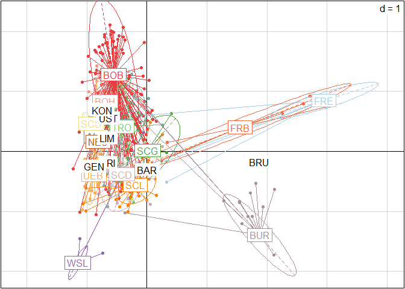

Presentation2024
================
Lia Baumann
2024-07-10

Readme:

SY = Sampling Year TY = Truffle Year

Contents:

1.  Nei’s genetic diversity Hexp

- allMarkersOnly (SY and TY)
- rar = rarefied (SY and TY)
- cc = clone-corrected (SY and TY)

2.  Simpson’s diversity

3.  PCA

- allMarkersOnly
- cc = clone-corrected (SY and TY)

## 1. Nei’s genetic diversity

#### myData_genind_allMarkersOnly locus table mean over all data

``` r
setPop(myData_genind_allMarkersOnly) <- ~Pop/SamplingYear
kable(locus_table(myData_genind_allMarkersOnly, lev="genotype"))
```

|          |  genotype |       1-D |      Hexp |  Evenness |
|:---------|----------:|----------:|----------:|----------:|
| aest06_1 |  7.000000 | 0.6730385 | 0.6732936 | 0.6570770 |
| aest07_1 |  6.000000 | 0.6421798 | 0.6424232 | 0.7374031 |
| aest15_1 |  3.000000 | 0.3599785 | 0.3601150 | 0.5951145 |
| aest26_1 | 11.000000 | 0.7662918 | 0.7665823 | 0.8581682 |
| aest28_1 | 21.000000 | 0.8233917 | 0.8237038 | 0.7871815 |
| aest35_1 |  7.000000 | 0.4727281 | 0.4729073 | 0.6372338 |
| aest36_1 |  7.000000 | 0.5682731 | 0.5684885 | 0.7985303 |
| aest01_1 |  7.000000 | 0.7400561 | 0.7403366 | 0.7860491 |
| aest10_1 |  7.000000 | 0.7669942 | 0.7672850 | 0.8699693 |
| aest18_1 |  5.000000 | 0.7290974 | 0.7293737 | 0.8861867 |
| aest24_1 |  7.000000 | 0.5509528 | 0.5511616 | 0.5277299 |
| aest25_1 |  5.000000 | 0.5665603 | 0.5667751 | 0.7270351 |
| aest29_1 |  9.000000 | 0.6922076 | 0.6924700 | 0.7836765 |
| aest31_1 |  7.000000 | 0.6665609 | 0.6668136 | 0.8004907 |
| mean     |  7.785714 | 0.6441650 | 0.6444092 | 0.7465604 |

#### myData_genind_allMarkersOnly locus table per Population, BAR and SCHIF removed (Strata: Population / SamplingYear)

``` r
setPop(myData_genind_allMarkersOnly) <- ~Pop
myData_genind_allMarkersOnly_allButBAR_SCHIF <- popsub(myData_genind_allMarkersOnly, exclude=c("BAR","SCHIF"))
setPop(myData_genind_allMarkersOnly_allButBAR_SCHIF) <- ~Pop/SamplingYear

# create a data frame and transpose the result;
# use sapply to iterate over all populations calculated by seppop.
# then use the locus_table function on the level Genotype

locus_table_SY_allButBAR_SCHIF <- data.frame(t(
  sapply(seppop(myData_genind_allMarkersOnly_allButBAR_SCHIF),
    function(ls) poppr::locus_table(ls,lev="genotype"))))

# choose only the columns corresponding to Hexp values and rename them with their loci

locus_table_SY_hexp_allButBAR_SCHIF <- 
  select(locus_table_SY_allButBAR_SCHIF, X31:X45) %>%
  rename(aest06_1=X31,aest07_1=X32, aest15_1=X33, aest26_1=X34,aest28_1=X35, aest35_1=X36, aest36_1=X37, aest01_1=X38, aest10_1=X39, aest18_1=X40, aest24_1=X41, aest25_1=X42, aest29_1=X43, aest31_1=X44, mean=X45) %>%
  tibble::rownames_to_column("Pop") %>%
  separate(.,Pop,sep="_", into=c("Pop","SamplingYear"))
                                      
#pivot to have Hexp values in columns as value to use in ggplot later
locus_table_SY_hexp_allButBAR_SCHIF_pivot <- pivot_longer(locus_table_SY_hexp_allButBAR_SCHIF,cols=3:16,names_to="locus",values_to="value")

ggplot(locus_table_SY_hexp_allButBAR_SCHIF_pivot,aes(x=as.numeric(SamplingYear), y=value)) +
  geom_point(pch=20, alpha=0.3, size=0.8) +
  geom_smooth(method="gam", formula=y~s(x,k=2), colour="darkgreen", linewidth=0.6) +
  facet_wrap(vars(Pop)) +
  labs(y="Nei's genetic diversity Hexp", x="Sampling year") +
  ggtitle("Nei's genetic diversity per locus, sampling year and population") +
  theme(aspect.ratio=0.4,
    strip.background = element_blank(),
    strip.text=element_text(size=7,hjust=0.1, vjust=0.5),
    panel.grid = element_blank(),
    panel.spacing=unit(0.1,"lines"))
```

<!-- -->

``` r
#Adaptiere Facetten nach Geographie

locus_table_SY_hexp_allButBAR_SCHIF_pivot$Pop <-factor(locus_table_SY_hexp_allButBAR_SCHIF_pivot$Pop, ordered=TRUE, levels=order_sites_WtoE)

ggplot(locus_table_SY_hexp_allButBAR_SCHIF_pivot,aes(x=as.numeric(SamplingYear), y=value)) +
  geom_point(pch=20, alpha=0.3, size=0.8) +
  geom_smooth(method="gam", formula=y~s(x,k=2), colour="darkgreen", linewidth=0.6) +
  facet_wrap(vars(Pop)) +
  labs(y="Nei's genetic diversity Hexp", x="Sampling year") +
  ggtitle("Nei's genetic diversity per locus, sampling year and population") +
  theme(aspect.ratio=0.4,
    strip.background = element_blank(),
    strip.text=element_text(size=7,hjust=0.1, vjust=0.5),
    panel.grid = element_blank(),
    panel.spacing=unit(0.1,"lines"))
```

<!-- -->

``` r
n_samples_allMarkersOnly_SY_allButBAR_SCHIF <- poppr(myData_genind_allMarkersOnly_allButBAR_SCHIF) %>%
  separate(Pop, sep="_", into=c("Pop","SamplingYear"))

n_samples_allMarkersOnly_SY_allButBAR_SCHIF %>%
  select(Pop,SamplingYear,N) %>%
  pivot_wider(names_from=SamplingYear, values_from=N) %>%
  select(.,-"NA") %>%
  replace(is.na(.),0) %>%
  arrange(Pop) %>%
  kable()
```

| Pop   | 2011 | 2012 | 2013 | 2014 | 2015 | 2016 | 2017 | 2018 | 2019 | 2020 | 2021 | 2022 | 2023 |
|:------|-----:|-----:|-----:|-----:|-----:|-----:|-----:|-----:|-----:|-----:|-----:|-----:|-----:|
| ALD   |   24 |   12 |   16 |    7 |    3 |    0 |    0 |    0 |    0 |    0 |    0 |    0 |    0 |
| BOB   |    6 |   36 |   50 |   30 |   16 |   53 |  145 |   65 |   28 |    0 |    0 |    0 |    0 |
| BOH   |   11 |   13 |    6 |   10 |    0 |    0 |    0 |    0 |    0 |    0 |    0 |    0 |    0 |
| BRU   |    0 |    0 |    0 |    0 |    0 |   90 |   14 |   74 |    0 |    0 |    0 |    0 |    0 |
| BUR   |    0 |    0 |   63 |    8 |    6 |   21 |    0 |   34 |    3 |   59 |   20 |    9 |    0 |
| FRB   |    4 |    4 |    4 |    1 |    0 |    0 |    0 |    0 |    0 |    0 |    0 |    0 |    0 |
| FRE   |   21 |   20 |   10 |    9 |    6 |   51 |   97 |    0 |    0 |    0 |    0 |    0 |    0 |
| FRI   |    0 |    0 |   51 |    4 |    1 |    9 |   52 |    3 |    0 |    0 |    0 |    0 |    0 |
| GEN   |    0 |    0 |    0 |    0 |    0 |    0 |    0 |    1 |    0 |    3 |    1 |    5 |    0 |
| HAN   |    0 |    0 |    0 |    0 |    0 |    1 |   39 |   22 |    3 |    0 |    0 |    0 |    0 |
| KON   |    0 |    0 |    3 |   12 |    2 |   25 |   17 |   41 |   26 |   25 |   27 |   11 |   23 |
| LIM   |    0 |    0 |    0 |    0 |    0 |   65 |   80 |   71 |    0 |    0 |    0 |    0 |    0 |
| NEU   |    0 |    0 |    4 |    3 |    1 |   15 |    2 |    0 |    0 |    5 |    2 |    0 |    0 |
| RIE   |   19 |   11 |   16 |   12 |    4 |    0 |    0 |    0 |    0 |    0 |    0 |    0 |    0 |
| SCD   |    0 |   25 |    5 |    8 |   16 |   43 |    3 |    0 |    0 |    0 |    0 |    0 |    0 |
| SCG   |    9 |    3 |    1 |    2 |    0 |    0 |    0 |    0 |    0 |    0 |    0 |    0 |    0 |
| SCL   |    0 |   53 |    7 |   24 |    1 |    9 |    5 |    0 |    0 |    0 |    0 |    0 |    0 |
| SCS   |    0 |    0 |    7 |   15 |    0 |   19 |    2 |    0 |    0 |    0 |    0 |    0 |    0 |
| TRO   |   16 |   10 |    8 |    0 |    0 |    0 |    0 |    0 |    0 |    0 |    0 |    0 |    0 |
| Total |    0 |    0 |    0 |    0 |    0 |    0 |    0 |    0 |    0 |    0 |    0 |    0 |    0 |
| UEB   |   27 |    6 |   54 |   36 |   27 |    0 |    0 |    0 |    3 |    0 |    0 |    0 |    0 |
| UST   |    0 |    0 |   25 |   10 |    0 |    0 |    0 |    0 |    0 |    0 |    0 |    0 |    0 |
| WSL   |    0 |    1 |    0 |    0 |    0 |   58 |   61 |   14 |   72 |   73 |    4 |    0 |    0 |

#### myData_genind_allMarkersOnly locus table per Population, BAR and SCHIF removed (Strata: Population / TruffleYear)

### Rarefaction of Neis’ diversity index

Rarefied: Hexp \* (N/N-1). N= Anzahl samples (nicht Allele)

``` r
setPop(myData_genind_allMarkersOnly_allButBAR_SCHIF) <- ~Pop/SamplingYear
popdata_pop_year_rareNei_SY <- poppr(myData_genind_allMarkersOnly_allButBAR_SCHIF) %>%
  select(Pop, N)

# choose only the columns corresponding to Hexp values and rename them with their loci
locus_table_SY_hexp_N_allButBAR_SCHIF <- 
  select(locus_table_SY_allButBAR_SCHIF, X31:X45) %>%
  rename(aest06_1=X31,aest07_1=X32, aest15_1=X33, aest26_1=X34,aest28_1=X35, aest35_1=X36, aest36_1=X37, aest01_1=X38, aest10_1=X39, aest18_1=X40, aest24_1=X41, aest25_1=X42, aest29_1=X43, aest31_1=X44, mean=X45) %>%
    tibble::rownames_to_column("Pop") %>%
  left_join(.,popdata_pop_year_rareNei_SY,by="Pop") %>%
  separate(.,Pop,sep="_", into=c("Pop","SamplingYear"))

N_minus_SY <- locus_table_SY_hexp_N_allButBAR_SCHIF$N #number of samples
#calculate rarefaction over all the values (columns 3:17)
rarHexpSY_minus <- (N_minus_SY/(N_minus_SY-1))*select(locus_table_SY_hexp_N_allButBAR_SCHIF,3:17)
#add the pop and year again
rarHexpSY_minus <- bind_cols(rarHexpSY_minus,Pop = locus_table_SY_hexp_N_allButBAR_SCHIF$Pop, SamplingYear = locus_table_SY_hexp_N_allButBAR_SCHIF$SamplingYear)

rarHexpSY_minus_pivot <- pivot_longer(locus_table_SY_hexp_N_allButBAR_SCHIF,cols=3:16,names_to="locus",values_to="value")

ggplot(rarHexpSY_minus_pivot,aes(x=as.numeric(SamplingYear), y=value)) +
  geom_point(pch=20, alpha=0.3, size=0.8) +
  geom_smooth(method="gam", formula=y~s(x,k=2), colour="darkgreen", linewidth=0.6) +
  facet_wrap(vars(Pop)) +
  labs(y="Nei's genetic diversity rarefied Hexp", x="Sampling year") +
  ggtitle("Nei's rarefied genetic diversity per locus, sampling year and population") +
  theme(aspect.ratio=0.4,
    strip.background = element_blank(),
    strip.text=element_text(size=7,hjust=0.1, vjust=0.5),
    panel.grid = element_blank(),
    panel.spacing=unit(0.1,"lines"))
```

<!-- -->

``` r
#Adaptiere Facetten nach Geographie

rarHexpSY_minus_pivot$Pop <-factor(rarHexpSY_minus_pivot$Pop, ordered=TRUE, levels=order_sites_WtoE)

ggplot(rarHexpSY_minus_pivot,aes(x=as.numeric(SamplingYear), y=value)) +
  geom_point(pch=20, alpha=0.3, size=0.8) +
  geom_smooth(method="gam", formula=y~s(x,k=2), colour="darkgreen", linewidth=0.6) +
  facet_wrap(vars(Pop)) +
  labs(y="Nei's rarefied genetic diversity Hexp", x="Sampling year") +
  ggtitle("Nei's rarefied genetic diversity per locus, sampling year and population") +
  theme(aspect.ratio=0.4,
    strip.background = element_blank(),
    strip.text=element_text(size=7,hjust=0.1, vjust=0.5),
    panel.grid = element_blank(),
    panel.spacing=unit(0.1,"lines"))
```

<!-- -->

#### clone-corrected myData_genind_allMarkersOnly locus table per Population (Strata: Population / SamplingYear), removed BAR and SCHIF

``` r
setPop(cc_myData_genind_allMarkersOnly_SY) <- ~Pop
cc_myData_genind_allMarkersOnly_allButBAR_SCHIF_SY <- popsub(cc_myData_genind_allMarkersOnly_SY, exclude=c("BAR","SCHIF"))
setPop(cc_myData_genind_allMarkersOnly_allButBAR_SCHIF_SY) <- ~Pop/SamplingYear

# create a data frame and transpose the result;
# use sapply to iterate over all populations calculated by seppop.
# then use the locus_table function on the level Genotype

cc_locus_table_allButBAR_SCHIF_SY <- data.frame(t(
  sapply(seppop(cc_myData_genind_allMarkersOnly_allButBAR_SCHIF_SY),
    function(ls) poppr::locus_table(ls,lev="genotype"))))

# choose only the columns corresponding to Hexp values and rename them with their loci

cc_locus_table_SY_hexp_allButBAR_SCHIF <- 
  select(cc_locus_table_allButBAR_SCHIF_SY, X31:X45) %>%
  rename(aest06_1=X31,aest07_1=X32, aest15_1=X33, aest26_1=X34,aest28_1=X35, aest35_1=X36, aest36_1=X37, aest01_1=X38, aest10_1=X39, aest18_1=X40, aest24_1=X41, aest25_1=X42, aest29_1=X43, aest31_1=X44, mean=X45) %>%
  tibble::rownames_to_column("Pop") %>%
  separate(.,Pop,sep="_", into=c("Pop","SamplingYear"))
                                      
cc_locus_table_SY_hexp_allButBAR_SCHIF_pivot <- pivot_longer(cc_locus_table_SY_hexp_allButBAR_SCHIF,cols=3:16,names_to="locus",values_to="value")

ggplot(cc_locus_table_SY_hexp_allButBAR_SCHIF_pivot,aes(x=as.numeric(SamplingYear), y=value)) +
  geom_point(pch=20, alpha=0.3, size=0.8) +
  geom_smooth(method="gam", formula=y~s(x,k=2), colour="darkgreen", linewidth=0.6) +
  facet_wrap(vars(Pop)) +
  labs(y="Nei's genetic diversity Hexp", x="Sampling year") +
  ggtitle("Nei's genetic diversity per locus, sampling year and population (clone-corrected)") +
  theme(aspect.ratio=0.4,
    strip.background = element_blank(),
    strip.text=element_text(size=7,hjust=0.1, vjust=0.5),
    panel.grid = element_blank(),
    panel.spacing=unit(0.1,"lines"))
```

<!-- -->

``` r
#Adaptiere mit Geographie

cc_locus_table_SY_hexp_allButBAR_SCHIF_pivot$Pop <-factor(cc_locus_table_SY_hexp_allButBAR_SCHIF_pivot$Pop, ordered=TRUE, levels=order_sites_WtoE)

ggplot(cc_locus_table_SY_hexp_allButBAR_SCHIF_pivot,aes(x=as.numeric(SamplingYear), y=value)) +
  geom_point(pch=20, alpha=0.3, size=0.8) +
  geom_smooth(method="gam", formula=y~s(x,k=2), colour="darkgreen", linewidth=0.6) +
  facet_wrap(vars(Pop)) +
  labs(y="Nei's genetic diversity Hexp", x="Sampling year") +
  ggtitle("Nei's genetic diversity per locus, sampling year and population (clone-corrected)") +
  theme(aspect.ratio=0.4,
    strip.background = element_blank(),
    strip.text=element_text(size=7,hjust=0.1, vjust=0.5),
    panel.grid = element_blank(),
    panel.spacing=unit(0.1,"lines"))
```

<!-- -->

``` r
n_samples_cc_allMarkersOnly_SY <- poppr(cc_myData_genind_allMarkersOnly_allButBAR_SCHIF_SY) %>%
  separate(Pop, sep="_", into=c("Pop","SamplingYear"))

n_samples_cc_allMarkersOnly_SY %>%
  select(Pop,SamplingYear,N) %>%
  pivot_wider(names_from=SamplingYear, values_from=N) %>%
  select(.,-"NA") %>%
  replace(is.na(.),0) %>%
  arrange(Pop) %>%
  kable()
```

| Pop   | 2011 | 2012 | 2013 | 2014 | 2015 | 2016 | 2017 | 2018 | 2019 | 2020 | 2021 | 2022 | 2023 |
|:------|-----:|-----:|-----:|-----:|-----:|-----:|-----:|-----:|-----:|-----:|-----:|-----:|-----:|
| ALD   |    6 |    4 |    4 |    5 |    2 |    0 |    0 |    0 |    0 |    0 |    0 |    0 |    0 |
| BOB   |    5 |   18 |   27 |   24 |   15 |   23 |   41 |   32 |   16 |    0 |    0 |    0 |    0 |
| BOH   |    9 |   12 |    6 |    6 |    0 |    0 |    0 |    0 |    0 |    0 |    0 |    0 |    0 |
| BRU   |    0 |    0 |    0 |    0 |    0 |    5 |    3 |   10 |    0 |    0 |    0 |    0 |    0 |
| BUR   |    0 |    0 |   11 |    6 |    4 |    3 |    0 |    2 |    1 |    2 |    2 |    1 |    0 |
| FRB   |    2 |    3 |    4 |    1 |    0 |    0 |    0 |    0 |    0 |    0 |    0 |    0 |    0 |
| FRE   |    2 |    3 |    3 |    2 |    1 |    1 |    2 |    0 |    0 |    0 |    0 |    0 |    0 |
| FRI   |    0 |    0 |    7 |    3 |    1 |    2 |    5 |    2 |    0 |    0 |    0 |    0 |    0 |
| GEN   |    0 |    0 |    0 |    0 |    0 |    0 |    0 |    1 |    0 |    2 |    1 |    1 |    0 |
| HAN   |    0 |    0 |    0 |    0 |    0 |    1 |    6 |    5 |    1 |    0 |    0 |    0 |    0 |
| KON   |    0 |    0 |    3 |    7 |    2 |    7 |    6 |    9 |    8 |    7 |    2 |    4 |    5 |
| LIM   |    0 |    0 |    0 |    0 |    0 |   12 |    6 |    6 |    0 |    0 |    0 |    0 |    0 |
| NEU   |    0 |    0 |    2 |    2 |    1 |    3 |    1 |    0 |    0 |    3 |    2 |    0 |    0 |
| RIE   |   16 |   10 |   13 |   11 |    4 |    0 |    0 |    0 |    0 |    0 |    0 |    0 |    0 |
| SCD   |    0 |   22 |    5 |    4 |   11 |    4 |    2 |    0 |    0 |    0 |    0 |    0 |    0 |
| SCG   |    5 |    1 |    1 |    2 |    0 |    0 |    0 |    0 |    0 |    0 |    0 |    0 |    0 |
| SCL   |    0 |   22 |    7 |   10 |    1 |    3 |    5 |    0 |    0 |    0 |    0 |    0 |    0 |
| SCS   |    0 |    0 |    4 |    3 |    0 |    1 |    1 |    0 |    0 |    0 |    0 |    0 |    0 |
| TRO   |    5 |    3 |    2 |    0 |    0 |    0 |    0 |    0 |    0 |    0 |    0 |    0 |    0 |
| Total |    0 |    0 |    0 |    0 |    0 |    0 |    0 |    0 |    0 |    0 |    0 |    0 |    0 |
| UEB   |    7 |    6 |   13 |   15 |    9 |    0 |    0 |    0 |    3 |    0 |    0 |    0 |    0 |
| UST   |    0 |    0 |   15 |    8 |    0 |    0 |    0 |    0 |    0 |    0 |    0 |    0 |    0 |
| WSL   |    0 |    1 |    0 |    0 |    0 |    2 |    2 |    1 |    2 |    3 |    2 |    0 |    0 |

#### clone-corrected myData_genind_allMarkersOnly locus table per Population (Strata: Population / TruffleYear), removed BAR, SCHIF and GEN

## 2. Simpson’s diversity

``` r
setPop(myData_genind_allMarkersOnly) <- ~Pop/SamplingYear
popdata_all_pop_year <- poppr(myData_genind_allMarkersOnly) %>%
  separate(Pop,c("Pop","SamplingYear"))

popdata_all_pop_year_graph <- filter(popdata_all_pop_year,Pop!="Total") %>%
ggplot(aes(as.numeric(SamplingYear),lambda)) +
  geom_point(pch=20, size=0.9) +
  facet_wrap(vars(Pop)) +
  labs(y="Simpson's index", x="Sampling year") +
  ggtitle("Simpson's index over the sampling years and all populations") +
  theme(aspect.ratio=0.4,
    strip.background = element_blank(),
    strip.text=element_text(size=7,hjust=0.1, vjust=0.5),
    panel.grid = element_blank(),
    panel.spacing=unit(0.1,"lines"))
popdata_all_pop_year_graph
```

<!-- -->

``` r
#emf(file="simpson_all_SY.emf")
#popdata_all_pop_year_graph
#dev.off()

#rarefied:
N_all      <- popdata_all_pop_year$N      # number of samples
lambda_all <- popdata_all_pop_year$lambda # Simpson's index
popdata_all_pop_year$rarLambda_all <- (N_all/(N_all - 1)) * lambda_all             # Corrected Simpson's index

rar_popdata_all_pop_year_graph <- filter(popdata_all_pop_year,Pop!="Total") %>%
ggplot(aes(as.numeric(SamplingYear),rarLambda_all)) +
  geom_point(pch=20, size=0.9) +
  facet_wrap(vars(Pop)) +
  labs(y="Rarefied Simpson's index", x="Sampling year") +
  ggtitle("Rarefied Simpson's index over the sampling years and all populations") +
  theme(aspect.ratio=0.4,
    strip.background = element_blank(),
    strip.text=element_text(size=7,hjust=0.1, vjust=0.5),
    panel.grid = element_blank(),
    panel.spacing=unit(0.1,"lines"))
rar_popdata_all_pop_year_graph
```

<!-- -->

``` r
#remove BAR and SCHIF
rar_popdata_all_pop_year_graph1 <- filter(popdata_all_pop_year,! Pop %in% c("Total", "BAR","SCHIF")) %>%
ggplot(aes(as.numeric(SamplingYear),rarLambda_all)) +
  geom_point(pch=20, size=0.9) +
  facet_wrap(vars(Pop)) +
  labs(y="Rarefied Simpson's index", x="Sampling year", subtitle="BAR and SCHIF: sample size too small") +
  ggtitle("Rarefied Simpson's index over the sampling years") +
  theme(aspect.ratio=0.4,
    strip.background = element_blank(),
    strip.text=element_text(size=7,hjust=0.1, vjust=0.5),
    panel.grid = element_blank(),
    panel.spacing=unit(0.1,"lines"))
rar_popdata_all_pop_year_graph1
```

<!-- -->

``` r
#emf(file="rarSimpson_all_SY_minusBARSCHIF.emf")
#rar_popdata_all_pop_year_graph1
#dev.off()


# TruffleYears

setPop(myData_genind_allMarkersOnly) <- ~Pop/TruffleYear
popdata_all_pop_year <- poppr(myData_genind_allMarkersOnly) %>%
  separate(Pop,c("Pop","TruffleYear"))

popdata_all_pop_year_graph_TY <- filter(popdata_all_pop_year,Pop!="Total") %>%
ggplot(aes(as.numeric(TruffleYear),lambda)) +
  geom_point(pch=20, size=0.9) +
  facet_wrap(vars(Pop)) +
  labs(y="Simpson's index", x="Truffle year") +
  ggtitle("Simpson's index over the truffle years and all populations") +
  theme(aspect.ratio=0.4,
    strip.background = element_blank(),
    strip.text=element_text(size=7,hjust=0.1, vjust=0.5),
    panel.grid = element_blank(),
    panel.spacing=unit(0.1,"lines"))
popdata_all_pop_year_graph_TY
```

<!-- -->

``` r
#emf(file="simpson_all_TY.emf")
#popdata_all_pop_year_graph_TY
#dev.off()

#rarefied:
N_all      <- popdata_all_pop_year$N      # number of samples
lambda_all <- popdata_all_pop_year$lambda # Simpson's index
popdata_all_pop_year$rarLambda_all <- (N_all/(N_all - 1)) * lambda_all             # Corrected Simpson's index

rar_popdata_all_pop_year_graph_TY <- filter(popdata_all_pop_year,Pop!="Total") %>%
ggplot(aes(as.numeric(TruffleYear),rarLambda_all)) +
  geom_point(pch=20, size=0.9) +
  facet_wrap(vars(Pop)) +
  labs(y="Rarefied Simpson's index", x="Truffle year") +
  ggtitle("Rarefied Simpson's index over the truffle years") +
  theme(aspect.ratio=0.4,
    strip.background = element_blank(),
    strip.text=element_text(size=7,hjust=0.1, vjust=0.5),
    panel.grid = element_blank(),
    panel.spacing=unit(0.1,"lines"))
rar_popdata_all_pop_year_graph_TY
```

<!-- -->

``` r
#emf(file="rarSimpson_all_TY.emf")
#rar_popdata_all_pop_year_graph_TY
#dev.off()

#remove BAR and SCHIF
rar_popdata_all_pop_year_TY_graph1 <- filter(popdata_all_pop_year,! Pop %in% c("Total", "BAR","SCHIF")) %>%
ggplot(aes(as.numeric(TruffleYear),rarLambda_all)) +
  geom_point(pch=20, size=0.9) +
  facet_wrap(vars(Pop)) +
  labs(y="Rarefied Simpson's index", x="Truffle year", subtitle="BAR and SCHIF: sample size too small") +
  ggtitle("Rarefied Simpson's index over the truffle years") +
  theme(aspect.ratio=0.4,
    strip.background = element_blank(),
    strip.text=element_text(size=7,hjust=0.1, vjust=0.5),
    panel.grid = element_blank(),
    panel.spacing=unit(0.1,"lines"))
rar_popdata_all_pop_year_TY_graph1
```

<!-- -->

``` r
#emf(file="rarSimpson_all_TY_minusBARSCHIF.emf")
#rar_popdata_all_pop_year_TY_graph1
#dev.off()

#clone corrected, Sampling Year:

setPop(cc_myData_genind_allMarkersOnly_SY) <- ~Pop/SamplingYear
cc_popdata_all_pop_year <- poppr(cc_myData_genind_allMarkersOnly_SY) %>%
  separate(Pop,c("Pop","SamplingYear"))

cc_popdata_all_pop_year_graph <- filter(cc_popdata_all_pop_year,Pop!="Total") %>%
ggplot(aes(as.numeric(SamplingYear),lambda)) +
  geom_point(pch=20, size=0.9) +
  facet_wrap(vars(Pop)) +
  labs(y="Simpson's index", x="Sampling year") +
  ggtitle("Simpson's index over the sampling years (clone-corrected)") +
  theme(aspect.ratio=0.4,
    strip.background = element_blank(),
    strip.text=element_text(size=7,hjust=0.1, vjust=0.5),
    panel.grid = element_blank(),
    panel.spacing=unit(0.1,"lines"))
cc_popdata_all_pop_year_graph
```

<!-- -->

``` r
#emf(file="cc_simpson_all_SY.emf")
#cc_popdata_all_pop_year_graph
#dev.off()

#rarefied doesn't make sense

# TruffleYears

setPop(cc_myData_genind_allMarkersOnly_TY) <- ~Pop/TruffleYear
cc_popdata_all_pop_year <- poppr(cc_myData_genind_allMarkersOnly_TY) %>%
  separate(Pop,c("Pop","TruffleYear"))

cc_popdata_all_pop_year_TY_graph <- filter(cc_popdata_all_pop_year,Pop!="Total") %>%
ggplot(aes(as.numeric(TruffleYear),lambda)) +
  geom_point(pch=20, size=0.9) +
  facet_wrap(vars(Pop)) +
  labs(y="Simpson's index", x="Truffle year") +
  ggtitle("Simpson's index over the truffle years (clone-corrected)") +
  theme(aspect.ratio=0.4,
    strip.background = element_blank(),
    strip.text=element_text(size=7,hjust=0.1, vjust=0.5),
    panel.grid = element_blank(),
    panel.spacing=unit(0.1,"lines"))
cc_popdata_all_pop_year_TY_graph
```

<!-- -->

``` r
#emf(file="cc_simpson_all_TY.emf")
#cc_popdata_all_pop_year_TY_graph
#dev.off()
```

## 3. PCA

``` r
#uncorrected PCA with allMarkersOnly dataset
setPop(myData_genind_allMarkersOnly) <- ~Pop
x.pops_allMarkersOnly <- tab(myData_genind_allMarkersOnly,
                             freq=TRUE, NA.method="mean")
#x.pops_allMarkersOnly[grep("FRE", rownames(x.pops_allMarkersOnly)), ]

pca.pops.allMarkersOnly <- dudi.pca(df = x.pops_allMarkersOnly,
                                    center = TRUE, scale = FALSE, scannf = FALSE, nf = 2)

s.class(pca.pops.allMarkersOnly$li, fac=pop(myData_genind_allMarkersOnly),
        col=funky(15))
```

<!-- -->

``` r
#emf(file="pca.allMarkersOnly.emf")
#s.class(pca.pops.allMarkersOnly$li, fac=pop(myData_genind_allMarkersOnly),
 #       col=funky(15))
#dev.off()

#clonecorrected PCA  with samplingYear
setPop(cc_myData_genind_allMarkersOnly_SY) <- ~Pop
x.pops_cc.SY <- tab(cc_myData_genind_allMarkersOnly_SY,
                    freq=TRUE, NA.method="mean")
pca.pops_cc.SY <- dudi.pca(df = x.pops_cc.SY,
                           center = TRUE, scale = FALSE, scannf = FALSE, nf = 2)
s.class(pca.pops_cc.SY$li,
        fac=pop(cc_myData_genind_allMarkersOnly_SY),
        col=funky(15))
```

<!-- -->

``` r
#emf(file="pca.cc.allMarkersOnly_SY.emf")
#s.class(pca.pops_cc.SY$li,
#        fac=pop(cc_myData_genind_allMarkersOnly_SY),
#        col=funky(15))
#dev.off()

#clonecorrected PCA  with TruffleYear
setPop(cc_myData_genind_allMarkersOnly_TY) <- ~Pop
x.pops_cc.TY <- tab(cc_myData_genind_allMarkersOnly_TY,
                    freq=TRUE, NA.method="mean")
pca.pops_cc.TY_2 <- dudi.pca(df = x.pops_cc.TY,
                           center = TRUE, scale = FALSE, scannf = FALSE, nf = 2)
pca.pops_cc.TY_3 <- dudi.pca(df = x.pops_cc.TY,
                           center = TRUE, scale = FALSE, scannf = FALSE, nf = 3)
s.class(pca.pops_cc.TY_2$li,
        fac=pop(cc_myData_genind_allMarkersOnly_TY),
        col=funky(15))
s.class(pca.pops_cc.TY_3$li,
        fac=pop(cc_myData_genind_allMarkersOnly_TY),
        col=funky(15))
```

<!-- -->

``` r
#emf(file="pca.cc.allMarkersOnly_TY.emf")
#s.class(pca.pops_cc.TY_2$li,
#        fac=pop(cc_myData_genind_allMarkersOnly_TY),
#        col=funky(15))
#dev.off()

#plot(pca.pops_cc.TY$li, col=
```
