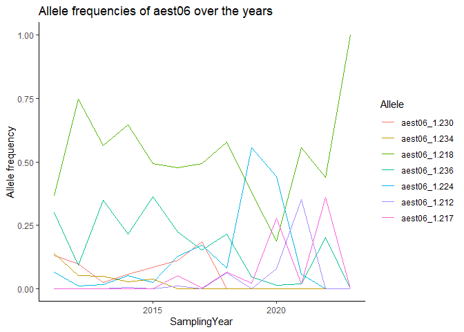

Richness, Evenness, AMOVA, Isolation by distance
================
Lia Baumann
2024-09-03

# Hardy-Weinberg equilibrium

Cannot be determined for haploids.

# Genotypic richness

The number of observed MLGs is equivalent to genotypic richness. We
expect that the BB population would have a higher genotypic richness
than the FR population. However, looking at the raw number of MLGs for
each symptom type, it shows us the opposite: there are 94 MLGs for BB
and 191 MLGs for FR. This discrepancy has to do with the sample size
differences, namely N=113 for BB and N=581 for FR. A more appropriate
comparison is the eMLG value, which is an approximation of the number of
genotypes that would be expected at the largest, shared sample size
(N=113) based on rarefaction. For BB (N=113) the eMLG=94 and for FR
(where N is set to 113) the eMLG = 66.6. Thus, genotypic richness is
indeed higher in the BB populations than the FR population when
considering equal sample sizes.

``` r
setPop(myData_genind_allMarkersOnly) <- ~SamplingYear

#Minimal sample size Sum is 1 so this can not give any relevant output. I will plot the same for higher sample sizes only
#only calculate Richness for populations > 100 samples (N)
myData_genind_allMarkersOnly_above100N <- selPopSize(myData_genind_allMarkersOnly,pop=NULL,nMin=100)
summary(myData_genind_allMarkersOnly_above100N)
```

    ## 
    ## // Number of individuals: 2454
    ## // Group sizes: 137 194 330 192 459 517 325 135 165
    ## // Number of alleles per locus: 7 6 3 10 21 7 7 7 7 5 7 5 9 7
    ## // Number of alleles per group: 57 69 77 77 78 68 72 55 49
    ## // Percentage of missing data: 0 %
    ## // Observed heterozygosity: 0

``` r
H.year <- mlg.table(myData_genind_allMarkersOnly, plot = FALSE)
rarecurve(H.year, ylab="Number of expected MLGs", sample=min(rowSums(H.year)),
          border = NA, fill = NA, font = 2, cex = 1, col = "blue")
title("Rarecurve of Sampling Years")
```

<!-- -->

``` r
setPop(myData_genind_allMarkersOnly) <- ~TruffleYear
myData_genind_allMarkersOnly_above100N <- selPopSize(myData_genind_allMarkersOnly,pop=NULL,nMin=100)
summary(myData_genind_allMarkersOnly_above100N)
```

    ## 
    ## // Number of individuals: 2454
    ## // Group sizes: 145 195 328 187 488 539 272 138 162
    ## // Number of alleles per locus: 7 6 3 10 21 7 7 7 7 5 7 5 9 7
    ## // Number of alleles per group: 57 67 76 75 80 75 70 56 48
    ## // Percentage of missing data: 0 %
    ## // Observed heterozygosity: 0

``` r
H.year <- mlg.table(myData_genind_allMarkersOnly, plot = FALSE)
rarecurve(H.year, ylab="Number of expected MLGs", sample=min(rowSums(H.year)),
          border = NA, fill = NA, font = 2, cex = 1, col = "blue")
title("Rarecurve of Truffle Years")
```

<!-- -->

``` r
setPop(myData_genind_allMarkersOnly) <- ~Month
myData_genind_allMarkersOnly_above100N <- selPopSize(myData_genind_allMarkersOnly,pop=NULL,nMin=40)
summary(myData_genind_allMarkersOnly_above100N)
```

    ## 
    ## // Number of individuals: 2585
    ## // Group sizes: 75 80 81 332 299 488 669 351 160 50
    ## // Number of alleles per locus: 7 6 3 11 21 7 7 7 7 5 7 5 9 7
    ## // Number of alleles per group: 68 73 67 76 81 84 83 83 82 67
    ## // Percentage of missing data: 0 %
    ## // Observed heterozygosity: 0

``` r
poppr(myData_genind_allMarkersOnly_above100N)
```

    ##      Pop    N MLG eMLG   SE    H    G lambda   E.5  Hexp   Ia rbarD
    ## 1      1   75  51 37.5 1.90 3.77 35.4  0.972 0.813 0.585 1.69 0.131
    ## 2      3   80  45 31.2 2.12 3.44 20.5  0.951 0.648 0.650 3.71 0.288
    ## 3      6   81  28 22.1 1.71 2.88 11.3  0.911 0.614 0.582 3.77 0.292
    ## 4      7  332  60 20.9 2.52 3.04 10.4  0.904 0.473 0.667 5.14 0.397
    ## 5      8  299  91 28.0 2.83 3.68 19.2  0.948 0.470 0.645 3.45 0.267
    ## 6      9  488 132 29.0 2.87 3.88 21.9  0.954 0.439 0.621 3.26 0.252
    ## 7     10  669 148 30.6 2.86 4.06 32.1  0.969 0.544 0.645 3.18 0.246
    ## 8     11  351 146 36.5 2.79 4.43 48.2  0.979 0.572 0.598 2.09 0.162
    ## 9     12  160  85 36.7 2.56 4.12 42.7  0.977 0.686 0.649 2.63 0.204
    ## 10     2   50  34 34.0 0.00 3.30 19.8  0.950 0.724 0.587 2.44 0.189
    ## 11 Total 2585 441 33.0 2.98 4.54 34.6  0.971 0.363 0.645 3.01 0.233
    ##                                      File
    ## 1  myData_genind_allMarkersOnly_above100N
    ## 2  myData_genind_allMarkersOnly_above100N
    ## 3  myData_genind_allMarkersOnly_above100N
    ## 4  myData_genind_allMarkersOnly_above100N
    ## 5  myData_genind_allMarkersOnly_above100N
    ## 6  myData_genind_allMarkersOnly_above100N
    ## 7  myData_genind_allMarkersOnly_above100N
    ## 8  myData_genind_allMarkersOnly_above100N
    ## 9  myData_genind_allMarkersOnly_above100N
    ## 10 myData_genind_allMarkersOnly_above100N
    ## 11 myData_genind_allMarkersOnly_above100N

``` r
H.year <- mlg.table(myData_genind_allMarkersOnly, plot = FALSE)
rarecurve(H.year, ylab="Number of expected MLGs", sample=min(rowSums(H.year)),
          border = NA, fill = NA, font = 2, cex = 1, col = "blue")
title("Rarecurve of Month")
```

<!-- -->

``` r
#Genotypic richness rises, the later the ascocarps were collected --> more different individuals produced fruiting bodies
```

\#Genotypic diversity Diversity measures incorporate both genotypic
richness and abundance. There are three measures of genotypic diversity
employed by poppr, the Shannon-Wiener index (H), Stoddart and Taylor’s
index (G), and Simpson’s index (lambda). In our example, comparing the
diversity of BB to FR shows that H is greater for FR (4.58 vs. 4.4), but
G is lower (53.4 vs. 61.7). Thus, our expectation that diversity is
lower for FR than BB is rejected in the case of H, which is likely due
to the sensitivity of the Shannon-Wiener index to genotypic richness in
the uneven sample sizes, and accepted in the case of G. To be fair, the
sample size used to calculate these diversity measures is different and
is therefore not an appropriate comparison.

For an easier statistic to grasp, we have included the Simpson index,
which is simply one minus the sum of squared genotype frequencies. This
measure provides an estimation of the probability that two randomly
selected genotypes are different and scales from 0 (no genotypes are
different) to 1 (all genotypes are different). In the data above, we can
see that lambda is just barely higher in BB than FR (0.984 vs. 0.981).
Since this might be an artifact of sample size, we can explore a
correction of Simpson’s index for sample size by multiplying lambda by
N/(N−1). Since R is vectorized, we can do this for all of our
populations at once:

``` r
setPop(myData_genind_allMarkersOnly) <- ~Pop
allMarkersOnly_diversity <- poppr(myData_genind_allMarkersOnly)
N      <- allMarkersOnly_diversity$N      # number of samples
lambda <- allMarkersOnly_diversity$lambda # Simpson's index
lambda_corr <- (N/(N - 1)) * lambda              # Corrected Simpson's index
allMarkersOnly_diversity$lambda_corr <- lambda_corr
allMarkersOnly_diversity
```

    ##      Pop    N MLG eMLG    SE     H     G lambda   E.5   Hexp     Ia  rbarD
    ## 1    FRE  214   6 1.54 0.672 0.301  1.12 0.1083 0.346 0.0675  9.831 0.8436
    ## 2    ALD   62  12 4.09 1.192 1.430  2.31 0.5671 0.412 0.1400  3.684 0.3652
    ## 3    RIE   62  39 9.18 0.816 3.507 28.26 0.9646 0.843 0.4263  0.882 0.0778
    ## 4    TRO   34   6 3.54 0.904 1.164  2.31 0.5675 0.596 0.1529  2.464 0.3408
    ## 5    SCG   15   6 5.14 0.703 1.617  4.41 0.7733 0.845 0.2891  2.283 0.2888
    ## 6    BOH   40  27 8.36 1.116 3.008 12.90 0.9225 0.618 0.2779  1.353 0.1364
    ## 7    BOB  429 125 8.05 1.223 3.730 16.16 0.9381 0.373 0.3379  2.148 0.1900
    ## 8    FRB   13   7 5.85 0.769 1.712  4.57 0.7811 0.786 0.5064  6.074 0.4700
    ## 9    UEB  153  29 6.17 1.280 2.448  6.81 0.8533 0.551 0.1454  0.732 0.0910
    ## 10   SCL   99  39 6.36 1.399 2.649  6.11 0.8364 0.389 0.1762  2.211 0.2492
    ## 11   SCD  100  40 6.00 1.457 2.523  4.16 0.7598 0.276 0.2686  2.549 0.2569
    ## 12   WSL  283   4 1.30 0.502 0.168  1.07 0.0621 0.362 0.0145  4.281 0.5055
    ## 13   BUR  223  19 3.90 0.933 1.564  3.50 0.7146 0.663 0.2316  4.767 0.4420
    ## 14   SCS   43   6 2.16 0.899 0.547  1.28 0.2163 0.380 0.0494  3.957 0.4517
    ## 15   NEU   32   6 3.12 0.911 0.961  1.84 0.4551 0.518 0.1031  2.505 0.3431
    ## 16   UST   35  22 8.36 1.050 2.877 13.76 0.9273 0.762 0.3733  1.116 0.0961
    ## 17   KON  212  25 5.42 1.206 2.129  5.21 0.8082 0.569 0.2292  1.291 0.1187
    ## 18   FRI  120  11 3.80 0.947 1.438  3.14 0.6814 0.666 0.2952  4.250 0.3842
    ## 19   BAR    1   1 1.00 0.000 0.000  1.00 0.0000   NaN    NaN     NA     NA
    ## 20   BRU  178  12 2.96 0.929 1.021  1.84 0.4555 0.471 0.4326 12.171 0.9362
    ## 21   LIM  216  15 3.77 0.917 1.471  3.18 0.6855 0.650 0.4155  5.194 0.4137
    ## 22   HAN   65   7 4.05 0.780 1.453  3.49 0.7138 0.761 0.2884  2.115 0.2208
    ## 23   GEN   10   2 2.00 0.000 0.325  1.22 0.1800 0.571 0.0857  5.000 1.0000
    ## 24 Total 2639 449 8.91 0.976 4.541 34.53 0.9710 0.361 0.6444  3.004 0.2325
    ##                            File lambda_corr
    ## 1  myData_genind_allMarkersOnly      0.1088
    ## 2  myData_genind_allMarkersOnly      0.5764
    ## 3  myData_genind_allMarkersOnly      0.9804
    ## 4  myData_genind_allMarkersOnly      0.5847
    ## 5  myData_genind_allMarkersOnly      0.8286
    ## 6  myData_genind_allMarkersOnly      0.9462
    ## 7  myData_genind_allMarkersOnly      0.9403
    ## 8  myData_genind_allMarkersOnly      0.8462
    ## 9  myData_genind_allMarkersOnly      0.8589
    ## 10 myData_genind_allMarkersOnly      0.8450
    ## 11 myData_genind_allMarkersOnly      0.7675
    ## 12 myData_genind_allMarkersOnly      0.0623
    ## 13 myData_genind_allMarkersOnly      0.7178
    ## 14 myData_genind_allMarkersOnly      0.2215
    ## 15 myData_genind_allMarkersOnly      0.4698
    ## 16 myData_genind_allMarkersOnly      0.9546
    ## 17 myData_genind_allMarkersOnly      0.8120
    ## 18 myData_genind_allMarkersOnly      0.6871
    ## 19 myData_genind_allMarkersOnly         NaN
    ## 20 myData_genind_allMarkersOnly      0.4581
    ## 21 myData_genind_allMarkersOnly      0.6887
    ## 22 myData_genind_allMarkersOnly      0.7250
    ## 23 myData_genind_allMarkersOnly      0.2000
    ## 24 myData_genind_allMarkersOnly      0.9714

\#Genotypic evenness Evenness is a measure of the distribution of
genotype abundances, wherein a population with equally abundant
genotypes yields a value equal to 1 and a population dominated by a
single genotype is closer to zero –\> Value E.5

``` r
allMarkersTable <- mlg.table(myData_genind_allMarkersOnly)
```

<!-- -->

# Genetic distance

One common way to visualize a genetic distance is with a dendrogram. For
this example, we will use the microbov data set (Laloe et al., 2007).
This contains information on 704 cattle from both Africa and France over
several different breeds. We can create a dendrogram over all 704
samples, but that would be difficult to visualize. For our purposes,
let’s take ten random samples and calculate Provesti’s distance, which
will return the fraction of the number of differences between samples:

``` r
setPop(myData_genind_allMarkersOnly) <- ~Pop/SamplingYear
data(myData_genind_allMarkersOnly)
set.seed(10)
ten_samples <- sample(nInd(myData_genind_allMarkersOnly), 10)
mic10       <- myData_genind_allMarkersOnly[ten_samples]
(micdist    <- provesti.dist(mic10))
```

    ##             BOHBU164     FREI51     WSL068     WSL262    FREI219   BOHBU272
    ## FREI51    0.85714286                                                       
    ## WSL068    0.71428571 1.00000000                                            
    ## WSL262    0.71428571 1.00000000 0.00000000                                 
    ## FREI219   0.85714286 0.00000000 1.00000000 1.00000000                      
    ## BOHBU272  0.07142857 0.85714286 0.71428571 0.71428571 0.85714286           
    ## FREI266   0.85714286 0.00000000 1.00000000 1.00000000 0.00000000 0.85714286
    ## TROSS30   0.50000000 0.92857143 0.64285714 0.64285714 0.92857143 0.50000000
    ## BOHBU509  0.21428571 0.85714286 0.57142857 0.57142857 0.85714286 0.14285714
    ## SCHLIDR73 0.64285714 0.85714286 0.42857143 0.42857143 0.85714286 0.71428571
    ##              FREI266    TROSS30   BOHBU509
    ## FREI51                                    
    ## WSL068                                    
    ## WSL262                                    
    ## FREI219                                   
    ## BOHBU272                                  
    ## FREI266                                   
    ## TROSS30   0.92857143                      
    ## BOHBU509  0.85714286 0.50000000           
    ## SCHLIDR73 0.85714286 0.64285714 0.57142857

``` r
#The above represents the pairwise distances between these 10 samples. We will use this distance matrix to create a neighbor-joining tree.
theTree <- micdist %>%
  nj() %>%    # calculate neighbor-joining tree
  ladderize() # organize branches by clade
plot(theTree)
add.scale.bar(length = 0.05) # add a scale bar showing 5% difference.
```

<!-- -->

``` r
set.seed(999)
aboot(mic10, dist = provesti.dist, sample = 200, tree = "nj", cutoff = 50, quiet = TRUE)
```

<!-- -->

    ## 
    ## Phylogenetic tree with 10 tips and 8 internal nodes.
    ## 
    ## Tip labels:
    ##   BOHBU164, FREI51, WSL068, WSL262, FREI219, BOHBU272, ...
    ## Node labels:
    ##   NA, 59.5, 85.5, 71, 79, 100, ...
    ## 
    ## Unrooted; includes branch lengths.

``` r
#The bootstrap value of 100 on the node separating the French and African samples gives support that the country of origin is a factor in how these breeds are structured. If we wanted to analyze all of the breeds against one another, it would be better to create a bootstrapped dendrogram based on a genetic distance. To do this, we will add 3 stratifications to the microbov data set: Country, Breed, and Species. We will then set the population to Country by Breed, convert the data to a genpop object and then create a tree using aboot with Nei’s genetic distance.

set.seed(999)
myData_genind_allMarkersOnly %>%
  genind2genpop(pop = ~Pop) %>%
  aboot(cutoff = 50, quiet = TRUE, sample = 1000, distance = nei.dist)
```

    ## 
    ##  Converting data from a genind to a genpop object... 
    ## 
    ## ...done.

<!-- -->

    ## 
    ## Phylogenetic tree with 23 tips and 22 internal nodes.
    ## 
    ## Tip labels:
    ##   FRE, ALD, RIE, TRO, SCG, BOH, ...
    ## Node labels:
    ##   100, 89.9, 61.2, 63.3, 92.2, NA, ...
    ## 
    ## Rooted; includes branch lengths.

``` r
#entspricht auch den Ergebnissen von Structure und PCA
```

# K-means hierarchical clustering

A recent study reported that the origin of the potato late blight
pathogen Phytophthora infestans lies in Mexico as opposed to South
America (Goss et al., 2014). We saw in the previous chapter that South
American populations showed signatures of clonal reproduction while
Mexican populations showed no evidence rejecting the null hypothesis of
random mating. In this section, we will use K-means clustering in
combination with bootstrapped dendrograms to see how well this pattern
holds up. Clonal populations should have short terminal branch lengths
and should cluster according to those branches. Panmictic populations
will show no clear pattern. Let’s look at the data:

``` r
# KON_msn <- myData_genind_allMarkersOnly %>% setPop(~Pop) %>% popsub("KON")
#args(plot_poppr_msn)
#ls()
# imsn() #accesses html tool to calculate distance networks
#command from the tool:
setPop(myData_genind_allMarkersOnly) <- ~Pop
myData_genind_allMarkersOnly_sub <- popsub(myData_genind_allMarkersOnly, sublist = c("FRE", "FRB", "BUR", "BRU"))
min_span_net <- bruvo.msn(myData_genind_allMarkersOnly_sub, replen = c(1, 2, 3), add = TRUE, loss = TRUE, showplot = FALSE, include.ties = TRUE)
set.seed(69)
plot_poppr_msn(myData_genind_allMarkersOnly,
               min_span_net,
               inds = "ALL",
               mlg = FALSE,
               gadj = 3,
               nodescale = 10,
               palette = cm.colors,
               cutoff = NULL,
               quantiles = FALSE,
               beforecut = TRUE,
               pop.leg = TRUE,
               size.leg = TRUE,
               scale.leg = TRUE,
               layfun = igraph::layout_nicely)
```

<!-- -->

``` r
#with MLGs instead of samples
plot_poppr_msn(myData_genind_allMarkersOnly,
               min_span_net,
               inds = "ALL",
               mlg = TRUE,
               gadj = 3,
               nodescale = 10,
               palette = cm.colors,
               cutoff = NULL,
               quantiles = FALSE,
               beforecut = TRUE,
               pop.leg = TRUE,
               size.leg = TRUE,
               scale.leg = TRUE,
               layfun = igraph::layout_nicely)
```

<!-- -->

# AMOVA

In this chapter, we will utilize AMOVA to analyze our populations. AMOVA
stands for Analysis of MOlecular VAriance and is a method to detect
population differentiation utilizing molecular markers (Excoffier,
Smouse & Quattro, 1992). This procedure was initially implemented for
DNA haplotypes, but applies to any marker system. The implementation of
AMOVA in poppr requires two very basic components: (1) A distance matrix
derived from the data and (2) a separate table used to partition the
data into different stratifications. The distance matrix can be
calculated using any distance as long as it is euclidean. The distance
that is used in the program Arlequin is the opposite of the Kronecker
Delta function that counts the number of differences summed over L loci

``` r
myData_genclone_allMarkersOnly <- as.genclone(myData_genind_allMarkersOnly)
myData_genclone_allMarkersOnly
```

    ## 
    ## This is a genclone object
    ## -------------------------
    ## Genotype information:
    ## 
    ##     449 original multilocus genotypes 
    ##    2639 haploid individuals
    ##      14 codominant loci
    ## 
    ## Population information:
    ## 
    ##       4 strata - Pop, Month, SamplingYear, TruffleYear
    ##      23 populations defined - FRE, ALD, RIE, ..., LIM, HAN, GEN

``` r
myData_genclone_allMarkersOnlyCC <- as.genclone(cc_myData_genind_allMarkersOnly_SY)
table(strata(myData_genclone_allMarkersOnly, ~Pop/Month, combine = FALSE))  # Subpopulations
```

    ##      Month
    ## Pop     1   3   4   5   6   7   8   9  10  11  12   2   0
    ##   FRE   3   5   2   4   3  81   8  44  42  14   7   1   0
    ##   ALD   7   6   1   3   2   1   5   1   9   9  11   7   0
    ##   RIE   7   8   2   0   2   0   3   2   9  12  10   7   0
    ##   TRO   5  10   1   0   0   0   1   0   2   7   6   2   0
    ##   SCG   1   3   0   0   2   4   0   0   1   3   0   1   0
    ##   BOH   0   0   0   1   1   1   7  10   8  11   1   0   0
    ##   BOB  15  15   3   2   9  37  44 101  93  70  34   6   0
    ##   FRB   0   0   0   0   0   0   0   0   6   2   3   2   0
    ##   UEB   7  10   1   4   1   7  11  24  67   9   5   7   0
    ##   SCL   1   0   5   0   6  53   4  10  15   4   1   0   0
    ##   SCD   1   1   0   0   0   7   4  28  40  16   3   0   0
    ##   WSL   1   2   1   4  10  46  51  78  62  26   2   0   0
    ##   BUR   0   0   0   1   2   6  41  46  84  32  11   0   0
    ##   SCS   1   0   0   1   0   6  10  12   8   2   2   0   1
    ##   NEU   0   0   0   0   0   1   4  12   8   4   1   2   0
    ##   UST   2   1   0   0   0   0   1  13   8   9   1   0   0
    ##   KON   5   0   0   0   0   8  28  34  70  38  28   1   0
    ##   FRI   4   1   0   0   0   0   2  14  50  43   6   0   0
    ##   BAR   0   0   0   0   1   0   0   0   0   0   0   0   0
    ##   BRU   3  14   0   1  11  25  40  17  48   6  10   3   0
    ##   LIM   3   0  10   4  10  36  33  40  38  26  13   3   0
    ##   HAN   7   4   0   0  21  12   0   2   0   5   4   8   2
    ##   GEN   2   0   0   0   0   1   2   0   1   3   1   0   0

``` r
#In panmictic populations, we would expect to see most of the variance arise from within samples. If we see that the most of the variance occurs among samples within populations or among populations, then there is evidence that we have some sort of population structure. In the case of clonal organisms, this would help support a hypothesis of clonal reproduction.
allMarkers_amova <- poppr.amova(myData_genclone_allMarkersOnly, ~Pop)
allMarkers_amovacc <- poppr.amova(myData_genclone_allMarkersOnly, ~Pop, clonecorrect = TRUE)
allMarkers_amovaCC <- poppr.amova(cc_myData_genind_allMarkersOnly_TY, ~Pop)
allMarkers_amova
```

    ## $call
    ## ade4::amova(samples = xtab, distances = xdist, structures = xstruct)
    ## 
    ## $results
    ##                   Df    Sum Sq    Mean Sq
    ## Between samples   22 15012.560 682.389111
    ## Within samples  2616  8786.761   3.358854
    ## Total           2638 23799.322   9.021729
    ## 
    ## $componentsofcovariance
    ##                                Sigma         %
    ## Variations  Between samples 6.155528  64.69709
    ## Variations  Within samples  3.358854  35.30291
    ## Total variations            9.514381 100.00000
    ## 
    ## $statphi
    ##                         Phi
    ## Phi-samples-total 0.6469709

``` r
allMarkers_amovacc
```

    ## $call
    ## ade4::amova(samples = xtab, distances = xdist, structures = xstruct)
    ## 
    ## $results
    ##                  Df   Sum Sq   Mean Sq
    ## Between samples  22 1177.919 53.541785
    ## Within samples  443 2514.544  5.676172
    ## Total           465 3692.464  7.940782
    ## 
    ## $componentsofcovariance
    ##                                Sigma         %
    ## Variations  Between samples 2.543689  30.94564
    ## Variations  Within samples  5.676172  69.05436
    ## Total variations            8.219861 100.00000
    ## 
    ## $statphi
    ##                         Phi
    ## Phi-samples-total 0.3094564

``` r
allMarkers_amovaCC
```

    ## $call
    ## ade4::amova(samples = xtab, distances = xdist, structures = xstruct)
    ## 
    ## $results
    ##                  Df   Sum Sq    Mean Sq
    ## Between samples  22 2238.765 101.762027
    ## Within samples  703 3568.492   5.076090
    ## Total           725 5807.256   8.010009
    ## 
    ## $componentsofcovariance
    ##                                Sigma         %
    ## Variations  Between samples 3.287761  39.30917
    ## Variations  Within samples  5.076090  60.69083
    ## Total variations            8.363851 100.00000
    ## 
    ## $statphi
    ##                         Phi
    ## Phi-samples-total 0.3930917

``` r
#Keines davon ergibt das gleiche Resultat wie im Genalex --> Check datasets!

#significance testing
set.seed(1999)
allMarkers_signif   <- randtest(allMarkers_amova, nrepet = 999)
plot(allMarkers_signif)
```

<!-- -->

``` r
allMarkers_ccsignif <- randtest(allMarkers_amovacc, nrepet = 999)
plot(allMarkers_ccsignif)
```

<!-- -->

# DAPC

DAPC was pioneered by Jombart and colleagues (Jombart et al., 2010) and
can be used to infer the number of clusters of genetically related
individuals. In this multivariate statistical approach variance in the
sample is partitioned into a between-group and within- group component,
in an effort to maximize discrimination between groups. In DAPC, data is
first transformed using a principal components analysis (PCA) and
subsequently clusters are identified using discriminant analysis (DA).
This tutorial is based on the vignette written by Thibaut Jombart. We
encourage the user to explore this vignette further. The vignette can
also be opened within R by executing adegenetTutorial(“dapc”)

``` r
setPop(myData_genind_allMarkersOnly) <- ~Pop
dapc.allMarkers <- dapc(myData_genind_allMarkersOnly, var.contrib = TRUE, scale = FALSE, n.pca = 30, n.da = nPop(myData_genind_allMarkersOnly) - 1)
scatter(dapc.allMarkers, cell = 0, pch = 18:23, cstar = 0, mstree = TRUE, lwd = 2, lty = 2)
```

<!-- -->

``` r
#BUR, FRB and FRE are separated from the cluster by their second axis (y) --> genetically distinct

setPop(myData_genind_allMarkersOnly) <- ~Month
dapc.allMarkers <- dapc(myData_genind_allMarkersOnly, var.contrib = TRUE, scale = FALSE, n.pca = 30, n.da = nPop(myData_genind_allMarkersOnly) - 1)
scatter(dapc.allMarkers, cell = 0, pch = 18:23, cstar = 0, mstree = TRUE, lwd = 2, lty = 2)
```

<!-- -->

``` r
#assess if there is alleles in BUR, FRB and FRE that distinguishes them
set.seed(4)
setPop(myData_genind_allMarkersOnly) <- ~Pop
contrib <- loadingplot(dapc.allMarkers$var.contr, axis = 2, thres = 0.07, lab.jitter = 1, threshold=0.05)
```

<!-- -->

``` r
temp    <- seploc(myData_genind_allMarkersOnly)       # seploc {adegenet} creates a list of individual loci.
aest07_1  <- tab(temp[["aest07_1"]]) # tab {adegenet} returns a matrix of genotypes
aest01_1  <- tab(temp[["aest01_1"]])
aest29_1  <- tab(temp[["aest29_1"]])

# The following two commands find the average allele frequencies per population
(freq07 <- apply(aest07_1, 2, function(e) tapply(e, pop(myData_genind_allMarkersOnly), mean, na.rm = TRUE)))
```

    ##     aest07_1.266 aest07_1.261 aest07_1.256 aest07_1.251 aest07_1.276
    ## FRE   0.95794393  0.032710280  0.009345794  0.000000000   0.00000000
    ## ALD   0.00000000  0.951612903  0.048387097  0.000000000   0.00000000
    ## RIE   0.00000000  0.887096774  0.112903226  0.000000000   0.00000000
    ## TRO   0.00000000  0.000000000  1.000000000  0.000000000   0.00000000
    ## SCG   0.00000000  0.066666667  0.933333333  0.000000000   0.00000000
    ## BOH   0.00000000  0.725000000  0.275000000  0.000000000   0.00000000
    ## BOB   0.00000000  0.272727273  0.727272727  0.000000000   0.00000000
    ## FRB   0.53846154  0.000000000  0.461538462  0.000000000   0.00000000
    ## UEB   0.00000000  0.228758170  0.764705882  0.006535948   0.00000000
    ## SCL   0.00000000  0.898989899  0.101010101  0.000000000   0.00000000
    ## SCD   0.00000000  0.750000000  0.250000000  0.000000000   0.00000000
    ## WSL   0.00000000  0.992932862  0.007067138  0.000000000   0.00000000
    ## BUR   0.00000000  0.004484305  0.313901345  0.000000000   0.68161435
    ## SCS   0.00000000  0.023255814  0.976744186  0.000000000   0.00000000
    ## NEU   0.00000000  0.968750000  0.031250000  0.000000000   0.00000000
    ## UST   0.00000000  0.600000000  0.400000000  0.000000000   0.00000000
    ## KON   0.00000000  0.778301887  0.221698113  0.000000000   0.00000000
    ## FRI   0.01666667  0.483333333  0.500000000  0.000000000   0.00000000
    ## BAR   0.00000000  1.000000000  0.000000000  0.000000000   0.00000000
    ## BRU   0.00000000  0.095505618  0.162921348  0.000000000   0.02247191
    ## LIM   0.00000000  0.925925926  0.055555556  0.000000000   0.01388889
    ## HAN   0.00000000  0.984615385  0.015384615  0.000000000   0.00000000
    ## GEN   0.00000000  0.900000000  0.100000000  0.000000000   0.00000000
    ##     aest07_1.311 aest07_1.281
    ## FRE            0   0.00000000
    ## ALD            0   0.00000000
    ## RIE            0   0.00000000
    ## TRO            0   0.00000000
    ## SCG            0   0.00000000
    ## BOH            0   0.00000000
    ## BOB            0   0.00000000
    ## FRB            0   0.00000000
    ## UEB            0   0.00000000
    ## SCL            0   0.00000000
    ## SCD            0   0.00000000
    ## WSL            0   0.00000000
    ## BUR            0   0.00000000
    ## SCS            0   0.00000000
    ## NEU            0   0.00000000
    ## UST            0   0.00000000
    ## KON            0   0.00000000
    ## FRI            0   0.00000000
    ## BAR            0   0.00000000
    ## BRU            0   0.71910112
    ## LIM            0   0.00462963
    ## HAN            0   0.00000000
    ## GEN            0   0.00000000

``` r
#This allele 266 only appears in the three populations that are further discriminated on the second axis in the dapc

(freq01 <- apply(aest01_1, 2, function(e) tapply(e, pop(myData_genind_allMarkersOnly), mean, na.rm = TRUE)))
```

    ##     aest01_1.254 aest01_1.242 aest01_1.236 aest01_1.248 aest01_1.260
    ## FRE  0.990654206  0.000000000  0.009345794   0.00000000  0.000000000
    ## ALD  0.000000000  0.887096774  0.096774194   0.01612903  0.000000000
    ## RIE  0.000000000  0.483870968  0.338709677   0.17741935  0.000000000
    ## TRO  0.000000000  0.058823529  0.000000000   0.94117647  0.000000000
    ## SCG  0.533333333  0.466666667  0.000000000   0.00000000  0.000000000
    ## BOH  0.025000000  0.225000000  0.750000000   0.00000000  0.000000000
    ## BOB  0.048951049  0.710955711  0.240093240   0.00000000  0.000000000
    ## FRB  0.846153846  0.000000000  0.000000000   0.00000000  0.153846154
    ## UEB  0.000000000  0.934640523  0.065359477   0.00000000  0.000000000
    ## SCL  0.797979798  0.090909091  0.040404040   0.07070707  0.000000000
    ## SCD  0.810000000  0.130000000  0.050000000   0.00000000  0.000000000
    ## WSL  0.000000000  0.007067138  0.992932862   0.00000000  0.000000000
    ## BUR  0.000000000  0.017937220  0.022421525   0.00000000  0.959641256
    ## SCS  0.000000000  0.046511628  0.953488372   0.00000000  0.000000000
    ## NEU  0.000000000  0.031250000  0.156250000   0.81250000  0.000000000
    ## UST  0.000000000  0.971428571  0.028571429   0.00000000  0.000000000
    ## KON  0.004716981  0.042452830  0.787735849   0.16037736  0.004716981
    ## FRI  0.008333333  0.000000000  0.975000000   0.00000000  0.016666667
    ## BAR  0.000000000  1.000000000  0.000000000   0.00000000  0.000000000
    ## BRU  0.061797753  0.168539326  0.028089888   0.00000000  0.000000000
    ## LIM  0.004629630  0.203703704  0.773148148   0.00000000  0.000000000
    ## HAN  0.000000000  0.015384615  0.784615385   0.20000000  0.000000000
    ## GEN  0.000000000  1.000000000  0.000000000   0.00000000  0.000000000
    ##     aest01_1.233 aest01_1.230 aest01_1.266
    ## FRE            0   0.00000000   0.00000000
    ## ALD            0   0.00000000   0.00000000
    ## RIE            0   0.00000000   0.00000000
    ## TRO            0   0.00000000   0.00000000
    ## SCG            0   0.00000000   0.00000000
    ## BOH            0   0.00000000   0.00000000
    ## BOB            0   0.00000000   0.00000000
    ## FRB            0   0.00000000   0.00000000
    ## UEB            0   0.00000000   0.00000000
    ## SCL            0   0.00000000   0.00000000
    ## SCD            0   0.01000000   0.00000000
    ## WSL            0   0.00000000   0.00000000
    ## BUR            0   0.00000000   0.00000000
    ## SCS            0   0.00000000   0.00000000
    ## NEU            0   0.00000000   0.00000000
    ## UST            0   0.00000000   0.00000000
    ## KON            0   0.00000000   0.00000000
    ## FRI            0   0.00000000   0.00000000
    ## BAR            0   0.00000000   0.00000000
    ## BRU            0   0.02247191   0.71910112
    ## LIM            0   0.01388889   0.00462963
    ## HAN            0   0.00000000   0.00000000
    ## GEN            0   0.00000000   0.00000000

``` r
# The allele 254 appears in many of the populations, also in Zurich regions, FRE, BOB, FRI, KON and BRU

(freq01 <- apply(aest29_1, 2, function(e) tapply(e, pop(myData_genind_allMarkersOnly), mean, na.rm = TRUE)))
```

    ##     aest29_1.204 aest29_1.211 aest29_1.216 aest29_1.241 aest29_1.209
    ## FRE  0.957943925  0.009345794  0.032710280    0.0000000  0.000000000
    ## ALD  0.000000000  0.951612903  0.048387097    0.0000000  0.000000000
    ## RIE  0.000000000  0.887096774  0.112903226    0.0000000  0.000000000
    ## TRO  0.000000000  1.000000000  0.000000000    0.0000000  0.000000000
    ## SCG  0.000000000  0.800000000  0.200000000    0.0000000  0.000000000
    ## BOH  0.000000000  0.075000000  0.900000000    0.0250000  0.000000000
    ## BOB  0.000000000  0.307692308  0.687645688    0.0000000  0.000000000
    ## FRB  0.461538462  0.000000000  0.461538462    0.0000000  0.000000000
    ## UEB  0.000000000  0.699346405  0.006535948    0.2941176  0.000000000
    ## SCL  0.000000000  0.989898990  0.010101010    0.0000000  0.000000000
    ## SCD  0.000000000  0.930000000  0.070000000    0.0000000  0.000000000
    ## WSL  0.000000000  1.000000000  0.000000000    0.0000000  0.000000000
    ## BUR  0.000000000  0.004484305  0.017937220    0.0000000  0.973094170
    ## SCS  0.000000000  0.000000000  1.000000000    0.0000000  0.000000000
    ## NEU  0.031250000  0.937500000  0.031250000    0.0000000  0.000000000
    ## UST  0.000000000  0.285714286  0.714285714    0.0000000  0.000000000
    ## KON  0.000000000  0.018867925  0.981132075    0.0000000  0.000000000
    ## FRI  0.008333333  0.433333333  0.550000000    0.0000000  0.008333333
    ## BAR  0.000000000  1.000000000  0.000000000    0.0000000  0.000000000
    ## BRU  0.000000000  0.078651685  0.179775281    0.0000000  0.741573034
    ## LIM  0.000000000  0.212962963  0.768518519    0.0000000  0.018518519
    ## HAN  0.000000000  0.169230769  0.184615385    0.0000000  0.000000000
    ## GEN  0.000000000  0.900000000  0.100000000    0.0000000  0.000000000
    ##     aest29_1.208 aest29_1.231 aest29_1.190 aest29_1.221
    ## FRE   0.00000000  0.000000000  0.000000000  0.000000000
    ## ALD   0.00000000  0.000000000  0.000000000  0.000000000
    ## RIE   0.00000000  0.000000000  0.000000000  0.000000000
    ## TRO   0.00000000  0.000000000  0.000000000  0.000000000
    ## SCG   0.00000000  0.000000000  0.000000000  0.000000000
    ## BOH   0.00000000  0.000000000  0.000000000  0.000000000
    ## BOB   0.00000000  0.002331002  0.000000000  0.002331002
    ## FRB   0.07692308  0.000000000  0.000000000  0.000000000
    ## UEB   0.00000000  0.000000000  0.000000000  0.000000000
    ## SCL   0.00000000  0.000000000  0.000000000  0.000000000
    ## SCD   0.00000000  0.000000000  0.000000000  0.000000000
    ## WSL   0.00000000  0.000000000  0.000000000  0.000000000
    ## BUR   0.00000000  0.000000000  0.004484305  0.000000000
    ## SCS   0.00000000  0.000000000  0.000000000  0.000000000
    ## NEU   0.00000000  0.000000000  0.000000000  0.000000000
    ## UST   0.00000000  0.000000000  0.000000000  0.000000000
    ## KON   0.00000000  0.000000000  0.000000000  0.000000000
    ## FRI   0.00000000  0.000000000  0.000000000  0.000000000
    ## BAR   0.00000000  0.000000000  0.000000000  0.000000000
    ## BRU   0.00000000  0.000000000  0.000000000  0.000000000
    ## LIM   0.00000000  0.000000000  0.000000000  0.000000000
    ## HAN   0.00000000  0.000000000  0.000000000  0.646153846
    ## GEN   0.00000000  0.000000000  0.000000000  0.000000000

``` r
# the allele 204 appears only in FRE, FRB, NEU and FRI

#When did the alleles appear?
setPop(myData_genind_allMarkersOnly) <- ~SamplingYear
dapc.allMarkers <- dapc(myData_genind_allMarkersOnly, var.contrib = TRUE, scale = FALSE, n.pca = 30, n.da = nPop(myData_genind_allMarkersOnly) - 1)
scatter(dapc.allMarkers, cell = 0, pch = 18:23, cstar = 0, mstree = TRUE, lwd = 2, lty = 2)
```

<!-- -->

``` r
set.seed(4)
setPop(myData_genind_allMarkersOnly) <- ~SamplingYear
contrib <- loadingplot(dapc.allMarkers$var.contr, axis = 2, thres = 0.07, lab.jitter = 1, threshold=0.05)
```

<!-- -->

``` r
aest06_1  <- tab(temp[["aest06_1"]]) #allele 217
aest24_1  <- tab(temp[["aest24_1"]]) #allele 295 & 301
aest10_1  <- tab(temp[["aest10_1"]]) #allele 280

# The following two commands find the average allele frequencies per population
(freq06 <- apply(aest06_1, 2, function(e) tapply(e, pop(myData_genind_allMarkersOnly), mean, na.rm = TRUE)))
```

    ##      aest06_1.230 aest06_1.234 aest06_1.218 aest06_1.236 aest06_1.224
    ## 2011   0.13138686   0.13868613    0.3649635   0.29927007   0.06569343
    ## 2012   0.09793814   0.05154639    0.7474227   0.09278351   0.01030928
    ## 2013   0.02424242   0.04848485    0.5636364   0.34848485   0.01515152
    ## 2014   0.05729167   0.02604167    0.6458333   0.21354167   0.05208333
    ## 2015   0.08433735   0.03614458    0.4939759   0.36144578   0.02409639
    ## 2016   0.11111111   0.00000000    0.4771242   0.22222222   0.12854031
    ## 2017   0.18375242   0.00000000    0.4932302   0.15087041   0.17021277
    ## 2018   0.00000000   0.00000000    0.5784615   0.21538462   0.08000000
    ## 2019   0.00000000   0.00000000    0.3777778   0.04444444   0.55555556
    ## 2020   0.00000000   0.00000000    0.1878788   0.01212121   0.44242424
    ## 2021   0.00000000   0.00000000    0.5555556   0.01851852   0.05555556
    ## 2022   0.00000000   0.00000000    0.4400000   0.20000000   0.00000000
    ## 2023   0.00000000   0.00000000    1.0000000   0.00000000   0.00000000
    ##      aest06_1.212 aest06_1.217
    ## 2011  0.000000000  0.000000000
    ## 2012  0.000000000  0.000000000
    ## 2013  0.000000000  0.000000000
    ## 2014  0.005208333  0.000000000
    ## 2015  0.000000000  0.000000000
    ## 2016  0.008714597  0.052287582
    ## 2017  0.000000000  0.001934236
    ## 2018  0.061538462  0.064615385
    ## 2019  0.000000000  0.022222222
    ## 2020  0.078787879  0.278787879
    ## 2021  0.351851852  0.018518519
    ## 2022  0.000000000  0.360000000
    ## 2023  0.000000000  0.000000000

``` r
#This allele 217 started appearing in the year 2016, but wasn't found in 2023

df_06 <- melt(freq06)
names(df_06)[1] <- "SamplingYear"
names(df_06)[2] <- "Allele"
names(df_06)[3] <- "Allele frequencies"

ggplot(df_06,aes(x=SamplingYear,y=`Allele frequencies`)) +
  geom_line(aes(color=Allele)) +
  labs(x="SamplingYear", y="Allele frequency", title="Allele frequencies of aest06 over the years") +
  theme_classic()
```

<!-- -->

``` r
(freq24 <- apply(aest24_1, 2, function(e) tapply(e, pop(myData_genind_allMarkersOnly), mean, na.rm = TRUE)))
```

    ##      aest24_1.304 aest24_1.298 aest24_1.292 aest24_1.295 aest24_1.301
    ## 2011   0.13138686    0.6642336  0.131386861   0.06569343  0.007299270
    ## 2012   0.09793814    0.7886598  0.077319588   0.02577320  0.005154639
    ## 2013   0.02424242    0.6727273  0.066666667   0.02424242  0.021212121
    ## 2014   0.04687500    0.7916667  0.052083333   0.03125000  0.046875000
    ## 2015   0.07228916    0.7469880  0.048192771   0.03614458  0.024096386
    ## 2016   0.11111111    0.5773420  0.026143791   0.17864924  0.052287582
    ## 2017   0.18568665    0.7098646  0.038684720   0.03288201  0.032882012
    ## 2018   0.00000000    0.5661538  0.061538462   0.13230769  0.132307692
    ## 2019   0.00000000    0.7925926  0.022222222   0.04444444  0.118518519
    ## 2020   0.00000000    0.5575758  0.006060606   0.03636364  0.042424242
    ## 2021   0.00000000    0.2407407  0.000000000   0.38888889  0.000000000
    ## 2022   0.00000000    0.2000000  0.000000000   0.04000000  0.400000000
    ## 2023   0.00000000    0.1739130  0.000000000   0.78260870  0.043478261
    ##      aest24_1.313 aest24_1.319 aest24_1.322 aest24_1.310
    ## 2011  0.000000000            0            0  0.000000000
    ## 2012  0.005154639            0            0  0.000000000
    ## 2013  0.190909091            0            0  0.000000000
    ## 2014  0.031250000            0            0  0.000000000
    ## 2015  0.072289157            0            0  0.000000000
    ## 2016  0.052287582            0            0  0.002178649
    ## 2017  0.000000000            0            0  0.000000000
    ## 2018  0.107692308            0            0  0.000000000
    ## 2019  0.022222222            0            0  0.000000000
    ## 2020  0.357575758            0            0  0.000000000
    ## 2021  0.370370370            0            0  0.000000000
    ## 2022  0.360000000            0            0  0.000000000
    ## 2023  0.000000000            0            0  0.000000000

``` r
# The allele 295 was always present since 2011 but increased during the last years, as can be seen also here graphically:

df_24 <- melt(freq24)
names(df_24)[1] <- "SamplingYear"
names(df_24)[2] <- "Allele"
names(df_24)[3] <- "Allele frequencies"

ggplot(df_24,aes(x=SamplingYear,y=`Allele frequencies`)) +
  geom_line(aes(color=Allele)) +
  labs(x="SamplingYear", y="Allele frequency", title="Allele frequencies of aest24 over the years") +
  theme_classic()
```

<!-- -->

``` r
(freq10 <- apply(aest10_1, 2, function(e) tapply(e, pop(myData_genind_allMarkersOnly), mean, na.rm = TRUE)))
```

    ##      aest10_1.294 aest10_1.295 aest10_1.290 aest10_1.280 aest10_1.288
    ## 2011   0.13138686   0.43795620   0.13138686   0.27737226   0.02189781
    ## 2012   0.10824742   0.20103093   0.39690722   0.28350515   0.01030928
    ## 2013   0.03030303   0.39090909   0.12727273   0.21818182   0.05151515
    ## 2014   0.05208333   0.31250000   0.31770833   0.27083333   0.01562500
    ## 2015   0.08433735   0.54216867   0.09638554   0.18072289   0.02409639
    ## 2016   0.28540305   0.27233115   0.15468410   0.23093682   0.00000000
    ## 2017   0.20696325   0.27272727   0.05222437   0.46808511   0.00000000
    ## 2018   0.11692308   0.16000000   0.19692308   0.41538462   0.00000000
    ## 2019   0.00000000   0.56296296   0.15555556   0.24444444   0.01481481
    ## 2020   0.00000000   0.43636364   0.12121212   0.08484848   0.00000000
    ## 2021   0.00000000   0.05555556   0.53703704   0.03703704   0.00000000
    ## 2022   0.00000000   0.00000000   0.56000000   0.08000000   0.00000000
    ## 2023   0.00000000   0.00000000   0.86956522   0.13043478   0.00000000
    ##      aest10_1.299 aest10_1.285 aest10_1.309
    ## 2011   0.00000000            0  0.000000000
    ## 2012   0.00000000            0  0.000000000
    ## 2013   0.18181818            0  0.000000000
    ## 2014   0.03125000            0  0.000000000
    ## 2015   0.07228916            0  0.000000000
    ## 2016   0.04575163            0  0.010893246
    ## 2017   0.00000000            0  0.000000000
    ## 2018   0.10461538            0  0.006153846
    ## 2019   0.02222222            0  0.000000000
    ## 2020   0.35757576            0  0.000000000
    ## 2021   0.37037037            0  0.000000000
    ## 2022   0.36000000            0  0.000000000
    ## 2023   0.00000000            0  0.000000000

``` r
# the allele 280 was always present, peaking in 2017.

#The same with TruffleYear
setPop(myData_genind_allMarkersOnly) <- ~TruffleYear
dapc.allMarkers <- dapc(myData_genind_allMarkersOnly, var.contrib = TRUE, scale = FALSE, n.pca = 30, n.da = nPop(myData_genind_allMarkersOnly) - 1)
scatter(dapc.allMarkers, cell = 0, pch = 18:23, cstar = 0, mstree = TRUE, lwd = 2, lty = 2)
```

<!-- -->

``` r
set.seed(4)
setPop(myData_genind_allMarkersOnly) <- ~TruffleYear
contrib <- loadingplot(dapc.allMarkers$var.contr, axis = 2, thres = 0.07, lab.jitter = 1, threshold=0.05)
```

<!-- -->

``` r
#not really a difference
```

\#Isolation by distance (Mantel test)

``` r
#https://cran.r-project.org/web/packages/graph4lg/vignettes/input_data_processing_1.html
dist_allMarkersOnly <- mat_gen_dist(myData_genind_allMarkersOnly,dist="basic")
```

    ## 
    ##  Finding allelic frequencies from a genpop object... 
    ## 
    ## ...done.
    ## 
    ## 
    ##  Converting data from a genind to a genpop object... 
    ## 
    ## ...done.
    ## 
    ## 
    ##  Finding allelic frequencies from a genpop object... 
    ## 
    ## ...done.

``` r
coord_dist <- data.frame(coord$Site_1_abrev,coord$LAT,coord$LON)
names(coord_dist)[1] <- "ID"
names(coord_dist)[2] <- "Y" #latitude
names(coord_dist)[3] <- "X" #longitude
mat_geo <- mat_geo_dist(coord_dist, ID="ID",x="X",y="Y", crds_type="polar")

# https://adegenet.r-forge.r-project.org/files/tutorial-basics.pdf

setPop(myData_genind_allMarkersOnly) <- ~Pop
myData_genind_allMarkersOnly@other$xy <- coord_dist[,2:3]
myData_genpop_allMarkersOnly2 <- genind2genpop(myData_genind_allMarkersOnly)
```

    ## 
    ##  Converting data from a genind to a genpop object... 
    ## 
    ## ...done.

``` r
Dgen <- dist.genpop(myData_genpop_allMarkersOnly2,method=2)
Dgeo <- dist(myData_genpop_allMarkersOnly2@other$xy)
ibd <- mantel.randtest(Dgen,Dgeo)
ibd
```

    ## Monte-Carlo test
    ## Call: mantel.randtest(m1 = Dgen, m2 = Dgeo)
    ## 
    ## Observation: -0.06485345 
    ## 
    ## Based on 999 replicates
    ## Simulated p-value: 0.603 
    ## Alternative hypothesis: greater 
    ## 
    ##      Std.Obs  Expectation     Variance 
    ## -0.400382478  0.006520364  0.031778080

``` r
plot(ibd)
```

<!-- -->

``` r
plot(Dgeo, Dgen)
```

<!-- -->

``` r
#abline(lm(Dgen~log(Dgeo)), col="red",lty=2)

#Hmm... das sieht nicht so befriedigend aus wie im Genalex...
```
