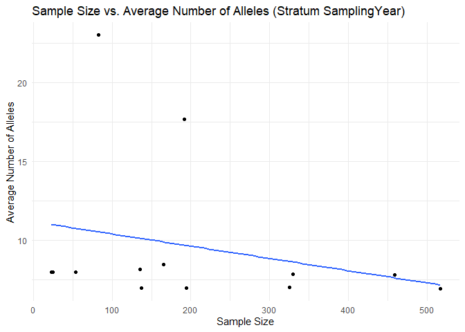
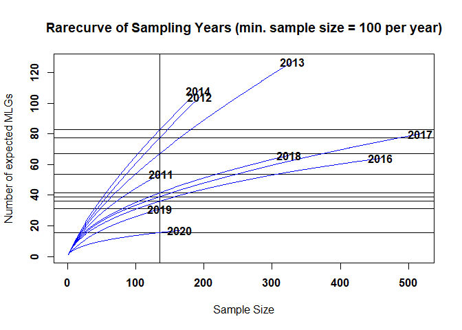
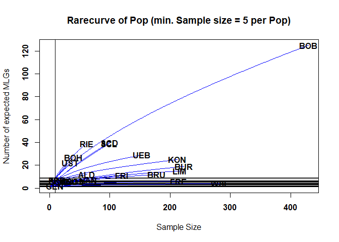

Richness, Evenness, AMOVA, Isolation by distance
================
Lia Baumann
2024-09-03

``` r
# Assuming `genind_original` and `genind_reduced` are your two genind objects
datasets <- list(Original = myData_genind, Reduced = myData_genind_allMarkersOnly)

#function to calculate metrics
calculate_metrics <- function(genind_obj) {
  # Number of individuals
  num_individuals <- nInd(genind_obj)
  
  # Number of loci
  num_loci <- nLoc(genind_obj)
  
  #Number of alleles
  # Calculate alleles per locus
  alleles_per_locus <- apply(tab(genind_obj), 2, function(x) length(unique(x[!is.na(x)])))
  total_num_alleles <-  sum(alleles_per_locus, na.rm = TRUE)
  
  # Calculate allelic richness manually
  alleles_per_locus <- apply(tab(genind_obj), 2, function(x) length(unique(x[!is.na(x)])))
  allelic_richness <- mean(alleles_per_locus, na.rm = TRUE)
  
  # Genetic diversity (Nei's diversity)
  nei_diversity <- mean(Hs(genind_obj), na.rm = TRUE)
  
  # Missing data proportion
  missing_data_prop <- sum(is.na(tab(genind_obj))) / length(tab(genind_obj))
  
  
  # Extract the genotype data from the genind object
  genotypes <- as.data.frame(genind_obj@tab)

  # Create a unique identifier for each MLG by combining allele information across all loci
  # You may need to adjust the indices based on your specific data structure
  genotypes$MLG <- apply(genotypes, 1, function(x) paste(na.omit(x), collapse = "_"))

  # Count the number of unique MLGs
  num_distinct_MLGs <- length(unique(genotypes$MLG))

  return(data.frame(
    "Number_of_Individuals" = num_individuals,
    "Number_of_Loci" = num_loci,
    "Number_of_Alleles" = total_num_alleles,
    "Allelic_Richness" = allelic_richness,
    "Number_of_distinct_MLGs" = num_distinct_MLGs,
    "Nei_Diversity" = nei_diversity,
    "Missing_Data_Proportion" = missing_data_prop
  ))
}

# Apply the function to both datasets and combine results
metrics_df <- do.call(rbind, lapply(datasets, calculate_metrics))
metrics_df <- cbind(Dataset = rownames(metrics_df), metrics_df)
rownames(metrics_df) <- NULL

# Display the metrics
print(metrics_df)
```

    ##    Dataset Number_of_Individuals Number_of_Loci Number_of_Alleles
    ## 1 Original                  3291             14               244
    ## 2  Reduced                  2639             14               231
    ##   Allelic_Richness Number_of_distinct_MLGs Nei_Diversity
    ## 1         2.000000                     724     0.5522483
    ## 2         1.893443                     449     0.5519406
    ##   Missing_Data_Proportion
    ## 1              0.03078939
    ## 2              0.00000000

``` r
# Reshape metrics_df to long format and define the order of metrics
metrics_long <- metrics_df %>%
  pivot_longer(cols = -Dataset, names_to = "Metric", values_to = "Value") %>%
  mutate(Metric = factor(Metric, levels = c(
    "Number_of_Individuals",
    "Number_of_Loci",
    "Number_of_Alleles",
    "Allelic_Richness",
    "Number_of_distinct_MLGs",
    "Nei_Diversity",
    "Missing_Data_Proportion"
  )))
metrics_long
```

    ## # A tibble: 14 × 3
    ##    Dataset  Metric                      Value
    ##    <chr>    <fct>                       <dbl>
    ##  1 Original Number_of_Individuals   3291     
    ##  2 Original Number_of_Loci            14     
    ##  3 Original Number_of_Alleles        244     
    ##  4 Original Allelic_Richness           2     
    ##  5 Original Number_of_distinct_MLGs  724     
    ##  6 Original Nei_Diversity              0.552 
    ##  7 Original Missing_Data_Proportion    0.0308
    ##  8 Reduced  Number_of_Individuals   2639     
    ##  9 Reduced  Number_of_Loci            14     
    ## 10 Reduced  Number_of_Alleles        231     
    ## 11 Reduced  Allelic_Richness           1.89  
    ## 12 Reduced  Number_of_distinct_MLGs  449     
    ## 13 Reduced  Nei_Diversity              0.552 
    ## 14 Reduced  Missing_Data_Proportion    0

``` r
# Plot with improved visibility and specified metric order
ggplot(metrics_long, aes(x = Metric, y = Value, fill = Dataset)) +
  geom_bar(stat = "identity", position = position_dodge(width = 0.7), color = "black") +
  geom_text(aes(label = round(Value, 2)), 
            position = position_dodge(width = 0.7), 
            vjust = -0.5, 
            size = 4.5) +  # Adjust text size
  scale_fill_manual(values = c("Original" = "skyblue", "Reduced" = "salmon")) +
  labs(title = "Comparison of Original and Reduced Datasets",
       y = "",
       x = "") +
  scale_y_continuous(expand = expansion(mult = c(0, 0.1))) +
  theme_minimal(base_size = 14) +  # Increase base font size
  theme(plot.title = element_text(hjust = 0.5),
        axis.text.x = element_text(angle = 45, hjust = 1))  # Rotate x-axis labels for better visibility
```

<!-- -->

``` r
mlg_data <- data.frame(
  mlg = mlg.vector(myData_genind_allMarkersOnly),
  pop = pop(myData_genind_allMarkersOnly)
)
shared_mlgs <- mlg_data %>%
  group_by(mlg) %>%
  summarize(n_pops = n_distinct(pop)) %>%
  filter(n_pops > 1)
print(shared_mlgs)
```

    ## # A tibble: 145 × 2
    ##      mlg n_pops
    ##    <int>  <int>
    ##  1     1     20
    ##  2     2      4
    ##  3     3      2
    ##  4     6      4
    ##  5     9     16
    ##  6    11      2
    ##  7    14      3
    ##  8    15      2
    ##  9    16      4
    ## 10    19     10
    ## # ℹ 135 more rows

# Hardy-Weinberg equilibrium

Cannot be determined for haploids.

# Genotypic richness

The number of observed MLGs is equivalent to genotypic richness. We
expect that the BB population would have a higher genotypic richness
than the FR population. However, looking at the raw number of MLGs for
each symptom type, it shows us the opposite: there are 94 MLGs for BB
and 191 MLGs for FR. This discrepancy has to do with the sample size
differences, namely N=113 for BB and N=581 for FR. A more appropriate
comparison is the eMLG value, which is an approximation of the number of
genotypes that would be expected at the largest, shared sample size
(N=113) based on rarefaction. For BB (N=113) the eMLG=94 and for FR
(where N is set to 113) the eMLG = 66.6. Thus, genotypic richness is
indeed higher in the BB populations than the FR population when
considering equal sample sizes.

``` r
setPop(myData_genind_allMarkersOnly) <- ~SamplingYear
# Calculating minimal necessary sample size
# Step 1: Extract population information

# Step 1: Extract population information
populations <- pop(myData_genind_allMarkersOnly)

# Step 2: Calculate sample sizes per population
population_counts <- table(populations)

# Step 3: Calculate number of alleles per locus
allele_counts <- nAll(myData_genind_allMarkersOnly)

# Step 4: Create a data frame to hold alleles and populations
# Repeat population assignments for each locus
pop_assignments <- rep(populations, each = length(allele_counts))

# Combine the population assignments and allele counts into a data frame
allele_data <- data.frame(Population = pop_assignments,
                           Locus = rep(1:length(allele_counts), times = length(populations)),
                           AlleleCount = rep(allele_counts, each = length(populations)))

# Step 5: Calculate average number of alleles per population
average_alleles <- aggregate(AlleleCount ~ Population, data = allele_data, FUN = mean)

# Combine sample sizes and average alleles into one data frame
sample_summary <- data.frame(Population = names(population_counts),
                             SampleSize = as.integer(population_counts),
                             AverageAlleles = average_alleles$AlleleCount)

# Step 6: Plot Sample Size vs. Average Number of Alleles
ggplot(sample_summary, aes(x = SampleSize, y = AverageAlleles)) +
  geom_point() +
  geom_smooth(method = "lm", se = FALSE) +
  labs(title = "Sample Size vs. Average Number of Alleles (Stratum SamplingYear)",
       x = "Sample Size",
       y = "Average Number of Alleles") +
  theme_minimal()
```

<!-- -->

``` r
#Minimal sample size Sum is 1 so this can not give any relevant output. I will plot the same for higher sample sizes only
#only calculate Richness for populations > 100 samples (N)
myData_genind_allMarkersOnly_above100N <- selPopSize(myData_genind_allMarkersOnly,pop=NULL,nMin=100)
summary(myData_genind_allMarkersOnly_above100N)
```

    ## 
    ## // Number of individuals: 2454
    ## // Group sizes: 137 194 330 192 459 517 325 135 165
    ## // Number of alleles per locus: 7 6 3 10 21 7 7 7 7 5 7 5 9 7
    ## // Number of alleles per group: 57 69 77 77 78 68 72 55 49
    ## // Percentage of missing data: 0 %
    ## // Observed heterozygosity: 0

``` r
H.year <- mlg.table(myData_genind_allMarkersOnly_above100N, plot = FALSE)
rarecurve(H.year, ylab="Number of expected MLGs", sample=min(rowSums(H.year)),
          border = NA, fill = NA, font = 2, cex = 1, col = "blue")
title("Rarecurve of Sampling Years (min. sample size = 100 per year)")
```

<!-- -->

``` r
setPop(myData_genind_allMarkersOnly) <- ~Pop
# Calculating minimal necessary sample size
# Step 1: Extract population information

# Step 1: Extract population information
populations <- pop(myData_genind_allMarkersOnly)

# Step 2: Calculate sample sizes per population
population_counts <- table(populations)

# Step 3: Calculate number of alleles per locus
allele_counts <- nAll(myData_genind_allMarkersOnly)

# Step 4: Create a data frame to hold alleles and populations
# Repeat population assignments for each locus
pop_assignments <- rep(populations, each = length(allele_counts))

# Combine the population assignments and allele counts into a data frame
allele_data <- data.frame(Population = pop_assignments,
                           Locus = rep(1:length(allele_counts), times = length(populations)),
                           AlleleCount = rep(allele_counts, each = length(populations)))

# Step 5: Calculate average number of alleles per population
average_alleles <- aggregate(AlleleCount ~ Population, data = allele_data, FUN = mean)

# Combine sample sizes and average alleles into one data frame
sample_summary <- data.frame(Population = names(population_counts),
                             SampleSize = as.integer(population_counts),
                             AverageAlleles = average_alleles$AlleleCount)

# Step 6: Plot Sample Size vs. Average Number of Alleles
ggplot(sample_summary, aes(x = SampleSize, y = AverageAlleles)) +
  geom_point() +
  geom_smooth(method = "lm", se = FALSE) +
  labs(title = "Sample Size vs. Average Number of Alleles (Stratum Pop)",
       x = "Sample Size",
       y = "Average Number of Alleles") +
  theme_minimal()
```

<!-- -->

``` r
setPop(myData_genind_allMarkersOnly) <- ~Pop
myData_genind_allMarkersOnly_above5N <- selPopSize(myData_genind_allMarkersOnly,pop=NULL,nMin=5)
poppr(myData_genind_allMarkersOnly_above5N)
```

    ##      Pop    N MLG eMLG    SE     H     G lambda   E.5   Hexp     Ia  rbarD
    ## 1    FRE  214   6 1.54 0.672 0.301  1.12 0.1083 0.346 0.0675  9.831 0.8436
    ## 2    ALD   62  12 4.09 1.192 1.430  2.31 0.5671 0.412 0.1400  3.684 0.3652
    ## 3    RIE   62  39 9.18 0.816 3.507 28.26 0.9646 0.843 0.4263  0.882 0.0778
    ## 4    TRO   34   6 3.54 0.904 1.164  2.31 0.5675 0.596 0.1529  2.464 0.3408
    ## 5    SCG   15   6 5.14 0.703 1.617  4.41 0.7733 0.845 0.2891  2.283 0.2888
    ## 6    BOH   40  27 8.36 1.116 3.008 12.90 0.9225 0.618 0.2779  1.353 0.1364
    ## 7    BOB  429 125 8.05 1.223 3.730 16.16 0.9381 0.373 0.3379  2.148 0.1900
    ## 8    FRB   13   7 5.85 0.769 1.712  4.57 0.7811 0.786 0.5064  6.074 0.4700
    ## 9    UEB  153  29 6.17 1.280 2.448  6.81 0.8533 0.551 0.1454  0.732 0.0910
    ## 10   SCL   99  39 6.36 1.399 2.649  6.11 0.8364 0.389 0.1762  2.211 0.2492
    ## 11   SCD  100  40 6.00 1.457 2.523  4.16 0.7598 0.276 0.2686  2.549 0.2569
    ## 12   WSL  283   4 1.30 0.502 0.168  1.07 0.0621 0.362 0.0145  4.281 0.5055
    ## 13   BUR  223  19 3.90 0.933 1.564  3.50 0.7146 0.663 0.2316  4.767 0.4420
    ## 14   SCS   43   6 2.16 0.899 0.547  1.28 0.2163 0.380 0.0494  3.957 0.4517
    ## 15   NEU   32   6 3.12 0.911 0.961  1.84 0.4551 0.518 0.1031  2.505 0.3431
    ## 16   UST   35  22 8.36 1.050 2.877 13.76 0.9273 0.762 0.3733  1.116 0.0961
    ## 17   KON  212  25 5.42 1.206 2.129  5.21 0.8082 0.569 0.2292  1.291 0.1187
    ## 18   FRI  120  11 3.80 0.947 1.438  3.14 0.6814 0.666 0.2952  4.250 0.3842
    ## 19   BRU  178  12 2.96 0.929 1.021  1.84 0.4555 0.471 0.4326 12.171 0.9362
    ## 20   LIM  216  15 3.77 0.917 1.471  3.18 0.6855 0.650 0.4155  5.194 0.4137
    ## 21   HAN   65   7 4.05 0.780 1.453  3.49 0.7138 0.761 0.2884  2.115 0.2208
    ## 22   GEN   10   2 2.00 0.000 0.325  1.22 0.1800 0.571 0.0857  5.000 1.0000
    ## 23 Total 2638 448 8.91 0.976 4.539 34.50 0.9710 0.362 0.6444  3.006 0.2326
    ##                                    File
    ## 1  myData_genind_allMarkersOnly_above5N
    ## 2  myData_genind_allMarkersOnly_above5N
    ## 3  myData_genind_allMarkersOnly_above5N
    ## 4  myData_genind_allMarkersOnly_above5N
    ## 5  myData_genind_allMarkersOnly_above5N
    ## 6  myData_genind_allMarkersOnly_above5N
    ## 7  myData_genind_allMarkersOnly_above5N
    ## 8  myData_genind_allMarkersOnly_above5N
    ## 9  myData_genind_allMarkersOnly_above5N
    ## 10 myData_genind_allMarkersOnly_above5N
    ## 11 myData_genind_allMarkersOnly_above5N
    ## 12 myData_genind_allMarkersOnly_above5N
    ## 13 myData_genind_allMarkersOnly_above5N
    ## 14 myData_genind_allMarkersOnly_above5N
    ## 15 myData_genind_allMarkersOnly_above5N
    ## 16 myData_genind_allMarkersOnly_above5N
    ## 17 myData_genind_allMarkersOnly_above5N
    ## 18 myData_genind_allMarkersOnly_above5N
    ## 19 myData_genind_allMarkersOnly_above5N
    ## 20 myData_genind_allMarkersOnly_above5N
    ## 21 myData_genind_allMarkersOnly_above5N
    ## 22 myData_genind_allMarkersOnly_above5N
    ## 23 myData_genind_allMarkersOnly_above5N

``` r
H.year <- mlg.table(myData_genind_allMarkersOnly_above5N, plot = FALSE)
rarecurve(H.year, ylab="Number of expected MLGs", sample=min(rowSums(H.year)),
          border = NA, fill = NA, font = 2, cex = 1, col = "blue")
title("Rarecurve of Pop (min. Sample size = 5 per Pop)")
```

<!-- -->

``` r
#rescale to see anything except for BOB
setPop(myData_genind_allMarkersOnly) <- ~Pop
myData_genind_allMarkersOnly_above5N_withoutBOB <- popsub(myData_genind_allMarkersOnly_above5N,exclude="BOB")
poppr(myData_genind_allMarkersOnly_above5N_withoutBOB)
```

    ##      Pop    N MLG eMLG    SE     H     G lambda   E.5   Hexp     Ia  rbarD
    ## 1    FRE  214   6 1.54 0.672 0.301  1.12 0.1083 0.346 0.0675  9.831 0.8436
    ## 2    ALD   62  12 4.09 1.192 1.430  2.31 0.5671 0.412 0.1400  3.684 0.3652
    ## 3    RIE   62  39 9.18 0.816 3.507 28.26 0.9646 0.843 0.4263  0.882 0.0778
    ## 4    TRO   34   6 3.54 0.904 1.164  2.31 0.5675 0.596 0.1529  2.464 0.3408
    ## 5    SCG   15   6 5.14 0.703 1.617  4.41 0.7733 0.845 0.2891  2.283 0.2888
    ## 6    BOH   40  27 8.36 1.116 3.008 12.90 0.9225 0.618 0.2779  1.353 0.1364
    ## 7    FRB   13   7 5.85 0.769 1.712  4.57 0.7811 0.786 0.5064  6.074 0.4700
    ## 8    UEB  153  29 6.17 1.280 2.448  6.81 0.8533 0.551 0.1454  0.732 0.0910
    ## 9    SCL   99  39 6.36 1.399 2.649  6.11 0.8364 0.389 0.1762  2.211 0.2492
    ## 10   SCD  100  40 6.00 1.457 2.523  4.16 0.7598 0.276 0.2686  2.549 0.2569
    ## 11   WSL  283   4 1.30 0.502 0.168  1.07 0.0621 0.362 0.0145  4.281 0.5055
    ## 12   BUR  223  19 3.90 0.933 1.564  3.50 0.7146 0.663 0.2316  4.767 0.4420
    ## 13   SCS   43   6 2.16 0.899 0.547  1.28 0.2163 0.380 0.0494  3.957 0.4517
    ## 14   NEU   32   6 3.12 0.911 0.961  1.84 0.4551 0.518 0.1031  2.505 0.3431
    ## 15   UST   35  22 8.36 1.050 2.877 13.76 0.9273 0.762 0.3733  1.116 0.0961
    ## 16   KON  212  25 5.42 1.206 2.129  5.21 0.8082 0.569 0.2292  1.291 0.1187
    ## 17   FRI  120  11 3.80 0.947 1.438  3.14 0.6814 0.666 0.2952  4.250 0.3842
    ## 18   BRU  178  12 2.96 0.929 1.021  1.84 0.4555 0.471 0.4326 12.171 0.9362
    ## 19   LIM  216  15 3.77 0.917 1.471  3.18 0.6855 0.650 0.4155  5.194 0.4137
    ## 20   HAN   65   7 4.05 0.780 1.453  3.49 0.7138 0.761 0.2884  2.115 0.2208
    ## 21   GEN   10   2 2.00 0.000 0.325  1.22 0.1800 0.571 0.0857  5.000 1.0000
    ## 22 Total 2209 325 8.59 1.073 4.170 25.67 0.9610 0.387 0.6567  3.412 0.2637
    ##                                               File
    ## 1  myData_genind_allMarkersOnly_above5N_withoutBOB
    ## 2  myData_genind_allMarkersOnly_above5N_withoutBOB
    ## 3  myData_genind_allMarkersOnly_above5N_withoutBOB
    ## 4  myData_genind_allMarkersOnly_above5N_withoutBOB
    ## 5  myData_genind_allMarkersOnly_above5N_withoutBOB
    ## 6  myData_genind_allMarkersOnly_above5N_withoutBOB
    ## 7  myData_genind_allMarkersOnly_above5N_withoutBOB
    ## 8  myData_genind_allMarkersOnly_above5N_withoutBOB
    ## 9  myData_genind_allMarkersOnly_above5N_withoutBOB
    ## 10 myData_genind_allMarkersOnly_above5N_withoutBOB
    ## 11 myData_genind_allMarkersOnly_above5N_withoutBOB
    ## 12 myData_genind_allMarkersOnly_above5N_withoutBOB
    ## 13 myData_genind_allMarkersOnly_above5N_withoutBOB
    ## 14 myData_genind_allMarkersOnly_above5N_withoutBOB
    ## 15 myData_genind_allMarkersOnly_above5N_withoutBOB
    ## 16 myData_genind_allMarkersOnly_above5N_withoutBOB
    ## 17 myData_genind_allMarkersOnly_above5N_withoutBOB
    ## 18 myData_genind_allMarkersOnly_above5N_withoutBOB
    ## 19 myData_genind_allMarkersOnly_above5N_withoutBOB
    ## 20 myData_genind_allMarkersOnly_above5N_withoutBOB
    ## 21 myData_genind_allMarkersOnly_above5N_withoutBOB
    ## 22 myData_genind_allMarkersOnly_above5N_withoutBOB

``` r
H.year_withoutBOB <- mlg.table(myData_genind_allMarkersOnly_above5N_withoutBOB, plot = FALSE)
rarecurve(H.year_withoutBOB, ylab="Number of expected MLGs", sample=min(rowSums(H.year_withoutBOB)),
font = 2, cex = 1, col = "blue")
title("Rarecurve of Pop  (min. Sample size = 5 per Pop; without BOB)")
```

<!-- -->

``` r
setPop(myData_genind_allMarkersOnly) <- ~TruffleYear
myData_genind_allMarkersOnly_above100N <- selPopSize(myData_genind_allMarkersOnly,pop=NULL,nMin=100)
summary(myData_genind_allMarkersOnly_above100N)
```

    ## 
    ## // Number of individuals: 2454
    ## // Group sizes: 145 195 328 187 488 539 272 138 162
    ## // Number of alleles per locus: 7 6 3 10 21 7 7 7 7 5 7 5 9 7
    ## // Number of alleles per group: 57 67 76 75 80 75 70 56 48
    ## // Percentage of missing data: 0 %
    ## // Observed heterozygosity: 0

``` r
H.year <- mlg.table(myData_genind_allMarkersOnly_above100N, plot = FALSE)
rarecurve(H.year, ylab="Number of expected MLGs", sample=min(rowSums(H.year)),
          border = NA, fill = NA, font = 2, cex = 1, col = "blue")
title("Rarecurve of Truffle Years")
```

<!-- -->

``` r
setPop(myData_genind_allMarkersOnly) <- ~Month
myData_genind_allMarkersOnly_above40N <- selPopSize(myData_genind_allMarkersOnly,pop=NULL,nMin=40)
summary(myData_genind_allMarkersOnly_above40N)
```

    ## 
    ## // Number of individuals: 2585
    ## // Group sizes: 75 80 81 332 299 488 669 351 160 50
    ## // Number of alleles per locus: 7 6 3 11 21 7 7 7 7 5 7 5 9 7
    ## // Number of alleles per group: 68 73 67 76 81 84 83 83 82 67
    ## // Percentage of missing data: 0 %
    ## // Observed heterozygosity: 0

``` r
poppr(myData_genind_allMarkersOnly_above40N)
```

    ##      Pop    N MLG eMLG   SE    H    G lambda   E.5  Hexp   Ia rbarD
    ## 1      1   75  51 37.5 1.90 3.77 35.4  0.972 0.813 0.585 1.69 0.131
    ## 2      3   80  45 31.2 2.12 3.44 20.5  0.951 0.648 0.650 3.71 0.288
    ## 3      6   81  28 22.1 1.71 2.88 11.3  0.911 0.614 0.582 3.77 0.292
    ## 4      7  332  60 20.9 2.52 3.04 10.4  0.904 0.473 0.667 5.14 0.397
    ## 5      8  299  91 28.0 2.83 3.68 19.2  0.948 0.470 0.645 3.45 0.267
    ## 6      9  488 132 29.0 2.87 3.88 21.9  0.954 0.439 0.621 3.26 0.252
    ## 7     10  669 148 30.6 2.86 4.06 32.1  0.969 0.544 0.645 3.18 0.246
    ## 8     11  351 146 36.5 2.79 4.43 48.2  0.979 0.572 0.598 2.09 0.162
    ## 9     12  160  85 36.7 2.56 4.12 42.7  0.977 0.686 0.649 2.63 0.204
    ## 10     2   50  34 34.0 0.00 3.30 19.8  0.950 0.724 0.587 2.44 0.189
    ## 11 Total 2585 441 33.0 2.98 4.54 34.6  0.971 0.363 0.645 3.01 0.233
    ##                                     File
    ## 1  myData_genind_allMarkersOnly_above40N
    ## 2  myData_genind_allMarkersOnly_above40N
    ## 3  myData_genind_allMarkersOnly_above40N
    ## 4  myData_genind_allMarkersOnly_above40N
    ## 5  myData_genind_allMarkersOnly_above40N
    ## 6  myData_genind_allMarkersOnly_above40N
    ## 7  myData_genind_allMarkersOnly_above40N
    ## 8  myData_genind_allMarkersOnly_above40N
    ## 9  myData_genind_allMarkersOnly_above40N
    ## 10 myData_genind_allMarkersOnly_above40N
    ## 11 myData_genind_allMarkersOnly_above40N

``` r
H.year <- mlg.table(myData_genind_allMarkersOnly_above40N, plot = FALSE)
rarecurve(H.year, ylab="Number of expected MLGs", sample=min(rowSums(H.year)),
          border = NA, fill = NA, font = 2, cex = 1, col = "blue")
title("Rarecurve of Month")
```

<!-- -->

``` r
#Genotypic richness rises, the later the ascocarps were collected --> more different individuals produced fruiting bodies
```

# Population structure using Fst

``` r
truffles.matFst <- mat_pw_fst(myData_genind_allMarkersOnly)
truffles.matFst
```

    ##               1            3            4             5            6          7
    ## 1   0.000000000 0.0027676203  0.007511949  0.0040036157  0.009122149 0.01892017
    ## 3   0.002767620 0.0000000000  0.012143296  0.0043341806  0.009553700 0.01506242
    ## 4   0.007511949 0.0121432957  0.000000000  0.0070476359  0.005959129 0.01280927
    ## 5   0.004003616 0.0043341806  0.007047636  0.0000000000  0.004899709 0.00741179
    ## 6   0.009122149 0.0095536998  0.005959129  0.0048997089  0.000000000 0.01663331
    ## 7   0.018920170 0.0150624200  0.012809268  0.0074117895  0.016633312 0.00000000
    ## 8   0.008679152 0.0080184639  0.010420867  0.0031369193  0.006936678 0.01483469
    ## 9   0.006705879 0.0086530515  0.006338210  0.0001435758  0.006432143 0.01043730
    ## 10  0.006608714 0.0071463715  0.009273377  0.0009645421  0.008123561 0.01141658
    ## 11  0.003049558 0.0076234929  0.007543517  0.0027820472  0.008462656 0.01600189
    ## 12  0.002772684 0.0047486182  0.010175156  0.0050375633  0.012458195 0.01373021
    ## 2  -0.001048776 0.0013368431  0.008849114  0.0063345078  0.010473270 0.02075741
    ## 0  -0.004467570 0.0008356709 -0.007884439 -0.0015750374 -0.015111642 0.01236025
    ##                8             9            10           11            12
    ## 1   0.0086791517  0.0067058788  0.0066087143  0.003049558  0.0027726842
    ## 3   0.0080184639  0.0086530515  0.0071463715  0.007623493  0.0047486182
    ## 4   0.0104208668  0.0063382096  0.0092733766  0.007543517  0.0101751558
    ## 5   0.0031369193  0.0001435758  0.0009645421  0.002782047  0.0050375633
    ## 6   0.0069366782  0.0064321431  0.0081235607  0.008462656  0.0124581952
    ## 7   0.0148346894  0.0104373031  0.0114165844  0.016001894  0.0137302056
    ## 8   0.0000000000  0.0017174832  0.0009499061  0.003298673  0.0043353915
    ## 9   0.0017174832  0.0000000000  0.0006941518  0.001499861  0.0037486747
    ## 10  0.0009499061  0.0006941518  0.0000000000  0.001969022  0.0029124743
    ## 11  0.0032986732  0.0014998605  0.0019690216  0.000000000  0.0014977462
    ## 12  0.0043353915  0.0037486747  0.0029124743  0.001497746  0.0000000000
    ## 2   0.0118600449  0.0106030328  0.0104045638  0.007805194  0.0057022157
    ## 0  -0.0030583107 -0.0037272402 -0.0017454577 -0.001792220 -0.0006487363
    ##               2             0
    ## 1  -0.001048776 -0.0044675701
    ## 3   0.001336843  0.0008356709
    ## 4   0.008849114 -0.0078844386
    ## 5   0.006334508 -0.0015750374
    ## 6   0.010473270 -0.0151116418
    ## 7   0.020757414  0.0123602462
    ## 8   0.011860045 -0.0030583107
    ## 9   0.010603033 -0.0037272402
    ## 10  0.010404564 -0.0017454577
    ## 11  0.007805194 -0.0017922200
    ## 12  0.005702216 -0.0006487363
    ## 2   0.000000000 -0.0028249859
    ## 0  -0.002824986  0.0000000000

``` r
truffles.tree <- nj(truffles.matFst)
plot(truffles.tree, type="unr", tip.col=funky(nPop(myData_genind_allMarkersOnly)), font=2)
annot <- round(truffles.tree$edge.length,2)
edgelabels(annot[annot>0], which(annot>0), frame="n")
add.scale.bar()
```

<!-- -->

``` r
table.paint(truffles.matFst,col.labels=1:23)
```

<!-- -->

``` r
boxplot(truffles.matFst, col=funky(nPop(myData_genind_allMarkersOnly)), las=3,
xlab="Population", ylab="Fst")
```

<!-- -->
\# Population structure using Gst

``` r
kable(Gst_Hedrick(myData_genind_allMarkersOnly))
```

<table class="kable_wrapper">
<tbody>
<tr>
<td>

|          |         x |
|:---------|----------:|
| aest06_1 | 0.1025806 |
| aest07_1 | 0.0477186 |
| aest15_1 | 0.0501921 |
| aest26_1 | 0.1399328 |
| aest28_1 | 0.2065323 |
| aest35_1 | 0.0962261 |
| aest36_1 | 0.1216121 |
| aest01_1 | 0.2572069 |
| aest10_1 | 0.1350087 |
| aest18_1 | 0.1521773 |
| aest24_1 | 0.0736116 |
| aest25_1 | 0.0384932 |
| aest29_1 | 0.0819715 |
| aest31_1 | 0.1456290 |

</td>
<td>

|         x |
|----------:|
| 0.1059934 |

</td>
</tr>
</tbody>
</table>

``` r
#very high differentiation for all loci!
```

``` r
kable(locus_table(myData_genind_allMarkersOnly))
```

|          |    allele |       1-D |      Hexp |  Evenness |
|:---------|----------:|----------:|----------:|----------:|
| aest06_1 |  7.000000 | 0.6730385 | 0.6732936 | 0.6570770 |
| aest07_1 |  6.000000 | 0.6421798 | 0.6424232 | 0.7374031 |
| aest15_1 |  3.000000 | 0.3599785 | 0.3601150 | 0.5951145 |
| aest26_1 | 11.000000 | 0.7662918 | 0.7665823 | 0.8581682 |
| aest28_1 | 21.000000 | 0.8233917 | 0.8237038 | 0.7871815 |
| aest35_1 |  7.000000 | 0.4727281 | 0.4729073 | 0.6372338 |
| aest36_1 |  7.000000 | 0.5682731 | 0.5684885 | 0.7985303 |
| aest01_1 |  7.000000 | 0.7400561 | 0.7403366 | 0.7860491 |
| aest10_1 |  7.000000 | 0.7669942 | 0.7672850 | 0.8699693 |
| aest18_1 |  5.000000 | 0.7290974 | 0.7293737 | 0.8861867 |
| aest24_1 |  7.000000 | 0.5509528 | 0.5511616 | 0.5277299 |
| aest25_1 |  5.000000 | 0.5665603 | 0.5667751 | 0.7270351 |
| aest29_1 |  9.000000 | 0.6922076 | 0.6924700 | 0.7836765 |
| aest31_1 |  7.000000 | 0.6665609 | 0.6668136 | 0.8004907 |
| mean     |  7.785714 | 0.6441650 | 0.6444092 | 0.7465604 |

\#Genotypic diversity Diversity measures incorporate both genotypic
richness and abundance. There are three measures of genotypic diversity
employed by poppr, the Shannon-Wiener index (H), Stoddart and Taylor’s
index (G), and Simpson’s index (lambda). In our example, comparing the
diversity of BB to FR shows that H is greater for FR (4.58 vs. 4.4), but
G is lower (53.4 vs. 61.7). Thus, our expectation that diversity is
lower for FR than BB is rejected in the case of H, which is likely due
to the sensitivity of the Shannon-Wiener index to genotypic richness in
the uneven sample sizes, and accepted in the case of G. To be fair, the
sample size used to calculate these diversity measures is different and
is therefore not an appropriate comparison.

For an easier statistic to grasp, we have included the Simpson index,
which is simply one minus the sum of squared genotype frequencies. This
measure provides an estimation of the probability that two randomly
selected genotypes are different and scales from 0 (no genotypes are
different) to 1 (all genotypes are different). In the data above, we can
see that lambda is just barely higher in BB than FR (0.984 vs. 0.981).
Since this might be an artifact of sample size, we can explore a
correction of Simpson’s index for sample size by multiplying lambda by
N/(N−1). Since R is vectorized, we can do this for all of our
populations at once:

``` r
setPop(myData_genind_allMarkersOnly) <- ~Pop
allMarkersOnly_diversity <- poppr(myData_genind_allMarkersOnly)
N      <- allMarkersOnly_diversity$N      # number of samples
lambda <- allMarkersOnly_diversity$lambda # Simpson's index
lambda_corr <- (N/(N - 1)) * lambda              # Corrected Simpson's index
allMarkersOnly_diversity$lambda_corr <- lambda_corr
allMarkersOnly_diversity
```

    ##      Pop    N MLG eMLG    SE     H     G lambda   E.5   Hexp     Ia  rbarD
    ## 1    FRE  214   6 1.54 0.672 0.301  1.12 0.1083 0.346 0.0675  9.831 0.8436
    ## 2    ALD   62  12 4.09 1.192 1.430  2.31 0.5671 0.412 0.1400  3.684 0.3652
    ## 3    RIE   62  39 9.18 0.816 3.507 28.26 0.9646 0.843 0.4263  0.882 0.0778
    ## 4    TRO   34   6 3.54 0.904 1.164  2.31 0.5675 0.596 0.1529  2.464 0.3408
    ## 5    SCG   15   6 5.14 0.703 1.617  4.41 0.7733 0.845 0.2891  2.283 0.2888
    ## 6    BOH   40  27 8.36 1.116 3.008 12.90 0.9225 0.618 0.2779  1.353 0.1364
    ## 7    BOB  429 125 8.05 1.223 3.730 16.16 0.9381 0.373 0.3379  2.148 0.1900
    ## 8    FRB   13   7 5.85 0.769 1.712  4.57 0.7811 0.786 0.5064  6.074 0.4700
    ## 9    UEB  153  29 6.17 1.280 2.448  6.81 0.8533 0.551 0.1454  0.732 0.0910
    ## 10   SCL   99  39 6.36 1.399 2.649  6.11 0.8364 0.389 0.1762  2.211 0.2492
    ## 11   SCD  100  40 6.00 1.457 2.523  4.16 0.7598 0.276 0.2686  2.549 0.2569
    ## 12   WSL  283   4 1.30 0.502 0.168  1.07 0.0621 0.362 0.0145  4.281 0.5055
    ## 13   BUR  223  19 3.90 0.933 1.564  3.50 0.7146 0.663 0.2316  4.767 0.4420
    ## 14   SCS   43   6 2.16 0.899 0.547  1.28 0.2163 0.380 0.0494  3.957 0.4517
    ## 15   NEU   32   6 3.12 0.911 0.961  1.84 0.4551 0.518 0.1031  2.505 0.3431
    ## 16   UST   35  22 8.36 1.050 2.877 13.76 0.9273 0.762 0.3733  1.116 0.0961
    ## 17   KON  212  25 5.42 1.206 2.129  5.21 0.8082 0.569 0.2292  1.291 0.1187
    ## 18   FRI  120  11 3.80 0.947 1.438  3.14 0.6814 0.666 0.2952  4.250 0.3842
    ## 19   BAR    1   1 1.00 0.000 0.000  1.00 0.0000   NaN    NaN     NA     NA
    ## 20   BRU  178  12 2.96 0.929 1.021  1.84 0.4555 0.471 0.4326 12.171 0.9362
    ## 21   LIM  216  15 3.77 0.917 1.471  3.18 0.6855 0.650 0.4155  5.194 0.4137
    ## 22   HAN   65   7 4.05 0.780 1.453  3.49 0.7138 0.761 0.2884  2.115 0.2208
    ## 23   GEN   10   2 2.00 0.000 0.325  1.22 0.1800 0.571 0.0857  5.000 1.0000
    ## 24 Total 2639 449 8.91 0.976 4.541 34.53 0.9710 0.361 0.6444  3.004 0.2325
    ##                            File lambda_corr
    ## 1  myData_genind_allMarkersOnly      0.1088
    ## 2  myData_genind_allMarkersOnly      0.5764
    ## 3  myData_genind_allMarkersOnly      0.9804
    ## 4  myData_genind_allMarkersOnly      0.5847
    ## 5  myData_genind_allMarkersOnly      0.8286
    ## 6  myData_genind_allMarkersOnly      0.9462
    ## 7  myData_genind_allMarkersOnly      0.9403
    ## 8  myData_genind_allMarkersOnly      0.8462
    ## 9  myData_genind_allMarkersOnly      0.8589
    ## 10 myData_genind_allMarkersOnly      0.8450
    ## 11 myData_genind_allMarkersOnly      0.7675
    ## 12 myData_genind_allMarkersOnly      0.0623
    ## 13 myData_genind_allMarkersOnly      0.7178
    ## 14 myData_genind_allMarkersOnly      0.2215
    ## 15 myData_genind_allMarkersOnly      0.4698
    ## 16 myData_genind_allMarkersOnly      0.9546
    ## 17 myData_genind_allMarkersOnly      0.8120
    ## 18 myData_genind_allMarkersOnly      0.6871
    ## 19 myData_genind_allMarkersOnly         NaN
    ## 20 myData_genind_allMarkersOnly      0.4581
    ## 21 myData_genind_allMarkersOnly      0.6887
    ## 22 myData_genind_allMarkersOnly      0.7250
    ## 23 myData_genind_allMarkersOnly      0.2000
    ## 24 myData_genind_allMarkersOnly      0.9714

``` r
setPop(myData_genind_withClusters) <- ~cluster
poppr(myData_genind_withClusters)
```

    ##     Pop    N MLG eMLG   SE    H     G lambda   E.5  Hexp   Ia  rbarD
    ## 1     3  568  26 13.2 2.03 1.81  4.50  0.778 0.683 0.566 7.10 0.5484
    ## 2     5  233  47 38.2 2.28 2.92 10.28  0.903 0.530 0.264 1.51 0.1484
    ## 3     6  849  94 35.1 3.44 2.87  7.28  0.863 0.378 0.408 1.75 0.1503
    ## 4 mixed  154  34 34.0 0.00 2.31  5.01  0.800 0.442 0.459 2.98 0.2494
    ## 5     2  253  73 50.2 3.26 3.16 11.05  0.909 0.446 0.340 1.37 0.1391
    ## 6     ?  652 276 88.2 5.04 4.48 15.67  0.936 0.168 0.608 2.97 0.2323
    ## 7     4  174  81 74.8 1.94 3.98 33.42  0.970 0.618 0.361 0.44 0.0376
    ## 8     1  408  94 47.7 3.84 3.25 11.64  0.914 0.431 0.291 1.81 0.1714
    ## 9 Total 3291 725 84.0 5.35 5.03 47.33  0.979 0.306 0.653 2.57 0.1983
    ##                         File
    ## 1 myData_genind_withClusters
    ## 2 myData_genind_withClusters
    ## 3 myData_genind_withClusters
    ## 4 myData_genind_withClusters
    ## 5 myData_genind_withClusters
    ## 6 myData_genind_withClusters
    ## 7 myData_genind_withClusters
    ## 8 myData_genind_withClusters
    ## 9 myData_genind_withClusters

\#Genotypic evenness Evenness is a measure of the distribution of
genotype abundances, wherein a population with equally abundant
genotypes yields a value equal to 1 and a population dominated by a
single genotype is closer to zero –\> Value E.5

``` r
(allMarkersTable <- mlg.table(myData_genind_allMarkersOnly))
```

<!-- -->

    ##     MLG.1 MLG.2 MLG.3 MLG.4 MLG.5 MLG.6 MLG.7 MLG.8 MLG.9 MLG.10 MLG.11 MLG.12
    ## FRE     0     0     0     0     0     0     0     0     0      0      0      0
    ## ALD     0     0     0     0     0     0     0     0     0      0      2      0
    ## RIE     0     0     0     0     0     0     0     0     0      0      0      1
    ## TRO     0     0     0     0     0     0     0     0     0      0      0      0
    ## SCG     0     0     0     0     0     0     0     0     0      0      0      0
    ## BOH     0     0     0     0     0     0     0     0     0      0      0      0
    ## BOB     0     0     0     1     1     5     1     0     0      0      0      0
    ## FRB     0     0     0     0     0     0     0     0     0      0      0      0
    ## UEB     0     0     0     0     0     0     0     0     0      0      0      0
    ## SCL     0     0     0     0     0     0     0     0     0      0      0      0
    ## SCD     0     0     0     0     0     0     0     0     0      0      0      0
    ## WSL     0     0     0     0     0     0     0     0     0      0      0      0
    ## BUR    90     0     0     0     0     0     0     1    56      0      0      0
    ## SCS     0     0     0     0     0     0     0     0     0      1      0      0
    ## NEU     0     0     0     0     0     0     0     0     0      0      0      0
    ## UST     0     0     0     0     0     0     0     0     0      0      0      0
    ## KON     0     0     0     0     0     0     0     0     0      0      0      0
    ## FRI     0     0     0     0     0     0     0     0     0      0      0      0
    ## BAR     0     0     0     0     0     0     0     0     0      0      0      0
    ## BRU     0     2     2     0     0     0     0     0     0      0      0      0
    ## LIM     0     3     0     0     0     0     0     0     0      0      0      0
    ## HAN     0     0     0     0     0     0     0     0     0      0      0      0
    ## GEN     0     0     0     0     0     0     0     0     0      0      0      0
    ##     MLG.13 MLG.14 MLG.15 MLG.16 MLG.17 MLG.18 MLG.19 MLG.20 MLG.21 MLG.22
    ## FRE      0      0      0      0      0      0      0      0      0      0
    ## ALD      0      0      0      0      0      0      0      0      0      0
    ## RIE      0      0      2      4      1      1      0      0      0      0
    ## TRO      0      0      0      0      0      0      0      0      0      0
    ## SCG      0      0      0      0      0      0      0      0      0      0
    ## BOH      0      0      0      0      0      0      0      0      0      0
    ## BOB      0      0      0      0      0      0      0      0      0      0
    ## FRB      1      4      0      0      0      0      0      0      0      0
    ## UEB      0      0      0      0      0      0      0      0      0      0
    ## SCL      0      0      0      0      0      0      0      0      0      0
    ## SCD      0      0      0      0      0      0      0      0      1      0
    ## WSL      0      0      0      0      0      0      0      6    274      0
    ## BUR      0      0      0      0      0      0      0      0      0      0
    ## SCS      0      0      0      0      0      0      0      0      0      0
    ## NEU      0      0      0      0      0      0      0      0      0      0
    ## UST      0      0      0      0      0      0      0      0      0      0
    ## KON      0      0      0      0      0      0      0      0      0      0
    ## FRI      0      0      0      0      0      0      0      0      0      0
    ## BAR      0      0      0      0      0      0      0      0      0      0
    ## BRU      0      0      0      0      0      0      0      0      0      0
    ## LIM      0      0      0      0      0      0      0      0      0      0
    ## HAN      0      0      0      0      0      0     29      0      0     12
    ## GEN      0      0      0      0      0      0      0      0      0      0
    ##     MLG.23 MLG.24 MLG.25 MLG.26 MLG.27 MLG.28 MLG.29 MLG.30 MLG.31 MLG.32
    ## FRE      0      0      0      0      0      0      0      0      0      0
    ## ALD      0      0      0      0      0      0      0      0      0      0
    ## RIE      1      1      0      0      1      0      0      0      0      0
    ## TRO      0      0      0      0      0      0      0      0      0      0
    ## SCG      0      0      0      0      0      0      0      0      0      0
    ## BOH      0      0      0      0      0      0      0      0      0      0
    ## BOB      0      0      0      0      0      0      0      0      0      0
    ## FRB      0      0      0      0      0      0      0      0      0      0
    ## UEB      0      0      0      0      0      0      0      0      0      0
    ## SCL      0      0      0      0      0      0      0      0      0      0
    ## SCD      0      0      0      0      0      0      0      0      0      0
    ## WSL      0      0      1      0      0      0      0      0      0      0
    ## BUR      0      0      0      0      0      0      0      0      0      0
    ## SCS      0      0      0      0      0      0      0      0      0      0
    ## NEU      0      0      0      0      0      0      0      0      0      0
    ## UST      0      0      0      0      0      0      0      0      0      0
    ## KON      0      0      0      1      0      3      1      1      1      1
    ## FRI      0      0      0      0      0      0      0      0      0      0
    ## BAR      0      0      0      0      0      0      0      0      0      0
    ## BRU      0      0      0      0      0      0      0      0      0      0
    ## LIM      0      0      0      0      0      0      0      0      0      0
    ## HAN      0      0      0      0      0      0      0      0      0      0
    ## GEN      0      0      0      0      0      0      0      0      0      0
    ##     MLG.33 MLG.34 MLG.35 MLG.36 MLG.37 MLG.38 MLG.39 MLG.40 MLG.41 MLG.42
    ## FRE      0      0      0      0      0      0      0      0      0      0
    ## ALD      0      0      0      0      0      0      0      0      0      1
    ## RIE      0      0      0      0      0      0      0      0      0      0
    ## TRO      0      0      0      0      0      0      0      0      2      7
    ## SCG      0      0      0      0      0      0      0      0      0      0
    ## BOH      1      0      0      0      0      0      0      0      0      0
    ## BOB      0      0      0      1      0      0      0      0      0      0
    ## FRB      0      0      0      0      0      0      0      0      0      0
    ## UEB      0      0      1      0      1      0      0      0      0      0
    ## SCL      0      0      0      0      0      0      0      0      0      0
    ## SCD      0      0      0      0      0      0      0      0      0      0
    ## WSL      0      0      0      0      0      0      0      0      0      0
    ## BUR      0      0      0      0      0      0      0      0      0      0
    ## SCS      0      0      0      0      0      0      0      0      0      0
    ## NEU      0      0      0      0      0      0      0      0      0      0
    ## UST      0      0      0      0      0      0      0      0      0      0
    ## KON      0      0      0      0      0      0      0      0      0      0
    ## FRI      0      0      0      0      0      2     54      1      0      0
    ## BAR      0      0      0      0      0      0      0      0      0      0
    ## BRU      0    128      0      0      0      0      0      0      0      0
    ## LIM      0      1      0      0      0      0      0      0      0      0
    ## HAN      0      0      0      0      0      0      0      0      0      0
    ## GEN      0      0      0      0      0      0      0      0      0      0
    ##     MLG.43 MLG.44 MLG.45 MLG.46 MLG.47 MLG.48 MLG.49 MLG.50 MLG.51 MLG.52
    ## FRE      0      0      0      0      0      0      0      0      0      0
    ## ALD      0      0      0      0      0      0      0      0      0      0
    ## RIE      0      0      0      0      0      0      0      0      0      0
    ## TRO      0      0      0      0      0      0      0      0      0      0
    ## SCG      0      0      0      0      0      0      0      0      0      0
    ## BOH      0      0      0      0      0      0      0      0      0      0
    ## BOB      4      1      0      0      0      0      0      0      0      0
    ## FRB      0      0      0      0      0      0      0      0      0      0
    ## UEB      0      0      0      1      1      1      5      3      1      3
    ## SCL      0      0      0      0      0      0      0      0      0      0
    ## SCD      0      0      0      0      0      0      0      0      0      0
    ## WSL      0      0      0      0      0      0      0      0      0      0
    ## BUR      0      0      0      0      0      0      0      0      0      0
    ## SCS      0      0      0      0      0      0      0      0      0      0
    ## NEU      0      0      0      0      0      0      0      0      0      0
    ## UST      0      0      1      0      0      0      0      0      0      0
    ## KON      0      0      0      0      0      0      0      0      0      0
    ## FRI      0      0      0      0      0      0      0      0      0      0
    ## BAR      0      0      0      0      0      0      0      0      0      0
    ## BRU      0      0      0      0      0      0      0      0      0      0
    ## LIM      0      0      0      0      0      0      0      0      0      0
    ## HAN      0      0      0      0      0      0      0      0      0      0
    ## GEN      0      0      0      0      0      0      0      0      0      0
    ##     MLG.53 MLG.54 MLG.55 MLG.56 MLG.57 MLG.58 MLG.59 MLG.60 MLG.61 MLG.62
    ## FRE      0      0      0      0      0      0      0      0      0      0
    ## ALD      0      0      0      0      0      0      0      0      0      0
    ## RIE      0      0      0      0      0      0      0      2      0      0
    ## TRO      0      0      0      0      0      0      0      0      0      0
    ## SCG      0      0      0      0      0      0      0      0      0      0
    ## BOH      1      0      0      0      0      0      1      0      0      0
    ## BOB      0      0      0      0      0      0      0      0      1      0
    ## FRB      0      0      0      0      0      0      0      0      0      0
    ## UEB     37      1      3     39      1      1     15      0      0      1
    ## SCL      0      0      0      0      0      0      0      0      0      0
    ## SCD      0      0      0      0      0      0      0      0      0      0
    ## WSL      0      0      0      0      0      0      0      0      0      0
    ## BUR      0      0      0      0      0      0      0      0      0      0
    ## SCS      0      0      0      0      0      0      0      0      0      0
    ## NEU      0      0      0      0      0      0      0      0      0      0
    ## UST      0      0      0      0      0      0      0      0      0      0
    ## KON      0      0      0      0      0      0      0      0      0      0
    ## FRI      0      0      0      0      0      0      0      0      0      0
    ## BAR      0      0      0      0      0      0      0      0      0      0
    ## BRU      0      0      0      0      0      0      0      0      0      0
    ## LIM      0      0      0      0      0      0      0      0      0      0
    ## HAN      0      0      0      0      0      0      0      0      0      0
    ## GEN      0      0      0      0      0      0      0      0      0      0
    ##     MLG.63 MLG.64 MLG.65 MLG.66 MLG.67 MLG.68 MLG.69 MLG.70 MLG.71 MLG.72
    ## FRE      0      0      0      0      0      0      0      0      0      0
    ## ALD      0      0      0      0      0      0      0      0      0      0
    ## RIE      0      1      0      0      0      0      0      0      0      0
    ## TRO      0      0      0      0      0      1      0      0      0      0
    ## SCG      0      0      0      0      0      0      0      0      0      0
    ## BOH      0      0      0      0      0      0      0      0      0      0
    ## BOB      0      0      1      3      7      0      8      1      1      5
    ## FRB      0      0      0      0      0      0      0      0      0      0
    ## UEB      1      0      0      0      0      0      0      0      0      0
    ## SCL      0      0      0      0      0      0      0      0      0      0
    ## SCD      0      0      0      0      0      0      0      0      0      0
    ## WSL      0      0      0      0      0      0      0      0      0      0
    ## BUR      0      0      0      0      0      0      0      0      0      0
    ## SCS      0      0      0      0      0      0      0      0      0      0
    ## NEU      0      0      0      0      0      0      0      0      0      0
    ## UST      0      0      0      0      0      0      0      0      0      0
    ## KON      0      0      0      0      0      0      0      0      0      0
    ## FRI      0      0      0      0      0      0      0      0      0      0
    ## BAR      0      0      0      0      0      0      0      0      0      0
    ## BRU      0      0      0      0      0      0      0      0      0      0
    ## LIM      0      0      0      0      0      0      0      0      0      0
    ## HAN      0      0      0      0      0      0      0      0      0      0
    ## GEN      0      0      0      0      0      0      0      0      0      0
    ##     MLG.73 MLG.74 MLG.75 MLG.76 MLG.77 MLG.78 MLG.79 MLG.80 MLG.81 MLG.82
    ## FRE      0      0      0      0      0      0      0      0      0      0
    ## ALD      0      0      0      0      0      0      0      0      0      0
    ## RIE      0      0      0      0      0      0      2      0      0      0
    ## TRO      0      0      0      0      0      0      0      0      0      0
    ## SCG      0      0      0      0      0      0      0      0      0      0
    ## BOH      0      0      0      0      0      0      0      0      0      0
    ## BOB      0      0      0      1      1      1      0      0      0      0
    ## FRB      0      0      0      0      0      0      0      0      0      0
    ## UEB      0      0      0      0      0      0      0      0      0      0
    ## SCL      0      0      0      0      0      0      0      0      0      0
    ## SCD      0      0      0      0      0      0      0      0      0      0
    ## WSL      0      0      0      0      0      0      0      0      0      0
    ## BUR      0      0      0      0      0      0      0      0      0      0
    ## SCS      0      0      0      0      0      0      0      0      0      0
    ## NEU      0      0      0      0      0      0      0      0      0      0
    ## UST      1      1      2      0      0      0      0      1      1      1
    ## KON      0      0      0      0      0      0      0      0      0      0
    ## FRI      0      0      0      0      0      0      0      0      0      0
    ## BAR      0      0      0      0      0      0      0      0      0      0
    ## BRU      0      0      0      0      0      0      0      0      0      0
    ## LIM      0      0      0      0      0      0      0      0      0      0
    ## HAN      0      0      0      0      0      0      0      0      0      0
    ## GEN      0      0      0      0      0      0      0      0      0      0
    ##     MLG.83 MLG.84 MLG.85 MLG.86 MLG.87 MLG.88 MLG.89 MLG.90 MLG.91 MLG.92
    ## FRE      0      0      0      0      0      0      0      0      0      0
    ## ALD      0      0      0      0      0      0      0      0      0      0
    ## RIE      0      0      0      0      0      0      0      0      0      0
    ## TRO      0      0      0      0      0      0      0      0      0      0
    ## SCG      0      0      0      0      0      0      0      0      0      0
    ## BOH      0      0      0      0      0      0      0      1      0      0
    ## BOB      0      0      0      0      1      0      0      0      0      0
    ## FRB      0      0      0      0      0      0      0      0      0      0
    ## UEB      0      0      0      0      0      2      3      5      1      1
    ## SCL      0      0      0      0      0      0      0      0      0      0
    ## SCD      0      0      0      0      0      0      0      0      0      0
    ## WSL      0      0      0      0      0      0      0      0      0      0
    ## BUR      0      0      0      0      0      0      0      0      0      0
    ## SCS      0      0      0      0      0      0      0      0      0      0
    ## NEU      0      0      0      0      0      0      0      0      0      0
    ## UST      1      3      4      2      0      0      0      0      0      0
    ## KON      0      0      0      0      0      0      0      0      0      0
    ## FRI      0      0      0      0      0      0      0      0      0      0
    ## BAR      0      0      0      0      0      0      0      0      0      0
    ## BRU      0      0      0      0      0      0      0      0      0      0
    ## LIM      0      0      0      0      0      0      0      0      0      0
    ## HAN      0      0      0      0      0      0      0      0      0      0
    ## GEN      0      0      0      0      0      0      0      0      0      0
    ##     MLG.93 MLG.94 MLG.95 MLG.96 MLG.97 MLG.98 MLG.99 MLG.100 MLG.101 MLG.102
    ## FRE      0      0      0      0      0      0      0       0       0       0
    ## ALD      0      0      0      0      0      0      0       0       0       1
    ## RIE      0      0      0      0      0      0      0       0       0       2
    ## TRO      0      0      0      0      0      0      0       0       0       0
    ## SCG      0      0      0      0      0      0      0       0       0       0
    ## BOH      0      0      0      0      0      0      0       0       0       0
    ## BOB      2      1      0      2      1      1      3       0       0       0
    ## FRB      0      0      0      0      0      0      0       0       0       0
    ## UEB      0     13      6      0      0      0      0       0       0       0
    ## SCL      0      0      0      0      0      0      0       0       0       0
    ## SCD      0      0      0      0      0      0      0       0       0       0
    ## WSL      0      0      0      0      0      0      0       0       0       0
    ## BUR      0      0      0      0      0      0      0       0       0       0
    ## SCS      0      0      0      0      0      0      0       0       0       0
    ## NEU      0      0      0      0      0      0      0       0       0       0
    ## UST      0      0      0      0      0      0      0       0       0       0
    ## KON      0      0      0      0      0      0      0       0       0       0
    ## FRI      0      0      0      0      0      0      0       0       0       0
    ## BAR      0      0      0      0      0      0      0       0       0       0
    ## BRU      0      0      0      0      0      0      0       0       0       0
    ## LIM      0      0      0      0      0      0      0      40       0       0
    ## HAN      0      0      0      0      0      0      0       0       0       0
    ## GEN      0      0      0      0      0      0      0       0       9       0
    ##     MLG.103 MLG.104 MLG.105 MLG.106 MLG.107 MLG.108 MLG.109 MLG.110 MLG.111
    ## FRE       0       0       0       0       0       0       4       1       0
    ## ALD       0       0       0       0       0       0       0       0       0
    ## RIE       0       0       0       0       0       0       0       0       0
    ## TRO       0       0       0       0       0       0       0       0       0
    ## SCG       0       0       0       0       0       0       0       0       0
    ## BOH       0       0       0       0       0       0       0       0       0
    ## BOB       1       2       1       1       0       1       0       0       1
    ## FRB       0       0       0       0       0       0       0       0       0
    ## UEB       0       0       0       0       0       0       0       0       0
    ## SCL       0       0       0       0       0       0       0       0       0
    ## SCD       0       0       0       0       0       0       0       0       0
    ## WSL       0       0       0       0       0       0       0       0       0
    ## BUR       0       0       0       0       0       0       0       0       0
    ## SCS       0       0       0       0       0       0       0       0       0
    ## NEU       0       0       0       0       0       0       0       0       0
    ## UST       0       0       0       0       0       0       0       0       0
    ## KON       0       0       0       0       0       0       0       0       0
    ## FRI       0       0       0       0      13       0       0       0       0
    ## BAR       0       0       0       0       0       0       0       0       0
    ## BRU       0       0       0       0       0       0       0       0       0
    ## LIM       0       0       0       0       0       0       0       0       0
    ## HAN       0       0       0       0       0       0       0       0       0
    ## GEN       0       0       0       0       0       0       0       0       0
    ##     MLG.112 MLG.113 MLG.114 MLG.115 MLG.116 MLG.117 MLG.118 MLG.119 MLG.120
    ## FRE       0       0       0       0       0       0       0       0       0
    ## ALD       0       0       0       0       0       0       0       0       0
    ## RIE       0       0       0       0       0       0       0       0       0
    ## TRO       0       0       0       0       0       0       0       0       0
    ## SCG       0       0       0       0       0       0       0       0       0
    ## BOH       0       0       0       0       0       0       0       0       0
    ## BOB       1       2       1       1       5       1       3       0       0
    ## FRB       0       0       0       0       0       0       0       0       0
    ## UEB       0       0       0       0       0       0       0       0       0
    ## SCL       0       0       0       0       0       0       0       0       0
    ## SCD       0       0       0       0       0       0       0       0       0
    ## WSL       0       0       0       0       0       0       0       0       0
    ## BUR       0       0       0       0       0       0       0       0       1
    ## SCS       0       0       0       0       0       0       0       0       0
    ## NEU       0       0       0       0       0       0       0       0       0
    ## UST       0       0       0       0       0       0       0       0       0
    ## KON       0       0       0       0       0       0       0       0       0
    ## FRI       0       0       0       0       0       0       0       1       0
    ## BAR       0       0       0       0       0       0       0       0       0
    ## BRU       0       0       0       0       0       0       0       0       0
    ## LIM       0       0       0       0       0       0       0       0       0
    ## HAN       0       0       0       0       0       0       0       0       0
    ## GEN       0       0       0       0       0       0       0       0       0
    ##     MLG.121 MLG.122 MLG.123 MLG.124 MLG.125 MLG.126 MLG.127 MLG.128 MLG.129
    ## FRE       0       0       0       0       0       0       0       0       0
    ## ALD       0       0       0       0       0       0       0       0       0
    ## RIE       0       0       0       0       0       0       0       0       0
    ## TRO       0       0       0       0       0       0       0       0       0
    ## SCG       0       0       0       0       0       0       0       0       0
    ## BOH       0       0       0       0       0       0       0       0       0
    ## BOB       0       0       0       0       0       0       0       0       0
    ## FRB       0       0       0       0       0       0       0       0       0
    ## UEB       0       0       0       0       0       0       0       0       0
    ## SCL       0       0       0       0       0       0       0       0       0
    ## SCD       0       0       0       0       0       0       0       0       0
    ## WSL       0       0       0       0       0       0       0       0       0
    ## BUR      54       3       3       1       1       1       1       3       1
    ## SCS       0       0       0       0       0       0       0       0       0
    ## NEU       0       0       0       0       0       0       0       0       0
    ## UST       0       0       0       0       0       0       0       0       0
    ## KON       0       0       0       0       0       0       0       0       0
    ## FRI       0       0       0       0       0       0       0       0       0
    ## BAR       0       0       0       0       0       0       0       0       0
    ## BRU       0       0       0       0       0       0       0       0       0
    ## LIM       0       0       0       0       0       0       0       0       0
    ## HAN       0       0       0       0       0       0       0       0       0
    ## GEN       0       0       0       0       0       0       0       0       0
    ##     MLG.130 MLG.131 MLG.132 MLG.133 MLG.134 MLG.135 MLG.136 MLG.137 MLG.138
    ## FRE       0       0       0       0       0       0       0       0       0
    ## ALD       0       0       0       0       0       0       0       0       0
    ## RIE       0       0       0       0       0       0       0       0       0
    ## TRO       0       0       0       0       0       0       0       0       0
    ## SCG       0       0       0       0       0       0       0       0       0
    ## BOH       0       0       0       0       0       0       0       0       0
    ## BOB       0       0       0       0       0       0       0       0       1
    ## FRB       0       0       0       0       0       0       0       0       0
    ## UEB       0       0       0       0       0       0       0       0       0
    ## SCL       0       0       0       0       0       1       0       0       0
    ## SCD       0       0       0       0       0       0       0       0       0
    ## WSL       0       0       0       0       0       0       0       0       0
    ## BUR       1       1       2       0       0       0       1       0       0
    ## SCS       0       0       0       0       0       0       0       0       0
    ## NEU       0       0       0       0       0       0       0       0       0
    ## UST       0       0       0       0       0       0       0       1       0
    ## KON       0       0       0       0       0       0       0       0       0
    ## FRI       0       0       0       0       1       0       0       0       0
    ## BAR       0       0       0       0       0       0       0       0       0
    ## BRU       0       0       0       0       0       0       0       0       0
    ## LIM       0       0       0       1       0       0       0       0       0
    ## HAN       0       0       0       0       0       0       0       0       0
    ## GEN       0       0       0       0       0       0       0       0       0
    ##     MLG.139 MLG.140 MLG.141 MLG.142 MLG.143 MLG.144 MLG.145 MLG.146 MLG.147
    ## FRE       0       0       0       0       0       0       0       0       0
    ## ALD       0       0       0       0       0       0       0       0       0
    ## RIE       0       0       0       0       0       0       0       0       0
    ## TRO       0       0       0       0       0       0       0       0       0
    ## SCG       0       0       0       0       0       0       0       0       0
    ## BOH       0       0       0       0       0       0       1       1       0
    ## BOB       1       1       0       0       0       0       0       0       2
    ## FRB       0       0       0       0       0       0       0       0       0
    ## UEB       0       0       0       0       0       0       0       0       0
    ## SCL       0       0       0       0       0       0       0       0       0
    ## SCD       0       0       1       0       0       0       0       0       0
    ## WSL       0       0       0       0       0       0       0       0       0
    ## BUR       0       0       0       0       0       0       0       0       0
    ## SCS       0       0       0       0       0       0       0       0       0
    ## NEU       0       0       0       0       0       0       0       0       0
    ## UST       0       0       0       0       0       0       0       0       0
    ## KON       0       0       0       0       0       0       0       0       0
    ## FRI       0       0       0       0       0       0       0       0       0
    ## BAR       0       0       0       0       0       0       0       0       0
    ## BRU       0       0       0       0       1       0       0       0       0
    ## LIM       0       0       0       0       1       2       0       0       0
    ## HAN       0       0       0       1       0       0       0       0       0
    ## GEN       0       0       0       0       0       0       0       0       0
    ##     MLG.148 MLG.149 MLG.150 MLG.151 MLG.152 MLG.153 MLG.154 MLG.155 MLG.156
    ## FRE       0       0       0       0       0       0       0       0       0
    ## ALD       0       0       0       0       0       0       0       0       0
    ## RIE       0       0       0       0       0       0       0       0       0
    ## TRO       0       0       0       0       0       0       0       0       1
    ## SCG       0       0       0       0       0       0       0       0       0
    ## BOH       0       0       0       0       0       0       0       0       0
    ## BOB       1       0       0       0       0       0       0       0       0
    ## FRB       0       0       0       0       0       0       0       0       0
    ## UEB       0       0       0       0       0       0       0       0       0
    ## SCL       0       0       0       0       0       0       0       0       0
    ## SCD       0       1       0       0       1       1       0       0       0
    ## WSL       0       0       0       0       0       0       0       0       0
    ## BUR       0       0       0       0       0       0       0       0       0
    ## SCS       0       0       0       0       0       0       0       0       0
    ## NEU       0       0       0       0       0       0       0       0       0
    ## UST       0       0       6       1       0       0       0       1       0
    ## KON       0       0       0       0       0       0       0       0       0
    ## FRI       0       0       0       0       0       0       0       0       0
    ## BAR       0       0       0       0       0       0       0       0       0
    ## BRU       0       0       0       0       0       0       0       0       0
    ## LIM       0       0       0       0       0       0       1       0       0
    ## HAN       0       0       0       0       0       0       0       0       0
    ## GEN       0       0       0       0       0       0       0       0       0
    ##     MLG.157 MLG.158 MLG.159 MLG.160 MLG.161 MLG.162 MLG.163 MLG.164 MLG.165
    ## FRE       0       0       0       0       0       0       0       0       0
    ## ALD       0       0       0       0       0       0       0       0       0
    ## RIE       0       1       0       0       0       0       0       0       0
    ## TRO      21       0       2       0       0       0       0       0       0
    ## SCG       0       0       0       0       0       0       0       0       0
    ## BOH       0       0       0       0       0       0       0       0       0
    ## BOB       0       0       0       0       0       0       0       0       0
    ## FRB       0       0       0       0       0       0       0       0       0
    ## UEB       0       0       0       0       0       0       0       0       0
    ## SCL       0       0       0       0       0       0       0       0       0
    ## SCD       0       0       0       0       0       0       0       0       0
    ## WSL       0       0       0       0       0       0       0       0       0
    ## BUR       0       0       0       0       0       0       0       0       0
    ## SCS       0       0       0       0       1       1       1      38       0
    ## NEU       0       0       0       0       0       0       0       0       0
    ## UST       0       0       0       1       0       0       0       0       0
    ## KON       0       0       0       0       0       0       0       0       0
    ## FRI       0       0       0       0       0       0       0       0       0
    ## BAR       0       0       0       0       0       0       0       0       0
    ## BRU       0       0       0       0       0       0       0       0       0
    ## LIM       0       0       0       0       0       0       0       0       0
    ## HAN       0       0       0       0       0       0       0       0       0
    ## GEN       0       0       0       0       0       0       0       0       1
    ##     MLG.166 MLG.167 MLG.168 MLG.169 MLG.170 MLG.171 MLG.172 MLG.173 MLG.174
    ## FRE       0       0       0       0       0       0       0       0       0
    ## ALD       0       0       0       0       0       0       0       0       0
    ## RIE       0       0       0       0       0       0       0       0       0
    ## TRO       0       0       0       0       0       0       0       0       0
    ## SCG       0       0       2       0       0       0       0       0       0
    ## BOH       0       0       0       0       0       0       0       0       0
    ## BOB       0       0       0       0       1       0       0       0       0
    ## FRB       0       0       0       0       0       0       0       0       0
    ## UEB       0       0       0       0       0       0       0       0       1
    ## SCL       0       0       0       0       0       0       0       0       0
    ## SCD       0       1       0       0       0       0       0       0       0
    ## WSL       0       0       0       0       0       0       0       0       0
    ## BUR       0       0       0       0       0       0       0       0       0
    ## SCS       0       0       0       0       0       0       0       0       0
    ## NEU       0       0       0       0       0       0       0       0       0
    ## UST       0       0       0       0       0       1       1       0       0
    ## KON       0       0       0       0       0       0       0       0       0
    ## FRI       1       0       0       1       0       0       0       0       0
    ## BAR       0       0       0       0       0       0       0       0       0
    ## BRU       0       0       0       0       0       0       0       0       0
    ## LIM       0       0       0       0       0       0       0       3       0
    ## HAN       0       0       0       0       0       0       0       0       0
    ## GEN       0       0       0       0       0       0       0       0       0
    ##     MLG.175 MLG.176 MLG.177 MLG.178 MLG.179 MLG.180 MLG.181 MLG.182 MLG.183
    ## FRE       0       0       0       0       0       0       0       0       0
    ## ALD       0       0       0       0       0       0       0       0       0
    ## RIE       0       0       0       0       0       0       0       0       0
    ## TRO       0       0       0       0       0       0       0       0       0
    ## SCG       0       0       0       0       0       0       0       0       0
    ## BOH       0       0       0       0       0       0       0       0       0
    ## BOB       0       0       0       0       0       0       0       0       0
    ## FRB       0       0       0       0       0       0       0       0       0
    ## UEB       0       0       0       0       0       0       0       0       0
    ## SCL       1       0       1       0       1       0       0       0       0
    ## SCD       0       0       0       1       0       1       1       4       1
    ## WSL       0       0       0       0       0       0       0       0       0
    ## BUR       0       0       0       0       0       0       0       0       0
    ## SCS       0       0       0       0       0       0       0       0       0
    ## NEU       0       0       0       0       0       0       0       0       0
    ## UST       0       0       0       0       0       0       0       0       0
    ## KON       0       0       0       0       0       0       0       0       0
    ## FRI       0       0       0       0       0       0       0       0       0
    ## BAR       0       0       0       0       0       0       0       0       0
    ## BRU       0      27       0       0       0       0       0       0       0
    ## LIM       0       0       0       0       0       0       0       0       0
    ## HAN       0       0       0       0       0       0       0       0       0
    ## GEN       0       0       0       0       0       0       0       0       0
    ##     MLG.184 MLG.185 MLG.186 MLG.187 MLG.188 MLG.189 MLG.190 MLG.191 MLG.192
    ## FRE       0       0       0       0       0       0       0       0       0
    ## ALD       0       0       0       0       0       0       0       0       0
    ## RIE       0       0       0       1       0       0       0       0       0
    ## TRO       0       0       0       0       0       0       0       0       0
    ## SCG       1       0       0       0       0       0       0       0       0
    ## BOH       0       0       0       0       0       0       0       0       0
    ## BOB       0       0       0       0       0       0       0       1       1
    ## FRB       0       0       0       0       0       0       0       0       0
    ## UEB       0       0       0       0       0       0       0       0       0
    ## SCL       0       1       0       0       0       1       0       0       0
    ## SCD       0       0       0       0       0       0       0       0       0
    ## WSL       0       0       0       0       0       0       0       0       0
    ## BUR       0       0       0       0       0       0       0       0       0
    ## SCS       0       0       0       0       0       0       0       0       0
    ## NEU       0       0       0       0       0       0       0       0       0
    ## UST       0       0       0       0       0       0       1       0       0
    ## KON       0       0       0       0       0       0       0       0       0
    ## FRI       0       0       0       0       0       0       0       0       0
    ## BAR       0       0       0       0       0       0       0       0       0
    ## BRU       0       0       0       0       0       0       0       0       0
    ## LIM       0       0       1       0       2       0       0       0       0
    ## HAN       0       0       0       0       0       0       0       0       0
    ## GEN       0       0       0       0       0       0       0       0       0
    ##     MLG.193 MLG.194 MLG.195 MLG.196 MLG.197 MLG.198 MLG.199 MLG.200 MLG.201
    ## FRE       0       0       0       0       0       0       0       0       0
    ## ALD       0       0       0       0       0       0       0       0       0
    ## RIE       0       0       0       0       0       0       0       0       0
    ## TRO       0       0       0       0       0       0       0       0       0
    ## SCG       0       0       0       0       0       0       0       0       0
    ## BOH       0       0       0       0       1       0       0       0       0
    ## BOB       0       1       1       2       0       2      27      23       1
    ## FRB       0       0       0       0       0       0       0       0       0
    ## UEB       0       0       0       0       0       0       0       0       0
    ## SCL       0       0       0       0       0       0       0       0       0
    ## SCD       1       0       0       0       0       0       0       0       0
    ## WSL       0       0       0       0       0       0       0       0       0
    ## BUR       0       0       0       0       0       0       0       0       0
    ## SCS       0       0       0       0       0       0       0       0       0
    ## NEU       0       0       0       0       0       0       0       0       0
    ## UST       0       0       0       0       0       0       0       0       0
    ## KON       0       0       0       0       0       0       0       0       0
    ## FRI       0       0       0       0       0       0       0       0       0
    ## BAR       0       0       0       0       0       0       0       0       0
    ## BRU       0       0       0       0       0       0       0       0       0
    ## LIM       0       0       0       0       0       0       0       0       0
    ## HAN       0       0       0       0       0       0       0       0       0
    ## GEN       0       0       0       0       0       0       0       0       0
    ##     MLG.202 MLG.203 MLG.204 MLG.205 MLG.206 MLG.207 MLG.208 MLG.209 MLG.210
    ## FRE       0       0       0       0       0       0       0       0       0
    ## ALD       0       0       0       0       0       0       0       0       0
    ## RIE       0       0       0       0       0       0       0       0       0
    ## TRO       0       0       0       0       0       0       0       0       0
    ## SCG       0       0       0       0       0       0       0       0       0
    ## BOH       0       0       0       0       0       0       0       0       0
    ## BOB       3       2       1       0       2       1      51       1      15
    ## FRB       0       0       0       0       0       0       0       0       0
    ## UEB       0       0       0       0       0       0       0       0       0
    ## SCL       0       0       0       0       0       0       0       0       0
    ## SCD       0       0       0       1       0       0       0       0       0
    ## WSL       0       0       0       0       0       0       0       0       0
    ## BUR       0       0       0       0       0       0       0       0       0
    ## SCS       0       0       0       0       0       0       0       0       0
    ## NEU       0       0       0       0       0       0       0       0       0
    ## UST       0       0       0       0       0       0       0       0       0
    ## KON       0       0       0       0       0       0       0       0       0
    ## FRI       0       0       0       0       0       0       0       0       0
    ## BAR       0       0       0       0       0       0       0       0       0
    ## BRU       0       0       0       0       0       0       0       0       0
    ## LIM       0       0       0       0       0       0       0       0       0
    ## HAN       0       0       0       0       0       0       0       0       0
    ## GEN       0       0       0       0       0       0       0       0       0
    ##     MLG.211 MLG.212 MLG.213 MLG.214 MLG.215 MLG.216 MLG.217 MLG.218 MLG.219
    ## FRE       0       0       0       0       0       0       0       0       0
    ## ALD       0       0       0       0       0       0       0       0       0
    ## RIE       0       0       0       0       0       0       0       0       0
    ## TRO       0       0       0       0       0       0       0       0       0
    ## SCG       0       0       0       0       0       0       0       0       0
    ## BOH       0       0       0       0       1       0       0       1       0
    ## BOB       4       1       1      19      78       0       0       0       1
    ## FRB       0       0       0       0       0       0       0       0       0
    ## UEB       0       0       0       0       0       0       0       0       0
    ## SCL       0       0       0       0       0       0       0       0       0
    ## SCD       0       0       0       0       0       3       2       0       0
    ## WSL       0       0       0       0       0       0       0       0       0
    ## BUR       0       0       0       0       0       0       0       0       0
    ## SCS       0       0       0       0       0       0       0       0       0
    ## NEU       0       0       0       0       0       0       0       0       0
    ## UST       0       0       0       0       0       0       0       0       0
    ## KON       0       0       0       0       0       0       0       0       0
    ## FRI       0       0       0       0       0       0       0       0       0
    ## BAR       0       0       0       0       0       0       0       0       0
    ## BRU       0       0       0       0       0       0       0       0       0
    ## LIM       0       0       0       0       0       0       0       0       0
    ## HAN       0       0       0       0       0       0       0       0       0
    ## GEN       0       0       0       0       0       0       0       0       0
    ##     MLG.220 MLG.221 MLG.222 MLG.223 MLG.224 MLG.225 MLG.226 MLG.227 MLG.228
    ## FRE       0       0       0       0       0       0       0       0       0
    ## ALD       0       0       0       0       0       0       0       0       0
    ## RIE       0       0       0       0       0       0       0       0       0
    ## TRO       0       0       0       0       0       0       0       0       0
    ## SCG       4       0       0       0       0       0       0       0       0
    ## BOH       0       0       0       0       0       0       0       0       0
    ## BOB       0       0       0       0       1       1       0       1       1
    ## FRB       0       0       0       0       0       0       0       0       0
    ## UEB       0       0       0       0       0       0       0       0       0
    ## SCL       3       1       0       0       0       0       0       0       0
    ## SCD       0       0       1       0       0       0       1       0       0
    ## WSL       0       0       0       0       0       0       0       0       0
    ## BUR       0       0       0       0       0       0       0       0       0
    ## SCS       0       0       0       0       0       0       0       0       0
    ## NEU       0       0       0       0       0       0       0       0       0
    ## UST       0       0       0       0       0       0       0       0       0
    ## KON       0       0       0      47       0       0       0       0       0
    ## FRI       0       0       0       0       0       0       0       0       0
    ## BAR       0       0       0       0       0       0       0       0       0
    ## BRU       0       0       0       0       0       0       0       0       0
    ## LIM       0       0       0       0       0       0       0       0       0
    ## HAN       0       0       0       0       0       0       0       0       0
    ## GEN       0       0       0       0       0       0       0       0       0
    ##     MLG.229 MLG.230 MLG.231 MLG.232 MLG.233 MLG.234 MLG.235 MLG.236 MLG.237
    ## FRE       0       0       0       0       0       0       0       0       0
    ## ALD       0       0       0       0       0       0       0       0       0
    ## RIE       0       0       0       0       0       0       0       0       0
    ## TRO       0       0       0       0       0       0       0       0       0
    ## SCG       0       0       0       0       0       0       0       0       0
    ## BOH       0       0       0       0       0       0       0       0       0
    ## BOB       0       0       1       1       0       1       1       4       1
    ## FRB       0       0       0       0       0       0       0       0       0
    ## UEB       0       0       0       0       0       0       0       0       0
    ## SCL       0       0       0       0       0       0       0       0       0
    ## SCD       0       0       0       0       0       0       0       0       0
    ## WSL       0       2       0       0       0       0       0       0       0
    ## BUR       0       0       0       0       1       0       0       0       0
    ## SCS       0       0       0       0       0       0       0       0       0
    ## NEU       1       0       0       0       0       0       0       0       0
    ## UST       0       0       0       0       0       0       0       0       0
    ## KON       0       0       0       0       0       0       0       0       0
    ## FRI       0       0       0       0       0       0       0       0       0
    ## BAR       0       0       0       0       0       0       0       0       0
    ## BRU       0       0       0       0       0       0       0       0       0
    ## LIM       0       0       0       0       0       0       0       0       0
    ## HAN       0       0       0       0       0       0       0       0       0
    ## GEN       0       0       0       0       0       0       0       0       0
    ##     MLG.238 MLG.239 MLG.240 MLG.241 MLG.242 MLG.243 MLG.244 MLG.245 MLG.246
    ## FRE       0       0       0       0       0       0       0       0       0
    ## ALD       0       0       0       0       0       0       0       0       0
    ## RIE       0       0       0       0       0       1       0       0       0
    ## TRO       0       0       0       0       0       0       0       0       0
    ## SCG       0       0       0       0       0       0       0       0       0
    ## BOH       0       0       0       0       0       0       0       0       1
    ## BOB       1       1       4       3       1       0       0       0       0
    ## FRB       0       0       0       0       0       0       0       0       0
    ## UEB       0       0       0       0       0       0       0       0       0
    ## SCL       0       0       0       0       0       0       0       0       0
    ## SCD       0       0       0       0       0       0       0       1       0
    ## WSL       0       0       0       0       0       0       0       0       0
    ## BUR       0       0       0       0       0       0       0       0       0
    ## SCS       0       0       0       0       0       0       0       0       0
    ## NEU       0       0       0       0       0       0       0       0       0
    ## UST       0       0       0       0       0       0       0       0       0
    ## KON       0       0       0       0       0       0       0       0       0
    ## FRI       0       0       0       0       0       0       0       0       0
    ## BAR       0       0       0       0       0       0       0       0       0
    ## BRU       0       0       0       0       0       0       1       0       0
    ## LIM       0       0       0       0       0       0       0       0       0
    ## HAN       0       0       0       0       0       0       0       0       0
    ## GEN       0       0       0       0       0       0       0       0       0
    ##     MLG.247 MLG.248 MLG.249 MLG.250 MLG.251 MLG.252 MLG.253 MLG.254 MLG.255
    ## FRE       0       0       0       0       0       0       0       0       0
    ## ALD       0       0       0       0       0       0       0       0       0
    ## RIE       0       0       0       0       0       0       0       0       0
    ## TRO       0       0       0       0       0       0       0       0       0
    ## SCG       0       0       0       0       0       0       0       0       5
    ## BOH       0       1       1       0       0       0       0       0       0
    ## BOB       1       0       0       1       1       3       0       0       0
    ## FRB       0       0       0       0       0       0       0       0       0
    ## UEB       0       0       0       0       0       0       0       0       0
    ## SCL       0       0       0       0       0       0       0       0       0
    ## SCD       0       0       0       0       0       0       1       1       0
    ## WSL       0       0       0       0       0       0       0       0       0
    ## BUR       0       0       0       0       0       0       0       0       0
    ## SCS       0       0       0       0       0       0       0       0       0
    ## NEU       0       0       0       0       0       0       0       0       0
    ## UST       0       0       0       0       0       0       0       0       0
    ## KON       0       0       0       0       0       0       0       0       0
    ## FRI       0       0       0       0       0       0       0       0       0
    ## BAR       0       0       0       0       0       0       0       0       0
    ## BRU       0       0       0       0       0       0       0       0       0
    ## LIM       0       0       0       0       0       0       0       0       0
    ## HAN       0       0       0       0       0       0       0       0       0
    ## GEN       0       0       0       0       0       0       0       0       0
    ##     MLG.256 MLG.257 MLG.258 MLG.259 MLG.260 MLG.261 MLG.262 MLG.263 MLG.264
    ## FRE       0       2       0       0       0       0       0       0       0
    ## ALD       0       0       0       0       0       0       0       0       0
    ## RIE       0       0       0       0       0       0       0       0       0
    ## TRO       0       0       0       0       0       0       0       0       0
    ## SCG       2       0       0       0       0       0       0       0       0
    ## BOH       0       0       0       0       0       1       0       0       0
    ## BOB       0       0       1       1       1       0       0       0       0
    ## FRB       0       1       0       0       0       0       0       0       0
    ## UEB       0       0       0       0       0       0       0       0       0
    ## SCL       0       0       0       0       0       0       0       0       1
    ## SCD       0       0       0       0       0       0       0       0       0
    ## WSL       0       0       0       0       0       0       0       0       0
    ## BUR       0       0       0       0       0       0       0       0       0
    ## SCS       0       0       0       0       0       0       0       0       0
    ## NEU       0       0       0       0       0       0       0       0       0
    ## UST       0       0       0       0       0       0       0       0       0
    ## KON       0       0       0       0       0       0       0       1       0
    ## FRI       0       0       0       0       0       0       0       0       0
    ## BAR       0       0       0       0       0       0       0       0       0
    ## BRU       0       0       0       0       0       0       0       0       0
    ## LIM       0       0       0       0       0       0       1       0       0
    ## HAN       0       0       0       0       0       0       0       0       0
    ## GEN       0       0       0       0       0       0       0       0       0
    ##     MLG.265 MLG.266 MLG.267 MLG.268 MLG.269 MLG.270 MLG.271 MLG.272 MLG.273
    ## FRE       0       0       0       0       0       0       0       0       0
    ## ALD       0       0       0       0       0       0       0       0       0
    ## RIE       0       0       1       1       1       0       0       0       1
    ## TRO       0       0       0       0       0       0       0       0       0
    ## SCG       0       0       0       0       0       0       0       0       0
    ## BOH       0       0       0       0       0       0       0       0       0
    ## BOB       0       0       0       0       0       0       1       1       0
    ## FRB       0       0       0       0       0       0       0       0       0
    ## UEB       0       0       0       0       0       0       0       0       0
    ## SCL       1       1       0       0       0       0       0       0       0
    ## SCD       0       0       0       0       0       0       0       0       0
    ## WSL       0       0       0       0       0       0       0       0       0
    ## BUR       0       0       0       0       0       0       0       0       0
    ## SCS       0       0       0       0       0       0       0       0       0
    ## NEU       0       0       0       0       0       0       0       0       0
    ## UST       0       0       0       0       0       1       0       0       0
    ## KON       0       0       0       0       0       0       0       0       0
    ## FRI       0       0       0       0       0       0       0       0       0
    ## BAR       0       0       0       0       0       0       0       0       0
    ## BRU       0       0       0       0       0       0       0       0       0
    ## LIM       0       0       0       0       0       0       0       0       0
    ## HAN       0       0       0       0       0       0       0       0       0
    ## GEN       0       0       0       0       0       0       0       0       0
    ##     MLG.274 MLG.275 MLG.276 MLG.277 MLG.278 MLG.279 MLG.280 MLG.281 MLG.282
    ## FRE       0       0       0       0       0       0       0       0       0
    ## ALD       0       0       0       0       0       1       0       0       0
    ## RIE       1       0       0       0       0       0       0       0       0
    ## TRO       0       0       0       0       0       0       0       0       0
    ## SCG       0       0       0       0       0       0       0       0       0
    ## BOH       0       1       0       0       0       0       0       0       0
    ## BOB       0       0       0       0       1       0       0       0       0
    ## FRB       0       0       0       0       0       0       0       0       0
    ## UEB       0       0       0       0       0       0       0       0       0
    ## SCL       0       0       0       0       0       0       0       0       0
    ## SCD       0       0       0       0       0       0       0       0       0
    ## WSL       0       0       0       0       0       0       0       0       0
    ## BUR       0       0       0       0       0       0       0       0       0
    ## SCS       0       0       0       0       0       0       0       0       0
    ## NEU       0       0       0       0       0       0       0       0       0
    ## UST       0       0       0       0       0       0       0       0       0
    ## KON       0       0       0       0       0       0       1       1      73
    ## FRI       0       0       0       0       0       0       0       0       0
    ## BAR       0       0       0       0       0       0       0       0       0
    ## BRU       0       0       0       0       0       0       0       0       0
    ## LIM       0       0       0       0       0       0       0       0       0
    ## HAN       0       0       1      11       0       0       0       0       0
    ## GEN       0       0       0       0       0       0       0       0       0
    ##     MLG.283 MLG.284 MLG.285 MLG.286 MLG.287 MLG.288 MLG.289 MLG.290 MLG.291
    ## FRE       0       0       0       0       0       0       0       0       0
    ## ALD       3       0       0       0       0       0       0       0       0
    ## RIE       0       0       0       0       0       0       0       0       0
    ## TRO       0       0       0       0       0       0       0       0       0
    ## SCG       0       0       0       0       0       0       0       0       0
    ## BOH       0       0       0       0       0       0       0       0       0
    ## BOB       0       0       0       0       0       1       0       2       0
    ## FRB       0       0       0       0       0       0       0       0       0
    ## UEB       0       0       0       0       0       0       0       0       0
    ## SCL       0       0       0       0       0       0       0       0       1
    ## SCD       0       1       0       0       0       0       0       0       0
    ## WSL       0       0       0       0       0       0       0       0       0
    ## BUR       0       0       0       0       0       0       0       0       0
    ## SCS       0       0       0       0       0       0       0       0       0
    ## NEU       0       0       0       0       0       0       0       0       0
    ## UST       0       0       0       0       0       0       1       0       0
    ## KON       0       0       0       0       0       0       0       0       0
    ## FRI       0       0       0       0       7       0       0       0       0
    ## BAR       0       0       0       0       0       0       0       0       0
    ## BRU       0       0       1       0       0       0       0       0       0
    ## LIM       0       0     100       1       0       0       0       0       0
    ## HAN       0       0       0       0       0       0       0       0       0
    ## GEN       0       0       0       0       0       0       0       0       0
    ##     MLG.292 MLG.293 MLG.294 MLG.295 MLG.296 MLG.297 MLG.298 MLG.299 MLG.300
    ## FRE       0       0       0       0       0       0       0       0       0
    ## ALD       0       0       0       0       0       0       0       0       0
    ## RIE       0       0       0       0       0       0       0       0       0
    ## TRO       0       0       0       0       0       0       0       0       0
    ## SCG       0       0       0       0       0       0       0       0       0
    ## BOH       0       0       0       0       0       0       0       0       1
    ## BOB       0       0       0       0       0       1       0       1       0
    ## FRB       0       0       0       0       0       0       0       0       0
    ## UEB       0       0       0       0       0       0       3       0       0
    ## SCL       1       1       1       1       1       0       0       0       0
    ## SCD       0       0       0       0       0       0       0       0       0
    ## WSL       0       0       0       0       0       0       0       0       0
    ## BUR       0       0       0       0       0       0       0       0       0
    ## SCS       0       0       0       0       0       0       0       0       0
    ## NEU       0       0       0       0       0       0       0       0       0
    ## UST       0       0       0       0       0       0       0       0       0
    ## KON       0       0       0       0       0       0       0       0       0
    ## FRI       0       0       0       0       0       0       0       0       0
    ## BAR       0       0       0       0       0       0       0       0       0
    ## BRU       0       0       0       0       0       0       0       0       0
    ## LIM       0       0       0       0       0       0       0       0       0
    ## HAN       0       0       0       0       0       0       0       0       0
    ## GEN       0       0       0       0       0       0       0       0       0
    ##     MLG.301 MLG.302 MLG.303 MLG.304 MLG.305 MLG.306 MLG.307 MLG.308 MLG.309
    ## FRE       0       0       0       0       0       0       0       0       0
    ## ALD       0       0       0       0       0       0       0       0       0
    ## RIE       1       1       0       0       0       3       1       0       0
    ## TRO       0       0       0       0       0       0       0       0       0
    ## SCG       0       0       0       0       0       0       0       0       0
    ## BOH       0       0       0       0       1       0       0       0       0
    ## BOB       0       0       0       0       0       0       0       0       0
    ## FRB       0       0       0       0       0       0       0       0       0
    ## UEB       0       0       0       0       0       0       0       0       0
    ## SCL       0       0       0       0       0       0       0       0       1
    ## SCD       0       0       0       0       0       0       0       0       0
    ## WSL       0       0       0       0       0       0       0       0       0
    ## BUR       0       0       0       0       0       0       0       0       0
    ## SCS       0       0       0       0       0       0       0       0       0
    ## NEU       0       0       0       0       0       0       0       0       0
    ## UST       0       0       0       0       0       0       0       2       0
    ## KON       0       0       0       0       0       0       0       0       0
    ## FRI       0       0       0       0       0       0       0       0       0
    ## BAR       0       0       0       0       0       0       0       0       0
    ## BRU       0       0       0       1       0       0       0       0       0
    ## LIM       0       0       0       0       0       0       0       0       0
    ## HAN       0       0       1       0       0       0       0       0       0
    ## GEN       0       0       0       0       0       0       0       0       0
    ##     MLG.310 MLG.311 MLG.312 MLG.313 MLG.314 MLG.315 MLG.316 MLG.317 MLG.318
    ## FRE       0       0       0       0       0       0       0       0       0
    ## ALD       0       0       0       0       0       0       0       0       0
    ## RIE       0       0       0       0       0       0       0       0       0
    ## TRO       0       0       0       0       0       0       0       0       0
    ## SCG       0       0       0       0       0       0       0       0       0
    ## BOH       0       0       0       0       0       0       0       0       0
    ## BOB       0       0       0       0       0       0       0       0       0
    ## FRB       0       0       0       0       0       0       0       0       0
    ## UEB       0       0       0       0       0       0       0       0       0
    ## SCL       1       1       0       0       0       0       0       0       0
    ## SCD       0       0       0       0       0       0       0       0       0
    ## WSL       0       0       0       0       0       0       0       0       0
    ## BUR       0       0       0       0       0       0       0       0       0
    ## SCS       0       0       0       0       0       0       0       0       0
    ## NEU       0       0       0       0      23       1       1       1       5
    ## UST       0       0       0       0       0       0       0       0       0
    ## KON       0       0       3       1       0       0       0       0       0
    ## FRI       0       0       0       0       0       0       0       0       0
    ## BAR       0       0       0       0       0       0       0       0       0
    ## BRU       0       0       0       0       0       0       0       0       0
    ## LIM       0       0       0       0       0       0       0       0       0
    ## HAN       0       0       0       0       0       0       0       0       0
    ## GEN       0       0       0       0       0       0       0       0       0
    ##     MLG.319 MLG.320 MLG.321 MLG.322 MLG.323 MLG.324 MLG.325 MLG.326 MLG.327
    ## FRE       0       0       0       0       0       0       0       0       0
    ## ALD       0       0       0       0       0       0       0       0       0
    ## RIE       0       0       0       0       0       0       0       0       0
    ## TRO       0       0       0       0       0       0       0       0       0
    ## SCG       0       0       0       0       0       0       0       0       0
    ## BOH       0       0       0       0       0       0       0       0       0
    ## BOB       0       0       0       0       0       0       0       0       0
    ## FRB       0       0       0       0       0       0       0       0       0
    ## UEB       0       0       0       0       0       0       0       0       0
    ## SCL       0       0       1       1       1       0      19       1       0
    ## SCD       0       1       0       0       0       2       0       0       5
    ## WSL       0       0       0       0       0       0       0       0       0
    ## BUR       0       0       0       0       0       0       0       0       0
    ## SCS       0       0       0       0       0       0       0       0       0
    ## NEU       0       0       0       0       0       0       0       0       0
    ## UST       0       0       0       0       0       0       0       0       0
    ## KON       1       0       0       0       0       0       0       0       0
    ## FRI       0       0       0       0       0       0       0       0       0
    ## BAR       0       0       0       0       0       0       0       0       0
    ## BRU       0       0       0       0       0       0       0       0       0
    ## LIM       0       0       0       0       0       0       0       0       0
    ## HAN       0       0       0       0       0       0       0       0       0
    ## GEN       0       0       0       0       0       0       0       0       0
    ##     MLG.328 MLG.329 MLG.330 MLG.331 MLG.332 MLG.333 MLG.334 MLG.335 MLG.336
    ## FRE       0       0       0       0       0       0       0       0       0
    ## ALD       0       0       0       0       0       0       0       0       0
    ## RIE       0       0       1       0       0       0       0       0       0
    ## TRO       0       0       0       0       0       0       0       0       0
    ## SCG       0       0       0       0       0       0       0       0       0
    ## BOH       0       0       0       0       0       0       0       0       0
    ## BOB       0       0       0       0       0       0       0       0       0
    ## FRB       0       0       0       0       0       0       0       0       0
    ## UEB       0       0       0       0       0       0       0       0       0
    ## SCL       1       1       0       1       1      34       2       1       0
    ## SCD       0       0       0       0       0       0       0       0       0
    ## WSL       0       0       0       0       0       0       0       0       0
    ## BUR       0       0       0       0       0       0       0       0       0
    ## SCS       0       0       0       0       0       0       0       0       0
    ## NEU       0       0       0       0       0       0       0       0       0
    ## UST       0       0       0       0       0       0       0       0       0
    ## KON       0       0       0       0       0       0       0       0       0
    ## FRI       0       0       0       0       0       0       0       0       0
    ## BAR       0       0       0       0       0       0       0       0       0
    ## BRU       0       0       0       0       0       0       0       0       0
    ## LIM       0       0       0       0       0       0       0       0       0
    ## HAN       0       0       0       0       0       0       0       0      10
    ## GEN       0       0       0       0       0       0       0       0       0
    ##     MLG.337 MLG.338 MLG.339 MLG.340 MLG.341 MLG.342 MLG.343 MLG.344 MLG.345
    ## FRE       0       0       0       0       0       0       0       0       0
    ## ALD       0       0       0       0       0       0       0       0       0
    ## RIE       1       2       4       0       0       0       0       0       0
    ## TRO       0       0       0       0       0       0       0       0       0
    ## SCG       0       0       0       0       0       0       0       0       0
    ## BOH       0       0       0       0       0       0       0       0       0
    ## BOB       0       0       0       0       0       0       1       0       1
    ## FRB       0       0       0       0       0       0       0       0       0
    ## UEB       0       0       0       0       0       0       0       1       0
    ## SCL       0       0       0       1       6       2       0       0       0
    ## SCD       0       0       0       0       0       0       0       0       0
    ## WSL       0       0       0       0       0       0       0       0       0
    ## BUR       0       0       0       0       0       0       0       0       0
    ## SCS       0       0       0       0       0       0       0       0       0
    ## NEU       0       0       0       0       0       0       0       0       0
    ## UST       0       0       0       0       0       0       0       0       0
    ## KON       0       0       0       0       0       0       0       0       0
    ## FRI       0       0       0       0       0       0       0       0       0
    ## BAR       0       0       0       0       0       0       0       0       0
    ## BRU       0       0       0       0       0       0       0       0       0
    ## LIM       0       0       0       0       0       0       0       0       0
    ## HAN       0       0       0       0       0       0       0       0       0
    ## GEN       0       0       0       0       0       0       0       0       0
    ##     MLG.346 MLG.347 MLG.348 MLG.349 MLG.350 MLG.351 MLG.352 MLG.353 MLG.354
    ## FRE       0       0       0       0       0       0       0       0       0
    ## ALD       0       0       0       0       0       0       0       0       0
    ## RIE       0       0       0       0       0       0       0       2       2
    ## TRO       0       0       0       0       0       0       0       0       0
    ## SCG       0       0       0       0       0       0       0       0       0
    ## BOH       0       0       0       0       0       0       0       0       0
    ## BOB       1       1       1       1       1       1       1       0       0
    ## FRB       0       0       0       0       0       0       0       0       0
    ## UEB       0       0       0       0       0       0       0       0       0
    ## SCL       0       0       0       0       0       0       0       0       0
    ## SCD       0       0       0       0       0       0       0       0       0
    ## WSL       0       0       0       0       0       0       0       0       0
    ## BUR       0       0       0       0       0       0       0       0       0
    ## SCS       0       0       0       0       0       0       0       0       0
    ## NEU       0       0       0       0       0       0       0       0       0
    ## UST       0       0       0       0       0       0       0       0       0
    ## KON       0       0       0       0       0       0       0       0       0
    ## FRI       0       0       0       0       0       0       0       0       0
    ## BAR       0       0       0       0       0       0       0       0       0
    ## BRU       0       0       0       0       0       0       0       0       0
    ## LIM       0       0       0       0       0       0       0       0       0
    ## HAN       0       0       0       0       0       0       0       0       0
    ## GEN       0       0       0       0       0       0       0       0       0
    ##     MLG.355 MLG.356 MLG.357 MLG.358 MLG.359 MLG.360 MLG.361 MLG.362 MLG.363
    ## FRE       0       0       0       0       0       0       0       0       0
    ## ALD       0       0       0       0       0       0       0       0       0
    ## RIE       4       0       0       0       0       0       0       0       0
    ## TRO       0       0       0       0       0       0       0       0       0
    ## SCG       0       0       0       0       0       0       0       0       0
    ## BOH       0       0       0       0       0       0       0       0       0
    ## BOB       0       1       5       5       5       0       0       0       0
    ## FRB       0       0       0       0       0       0       0       0       0
    ## UEB       0       0       0       0       0       0       0       0       0
    ## SCL       0       0       0       0       0       0       0       0       0
    ## SCD       0       0       0       0       0       0       0       0       0
    ## WSL       0       0       0       0       0       0       0       0       0
    ## BUR       0       0       0       0       0       0       0       0       0
    ## SCS       0       0       0       0       0       0       0       0       0
    ## NEU       0       0       0       0       0       0       0       0       0
    ## UST       0       0       0       0       0       0       0       0       0
    ## KON       0       0       0       0       0       1       2      20       8
    ## FRI       0       0       0       0       0       0       0       0       0
    ## BAR       0       0       0       0       0       0       0       0       0
    ## BRU       0       0       0       0       0       0       0       0       0
    ## LIM       0       0       0       0       0       0       0       0       0
    ## HAN       0       0       0       0       0       0       0       0       0
    ## GEN       0       0       0       0       0       0       0       0       0
    ##     MLG.364 MLG.365 MLG.366 MLG.367 MLG.368 MLG.369 MLG.370 MLG.371 MLG.372
    ## FRE       0       0       0       0       0       0       0       0       0
    ## ALD       0       0       0       0       0       0       0       0       0
    ## RIE       0       0       0       0       1       0       0       0       1
    ## TRO       0       0       0       0       0       0       0       0       0
    ## SCG       0       0       0       0       0       0       0       0       0
    ## BOH       0       0       0       0       0       0       0       0       0
    ## BOB       0       0       0       0       0       0       0       0       0
    ## FRB       0       0       0       0       0       0       0       0       0
    ## UEB       0       0       0       0       0       0       0       0       0
    ## SCL       0       0       0       0       0       0       0       0       0
    ## SCD       0       0       0       0       0       0       0       0       0
    ## WSL       0       0       0       0       0       0       0       0       0
    ## BUR       0       0       0       0       0       0       0       0       0
    ## SCS       0       0       0       0       0       0       0       0       0
    ## NEU       0       0       0       0       0       0       0       0       0
    ## UST       0       0       0       0       0       0       0       0       0
    ## KON       6      19       4       1       0      13       1       0       0
    ## FRI       0       0       0       0       0       0       0       0       0
    ## BAR       0       0       0       0       0       0       0       0       0
    ## BRU       0       0       0       0       0       0       0       1       0
    ## LIM       0       0       0       0       0       0       0       0       0
    ## HAN       0       0       0       0       0       0       0       0       0
    ## GEN       0       0       0       0       0       0       0       0       0
    ##     MLG.373 MLG.374 MLG.375 MLG.376 MLG.377 MLG.378 MLG.379 MLG.380 MLG.381
    ## FRE       0       0       0       0       0       0       0       0       0
    ## ALD       0       0       0       0       0       0       0       0       0
    ## RIE       0       1       1       1       0       0       0       0       0
    ## TRO       0       0       0       0       0       0       0       0       0
    ## SCG       0       0       0       0       0       0       0       0       0
    ## BOH       0       0       0       0       0       0       2       0       0
    ## BOB       0       0       0       0       2       1       0       1       1
    ## FRB       0       0       0       0       0       0       0       0       0
    ## UEB       0       0       0       0       0       0       0       0       0
    ## SCL       0       0       0       0       0       0       0       0       0
    ## SCD       0       0       0       0       0       0       0       0       0
    ## WSL       0       0       0       0       0       0       0       0       0
    ## BUR       0       0       0       0       0       0       0       0       0
    ## SCS       0       0       0       0       0       0       0       0       0
    ## NEU       0       0       0       0       0       0       0       0       0
    ## UST       0       0       0       0       0       0       0       0       0
    ## KON       1       0       0       0       0       0       0       0       0
    ## FRI       0       0       0       0       0       0       0       0       0
    ## BAR       0       0       0       0       0       0       0       0       0
    ## BRU       0       0       0       0       0       0       0       0       0
    ## LIM       0       0       0       0       0       0       0       0       0
    ## HAN       0       0       0       0       0       0       0       0       0
    ## GEN       0       0       0       0       0       0       0       0       0
    ##     MLG.382 MLG.383 MLG.384 MLG.385 MLG.386 MLG.387 MLG.388 MLG.389 MLG.390
    ## FRE       0       0       0       0       0       0       0       0       0
    ## ALD       0       0       0       0       0       0       0       0       0
    ## RIE       0       0       0       0       0       0       0       0       0
    ## TRO       0       0       0       0       0       0       0       0       0
    ## SCG       0       0       0       0       0       0       0       0       0
    ## BOH       0       0       0       0       0       0       0       0       0
    ## BOB       2       7       1      17       3       1       0       1       0
    ## FRB       0       0       0       0       0       0       0       0       0
    ## UEB       0       0       0       0       0       0       0       0       0
    ## SCL       0       0       0       0       0       0       0       0       0
    ## SCD       0       0       0       0       0       0       0       0       1
    ## WSL       0       0       0       0       0       0       0       0       0
    ## BUR       0       0       0       0       0       0       0       0       0
    ## SCS       0       0       0       0       0       0       0       0       0
    ## NEU       0       0       0       0       0       0       0       0       0
    ## UST       0       0       0       0       0       0       0       0       0
    ## KON       0       0       0       0       0       0       0       0       0
    ## FRI       0       0       0       0       0       0       0       0       0
    ## BAR       0       0       0       0       0       0       1       0       0
    ## BRU       0       0       0       0       0       0       0       0       0
    ## LIM       0       0       0       0       0       0       0       0       0
    ## HAN       0       0       0       0       0       0       0       0       0
    ## GEN       0       0       0       0       0       0       0       0       0
    ##     MLG.391 MLG.392 MLG.393 MLG.394 MLG.395 MLG.396 MLG.397 MLG.398 MLG.399
    ## FRE       0       0       0       0       0       0       0       0       0
    ## ALD       0       0       0       0       0       0       0       0       0
    ## RIE       0       0       0       0       0       0       0       0       0
    ## TRO       0       0       0       0       0       0       0       0       0
    ## SCG       0       0       0       0       0       0       0       0       0
    ## BOH       1       1       0       0       1       1       0       0       0
    ## BOB       0       0       0       0       0       0       0       0       0
    ## FRB       0       0       0       0       0       0       0       0       0
    ## UEB       0       0       0       0       0       0       0       0       0
    ## SCL       0       0       0       0       0       0       0       0       0
    ## SCD       0       0       1       1       0       0       1       1       1
    ## WSL       0       0       0       0       0       0       0       0       0
    ## BUR       0       0       0       0       0       0       0       0       0
    ## SCS       0       0       0       0       0       0       0       0       0
    ## NEU       0       0       0       0       0       0       0       0       0
    ## UST       0       0       0       0       0       0       0       0       0
    ## KON       0       0       0       0       0       0       0       0       0
    ## FRI       0       0       0       0       0       0       0       0       0
    ## BAR       0       0       0       0       0       0       0       0       0
    ## BRU       0       0       0       0       0       0       0       0       0
    ## LIM       0       0       0       0       0       0       0       0       0
    ## HAN       0       0       0       0       0       0       0       0       0
    ## GEN       0       0       0       0       0       0       0       0       0
    ##     MLG.400 MLG.401 MLG.402 MLG.403 MLG.404 MLG.405 MLG.406 MLG.407 MLG.408
    ## FRE       0       0       0       0       0       0       0       0       0
    ## ALD       0       0       0       0       0       0       0       0       0
    ## RIE       0       0       0       0       0       0       0       0       0
    ## TRO       0       0       0       0       0       0       0       0       0
    ## SCG       0       0       0       0       0       0       0       0       0
    ## BOH       0       0       0       0       0       9       2       2       3
    ## BOB       0       0       0       0       0       0       0       0       0
    ## FRB       0       0       0       0       0       0       0       0       0
    ## UEB       0       0       0       0       0       0       0       0       0
    ## SCL       0       0       0       0       1       0       0       0       0
    ## SCD       0       1       1       2      48       0       0       0       0
    ## WSL       0       0       0       0       0       0       0       0       0
    ## BUR       0       0       0       0       0       0       0       0       0
    ## SCS       1       0       0       0       0       0       0       0       0
    ## NEU       0       0       0       0       0       0       0       0       0
    ## UST       0       0       0       0       0       0       0       0       0
    ## KON       0       0       0       0       0       0       0       0       0
    ## FRI       0       0       0       0       0       0       0       0       0
    ## BAR       0       0       0       0       0       0       0       0       0
    ## BRU       0       0       0       0       0       0       0       0       0
    ## LIM       0       0       0       0       0       0       0       0       0
    ## HAN       0       0       0       0       0       0       0       0       0
    ## GEN       0       0       0       0       0       0       0       0       0
    ##     MLG.409 MLG.410 MLG.411 MLG.412 MLG.413 MLG.414 MLG.415 MLG.416 MLG.417
    ## FRE       0       0       0       0       0       0       0       0       0
    ## ALD       0       0       0       0       0       0       0       0       0
    ## RIE       0       0       0       0       0       0       0       0       0
    ## TRO       0       0       0       0       0       0       0       0       0
    ## SCG       0       0       0       0       0       0       0       0       0
    ## BOH       1       0       0       0       0       0       0       0       0
    ## BOB       0       0       0       0       0       0       0       0       0
    ## FRB       0       0       0       0       0       0       0       0       0
    ## UEB       0       0       0       0       0       0       0       0       0
    ## SCL       0       0       1       0       0       0       0       0       0
    ## SCD       0       1       0       2       0       1       1       1       0
    ## WSL       0       0       0       0       0       0       0       0       0
    ## BUR       0       0       0       0       0       0       0       0       0
    ## SCS       0       0       0       0       0       0       0       0       0
    ## NEU       0       0       0       0       0       0       0       0       0
    ## UST       0       0       0       0       0       0       0       0       0
    ## KON       0       0       0       0       0       0       0       0       0
    ## FRI       0       0       0       0       0       0       0       0      38
    ## BAR       0       0       0       0       0       0       0       0       0
    ## BRU       0       0       0       0       2       0       0       0       0
    ## LIM       0       0       0       0      55       0       0       0       0
    ## HAN       0       0       0       0       0       0       0       0       0
    ## GEN       0       0       0       0       0       0       0       0       0
    ##     MLG.418 MLG.419 MLG.420 MLG.421 MLG.422 MLG.423 MLG.424 MLG.425 MLG.426
    ## FRE       0       0       0       0       0       0       0       0       2
    ## ALD       0       0       0       0       0       0       0       0       0
    ## RIE       0       0       0       1       0       0       0       4       0
    ## TRO       0       0       0       0       0       0       0       0       0
    ## SCG       0       1       0       0       0       0       0       0       0
    ## BOH       0       0       0       0       0       0       0       0       0
    ## BOB       0       0       0       0       0       0       0       0       0
    ## FRB       0       0       0       0       0       0       0       0       0
    ## UEB       0       0       0       0       0       0       0       0       0
    ## SCL       0       1       1       0       0       0       0       0       0
    ## SCD       0       0       0       0       0       0       1       0       0
    ## WSL       0       0       0       0       0       0       0       0       0
    ## BUR       0       0       0       0       1       0       0       0       0
    ## SCS       0       0       0       0       0       0       0       0       0
    ## NEU       0       0       0       0       0       0       0       0       0
    ## UST       0       0       0       0       0       0       0       0       0
    ## KON       0       0       0       0       0       0       0       0       0
    ## FRI       0       0       0       0       0       0       0       0       0
    ## BAR       0       0       0       0       0       0       0       0       0
    ## BRU       1       0       0       0       0       0       0       0       0
    ## LIM       0       0       0       0       0       4       0       0       0
    ## HAN       0       0       0       0       0       0       0       0       0
    ## GEN       0       0       0       0       0       0       0       0       0
    ##     MLG.427 MLG.428 MLG.429 MLG.430 MLG.431 MLG.432 MLG.433 MLG.434 MLG.435
    ## FRE       0       0       0       0       0       0       0       0       0
    ## ALD       0       0       0       0       0       0       0       0       0
    ## RIE       0       0       0       0       3       0       0       0       0
    ## TRO       0       0       0       0       0       0       0       0       0
    ## SCG       0       0       0       0       0       0       0       0       0
    ## BOH       1       0       0       0       0       0       0       0       0
    ## BOB       0       1       1       1       0       1       1       0       0
    ## FRB       0       0       0       0       0       0       0       0       1
    ## UEB       0       0       0       0       0       0       0       0       0
    ## SCL       0       0       0       0       0       0       0       0       0
    ## SCD       0       0       0       0       0       0       0       0       0
    ## WSL       0       0       0       0       0       0       0       0       0
    ## BUR       0       0       0       0       0       0       0       0       0
    ## SCS       0       0       0       0       0       0       0       0       0
    ## NEU       0       0       0       0       0       0       0       0       0
    ## UST       0       0       0       0       0       0       0       0       0
    ## KON       0       0       0       0       0       0       0       0       0
    ## FRI       0       0       0       0       0       0       0       0       0
    ## BAR       0       0       0       0       0       0       0       0       0
    ## BRU       0       0       0       0       0       0       0      11       0
    ## LIM       0       0       0       0       0       0       0       0       0
    ## HAN       0       0       0       0       0       0       0       0       0
    ## GEN       0       0       0       0       0       0       0       0       0
    ##     MLG.436 MLG.437 MLG.438 MLG.439 MLG.440 MLG.441 MLG.442 MLG.443 MLG.444
    ## FRE       0       0       0       0       0       0       0       0       0
    ## ALD       0       0       1       4       5       1       2      40       0
    ## RIE       0       0       0       0       0       0       0       0       0
    ## TRO       0       0       0       0       0       0       0       0       0
    ## SCG       0       0       0       0       0       0       0       0       0
    ## BOH       0       0       0       0       0       0       0       0       0
    ## BOB       0       0       0       0       0       0       0       0       0
    ## FRB       4       1       0       0       0       0       0       0       0
    ## UEB       0       0       0       0       0       0       0       0       1
    ## SCL       0       0       0       0       0       0       0       0       0
    ## SCD       0       0       0       0       0       0       0       0       0
    ## WSL       0       0       0       0       0       0       0       0       0
    ## BUR       0       0       0       0       0       0       0       0       0
    ## SCS       0       0       0       0       0       0       0       0       0
    ## NEU       0       0       0       0       0       0       0       0       0
    ## UST       0       0       0       0       0       0       0       0       0
    ## KON       0       0       0       0       0       0       0       0       0
    ## FRI       0       0       0       0       0       0       0       0       0
    ## BAR       0       0       0       0       0       0       0       0       0
    ## BRU       0       0       0       0       0       0       0       0       0
    ## LIM       0       0       0       0       0       0       0       0       0
    ## HAN       0       0       0       0       0       0       0       0       0
    ## GEN       0       0       0       0       0       0       0       0       0
    ##     MLG.445 MLG.446 MLG.447 MLG.448 MLG.449
    ## FRE       0       0       0       3     202
    ## ALD       1       0       0       0       0
    ## RIE       0       0       0       0       0
    ## TRO       0       0       0       0       0
    ## SCG       0       0       0       0       0
    ## BOH       0       0       0       0       0
    ## BOB       0       0       0       0       0
    ## FRB       0       0       1       0       0
    ## UEB       0       0       0       0       0
    ## SCL       0       0       0       0       0
    ## SCD       0       0       0       0       0
    ## WSL       0       0       0       0       0
    ## BUR       0       0       0       0       0
    ## SCS       0       0       0       0       0
    ## NEU       0       0       0       0       0
    ## UST       0       0       0       0       0
    ## KON       0       0       0       0       0
    ## FRI       0       1       0       0       0
    ## BAR       0       0       0       0       0
    ## BRU       0       0       0       0       0
    ## LIM       0       0       0       0       0
    ## HAN       0       0       0       0       0
    ## GEN       0       0       0       0       0

# Genetic distance

One common way to visualize a genetic distance is with a dendrogram. For
this example, we will use the microbov data set (Laloe et al., 2001).
This contains information on 704 cattle from both Africa and France over
several different breeds. We can create a dendrogram over all 704
samples, but that would be difficult to visualize. For our purposes,
let’s take ten random samples and calculate Provesti’s distance, which
will return the fraction of the number of differences between samples:

``` r
setPop(myData_genind_allMarkersOnly) <- ~Pop/SamplingYear
data(myData_genind_allMarkersOnly)
set.seed(10)
ten_samples <- sample(nInd(myData_genind_allMarkersOnly), 10)
mic10       <- myData_genind_allMarkersOnly[ten_samples]
(micdist    <- provesti.dist(mic10))
```

    ##             BOHBU164     FREI51     WSL068     WSL262    FREI219   BOHBU272
    ## FREI51    0.85714286                                                       
    ## WSL068    0.71428571 1.00000000                                            
    ## WSL262    0.71428571 1.00000000 0.00000000                                 
    ## FREI219   0.85714286 0.00000000 1.00000000 1.00000000                      
    ## BOHBU272  0.07142857 0.85714286 0.71428571 0.71428571 0.85714286           
    ## FREI266   0.85714286 0.00000000 1.00000000 1.00000000 0.00000000 0.85714286
    ## TROSS30   0.50000000 0.92857143 0.64285714 0.64285714 0.92857143 0.50000000
    ## BOHBU509  0.21428571 0.85714286 0.57142857 0.57142857 0.85714286 0.14285714
    ## SCHLIDR73 0.64285714 0.85714286 0.42857143 0.42857143 0.85714286 0.71428571
    ##              FREI266    TROSS30   BOHBU509
    ## FREI51                                    
    ## WSL068                                    
    ## WSL262                                    
    ## FREI219                                   
    ## BOHBU272                                  
    ## FREI266                                   
    ## TROSS30   0.92857143                      
    ## BOHBU509  0.85714286 0.50000000           
    ## SCHLIDR73 0.85714286 0.64285714 0.57142857

``` r
#The above represents the pairwise distances between these 10 samples. We will use this distance matrix to create a neighbor-joining tree.
theTree <- micdist %>%
  nj() %>%    # calculate neighbor-joining tree
  ladderize() # organize branches by clade
plot(theTree)
add.scale.bar(length = 0.05) # add a scale bar showing 5% difference.
```

<!-- -->

``` r
set.seed(999)
aboot(mic10, dist = provesti.dist, sample = 200, tree = "nj", cutoff = 50, quiet = TRUE)
```

<!-- -->

    ## 
    ## Phylogenetic tree with 10 tips and 8 internal nodes.
    ## 
    ## Tip labels:
    ##   BOHBU164, FREI51, WSL068, WSL262, FREI219, BOHBU272, ...
    ## Node labels:
    ##   NA, 59.5, 85.5, 71, 79, 100, ...
    ## 
    ## Unrooted; includes branch lengths.

``` r
#The bootstrap value of 100 on the node separating the French and African samples gives support that the country of origin is a factor in how these breeds are structured. If we wanted to analyze all of the breeds against one another, it would be better to create a bootstrapped dendrogram based on a genetic distance. To do this, we will add 3 stratifications to the microbov data set: Country, Breed, and Species. We will then set the population to Country by Breed, convert the data to a genpop object and then create a tree using aboot with Nei’s genetic distance.

set.seed(999)
myData_genind_allMarkersOnly %>%
  genind2genpop(pop = ~Pop) %>%
  aboot(cutoff = 50, quiet = TRUE, sample = 1000, distance = nei.dist)
```

    ## 
    ##  Converting data from a genind to a genpop object... 
    ## 
    ## ...done.

<!-- -->

    ## 
    ## Phylogenetic tree with 23 tips and 22 internal nodes.
    ## 
    ## Tip labels:
    ##   FRE, ALD, RIE, TRO, SCG, BOH, ...
    ## Node labels:
    ##   100, 89.9, 61.2, 63.3, 92.2, NA, ...
    ## 
    ## Rooted; includes branch lengths.

``` r
#entspricht auch den Ergebnissen von Structure und PCA
```

# K-means hierarchical clustering

A recent study reported that the origin of the potato late blight
pathogen Phytophthora infestans lies in Mexico as opposed to South
America (Goss et al., 2014). We saw in the previous chapter that South
American populations showed signatures of clonal reproduction while
Mexican populations showed no evidence rejecting the null hypothesis of
random mating. In this section, we will use K-means clustering in
combination with bootstrapped dendrograms to see how well this pattern
holds up. Clonal populations should have short terminal branch lengths
and should cluster according to those branches. Panmictic populations
will show no clear pattern. Let’s look at the data:

``` r
# KON_msn <- myData_genind_allMarkersOnly %>% setPop(~Pop) %>% popsub("KON")
#args(plot_poppr_msn)
#ls()
# imsn() #accesses html tool to calculate distance networks
#command from the tool:
setPop(myData_genind_allMarkersOnly) <- ~Pop
myData_genind_allMarkersOnly_sub <- popsub(myData_genind_allMarkersOnly, sublist = c("FRE", "FRB", "BUR", "BRU"))
min_span_net <- bruvo.msn(myData_genind_allMarkersOnly_sub, replen = c(1, 2, 3), add = TRUE, loss = TRUE, showplot = FALSE, include.ties = TRUE)
set.seed(69)
plot_poppr_msn(myData_genind_allMarkersOnly,
               min_span_net,
               inds = "ALL",
               mlg = FALSE,
               gadj = 3,
               nodescale = 10,
               palette = cm.colors,
               cutoff = NULL,
               quantiles = FALSE,
               beforecut = TRUE,
               pop.leg = TRUE,
               size.leg = TRUE,
               scale.leg = TRUE,
               layfun = igraph::layout_nicely)
```

<!-- -->

``` r
#with MLGs instead of samples
plot_poppr_msn(myData_genind_allMarkersOnly,
               min_span_net,
               inds = "ALL",
               mlg = TRUE,
               gadj = 3,
               nodescale = 10,
               palette = cm.colors,
               cutoff = NULL,
               quantiles = FALSE,
               beforecut = TRUE,
               pop.leg = TRUE,
               size.leg = TRUE,
               scale.leg = TRUE,
               layfun = igraph::layout_nicely)
```

<!-- -->

# AMOVA

In this chapter, we will utilize AMOVA to analyze our populations. AMOVA
stands for Analysis of MOlecular VAriance and is a method to detect
population differentiation utilizing molecular markers (Excoffier,
Smouse & Quattro, 1992). This procedure was initially implemented for
DNA haplotypes, but applies to any marker system. The implementation of
AMOVA in poppr requires two very basic components: (1) A distance matrix
derived from the data and (2) a separate table used to partition the
data into different stratifications. The distance matrix can be
calculated using any distance as long as it is euclidean. The distance
that is used in the program Arlequin is the opposite of the Kronecker
Delta function that counts the number of differences summed over L loci

``` r
#In panmictic populations, we would expect to see most of the variance arise from within samples. If we see that the most of the variance occurs among samples within populations or among populations, then there is evidence that we have some sort of population structure. In the case of clonal organisms, this would help support a hypothesis of clonal reproduction.
allMarkers_amova <- poppr.amova(myData_genind_allMarkersOnly, ~Pop)
allMarkers_amova
```

    ## $call
    ## ade4::amova(samples = xtab, distances = xdist, structures = xstruct)
    ## 
    ## $results
    ##                   Df    Sum Sq    Mean Sq
    ## Between samples   22 15012.560 682.389111
    ## Within samples  2616  8786.761   3.358854
    ## Total           2638 23799.322   9.021729
    ## 
    ## $componentsofcovariance
    ##                                Sigma         %
    ## Variations  Between samples 6.155528  64.69709
    ## Variations  Within samples  3.358854  35.30291
    ## Total variations            9.514381 100.00000
    ## 
    ## $statphi
    ##                         Phi
    ## Phi-samples-total 0.6469709

``` r
allMarkers_amovacc <- poppr.amova(myData_genind_allMarkersOnly, ~Pop, clonecorrect = TRUE)
allMarkers_amovacc
```

    ## $call
    ## ade4::amova(samples = xtab, distances = xdist, structures = xstruct)
    ## 
    ## $results
    ##                  Df   Sum Sq   Mean Sq
    ## Between samples  22 1177.919 53.541785
    ## Within samples  443 2514.544  5.676172
    ## Total           465 3692.464  7.940782
    ## 
    ## $componentsofcovariance
    ##                                Sigma         %
    ## Variations  Between samples 2.543689  30.94564
    ## Variations  Within samples  5.676172  69.05436
    ## Total variations            8.219861 100.00000
    ## 
    ## $statphi
    ##                         Phi
    ## Phi-samples-total 0.3094564

``` r
allMarkers_cluster_amova <- poppr.amova(myData_genind_withClusters, ~cluster)
allMarkers_cluster_amova
```

    ## $call
    ## ade4::amova(samples = xtab, distances = xdist, structures = xstruct)
    ## 
    ## $results
    ##                   Df    Sum Sq     Mean Sq
    ## Between samples    7  7638.647 1091.235224
    ## Within samples  3283 15250.703    4.645356
    ## Total           3290 22889.350    6.957249
    ## 
    ## $componentsofcovariance
    ##                                Sigma        %
    ## Variations  Between samples 2.774096  37.3895
    ## Variations  Within samples  4.645356  62.6105
    ## Total variations            7.419452 100.0000
    ## 
    ## $statphi
    ##                        Phi
    ## Phi-samples-total 0.373895

``` r
# Function to calculate PhiPT manually
setPop(myData_genind_allMarkersOnly) <- ~Pop


calculate_phi_pt_genalex <- function(genind_obj) {
  # Step 1: Get allele frequencies and population sizes
  allele_freq <- tab(genind_obj, freq = TRUE)
  populations <- pop(genind_obj)
  population_names <- unique(populations)
  n_pop <- length(population_names)

  # Population sizes
  pop_sizes <- table(populations)
  
  # Initialize PhiPT matrix
  phi_pt_matrix <- matrix(0, nrow = n_pop, ncol = n_pop)
  rownames(phi_pt_matrix) <- population_names
  colnames(phi_pt_matrix) <- population_names

  # Calculate mean allele frequencies weighted by population size
  pop_freqs <- sapply(population_names, function(pop_name) {
    pop_rows <- which(populations == pop_name)
    colMeans(allele_freq[pop_rows, , drop = FALSE])
  })
  
  # Total allele frequency, weighted by population size
  total_freq <- rowSums(t(pop_freqs) * as.numeric(pop_sizes)) / sum(pop_sizes)

  # Loop over pairs of populations to calculate PhiPT
  for (i in 1:(n_pop - 1)) {
    for (j in (i + 1):n_pop) {
      # Frequencies for populations i and j
      freq_i <- pop_freqs[, i]
      freq_j <- pop_freqs[, j]

      # Calculate AMOVA-like components
      MS_between <- mean((freq_i - freq_j)^2)
      MS_within <- (mean((freq_i - total_freq)^2) + mean((freq_j - total_freq)^2)) / 2

      # Calculate PhiPT
      phi_pt <- MS_between / (MS_between + MS_within)
      
      # Symmetric assignment and setting negative values to zero
      phi_pt <- max(phi_pt, 0)
      phi_pt_matrix[i, j] <- phi_pt
      phi_pt_matrix[j, i] <- phi_pt
    }
  }
  
  return(phi_pt_matrix)
}

# Run the function on your genind object
phi_pt_genalex_results <- calculate_phi_pt_genalex(myData_genind_allMarkersOnly)

# View results
print("GenAlEx-approximated PhiPT matrix:")
```

    ## [1] "GenAlEx-approximated PhiPT matrix:"

``` r
print(phi_pt_genalex_results)
```

    ##            FRE        ALD        RIE        TRO        SCG        BOH
    ## FRE 0.00000000 0.21597495 0.17492502 0.22051393 0.18824671 0.19111576
    ## ALD 0.21597495 0.00000000 0.06659534 0.14147924 0.14155430 0.10378704
    ## RIE 0.17492502 0.06659534 0.00000000 0.09027868 0.09836994 0.06648208
    ## TRO 0.22051393 0.14147924 0.09027868 0.00000000 0.12025152 0.09929197
    ## SCG 0.18824671 0.14155430 0.09836994 0.12025152 0.00000000 0.11171603
    ## BOH 0.19111576 0.10378704 0.06648208 0.09929197 0.11171603 0.00000000
    ## BOB 0.18532275 0.07576506 0.04839850 0.09275982 0.09797921 0.03826240
    ## FRB 0.07984262 0.14661188 0.10742864 0.14954845 0.10581388 0.11770792
    ## UEB 0.22384915 0.09839356 0.09716362 0.12270275 0.12019734 0.10033383
    ## SCL 0.20164062 0.15254852 0.09523862 0.13815086 0.03930961 0.11902314
    ## SCD 0.18924071 0.10920222 0.06895014 0.12904683 0.06194166 0.07968673
    ## WSL 0.23834923 0.10993506 0.10446244 0.15087302 0.14465427 0.12368347
    ## BUR 0.20114134 0.21458747 0.17772786 0.18725815 0.16124134 0.17986090
    ## SCS 0.24015624 0.13922155 0.12008789 0.14007945 0.09811139 0.10327531
    ## NEU 0.21955446 0.11566448 0.06871979 0.06279097 0.12684065 0.06904615
    ## UST 0.19519339 0.06956846 0.05324751 0.08871443 0.09088470 0.04778119
    ## KON 0.20956606 0.11217474 0.06957561 0.10361738 0.11270933 0.05912025
    ## FRI 0.19257520 0.09548287 0.07311360 0.12325290 0.10999399 0.05406477
    ## BAR 0.19921637 0.15042944 0.11658741 0.17866739 0.10951046 0.12472689
    ## BRU 0.15260511 0.17534500 0.13834771 0.17456946 0.15700382 0.15347220
    ## LIM 0.19092036 0.08904273 0.05321349 0.08655362 0.08349523 0.02939213
    ## HAN 0.20891931 0.10998904 0.06868752 0.12350645 0.12491506 0.05969816
    ## GEN 0.23893872 0.09864750 0.09322148 0.14691525 0.09611240 0.12024958
    ##            BOB        FRB        UEB        SCL        SCD        WSL       BUR
    ## FRE 0.18532275 0.07984262 0.22384915 0.20164062 0.18924071 0.23834923 0.2011413
    ## ALD 0.07576506 0.14661188 0.09839356 0.15254852 0.10920222 0.10993506 0.2145875
    ## RIE 0.04839850 0.10742864 0.09716362 0.09523862 0.06895014 0.10446244 0.1777279
    ## TRO 0.09275982 0.14954845 0.12270275 0.13815086 0.12904683 0.15087302 0.1872582
    ## SCG 0.09797921 0.10581388 0.12019734 0.03930961 0.06194166 0.14465427 0.1612413
    ## BOH 0.03826240 0.11770792 0.10033383 0.11902314 0.07968673 0.12368347 0.1798609
    ## BOB 0.00000000 0.10828204 0.09393538 0.13142931 0.08600074 0.13478800 0.1777452
    ## FRB 0.10828204 0.00000000 0.15576082 0.13123797 0.11668894 0.16024038 0.1432947
    ## UEB 0.09393538 0.15576082 0.00000000 0.12602923 0.09929481 0.09911571 0.2030242
    ## SCL 0.13142931 0.13123797 0.12602923 0.00000000 0.05729142 0.12895222 0.1850452
    ## SCD 0.08600074 0.11668894 0.09929481 0.05729142 0.00000000 0.10055715 0.1707081
    ## WSL 0.13478800 0.16024038 0.09911571 0.12895222 0.10055715 0.00000000 0.1901345
    ## BUR 0.17774523 0.14329467 0.20302423 0.18504517 0.17070809 0.19013447 0.0000000
    ## SCS 0.09532132 0.15786141 0.13190389 0.14071652 0.12491343 0.13965972 0.2022713
    ## NEU 0.08324029 0.15844961 0.11655556 0.09445324 0.10312458 0.11535226 0.1983321
    ## UST 0.04834379 0.11639556 0.06513953 0.10407721 0.07172873 0.12004140 0.1830654
    ## KON 0.07899592 0.13112458 0.12528770 0.12203404 0.10755054 0.12823612 0.1921292
    ## FRI 0.06319002 0.11233096 0.08692401 0.13462308 0.07562717 0.07167544 0.1657071
    ## BAR 0.13602982 0.14298062 0.12022676 0.10757358 0.09577815 0.15886394 0.2031560
    ## BRU 0.14394592 0.09717679 0.15866548 0.16770913 0.15660684 0.18221296 0.1458968
    ## LIM 0.04732661 0.10960792 0.09697344 0.08824923 0.06827105 0.09184583 0.1593996
    ## HAN 0.08314278 0.13925367 0.08980894 0.09961303 0.06908635 0.08222602 0.1939567
    ## GEN 0.11248001 0.17398117 0.07523645 0.10392603 0.09823334 0.12461370 0.2106882
    ##            SCS        NEU        UST        KON        FRI        BAR
    ## FRE 0.24015624 0.21955446 0.19519339 0.20956606 0.19257520 0.19921637
    ## ALD 0.13922155 0.11566448 0.06956846 0.11217474 0.09548287 0.15042944
    ## RIE 0.12008789 0.06871979 0.05324751 0.06957561 0.07311360 0.11658741
    ## TRO 0.14007945 0.06279097 0.08871443 0.10361738 0.12325290 0.17866739
    ## SCG 0.09811139 0.12684065 0.09088470 0.11270933 0.10999399 0.10951046
    ## BOH 0.10327531 0.06904615 0.04778119 0.05912025 0.05406477 0.12472689
    ## BOB 0.09532132 0.08324029 0.04834379 0.07899592 0.06319002 0.13602982
    ## FRB 0.15786141 0.15844961 0.11639556 0.13112458 0.11233096 0.14298062
    ## UEB 0.13190389 0.11655556 0.06513953 0.12528770 0.08692401 0.12022676
    ## SCL 0.14071652 0.09445324 0.10407721 0.12203404 0.13462308 0.10757358
    ## SCD 0.12491343 0.10312458 0.07172873 0.10755054 0.07562717 0.09577815
    ## WSL 0.13965972 0.11535226 0.12004140 0.12823612 0.07167544 0.15886394
    ## BUR 0.20227130 0.19833215 0.18306544 0.19212915 0.16570714 0.20315595
    ## SCS 0.00000000 0.16018630 0.09817729 0.08903975 0.08693492 0.18995515
    ## NEU 0.16018630 0.00000000 0.08551947 0.08699845 0.11797138 0.15612615
    ## UST 0.09817729 0.08551947 0.00000000 0.06692752 0.06722676 0.12018596
    ## KON 0.08903975 0.08699845 0.06692752 0.00000000 0.09190933 0.17074502
    ## FRI 0.08693492 0.11797138 0.06722676 0.09190933 0.00000000 0.13644023
    ## BAR 0.18995515 0.15612615 0.12018596 0.17074502 0.13644023 0.00000000
    ## BRU 0.17795527 0.17708309 0.13754048 0.16308372 0.14074912 0.18866528
    ## LIM 0.07134287 0.06831787 0.04119429 0.04836409 0.04811985 0.11843764
    ## HAN 0.11963435 0.08204018 0.06721155 0.08551280 0.07968667 0.13922958
    ## GEN 0.11235459 0.13590950 0.07947584 0.10283970 0.10489822 0.13951288
    ##            BRU        LIM        HAN        GEN
    ## FRE 0.15260511 0.19092036 0.20891931 0.23893872
    ## ALD 0.17534500 0.08904273 0.10998904 0.09864750
    ## RIE 0.13834771 0.05321349 0.06868752 0.09322148
    ## TRO 0.17456946 0.08655362 0.12350645 0.14691525
    ## SCG 0.15700382 0.08349523 0.12491506 0.09611240
    ## BOH 0.15347220 0.02939213 0.05969816 0.12024958
    ## BOB 0.14394592 0.04732661 0.08314278 0.11248001
    ## FRB 0.09717679 0.10960792 0.13925367 0.17398117
    ## UEB 0.15866548 0.09697344 0.08980894 0.07523645
    ## SCL 0.16770913 0.08824923 0.09961303 0.10392603
    ## SCD 0.15660684 0.06827105 0.06908635 0.09823334
    ## WSL 0.18221296 0.09184583 0.08222602 0.12461370
    ## BUR 0.14589681 0.15939955 0.19395670 0.21068824
    ## SCS 0.17795527 0.07134287 0.11963435 0.11235459
    ## NEU 0.17708309 0.06831787 0.08204018 0.13590950
    ## UST 0.13754048 0.04119429 0.06721155 0.07947584
    ## KON 0.16308372 0.04836409 0.08551280 0.10283970
    ## FRI 0.14074912 0.04811985 0.07968667 0.10489822
    ## BAR 0.18866528 0.11843764 0.13922958 0.13951288
    ## BRU 0.00000000 0.13942132 0.15715558 0.16925269
    ## LIM 0.13942132 0.00000000 0.05221972 0.08616566
    ## HAN 0.15715558 0.05221972 0.00000000 0.10504779
    ## GEN 0.16925269 0.08616566 0.10504779 0.00000000

``` r
#compare clone-corrected to genalex output
str(cc_myData_genind_allMarkersOnly)
```

    ## Formal class 'genind' [package "adegenet"] with 11 slots
    ##   ..@ tab      : int [1:466, 1:122] 1 0 0 0 1 0 0 0 0 0 ...
    ##   .. ..- attr(*, "dimnames")=List of 2
    ##   .. .. ..$ : chr [1:466] "FREI1" "FREI10" "FREI28" "FREI54" ...
    ##   .. .. ..$ : chr [1:122] "aest06_1.230" "aest06_1.234" "aest06_1.218" "aest06_1.236" ...
    ##   ..@ loc.fac  : Factor w/ 14 levels "aest06_1","aest07_1",..: 1 1 1 1 1 1 1 2 2 2 ...
    ##   ..@ loc.n.all: Named int [1:14] 7 7 6 12 23 7 8 8 8 5 ...
    ##   .. ..- attr(*, "names")= chr [1:14] "aest06_1" "aest07_1" "aest15_1" "aest26_1" ...
    ##   ..@ all.names:List of 14
    ##   .. ..$ aest06_1: chr [1:7] "230" "234" "218" "236" ...
    ##   .. ..$ aest07_1: chr [1:7] "266" "261" "256" "251" ...
    ##   .. ..$ aest15_1: chr [1:6] "317" "312" "307" "322" ...
    ##   .. ..$ aest26_1: chr [1:12] "157" "145" "178" "142" ...
    ##   .. ..$ aest28_1: chr [1:23] "401" "356" "359" "353" ...
    ##   .. ..$ aest35_1: chr [1:7] "152" "148" "140" "128" ...
    ##   .. ..$ aest36_1: chr [1:8] "326" "322" "314" "318" ...
    ##   .. ..$ aest01_1: chr [1:8] "254" "242" "236" "248" ...
    ##   .. ..$ aest10_1: chr [1:8] "294" "295" "290" "280" ...
    ##   .. ..$ aest18_1: chr [1:5] "136" "140" "144" "164" ...
    ##   .. ..$ aest24_1: chr [1:9] "304" "298" "292" "295" ...
    ##   .. ..$ aest25_1: chr [1:5] "137" "128" "122" "140" ...
    ##   .. ..$ aest29_1: chr [1:9] "204" "211" "216" "241" ...
    ##   .. ..$ aest31_1: chr [1:8] "313" "308" "318" "300" ...
    ##   ..@ ploidy   : int [1:466] 1 1 1 1 1 1 1 1 1 1 ...
    ##   ..@ type     : chr "codom"
    ##   ..@ other    : list()
    ##   ..@ call     : language clonecorrect(pop = myData_genind_allMarkersOnly, strata = ~Pop)
    ##   ..@ pop      : Factor w/ 23 levels "FRE","ALD","RIE",..: 1 1 1 1 1 1 2 2 2 2 ...
    ##   ..@ strata   :'data.frame':    466 obs. of  4 variables:
    ##   .. ..$ Pop         : Factor w/ 23 levels "FRE","ALD","RIE",..: 1 1 1 1 1 1 2 2 2 2 ...
    ##   .. ..$ Month       : Factor w/ 13 levels "1","3","4","5",..: 1 5 1 8 10 8 2 6 7 7 ...
    ##   .. ..$ SamplingYear: Factor w/ 13 levels "2011","2012",..: 1 1 2 3 3 7 1 1 1 1 ...
    ##   .. ..$ TruffleYear : Factor w/ 14 levels "2010","2011",..: 1 2 2 4 4 8 1 2 2 2 ...
    ##   ..@ hierarchy: NULL

``` r
cc_phi_pt_genalex_results <- calculate_phi_pt_genalex(cc_myData_genind_allMarkersOnly)
#write.csv(cc_phi_pt_genalex_results,"PhiPT_cc.csv")

#Keines davon ergibt das gleiche Resultat wie im Genalex --> Check datasets!

#significance testing
set.seed(1999)
allMarkers_signif   <- randtest(allMarkers_amova, nrepet = 999)
plot(allMarkers_signif)
```

<!-- -->

``` r
allMarkers_ccsignif <- randtest(allMarkers_amovacc, nrepet = 999)
plot(allMarkers_ccsignif)
```

<!-- -->

# Alleles contributing to differentiation of BUR,FRB and FRE

``` r
#assess if there is alleles in BUR, FRB and FRE that distinguishes them
set.seed(4)
setPop(myData_genind_allMarkersOnly) <- ~Pop
dapc.allMarkers <- dapc(myData_genind_allMarkersOnly, var.contrib = TRUE, scale = FALSE, n.pca = 30, n.da = nPop(myData_genind_allMarkersOnly) - 1)
contrib <- loadingplot(dapc.allMarkers$var.contr, axis = 2, thres = 0.01, lab.jitter = 1, threshold=0.05)
```

<!-- -->

``` r
temp    <- seploc(myData_genind_allMarkersOnly)       # seploc {adegenet} creates a list of individual loci.
aest29_1  <- tab(temp[["aest29_1"]])
aest06_1  <- tab(temp[["aest06_1"]]) #allele 217
aest24_1  <- tab(temp[["aest24_1"]]) #allele 295 & 301
aest10_1  <- tab(temp[["aest10_1"]]) #allele 280
aest28_1  <- tab(temp[["aest28_1"]])
aest36_1  <- tab(temp[["aest36_1"]])

# The following two commands find the average allele frequencies per population
setPop(myData_genind_allMarkersOnly) <- ~Pop
(freq29 <- apply(aest29_1, 2, function(e) tapply(e, pop(myData_genind_allMarkersOnly), mean, na.rm = TRUE)))
```

    ##     aest29_1.204 aest29_1.211 aest29_1.216 aest29_1.241 aest29_1.209
    ## FRE  0.957943925  0.009345794  0.032710280    0.0000000  0.000000000
    ## ALD  0.000000000  0.951612903  0.048387097    0.0000000  0.000000000
    ## RIE  0.000000000  0.887096774  0.112903226    0.0000000  0.000000000
    ## TRO  0.000000000  1.000000000  0.000000000    0.0000000  0.000000000
    ## SCG  0.000000000  0.800000000  0.200000000    0.0000000  0.000000000
    ## BOH  0.000000000  0.075000000  0.900000000    0.0250000  0.000000000
    ## BOB  0.000000000  0.307692308  0.687645688    0.0000000  0.000000000
    ## FRB  0.461538462  0.000000000  0.461538462    0.0000000  0.000000000
    ## UEB  0.000000000  0.699346405  0.006535948    0.2941176  0.000000000
    ## SCL  0.000000000  0.989898990  0.010101010    0.0000000  0.000000000
    ## SCD  0.000000000  0.930000000  0.070000000    0.0000000  0.000000000
    ## WSL  0.000000000  1.000000000  0.000000000    0.0000000  0.000000000
    ## BUR  0.000000000  0.004484305  0.017937220    0.0000000  0.973094170
    ## SCS  0.000000000  0.000000000  1.000000000    0.0000000  0.000000000
    ## NEU  0.031250000  0.937500000  0.031250000    0.0000000  0.000000000
    ## UST  0.000000000  0.285714286  0.714285714    0.0000000  0.000000000
    ## KON  0.000000000  0.018867925  0.981132075    0.0000000  0.000000000
    ## FRI  0.008333333  0.433333333  0.550000000    0.0000000  0.008333333
    ## BAR  0.000000000  1.000000000  0.000000000    0.0000000  0.000000000
    ## BRU  0.000000000  0.078651685  0.179775281    0.0000000  0.741573034
    ## LIM  0.000000000  0.212962963  0.768518519    0.0000000  0.018518519
    ## HAN  0.000000000  0.169230769  0.184615385    0.0000000  0.000000000
    ## GEN  0.000000000  0.900000000  0.100000000    0.0000000  0.000000000
    ##     aest29_1.208 aest29_1.231 aest29_1.190 aest29_1.221
    ## FRE   0.00000000  0.000000000  0.000000000  0.000000000
    ## ALD   0.00000000  0.000000000  0.000000000  0.000000000
    ## RIE   0.00000000  0.000000000  0.000000000  0.000000000
    ## TRO   0.00000000  0.000000000  0.000000000  0.000000000
    ## SCG   0.00000000  0.000000000  0.000000000  0.000000000
    ## BOH   0.00000000  0.000000000  0.000000000  0.000000000
    ## BOB   0.00000000  0.002331002  0.000000000  0.002331002
    ## FRB   0.07692308  0.000000000  0.000000000  0.000000000
    ## UEB   0.00000000  0.000000000  0.000000000  0.000000000
    ## SCL   0.00000000  0.000000000  0.000000000  0.000000000
    ## SCD   0.00000000  0.000000000  0.000000000  0.000000000
    ## WSL   0.00000000  0.000000000  0.000000000  0.000000000
    ## BUR   0.00000000  0.000000000  0.004484305  0.000000000
    ## SCS   0.00000000  0.000000000  0.000000000  0.000000000
    ## NEU   0.00000000  0.000000000  0.000000000  0.000000000
    ## UST   0.00000000  0.000000000  0.000000000  0.000000000
    ## KON   0.00000000  0.000000000  0.000000000  0.000000000
    ## FRI   0.00000000  0.000000000  0.000000000  0.000000000
    ## BAR   0.00000000  0.000000000  0.000000000  0.000000000
    ## BRU   0.00000000  0.000000000  0.000000000  0.000000000
    ## LIM   0.00000000  0.000000000  0.000000000  0.000000000
    ## HAN   0.00000000  0.000000000  0.000000000  0.646153846
    ## GEN   0.00000000  0.000000000  0.000000000  0.000000000

``` r
setPop(myData_genind_allMarkersOnly) <- ~SamplingYear
(freq29 <- apply(aest29_1, 2, function(e) tapply(e, pop(myData_genind_allMarkersOnly), mean, na.rm = TRUE)))
```

    ##      aest29_1.204 aest29_1.211 aest29_1.216 aest29_1.241 aest29_1.209
    ## 2011   0.13138686    0.5839416    0.2043796  0.080291971   0.00000000
    ## 2012   0.10824742    0.6443299    0.2319588  0.015463918   0.00000000
    ## 2013   0.03030303    0.3727273    0.3818182  0.030303030   0.18181818
    ## 2014   0.05729167    0.4843750    0.3802083  0.046875000   0.03125000
    ## 2015   0.07228916    0.5542169    0.1445783  0.144578313   0.08433735
    ## 2016   0.11111111    0.3594771    0.2984749  0.000000000   0.22875817
    ## 2017   0.18568665    0.3326886    0.4100580  0.000000000   0.02127660
    ## 2018   0.00000000    0.2184615    0.5076923  0.000000000   0.22769231
    ## 2019   0.00000000    0.6592593    0.2888889  0.007407407   0.02222222
    ## 2020   0.00000000    0.4787879    0.1636364  0.000000000   0.35757576
    ## 2021   0.00000000    0.1296296    0.5000000  0.000000000   0.37037037
    ## 2022   0.00000000    0.2400000    0.4000000  0.000000000   0.36000000
    ## 2023   0.00000000    0.0000000    1.0000000  0.000000000   0.00000000
    ##      aest29_1.208 aest29_1.231 aest29_1.190 aest29_1.221
    ## 2011  0.000000000  0.000000000  0.000000000   0.00000000
    ## 2012  0.000000000  0.000000000  0.000000000   0.00000000
    ## 2013  0.003030303  0.000000000  0.000000000   0.00000000
    ## 2014  0.000000000  0.000000000  0.000000000   0.00000000
    ## 2015  0.000000000  0.000000000  0.000000000   0.00000000
    ## 2016  0.000000000  0.000000000  0.002178649   0.00000000
    ## 2017  0.000000000  0.001934236  0.000000000   0.04835590
    ## 2018  0.000000000  0.000000000  0.000000000   0.04615385
    ## 2019  0.000000000  0.000000000  0.000000000   0.02222222
    ## 2020  0.000000000  0.000000000  0.000000000   0.00000000
    ## 2021  0.000000000  0.000000000  0.000000000   0.00000000
    ## 2022  0.000000000  0.000000000  0.000000000   0.00000000
    ## 2023  0.000000000  0.000000000  0.000000000   0.00000000

``` r
df_29 <- melt(freq29)
names(df_29)[1] <- "SamplingYear"
names(df_29)[2] <- "Allele"
names(df_29)[3] <- "Allele frequencies"

ggplot(df_29,aes(x=SamplingYear,y=`Allele frequencies`)) +
  geom_line(aes(color=Allele)) +
  labs(x="SamplingYear", y="Allele frequency", title="Allele frequencies of aest29 over the years") +
  theme_classic()
```

<!-- -->

``` r
setPop(myData_genind_allMarkersOnly) <- ~Pop
(freq36 <- apply(aest36_1, 2, function(e) tapply(e, pop(myData_genind_allMarkersOnly), mean, na.rm = TRUE)))
```

    ##     aest36_1.326 aest36_1.322 aest36_1.314 aest36_1.318 aest36_1.350
    ## FRE  0.967289720   0.03271028         0.00  0.000000000    0.0000000
    ## ALD  0.983870968   0.01612903         0.00  0.000000000    0.0000000
    ## RIE  0.967741935   0.03225806         0.00  0.000000000    0.0000000
    ## TRO  0.705882353   0.29411765         0.00  0.000000000    0.0000000
    ## SCG  0.133333333   0.86666667         0.00  0.000000000    0.0000000
    ## BOH  0.850000000   0.15000000         0.00  0.000000000    0.0000000
    ## BOB  0.934731935   0.06526807         0.00  0.000000000    0.0000000
    ## FRB  0.538461538   0.38461538         0.00  0.076923077    0.0000000
    ## UEB  0.287581699   0.70588235         0.00  0.006535948    0.0000000
    ## SCL  0.010101010   0.98989899         0.00  0.000000000    0.0000000
    ## SCD  0.230000000   0.76000000         0.01  0.000000000    0.0000000
    ## WSL  0.007067138   0.99293286         0.00  0.000000000    0.0000000
    ## BUR  0.022421525   0.68609865         0.00  0.000000000    0.2914798
    ## SCS  0.000000000   1.00000000         0.00  0.000000000    0.0000000
    ## NEU  1.000000000   0.00000000         0.00  0.000000000    0.0000000
    ## UST  0.828571429   0.17142857         0.00  0.000000000    0.0000000
    ## KON  0.952830189   0.04716981         0.00  0.000000000    0.0000000
    ## FRI  0.500000000   0.49166667         0.00  0.000000000    0.0000000
    ## BAR  0.000000000   1.00000000         0.00  0.000000000    0.0000000
    ## BRU  0.073033708   0.18539326         0.00  0.000000000    0.0000000
    ## LIM  0.444444444   0.53703704         0.00  0.000000000    0.0000000
    ## HAN  0.338461538   0.66153846         0.00  0.000000000    0.0000000
    ## GEN  0.000000000   1.00000000         0.00  0.000000000    0.0000000
    ##     aest36_1.330 aest36_1.346 aest36_1.342
    ## FRE            0   0.00000000  0.000000000
    ## ALD            0   0.00000000  0.000000000
    ## RIE            0   0.00000000  0.000000000
    ## TRO            0   0.00000000  0.000000000
    ## SCG            0   0.00000000  0.000000000
    ## BOH            0   0.00000000  0.000000000
    ## BOB            0   0.00000000  0.000000000
    ## FRB            0   0.00000000  0.000000000
    ## UEB            0   0.00000000  0.000000000
    ## SCL            0   0.00000000  0.000000000
    ## SCD            0   0.00000000  0.000000000
    ## WSL            0   0.00000000  0.000000000
    ## BUR            0   0.00000000  0.000000000
    ## SCS            0   0.00000000  0.000000000
    ## NEU            0   0.00000000  0.000000000
    ## UST            0   0.00000000  0.000000000
    ## KON            0   0.00000000  0.000000000
    ## FRI            0   0.00000000  0.008333333
    ## BAR            0   0.00000000  0.000000000
    ## BRU            0   0.02247191  0.719101124
    ## LIM            0   0.01388889  0.004629630
    ## HAN            0   0.00000000  0.000000000
    ## GEN            0   0.00000000  0.000000000

``` r
setPop(myData_genind_allMarkersOnly) <- ~SamplingYear
(freq36 <- apply(aest36_1, 2, function(e) tapply(e, pop(myData_genind_allMarkersOnly), mean, na.rm = TRUE)))
```

    ##      aest36_1.326 aest36_1.322 aest36_1.314 aest36_1.318 aest36_1.350
    ## 2011    0.7080292   0.29197080  0.000000000  0.000000000  0.000000000
    ## 2012    0.5309278   0.45876289  0.005154639  0.005154639  0.000000000
    ## 2013    0.6030303   0.37878788  0.000000000  0.003030303  0.015151515
    ## 2014    0.5000000   0.48437500  0.000000000  0.000000000  0.015625000
    ## 2015    0.4457831   0.53012048  0.000000000  0.000000000  0.024096386
    ## 2016    0.3638344   0.44444444  0.000000000  0.000000000  0.006535948
    ## 2017    0.6382979   0.33849130  0.000000000  0.000000000  0.000000000
    ## 2018    0.4707692   0.34461538  0.000000000  0.000000000  0.061538462
    ## 2019    0.3703704   0.62962963  0.000000000  0.000000000  0.000000000
    ## 2020    0.1818182   0.73939394  0.000000000  0.000000000  0.078787879
    ## 2021    0.5555556   0.09259259  0.000000000  0.000000000  0.351851852
    ## 2022    0.4400000   0.56000000  0.000000000  0.000000000  0.000000000
    ## 2023    0.9565217   0.04347826  0.000000000  0.000000000  0.000000000
    ##      aest36_1.330 aest36_1.346 aest36_1.342
    ## 2011            0  0.000000000   0.00000000
    ## 2012            0  0.000000000   0.00000000
    ## 2013            0  0.000000000   0.00000000
    ## 2014            0  0.000000000   0.00000000
    ## 2015            0  0.000000000   0.00000000
    ## 2016            0  0.010893246   0.17429194
    ## 2017            0  0.000000000   0.02321083
    ## 2018            0  0.006153846   0.11692308
    ## 2019            0  0.000000000   0.00000000
    ## 2020            0  0.000000000   0.00000000
    ## 2021            0  0.000000000   0.00000000
    ## 2022            0  0.000000000   0.00000000
    ## 2023            0  0.000000000   0.00000000

``` r
df_36 <- melt(freq36)
names(df_36)[1] <- "SamplingYear"
names(df_36)[2] <- "Allele"
names(df_36)[3] <- "Allele frequencies"

ggplot(df_36,aes(x=SamplingYear,y=`Allele frequencies`)) +
  geom_line(aes(color=Allele)) +
  labs(x="SamplingYear", y="Allele frequency", title="Allele frequencies of aest36 over the years") +
  theme_classic()
```

<!-- -->

``` r
setPop(myData_genind_allMarkersOnly) <- ~Pop
(freq06 <- apply(aest06_1, 2, function(e) tapply(e, pop(myData_genind_allMarkersOnly), mean, na.rm = TRUE)))
```

    ##     aest06_1.230 aest06_1.234 aest06_1.218 aest06_1.236 aest06_1.224
    ## FRE  0.957943925    0.0000000  0.018691589   0.02336449   0.00000000
    ## ALD  0.016129032    0.8548387  0.064516129   0.03225806   0.03225806
    ## RIE  0.000000000    0.0000000  0.693548387   0.11290323   0.19354839
    ## TRO  0.000000000    0.0000000  0.705882353   0.29411765   0.00000000
    ## SCG  0.000000000    0.0000000  1.000000000   0.00000000   0.00000000
    ## BOH  0.000000000    0.0000000  0.900000000   0.07500000   0.02500000
    ## BOB  0.000000000    0.0000000  0.822843823   0.15850816   0.00000000
    ## FRB  0.076923077    0.0000000  0.538461538   0.00000000   0.38461538
    ## UEB  0.006535948    0.0000000  0.032679739   0.96078431   0.00000000
    ## SCL  0.000000000    0.0000000  1.000000000   0.00000000   0.00000000
    ## SCD  0.000000000    0.0000000  0.990000000   0.00000000   0.01000000
    ## WSL  0.000000000    0.0000000  0.007067138   0.00000000   0.99293286
    ## BUR  0.000000000    0.0000000  0.340807175   0.00000000   0.00000000
    ## SCS  0.000000000    0.0000000  0.976744186   0.00000000   0.02325581
    ## NEU  0.000000000    0.0000000  1.000000000   0.00000000   0.00000000
    ## UST  0.000000000    0.0000000  0.485714286   0.51428571   0.00000000
    ## KON  0.000000000    0.0000000  0.962264151   0.00000000   0.03773585
    ## FRI  0.008333333    0.0000000  0.400000000   0.59166667   0.00000000
    ## BAR  0.000000000    0.0000000  1.000000000   0.00000000   0.00000000
    ## BRU  0.000000000    0.0000000  0.258426966   0.71910112   0.00000000
    ## LIM  0.000000000    0.0000000  0.796296296   0.18981481   0.00000000
    ## HAN  0.000000000    0.0000000  0.369230769   0.00000000   0.63076923
    ## GEN  0.000000000    0.0000000  0.100000000   0.90000000   0.00000000
    ##     aest06_1.212 aest06_1.217
    ## FRE    0.0000000   0.00000000
    ## ALD    0.0000000   0.00000000
    ## RIE    0.0000000   0.00000000
    ## TRO    0.0000000   0.00000000
    ## SCG    0.0000000   0.00000000
    ## BOH    0.0000000   0.00000000
    ## BOB    0.0000000   0.01864802
    ## FRB    0.0000000   0.00000000
    ## UEB    0.0000000   0.00000000
    ## SCL    0.0000000   0.00000000
    ## SCD    0.0000000   0.00000000
    ## WSL    0.0000000   0.00000000
    ## BUR    0.2556054   0.40358744
    ## SCS    0.0000000   0.00000000
    ## NEU    0.0000000   0.00000000
    ## UST    0.0000000   0.00000000
    ## KON    0.0000000   0.00000000
    ## FRI    0.0000000   0.00000000
    ## BAR    0.0000000   0.00000000
    ## BRU    0.0000000   0.02247191
    ## LIM    0.0000000   0.01388889
    ## HAN    0.0000000   0.00000000
    ## GEN    0.0000000   0.00000000

``` r
# The following two commands find the average allele frequencies per population
setPop(myData_genind_allMarkersOnly) <- ~SamplingYear
(freq06 <- apply(aest06_1, 2, function(e) tapply(e, pop(myData_genind_allMarkersOnly), mean, na.rm = TRUE)))
```

    ##      aest06_1.230 aest06_1.234 aest06_1.218 aest06_1.236 aest06_1.224
    ## 2011   0.13138686   0.13868613    0.3649635   0.29927007   0.06569343
    ## 2012   0.09793814   0.05154639    0.7474227   0.09278351   0.01030928
    ## 2013   0.02424242   0.04848485    0.5636364   0.34848485   0.01515152
    ## 2014   0.05729167   0.02604167    0.6458333   0.21354167   0.05208333
    ## 2015   0.08433735   0.03614458    0.4939759   0.36144578   0.02409639
    ## 2016   0.11111111   0.00000000    0.4771242   0.22222222   0.12854031
    ## 2017   0.18375242   0.00000000    0.4932302   0.15087041   0.17021277
    ## 2018   0.00000000   0.00000000    0.5784615   0.21538462   0.08000000
    ## 2019   0.00000000   0.00000000    0.3777778   0.04444444   0.55555556
    ## 2020   0.00000000   0.00000000    0.1878788   0.01212121   0.44242424
    ## 2021   0.00000000   0.00000000    0.5555556   0.01851852   0.05555556
    ## 2022   0.00000000   0.00000000    0.4400000   0.20000000   0.00000000
    ## 2023   0.00000000   0.00000000    1.0000000   0.00000000   0.00000000
    ##      aest06_1.212 aest06_1.217
    ## 2011  0.000000000  0.000000000
    ## 2012  0.000000000  0.000000000
    ## 2013  0.000000000  0.000000000
    ## 2014  0.005208333  0.000000000
    ## 2015  0.000000000  0.000000000
    ## 2016  0.008714597  0.052287582
    ## 2017  0.000000000  0.001934236
    ## 2018  0.061538462  0.064615385
    ## 2019  0.000000000  0.022222222
    ## 2020  0.078787879  0.278787879
    ## 2021  0.351851852  0.018518519
    ## 2022  0.000000000  0.360000000
    ## 2023  0.000000000  0.000000000

``` r
#This allele 217 started appearing in the year 2016, but wasn't found in 2023

df_06 <- melt(freq06)
names(df_06)[1] <- "SamplingYear"
names(df_06)[2] <- "Allele"
names(df_06)[3] <- "Allele frequencies"

ggplot(df_06,aes(x=SamplingYear,y=`Allele frequencies`)) +
  geom_line(aes(color=Allele)) +
  labs(x="SamplingYear", y="Allele frequency", title="Allele frequencies of aest06 over the years") +
  theme_classic()
```

<!-- -->

``` r
setPop(myData_genind_allMarkersOnly) <- ~Pop
(freq24 <- apply(aest24_1, 2, function(e) tapply(e, pop(myData_genind_allMarkersOnly), mean, na.rm = TRUE)))
```

    ##     aest24_1.304 aest24_1.298 aest24_1.292 aest24_1.295 aest24_1.301
    ## FRE  0.957943925  0.009345794  0.000000000   0.03271028   0.00000000
    ## ALD  0.000000000  0.983870968  0.016129032   0.00000000   0.00000000
    ## RIE  0.000000000  0.274193548  0.596774194   0.11290323   0.00000000
    ## TRO  0.000000000  0.264705882  0.735294118   0.00000000   0.00000000
    ## SCG  0.000000000  1.000000000  0.000000000   0.00000000   0.00000000
    ## BOH  0.000000000  1.000000000  0.000000000   0.00000000   0.00000000
    ## BOB  0.000000000  0.897435897  0.032634033   0.02097902   0.04895105
    ## FRB  0.076923077  0.000000000  0.000000000   0.92307692   0.00000000
    ## UEB  0.000000000  0.993464052  0.006535948   0.00000000   0.00000000
    ## SCL  0.000000000  1.000000000  0.000000000   0.00000000   0.00000000
    ## SCD  0.000000000  1.000000000  0.000000000   0.00000000   0.00000000
    ## WSL  0.000000000  0.978798587  0.021201413   0.00000000   0.00000000
    ## BUR  0.000000000  0.017937220  0.000000000   0.00000000   0.00000000
    ## SCS  0.000000000  0.976744186  0.000000000   0.02325581   0.00000000
    ## NEU  0.000000000  0.968750000  0.000000000   0.03125000   0.00000000
    ## UST  0.000000000  0.942857143  0.000000000   0.00000000   0.00000000
    ## KON  0.000000000  0.226415094  0.000000000   0.22169811   0.55188679
    ## FRI  0.008333333  0.975000000  0.000000000   0.01666667   0.00000000
    ## BAR  0.000000000  1.000000000  0.000000000   0.00000000   0.00000000
    ## BRU  0.000000000  0.269662921  0.000000000   0.71910112   0.00000000
    ## LIM  0.000000000  0.791666667  0.189814815   0.00462963   0.00000000
    ## HAN  0.000000000  0.846153846  0.000000000   0.15384615   0.00000000
    ## GEN  0.000000000  1.000000000  0.000000000   0.00000000   0.00000000
    ##     aest24_1.313 aest24_1.319 aest24_1.322 aest24_1.310
    ## FRE   0.00000000            0            0  0.000000000
    ## ALD   0.00000000            0            0  0.000000000
    ## RIE   0.01612903            0            0  0.000000000
    ## TRO   0.00000000            0            0  0.000000000
    ## SCG   0.00000000            0            0  0.000000000
    ## BOH   0.00000000            0            0  0.000000000
    ## BOB   0.00000000            0            0  0.000000000
    ## FRB   0.00000000            0            0  0.000000000
    ## UEB   0.00000000            0            0  0.000000000
    ## SCL   0.00000000            0            0  0.000000000
    ## SCD   0.00000000            0            0  0.000000000
    ## WSL   0.00000000            0            0  0.000000000
    ## BUR   0.97757848            0            0  0.004484305
    ## SCS   0.00000000            0            0  0.000000000
    ## NEU   0.00000000            0            0  0.000000000
    ## UST   0.05714286            0            0  0.000000000
    ## KON   0.00000000            0            0  0.000000000
    ## FRI   0.00000000            0            0  0.000000000
    ## BAR   0.00000000            0            0  0.000000000
    ## BRU   0.01123596            0            0  0.000000000
    ## LIM   0.01388889            0            0  0.000000000
    ## HAN   0.00000000            0            0  0.000000000
    ## GEN   0.00000000            0            0  0.000000000

``` r
# The following two commands find the average allele frequencies per population
setPop(myData_genind_allMarkersOnly) <- ~SamplingYear
(freq24 <- apply(aest24_1, 2, function(e) tapply(e, pop(myData_genind_allMarkersOnly), mean, na.rm = TRUE)))
```

    ##      aest24_1.304 aest24_1.298 aest24_1.292 aest24_1.295 aest24_1.301
    ## 2011   0.13138686    0.6642336  0.131386861   0.06569343  0.007299270
    ## 2012   0.09793814    0.7886598  0.077319588   0.02577320  0.005154639
    ## 2013   0.02424242    0.6727273  0.066666667   0.02424242  0.021212121
    ## 2014   0.04687500    0.7916667  0.052083333   0.03125000  0.046875000
    ## 2015   0.07228916    0.7469880  0.048192771   0.03614458  0.024096386
    ## 2016   0.11111111    0.5773420  0.026143791   0.17864924  0.052287582
    ## 2017   0.18568665    0.7098646  0.038684720   0.03288201  0.032882012
    ## 2018   0.00000000    0.5661538  0.061538462   0.13230769  0.132307692
    ## 2019   0.00000000    0.7925926  0.022222222   0.04444444  0.118518519
    ## 2020   0.00000000    0.5575758  0.006060606   0.03636364  0.042424242
    ## 2021   0.00000000    0.2407407  0.000000000   0.38888889  0.000000000
    ## 2022   0.00000000    0.2000000  0.000000000   0.04000000  0.400000000
    ## 2023   0.00000000    0.1739130  0.000000000   0.78260870  0.043478261
    ##      aest24_1.313 aest24_1.319 aest24_1.322 aest24_1.310
    ## 2011  0.000000000            0            0  0.000000000
    ## 2012  0.005154639            0            0  0.000000000
    ## 2013  0.190909091            0            0  0.000000000
    ## 2014  0.031250000            0            0  0.000000000
    ## 2015  0.072289157            0            0  0.000000000
    ## 2016  0.052287582            0            0  0.002178649
    ## 2017  0.000000000            0            0  0.000000000
    ## 2018  0.107692308            0            0  0.000000000
    ## 2019  0.022222222            0            0  0.000000000
    ## 2020  0.357575758            0            0  0.000000000
    ## 2021  0.370370370            0            0  0.000000000
    ## 2022  0.360000000            0            0  0.000000000
    ## 2023  0.000000000            0            0  0.000000000

``` r
# The allele 295 was always present since 2011 but increased during the last years, as can be seen also here graphically:

df_24 <- melt(freq24)
names(df_24)[1] <- "SamplingYear"
names(df_24)[2] <- "Allele"
names(df_24)[3] <- "Allele frequencies"

ggplot(df_24,aes(x=SamplingYear,y=`Allele frequencies`)) +
  geom_line(aes(color=Allele)) +
  labs(x="SamplingYear", y="Allele frequency", title="Allele frequencies of aest24 over the years") +
  theme_classic()
```

<!-- -->

``` r
setPop(myData_genind_allMarkersOnly) <- ~Pop
(freq10 <- apply(aest10_1, 2, function(e) tapply(e, pop(myData_genind_allMarkersOnly), mean, na.rm = TRUE)))
```

    ##     aest10_1.294 aest10_1.295 aest10_1.290 aest10_1.280 aest10_1.288
    ## FRE   0.95794393   0.03271028  0.000000000  0.009345794  0.000000000
    ## ALD   0.00000000   0.88709677  0.064516129  0.048387097  0.000000000
    ## RIE   0.00000000   0.20967742  0.548387097  0.241935484  0.000000000
    ## TRO   0.00000000   0.02941176  0.000000000  0.970588235  0.000000000
    ## SCG   0.00000000   0.00000000  1.000000000  0.000000000  0.000000000
    ## BOH   0.00000000   0.32500000  0.000000000  0.675000000  0.000000000
    ## BOB   0.00000000   0.07692308  0.000000000  0.920745921  0.002331002
    ## FRB   0.46153846   0.53846154  0.000000000  0.000000000  0.000000000
    ## UEB   0.00000000   0.73856209  0.000000000  0.078431373  0.183006536
    ## SCL   0.00000000   0.03030303  0.969696970  0.000000000  0.000000000
    ## SCD   0.00000000   0.68000000  0.320000000  0.000000000  0.000000000
    ## WSL   0.00000000   0.99293286  0.007067138  0.000000000  0.000000000
    ## BUR   0.00000000   0.01345291  0.008968610  0.000000000  0.000000000
    ## SCS   0.00000000   0.02325581  0.976744186  0.000000000  0.000000000
    ## NEU   0.00000000   0.00000000  0.062500000  0.937500000  0.000000000
    ## UST   0.00000000   0.51428571  0.257142857  0.228571429  0.000000000
    ## KON   0.00000000   0.00000000  0.853773585  0.146226415  0.000000000
    ## FRI   0.01666667   0.85833333  0.008333333  0.116666667  0.000000000
    ## BAR   0.00000000   1.00000000  0.000000000  0.000000000  0.000000000
    ## BRU   0.71910112   0.03370787  0.213483146  0.011235955  0.000000000
    ## LIM   0.00462963   0.29629630  0.013888889  0.671296296  0.000000000
    ## HAN   0.00000000   0.18461538  0.015384615  0.800000000  0.000000000
    ## GEN   0.00000000   0.00000000  1.000000000  0.000000000  0.000000000
    ##     aest10_1.299 aest10_1.285 aest10_1.309
    ## FRE    0.0000000            0   0.00000000
    ## ALD    0.0000000            0   0.00000000
    ## RIE    0.0000000            0   0.00000000
    ## TRO    0.0000000            0   0.00000000
    ## SCG    0.0000000            0   0.00000000
    ## BOH    0.0000000            0   0.00000000
    ## BOB    0.0000000            0   0.00000000
    ## FRB    0.0000000            0   0.00000000
    ## UEB    0.0000000            0   0.00000000
    ## SCL    0.0000000            0   0.00000000
    ## SCD    0.0000000            0   0.00000000
    ## WSL    0.0000000            0   0.00000000
    ## BUR    0.9775785            0   0.00000000
    ## SCS    0.0000000            0   0.00000000
    ## NEU    0.0000000            0   0.00000000
    ## UST    0.0000000            0   0.00000000
    ## KON    0.0000000            0   0.00000000
    ## FRI    0.0000000            0   0.00000000
    ## BAR    0.0000000            0   0.00000000
    ## BRU    0.0000000            0   0.02247191
    ## LIM    0.0000000            0   0.01388889
    ## HAN    0.0000000            0   0.00000000
    ## GEN    0.0000000            0   0.00000000

``` r
# The following two commands find the average allele frequencies per population
setPop(myData_genind_allMarkersOnly) <- ~SamplingYear
(freq10 <- apply(aest10_1, 2, function(e) tapply(e, pop(myData_genind_allMarkersOnly), mean, na.rm = TRUE)))
```

    ##      aest10_1.294 aest10_1.295 aest10_1.290 aest10_1.280 aest10_1.288
    ## 2011   0.13138686   0.43795620   0.13138686   0.27737226   0.02189781
    ## 2012   0.10824742   0.20103093   0.39690722   0.28350515   0.01030928
    ## 2013   0.03030303   0.39090909   0.12727273   0.21818182   0.05151515
    ## 2014   0.05208333   0.31250000   0.31770833   0.27083333   0.01562500
    ## 2015   0.08433735   0.54216867   0.09638554   0.18072289   0.02409639
    ## 2016   0.28540305   0.27233115   0.15468410   0.23093682   0.00000000
    ## 2017   0.20696325   0.27272727   0.05222437   0.46808511   0.00000000
    ## 2018   0.11692308   0.16000000   0.19692308   0.41538462   0.00000000
    ## 2019   0.00000000   0.56296296   0.15555556   0.24444444   0.01481481
    ## 2020   0.00000000   0.43636364   0.12121212   0.08484848   0.00000000
    ## 2021   0.00000000   0.05555556   0.53703704   0.03703704   0.00000000
    ## 2022   0.00000000   0.00000000   0.56000000   0.08000000   0.00000000
    ## 2023   0.00000000   0.00000000   0.86956522   0.13043478   0.00000000
    ##      aest10_1.299 aest10_1.285 aest10_1.309
    ## 2011   0.00000000            0  0.000000000
    ## 2012   0.00000000            0  0.000000000
    ## 2013   0.18181818            0  0.000000000
    ## 2014   0.03125000            0  0.000000000
    ## 2015   0.07228916            0  0.000000000
    ## 2016   0.04575163            0  0.010893246
    ## 2017   0.00000000            0  0.000000000
    ## 2018   0.10461538            0  0.006153846
    ## 2019   0.02222222            0  0.000000000
    ## 2020   0.35757576            0  0.000000000
    ## 2021   0.37037037            0  0.000000000
    ## 2022   0.36000000            0  0.000000000
    ## 2023   0.00000000            0  0.000000000

``` r
# the allele 280 was always present, peaking in 2017.

df_10 <- melt(freq10)
names(df_10)[1] <- "SamplingYear"
names(df_10)[2] <- "Allele"
names(df_10)[3] <- "Allele frequencies"

ggplot(df_10,aes(x=SamplingYear,y=`Allele frequencies`)) +
  geom_line(aes(color=Allele)) +
  labs(x="SamplingYear", y="Allele frequency", title="Allele frequencies of aest10 over the years") +
  theme_classic()
```

<!-- -->

``` r
setPop(myData_genind_allMarkersOnly) <- ~Pop
(freq28 <- apply(aest28_1, 2, function(e) tapply(e, pop(myData_genind_allMarkersOnly), mean, na.rm = TRUE)))
```

    ##     aest28_1.401 aest28_1.356 aest28_1.359 aest28_1.353 aest28_1.389
    ## FRE   0.95794393  0.018691589  0.000000000  0.004672897   0.01869159
    ## ALD   0.00000000  0.887096774  0.000000000  0.080645161   0.00000000
    ## RIE   0.00000000  0.387096774  0.080645161  0.064516129   0.11290323
    ## TRO   0.00000000  0.000000000  0.000000000  1.000000000   0.00000000
    ## SCG   0.00000000  0.000000000  0.666666667  0.333333333   0.00000000
    ## BOH   0.00000000  0.050000000  0.000000000  0.025000000   0.75000000
    ## BOB   0.00000000  0.121212121  0.006993007  0.002331002   0.48951049
    ## FRB   0.15384615  0.461538462  0.000000000  0.000000000   0.00000000
    ## UEB   0.00000000  0.000000000  0.000000000  0.000000000   0.00000000
    ## SCL   0.02020202  0.070707071  0.454545455  0.333333333   0.04040404
    ## SCD   0.00000000  0.010000000  0.060000000  0.220000000   0.70000000
    ## WSL   0.00000000  0.000000000  0.000000000  0.992932862   0.00000000
    ## BUR   0.00000000  0.008968610  0.278026906  0.690582960   0.00000000
    ## SCS   0.00000000  0.000000000  0.953488372  0.000000000   0.02325581
    ## NEU   0.00000000  0.031250000  0.000000000  0.968750000   0.00000000
    ## UST   0.00000000  0.428571429  0.000000000  0.085714286   0.28571429
    ## KON   0.00000000  0.000000000  0.226415094  0.773584906   0.00000000
    ## FRI   0.01666667  0.008333333  0.391666667  0.000000000   0.58333333
    ## BAR   0.00000000  0.000000000  0.000000000  0.000000000   0.00000000
    ## BRU   0.00000000  0.061797753  0.039325843  0.011235955   0.16853933
    ## LIM   0.00000000  0.023148148  0.495370370  0.259259259   0.01851852
    ## HAN   0.00000000  0.338461538  0.000000000  0.000000000   0.66153846
    ## GEN   0.00000000  0.000000000  1.000000000  0.000000000   0.00000000
    ##     aest28_1.392 aest28_1.383 aest28_1.377 aest28_1.371 aest28_1.386
    ## FRE   0.00000000   0.00000000  0.000000000   0.00000000   0.00000000
    ## ALD   0.03225806   0.00000000  0.000000000   0.00000000   0.00000000
    ## RIE   0.25806452   0.09677419  0.000000000   0.00000000   0.00000000
    ## TRO   0.00000000   0.00000000  0.000000000   0.00000000   0.00000000
    ## SCG   0.00000000   0.00000000  0.000000000   0.00000000   0.00000000
    ## BOH   0.00000000   0.17500000  0.000000000   0.00000000   0.00000000
    ## BOB   0.02564103   0.32867133  0.000000000   0.00000000   0.00000000
    ## FRB   0.00000000   0.00000000  0.384615385   0.00000000   0.00000000
    ## UEB   0.00000000   1.00000000  0.000000000   0.00000000   0.00000000
    ## SCL   0.00000000   0.01010101  0.010101010   0.02020202   0.01010101
    ## SCD   0.00000000   0.00000000  0.000000000   0.00000000   0.01000000
    ## WSL   0.00000000   0.00000000  0.000000000   0.00000000   0.00000000
    ## BUR   0.00000000   0.00000000  0.004484305   0.00000000   0.00000000
    ## SCS   0.00000000   0.00000000  0.000000000   0.00000000   0.00000000
    ## NEU   0.00000000   0.00000000  0.000000000   0.00000000   0.00000000
    ## UST   0.00000000   0.00000000  0.200000000   0.00000000   0.00000000
    ## KON   0.00000000   0.00000000  0.000000000   0.00000000   0.00000000
    ## FRI   0.00000000   0.00000000  0.000000000   0.00000000   0.00000000
    ## BAR   0.00000000   1.00000000  0.000000000   0.00000000   0.00000000
    ## BRU   0.00000000   0.00000000  0.719101124   0.00000000   0.00000000
    ## LIM   0.18518519   0.00000000  0.004629630   0.00000000   0.00000000
    ## HAN   0.00000000   0.00000000  0.000000000   0.00000000   0.00000000
    ## GEN   0.00000000   0.00000000  0.000000000   0.00000000   0.00000000
    ##     aest28_1.362 aest28_1.492 aest28_1.476 aest28_1.347 aest28_1.398
    ## FRE   0.00000000   0.00000000   0.00000000            0   0.00000000
    ## ALD   0.00000000   0.00000000   0.00000000            0   0.00000000
    ## RIE   0.00000000   0.00000000   0.00000000            0   0.00000000
    ## TRO   0.00000000   0.00000000   0.00000000            0   0.00000000
    ## SCG   0.00000000   0.00000000   0.00000000            0   0.00000000
    ## BOH   0.00000000   0.00000000   0.00000000            0   0.00000000
    ## BOB   0.00000000   0.00000000   0.00000000            0   0.00000000
    ## FRB   0.00000000   0.00000000   0.00000000            0   0.00000000
    ## UEB   0.00000000   0.00000000   0.00000000            0   0.00000000
    ## SCL   0.01010101   0.00000000   0.00000000            0   0.01010101
    ## SCD   0.00000000   0.00000000   0.00000000            0   0.00000000
    ## WSL   0.00000000   0.00000000   0.00000000            0   0.00000000
    ## BUR   0.00000000   0.00896861   0.00000000            0   0.00000000
    ## SCS   0.00000000   0.00000000   0.02325581            0   0.00000000
    ## NEU   0.00000000   0.00000000   0.00000000            0   0.00000000
    ## UST   0.00000000   0.00000000   0.00000000            0   0.00000000
    ## KON   0.00000000   0.00000000   0.00000000            0   0.00000000
    ## FRI   0.00000000   0.00000000   0.00000000            0   0.00000000
    ## BAR   0.00000000   0.00000000   0.00000000            0   0.00000000
    ## BRU   0.00000000   0.00000000   0.00000000            0   0.00000000
    ## LIM   0.00000000   0.00000000   0.00000000            0   0.00000000
    ## HAN   0.00000000   0.00000000   0.00000000            0   0.00000000
    ## GEN   0.00000000   0.00000000   0.00000000            0   0.00000000
    ##     aest28_1.410 aest28_1.338 aest28_1.350 aest28_1.425 aest28_1.380
    ## FRE   0.00000000   0.00000000   0.00000000   0.00000000  0.000000000
    ## ALD   0.00000000   0.00000000   0.00000000   0.00000000  0.000000000
    ## RIE   0.00000000   0.00000000   0.00000000   0.00000000  0.000000000
    ## TRO   0.00000000   0.00000000   0.00000000   0.00000000  0.000000000
    ## SCG   0.00000000   0.00000000   0.00000000   0.00000000  0.000000000
    ## BOH   0.00000000   0.00000000   0.00000000   0.00000000  0.000000000
    ## BOB   0.00000000   0.01864802   0.00000000   0.00000000  0.002331002
    ## FRB   0.00000000   0.00000000   0.00000000   0.00000000  0.000000000
    ## UEB   0.00000000   0.00000000   0.00000000   0.00000000  0.000000000
    ## SCL   0.00000000   0.00000000   0.00000000   0.01010101  0.000000000
    ## SCD   0.00000000   0.00000000   0.00000000   0.00000000  0.000000000
    ## WSL   0.00000000   0.00000000   0.00000000   0.00000000  0.000000000
    ## BUR   0.00896861   0.00000000   0.00000000   0.00000000  0.000000000
    ## SCS   0.00000000   0.00000000   0.00000000   0.00000000  0.000000000
    ## NEU   0.00000000   0.00000000   0.00000000   0.00000000  0.000000000
    ## UST   0.00000000   0.00000000   0.00000000   0.00000000  0.000000000
    ## KON   0.00000000   0.00000000   0.00000000   0.00000000  0.000000000
    ## FRI   0.00000000   0.00000000   0.00000000   0.00000000  0.000000000
    ## BAR   0.00000000   0.00000000   0.00000000   0.00000000  0.000000000
    ## BRU   0.00000000   0.00000000   0.00000000   0.00000000  0.000000000
    ## LIM   0.00000000   0.00000000   0.01388889   0.00000000  0.000000000
    ## HAN   0.00000000   0.00000000   0.00000000   0.00000000  0.000000000
    ## GEN   0.00000000   0.00000000   0.00000000   0.00000000  0.000000000
    ##     aest28_1.404 aest28_1.491 aest28_1.335
    ## FRE  0.000000000            0  0.000000000
    ## ALD  0.000000000            0  0.000000000
    ## RIE  0.000000000            0  0.000000000
    ## TRO  0.000000000            0  0.000000000
    ## SCG  0.000000000            0  0.000000000
    ## BOH  0.000000000            0  0.000000000
    ## BOB  0.004662005            0  0.000000000
    ## FRB  0.000000000            0  0.000000000
    ## UEB  0.000000000            0  0.000000000
    ## SCL  0.000000000            0  0.000000000
    ## SCD  0.000000000            0  0.000000000
    ## WSL  0.000000000            0  0.007067138
    ## BUR  0.000000000            0  0.000000000
    ## SCS  0.000000000            0  0.000000000
    ## NEU  0.000000000            0  0.000000000
    ## UST  0.000000000            0  0.000000000
    ## KON  0.000000000            0  0.000000000
    ## FRI  0.000000000            0  0.000000000
    ## BAR  0.000000000            0  0.000000000
    ## BRU  0.000000000            0  0.000000000
    ## LIM  0.000000000            0  0.000000000
    ## HAN  0.000000000            0  0.000000000
    ## GEN  0.000000000            0  0.000000000

``` r
# The following two commands find the average allele frequencies per population
setPop(myData_genind_allMarkersOnly) <- ~SamplingYear
(freq28 <- apply(aest28_1, 2, function(e) tapply(e, pop(myData_genind_allMarkersOnly), mean, na.rm = TRUE)))
```

    ##      aest28_1.401 aest28_1.356 aest28_1.359 aest28_1.353 aest28_1.389
    ## 2011   0.13138686   0.27737226  0.043795620    0.1751825   0.11678832
    ## 2012   0.10824742   0.12371134  0.159793814    0.2268041   0.22164948
    ## 2013   0.02727273   0.13333333  0.084848485    0.2424242   0.24545455
    ## 2014   0.04687500   0.10416667  0.192708333    0.1250000   0.18750000
    ## 2015   0.08433735   0.09638554  0.036144578    0.1084337   0.27710843
    ## 2016   0.11111111   0.03921569  0.163398693    0.2919390   0.14814815
    ## 2017   0.18568665   0.06769826  0.127659574    0.2166344   0.24951644
    ## 2018   0.00000000   0.05846154  0.175384615    0.2830769   0.23076923
    ## 2019   0.00000000   0.01481481  0.007407407    0.7407407   0.08888889
    ## 2020   0.00000000   0.00000000  0.133333333    0.8606061   0.00000000
    ## 2021   0.00000000   0.00000000  0.759259259    0.2222222   0.00000000
    ## 2022   0.00000000   0.00000000  0.240000000    0.7600000   0.00000000
    ## 2023   0.00000000   0.00000000  0.782608696    0.2173913   0.00000000
    ##      aest28_1.392 aest28_1.383 aest28_1.377 aest28_1.371 aest28_1.386
    ## 2011  0.021897810   0.23357664   0.00000000  0.000000000  0.000000000
    ## 2012  0.036082474   0.10309278   0.01030928  0.005154639  0.005154639
    ## 2013  0.015151515   0.21212121   0.02424242  0.003030303  0.000000000
    ## 2014  0.036458333   0.27083333   0.01562500  0.000000000  0.000000000
    ## 2015  0.012048193   0.37349398   0.00000000  0.000000000  0.012048193
    ## 2016  0.019607843   0.03921569   0.17647059  0.000000000  0.000000000
    ## 2017  0.029013540   0.09090909   0.02127660  0.000000000  0.000000000
    ## 2018  0.064615385   0.06461538   0.11692308  0.000000000  0.000000000
    ## 2019  0.007407407   0.13333333   0.00000000  0.000000000  0.000000000
    ## 2020  0.000000000   0.00000000   0.00000000  0.000000000  0.000000000
    ## 2021  0.000000000   0.00000000   0.00000000  0.000000000  0.000000000
    ## 2022  0.000000000   0.00000000   0.00000000  0.000000000  0.000000000
    ## 2023  0.000000000   0.00000000   0.00000000  0.000000000  0.000000000
    ##      aest28_1.362 aest28_1.492 aest28_1.476 aest28_1.347 aest28_1.398
    ## 2011  0.000000000  0.000000000  0.000000000            0  0.000000000
    ## 2012  0.000000000  0.000000000  0.000000000            0  0.000000000
    ## 2013  0.003030303  0.006060606  0.003030303            0  0.000000000
    ## 2014  0.000000000  0.000000000  0.000000000            0  0.005208333
    ## 2015  0.000000000  0.000000000  0.000000000            0  0.000000000
    ## 2016  0.000000000  0.000000000  0.000000000            0  0.000000000
    ## 2017  0.000000000  0.000000000  0.000000000            0  0.000000000
    ## 2018  0.000000000  0.000000000  0.000000000            0  0.000000000
    ## 2019  0.000000000  0.000000000  0.000000000            0  0.000000000
    ## 2020  0.000000000  0.000000000  0.000000000            0  0.000000000
    ## 2021  0.000000000  0.000000000  0.000000000            0  0.000000000
    ## 2022  0.000000000  0.000000000  0.000000000            0  0.000000000
    ## 2023  0.000000000  0.000000000  0.000000000            0  0.000000000
    ##      aest28_1.410 aest28_1.338 aest28_1.350 aest28_1.425 aest28_1.380
    ## 2011   0.00000000  0.000000000  0.000000000  0.000000000  0.000000000
    ## 2012   0.00000000  0.000000000  0.000000000  0.000000000  0.000000000
    ## 2013   0.00000000  0.000000000  0.000000000  0.000000000  0.000000000
    ## 2014   0.01041667  0.005208333  0.000000000  0.000000000  0.000000000
    ## 2015   0.00000000  0.000000000  0.000000000  0.000000000  0.000000000
    ## 2016   0.00000000  0.004357298  0.004357298  0.002178649  0.000000000
    ## 2017   0.00000000  0.005802708  0.000000000  0.000000000  0.001934236
    ## 2018   0.00000000  0.003076923  0.003076923  0.000000000  0.000000000
    ## 2019   0.00000000  0.007407407  0.000000000  0.000000000  0.000000000
    ## 2020   0.00000000  0.000000000  0.000000000  0.000000000  0.000000000
    ## 2021   0.00000000  0.000000000  0.000000000  0.000000000  0.000000000
    ## 2022   0.00000000  0.000000000  0.000000000  0.000000000  0.000000000
    ## 2023   0.00000000  0.000000000  0.000000000  0.000000000  0.000000000
    ##      aest28_1.404 aest28_1.491 aest28_1.335
    ## 2011  0.000000000            0  0.000000000
    ## 2012  0.000000000            0  0.000000000
    ## 2013  0.000000000            0  0.000000000
    ## 2014  0.000000000            0  0.000000000
    ## 2015  0.000000000            0  0.000000000
    ## 2016  0.000000000            0  0.000000000
    ## 2017  0.003868472            0  0.000000000
    ## 2018  0.000000000            0  0.000000000
    ## 2019  0.000000000            0  0.000000000
    ## 2020  0.000000000            0  0.006060606
    ## 2021  0.000000000            0  0.018518519
    ## 2022  0.000000000            0  0.000000000
    ## 2023  0.000000000            0  0.000000000

``` r
# the allele 280 was always present, peaking in 2017.

df_28 <- melt(freq28)
names(df_28)[1] <- "SamplingYear"
names(df_28)[2] <- "Allele"
names(df_28)[3] <- "Allele frequencies"

ggplot(df_28,aes(x=SamplingYear,y=`Allele frequencies`)) +
  geom_line(aes(color=Allele)) +
  labs(x="SamplingYear", y="Allele frequency", title="Allele frequencies of aest28 over the years") +
  theme_classic()
```

<!-- -->

\#Isolation by distance (Mantel test)
