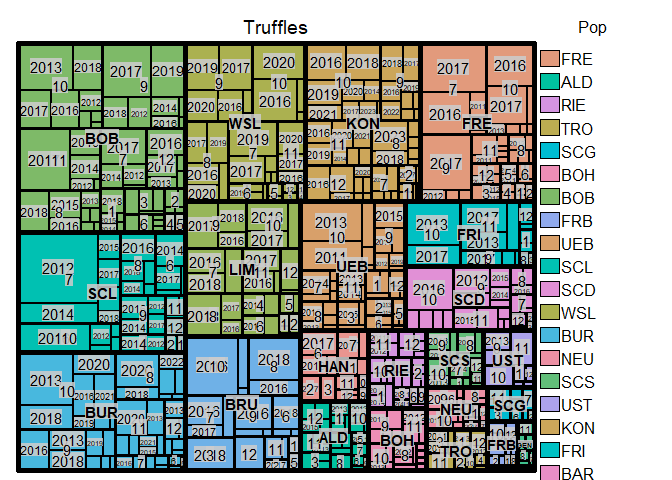

Truffle Monitoring
================
Lia Baumann
2024-03-05

## Basis

The basis for the research about Truffle Monitoring data is described in
detail in these publications: Virginie Molinier et al. (2013) Virgine
Molinier et al. (2016) Virginie Molinier et al. (2016) Staubli et al.
(2022) Steidinger et al. (2022) Legendre and Fortin (2010) Kamvar,
Tabima, and Grünwald (2014)

\#Create genalex file with dates of sampling: I want to compare genetic
diversity across years and show it for populations. So I need to combine
the sample and assign the sampling date. I have several ideas how to do
it. 1. –\> Join Genalex file with monitoring file on the sampling
column. –\> then read it in as a genclone and genind file again. 2. –\>
Filter monitoring file with genalex file to exclude the rows not
matching –\> choose columns that I want to process as a new file and
read in as genclone and genind file again.

## Monitoring Sites

<!-- -->

The dataset was already corrected in the following way: - Removal of
samples with less than 10 markers - Removal of samples with two mating
types.

# Number of samples per Site

| Site_1_abrev | Site                  |   n |
|:-------------|:----------------------|----:|
| ALD          | Aldingen              |  71 |
| BAR          | Barbengo              |   2 |
| BOB          | Bohlingen Buche       | 477 |
| BOH          | Bohlingen Hasel       |  54 |
| BUR          | Bursins               | 284 |
| FRB          | Freiburg-Brumaleweg   |  20 |
| FRE          | Freiburg-Wittnau      | 268 |
| FRI          | Frick                 | 125 |
| GEN          | Genolier              |   5 |
| KON          | Köniz                 | 234 |
| NEU          | Neuchatel             |  38 |
| RIE          | Rietheim              |  67 |
| SCD          | Schlieren Dreieck     | 123 |
| SCG          | Schlieren Graben      |  24 |
| SCL          | Schlieren Grillplatz  | 299 |
| SCS          | Schiffenensee         |  50 |
| TRO          | Trossingen            |  37 |
| UEB          | Bohlingen Ueberlingen | 204 |
| UST          | Uster                 |  43 |
| WSL          | WSL                   | 283 |

Number of observations per site

<!-- -->

Evtl. später: Standorte mit weniger als 10 Samples werden entfernt. Dies
lässt danach noch folgende Standorte für die Auswertung zu:

\#Idee: alle Observationen auf einer Zeitachse und nach Standort
unterteilt anzeigen

<!-- -->

Show missing data

    ## `summarise()` has grouped output by 'Pop', 'Month'. You can override using the
    ## `.groups` argument.

<!-- -->

<!-- -->

    ## 
    ## // Number of individuals: 2708
    ## // Group sizes: 71 2 477 54 284 20 268 125 5 234 38 67 123 24 299 50 37 204 43 283
    ## // Number of alleles per locus: 9 7 6 9 6 5 10 5 12 24 9 10 7 8
    ## // Number of alleles per group: 35 19 68 38 51 39 42 43 20 40 28 44 37 31 54 34 23 43 38 26
    ## // Percentage of missing data: 2.37 %
    ## // Observed heterozygosity: 0

    ## NULL

<!-- -->

\##Clone correction from
<https://grunwaldlab.github.io/Population_Genetics_in_R/Population_Strata.html>
When dealing with clonal populations, analyses are typically conducted
with and without clone correction. Clone correction is a method of
censoring a data set such that only one individual per MLG is
represented per population (Milgroom, 1996; Grünwald et al., 2003;
Grünwald & Hoheisel, 2006). This technique is commonly used with the
index of association and genotypic diversity measures since clone
corrected populations approximate behavior of sexual populations. Since
we want to only observe unique genotypes per population, clone
correction requires specification of the stratifications at which clones
should be censored. This section will show how to clone correct at a
specific stratification and also compare the results with uncorrected
data.

Question: Will allelic diversity increase or decrease with
clone-censored data?

The graph shows a decrease of diversity for most markers when
clone-correcting the data (increase of Simpson index means a decrease of
genotypic diversity).

\#Allele frequencies, missing data

``` r
(microsats_lt <- locus_table(microsats_dates))
```

    ## 
    ## allele = Number of observed alleles
    ## 1-D = Simpson index
    ## Hexp = Nei's 1978 gene diversity
    ## ------------------------------------------

    ##           summary
    ## locus      allele   1-D  Hexp Evenness
    ##   aest01_1   9.00  0.74  0.74     0.87
    ##   aest06_1   7.00  0.66  0.66     0.62
    ##   aest07_1   6.00  0.63  0.63     0.80
    ##   aest10_1   9.00  0.77  0.77     0.88
    ##   aest15_1   6.00  0.35  0.35     0.57
    ##   aest18_1   5.00  0.71  0.71     0.86
    ##   aest24_1  10.00  0.52  0.52     0.51
    ##   aest25_1   5.00  0.59  0.60     0.77
    ##   aest26_1  12.00  0.73  0.73     0.85
    ##   aest28_1  24.00  0.80  0.80     0.76
    ##   aest29_1   9.00  0.67  0.67     0.77
    ##   aest31_1  10.00  0.65  0.65     0.86
    ##   aest35_1   7.00  0.52  0.52     0.70
    ##   aest36_1   8.00  0.53  0.53     0.88
    ##   mean       9.07  0.63  0.63     0.76

``` r
info_table(microsats_dates, type = "missing", plot = TRUE)
```

<!-- -->

    ##              Locus
    ## Population    aest01_1 aest06_1 aest07_1 aest10_1 aest15_1 aest18_1 aest24_1
    ##   ALD_3_2011         .        .        .        .        .        .        .
    ##   ALD_6_2011         .        .        .        .        .        .        .
    ##   ALD_7_2011         .        .        .        .        .        .  0.50000
    ##   ALD_8_2011         .        .        .        .        .        .        .
    ##   ALD_10_2011        .        .        .        .        .        .        .
    ##   ALD_11_2011        .        .        .        .        .        .        .
    ##   ALD_12_2011        .        .        .        .        .        .        .
    ##   ALD_1_2012         .        .        .        .        .        .        .
    ##   ALD_2_2012         .        .        .        .        .        .        .
    ##   ALD_3_2012   0.50000        .        .        .        .        .        .
    ##   ALD_10_2012        .        .        .        .        .        .        .
    ##   ALD_11_2012        .        .        .        .        .        .        .
    ##   ALD_12_2012        .        .        .        .        .        .        .
    ##   ALD_1_2013         .        .        .        .        .        .        .
    ##   ALD_2_2013         .        .        .        .        .        .        .
    ##   ALD_3_2013   0.50000        .        .        .        .        .        .
    ##   ALD_10_2013        .        .        .        .        .        .        .
    ##   ALD_4_2011         .        .        .        .        .        .        .
    ##   ALD_11_2013        .        .        .        .        .        .        .
    ##   ALD_12_2013  0.25000        .        .        .        .        .        .
    ##   ALD_1_2014   0.50000        .        .        .        .        .  1.00000
    ##   ALD_2_2014         .        .        .        .        .        .        .
    ##   ALD_5_2011         .        .        .        .        .        .        .
    ##   ALD_7_2014         .        .        .        .        .        .        .
    ##   ALD_8_2014         .        .        .        .        .        .        .
    ##   ALD_9_2014         .        .        .        .        .        .        .
    ##   ALD_10_2014        .        .        .        .        .        .        .
    ##   ALD_1_2015         .        .        .        .        .        .        .
    ##   ALD_12_2015  0.25000        .        .        .        .        .        .
    ##   BAR_5_2014   1.00000        .        .        .        .        .        .
    ##   BAR_6_2014         .        .        .        .        .        .        .
    ##   BOB_8_2011         .        .        .        .        .        .        .
    ##   BOB_2_2012         .        .        .        .        .        .        .
    ##   BOB_1_2015         .        .        .        .        .        .        .
    ##   BOB_3_2015   0.25000        .        .        .        .        .        .
    ##   BOB_6_2015         .        .        .        .        .        .        .
    ##   BOB_8_2015   0.23077        .        .        .        .        .        .
    ##   BOB_3_2012         .        .        .        .        .        .        .
    ##   BOB_10_2015  0.50000        .        .        .        .        .        .
    ##   BOB_1_2016         .        .        .        .        .        .        .
    ##   BOB_2_2016   1.00000        .        .        .        .        .        .
    ##   BOB_11_2012        .        .        .        .        .        .        .
    ##   BOB_9_2014         .        .        .        .        .        .  0.12500
    ##   BOB_10_2013  0.02564        .        .        .        .  0.02564        .
    ##   BOB_5_2012         .        .        .        .        .        .        .
    ##   BOB_7_2012   0.14286        .        .        .        .        .        .
    ##   BOB_6_2016   1.00000        .        .        .        .        .        .
    ##   BOB_7_2016         .        .        .        .        .        .        .
    ##   BOB_8_2016   0.28571        .        .        .        .        .        .
    ##   BOB_9_2016         .        .        .        .        .        .        .
    ##   BOB_10_2016        .        .        .        .        .        .        .
    ##   BOB_9_2011         .        .        .        .        .        .        .
    ##   BOB_11_2016  0.07692  0.07692        .        .        .        .        .
    ##   BOB_8_2012         .        .        .        .        .        .        .
    ##   BOB_12_2016        .        .        .        .        .        .        .
    ##   BOB_9_2012   0.18182        .        .        .        .        .        .
    ##   BOB_6_2017         .        .        .        .        .        .        .
    ##   BOB_7_2017         .        .        .        .        .        .        .
    ##   BOB_8_2017         .        .        .        .        .        .        .
    ##   BOB_9_2017         .        .        .        .        .        .        .
    ##   BOB_10_2011        .        .        .        .        .        .        .
    ##   BOB_10_2017  0.05556        .        .        .        .        .        .
    ##   BOB_11_2017        .        .        .        .        .        .        .
    ##   BOB_10_2012        .        .        .        .        .        .  0.14286
    ##   BOB_11_2011        .        .        .        .        .        .        .
    ##   BOB_12_2017        .        .        .        .        .        .        .
    ##   BOB_1_2018         .        .        .        .        .        .        .
    ##   BOB_3_2018         .        .        .        .        .        .        .
    ##   BOB_4_2018         .        .        .        .        .        .        .
    ##   BOB_6_2018         .        .        .        .        .        .        .
    ##   BOB_8_2018         .        .        .        .        .        .        .
    ##   BOB_1_2013         .        .        .        .        .        .        .
    ##   BOB_9_2018         .        .        .        .        .        .        .
    ##   BOB_2_2013   1.00000        .        .  1.00000        .        .        .
    ##   BOB_5_2013   0.50000        .        .        .        .        .        .
    ##   BOB_10_2018  0.38095        .        .        .        .        .        .
    ##   BOB_12_2011        .        .        .        .        .        .        .
    ##   BOB_6_2013   1.00000        .        .        .        .        .        .
    ##   BOB_8_2013         .        .        .        .        .        .        .
    ##   BOB_9_2019         .        .        .        .        .        .        .
    ##   BOB_9_2013         .        .        .        .        .        .        .
    ##   BOB_12_2013        .        .        .        .        .        .        .
    ##   BOB_1_2014         .        .        .        .        .        .        .
    ##   BOB_2_2014         .        .        .        .        .        .        .
    ##   BOB_3_2014         .        .        .        .        .        .        .
    ##   BOB_7_2014   0.25000        .        .        .        .        .  0.12500
    ##   BOB_8_2014         .        .        .        .        .        .        .
    ##   BOB_10_2014  0.33333        .        .        .        .        .        .
    ##   BOB_11_2014  0.27273        .        .        .        .        .        .
    ##   BOB_12_2014        .        .        .        .        .        .        .
    ##   BOH_5_2011         .        .        .        .        .        .        .
    ##   BOH_10_2011        .        .        .        .        .        .        .
    ##   BOH_12_2011        .        .        .        .        .        .        .
    ##   BOH_3_2012   1.00000        .        .        .        .        .        .
    ##   BOH_8_2012         .        .        .        .        .        .        .
    ##   BOH_9_2012   0.33333        .        .        .        .        .        .
    ##   BOH_6_2011         .        .        .        .        .        .        .
    ##   BOH_10_2012        .        .        .        .        .        .        .
    ##   BOH_11_2012  0.33333        .        .  0.16667        .  0.16667  0.16667
    ##   BOH_8_2011         .        .        .        .        .        .        .
    ##   BOH_9_2013   0.40000        .        .        .        .        .  0.20000
    ##   BOH_10_2013  0.50000        .        .        .        .        .        .
    ##   BOH_9_2011         .        .        .        .        .        .        .
    ##   BOH_11_2013        .        .        .        .        .        .        .
    ##   BOH_7_2014   0.50000        .        .        .        .        .        .
    ##   BOH_8_2014         .        .        .        .        .        .        .
    ##   BOH_9_2014         .        .        .        .        .        .        .
    ##   BOH_11_2014        .        .        .        .        .        .        .
    ##   BOH_9_2015   1.00000        .        .        .        .        .        .
    ##   BOH_10_2015  1.00000        .        .        .        .        .  1.00000
    ##   BUR_7_2013         .        .        .        .        .        .        .
    ##   BUR_9_2013         .        .        .        .        .        .        .
    ##   BUR_8_2016   0.83333        .        .        .        .        .  0.16667
    ##   BUR_9_2016   0.21053        .        .        .        .        .        .
    ##   BUR_10_2016  0.61538        .        .        .        .        .  0.07692
    ##   BUR_12_2016  1.00000        .        .        .        .        .        .
    ##   BUR_6_2018         .        .        .        .        .        .        .
    ##   BUR_8_2018   0.12500        .        .        .        .        .        .
    ##   BUR_9_2018   0.09091        .        .        .        .        .        .
    ##   BUR_10_2013  0.11364        .        .        .        .        .  0.04545
    ##   BUR_10_2018  0.05263        .        .        .        .        .        .
    ##   BUR_11_2018  0.50000        .        .        .        .        .        .
    ##   BUR_7_2019   1.00000        .        .        .        .        .        .
    ##   BUR_8_2019         .        .        .        .        .        .        .
    ##   BUR_9_2019   0.85714        .        .  0.14286        .        .  0.14286
    ##   BUR_10_2019  0.75000        .        .        .        .        .        .
    ##   BUR_11_2019  1.00000        .        .        .        .        .        .
    ##   BUR_12_2019  0.80000        .        .        .        .        .        .
    ##   BUR_1_2020   1.00000        .        .        .        .        .        .
    ##   BUR_5_2020         .        .        .        .        .        .        .
    ##   BUR_6_2020         .        .        .        .        .        .        .
    ##   BUR_7_2020         .        .        .        .        .        .        .
    ##   BUR_8_2020         .        .        .        .        .        .        .
    ##   BUR_10_2020        .        .        .        .        .        .        .
    ##   BUR_11_2020        .        .        .        .        .        .        .
    ##   BUR_12_2020        .        .        .        .        .        .        .
    ##   BUR_8_2021         .        .        .        .        .        .        .
    ##   BUR_9_2021         .        .        .        .        .        .        .
    ##   BUR_10_2021        .        .        .        .        .        .        .
    ##   BUR_8_2013         .        .        .        .        .        .        .
    ##   BUR_11_2021        .        .        .        .        .        .        .
    ##   BUR_12_2021        .        .        .        .        .        .        .
    ##   BUR_11_2013  0.11111        .        .        .        .        .        .
    ##   BUR_12_2013        .        .        .        .        .        .        .
    ##   BUR_8_2014         .        .        .        .        .        .        .
    ##   BUR_9_2014         .        .        .        .        .        .        .
    ##   BUR_10_2014  0.33333        .        .        .        .        .        .
    ##   BUR_11_2014        .        .        .        .        .        .        .
    ##   BUR_12_2014  0.50000        .        .        .        .        .        .
    ##   BUR_9_2015   0.20000        .        .        .        .        .        .
    ##   BUR_11_2015        .        .        .        .        .        .        .
    ##   BUR_7_2016   1.00000        .        .        .        .        .        .
    ##   FRB_10_2011        .        .        .        .        .        .        .
    ##   FRB_2_2013         .        .        .  0.50000        .        .        .
    ##   FRB_10_2013        .        .        .        .        .        .        .
    ##   FRB_12_2013        .        .        .        .        .        .        .
    ##   FRB_1_2014         .        .        .  1.00000        .        .        .
    ##   FRB_2_2014         .        .        .        .        .        .        .
    ##   FRB_5_2014   1.00000        .        .        .        .        .        .
    ##   FRB_8_2014         .        .        .        .        .        .        .
    ##   FRB_12_2014  1.00000        .        .        .        .        .        .
    ##   FRB_5_2015         .        .        .  1.00000        .        .        .
    ##   FRB_12_2011        .        .        .        .        .        .        .
    ##   FRB_10_2012        .        .        .        .        .        .        .
    ##   FRB_11_2012        .        .        .  0.33333        .        .        .
    ##   FRE_1_2011         .        .        .        .        .        .        .
    ##   FRE_6_2011         .        .        .  0.50000        .        .        .
    ##   FRE_7_2016   0.12903        .        .  0.12903        .        .  0.03226
    ##   FRE_7_2011         .        .        .        .        .        .        .
    ##   FRE_10_2016  0.32258        .        .  0.22581        .        .  0.03226
    ##   FRE_11_2016        .        .        .        .        .        .        .
    ##   FRE_7_2017   0.04082        .        .  0.06122        .        .  0.02041
    ##   FRE_8_2011         .        .        .        .        .        .        .
    ##   FRE_10_2011        .        .        .        .        .        .        .
    ##   FRE_3_2011         .        .        .        .        .        .        .
    ##   FRE_9_2017   0.13953        .        .  0.06977        .        .        .
    ##   FRE_11_2011  0.33333        .        .        .        .        .        .
    ##   FRE_10_2017  0.34783        .        .  0.21739        .        .        .
    ##   FRE_12_2011        .        .        .  1.00000        .        .        .
    ##   FRE_1_2012         .        .        .        .        .        .        .
    ##   FRE_3_2012         .        .        .        .        .        .        .
    ##   FRE_6_2012         .        .        .        .        .        .        .
    ##   FRE_7_2012         .        .        .        .        .        .        .
    ##   FRE_8_2012   0.25000        .        .        .        .        .        .
    ##   FRE_9_2012         .        .        .        .        .        .        .
    ##   FRE_10_2012        .        .        .        .        .        .        .
    ##   FRE_11_2012        .        .        .        .        .        .        .
    ##   FRE_12_2012        .        .        .        .        .        .        .
    ##   FRE_1_2013         .        .        .        .        .        .        .
    ##   FRE_4_2011         .        .        .  0.50000        .        .        .
    ##   FRE_6_2013         .        .        .  1.00000        .        .        .
    ##   FRE_7_2013         .        .        .        .        .        .        .
    ##   FRE_8_2013         .        .        .        .        .        .        .
    ##   FRE_9_2013         .        .        .        .        .        .        .
    ##   FRE_10_2013        .        .        .  0.33333        .        .        .
    ##   FRE_11_2013        .        .        .        .        .        .        .
    ##   FRE_12_2013        .        .        .        .        .        .        .
    ##   FRE_2_2014         .        .        .  0.50000        .        .        .
    ##   FRE_4_2014   0.50000        .        .        .        .        .        .
    ##   FRE_5_2014   0.33333        .        .        .        .        .        .
    ##   FRE_7_2014         .        .        .        .        .        .        .
    ##   FRE_8_2014   0.50000        .        .  0.50000        .        .  0.50000
    ##   FRE_5_2011         .        .        .        .        .        .        .
    ##   FRE_10_2014        .        .        .        .        .        .        .
    ##   FRE_11_2014        .        .        .        .        .        .        .
    ##   FRE_12_2014        .        .        .        .        .        .        .
    ##   FRE_3_2015         .        .        .        .        .        .        .
    ##   FRE_8_2015         .        .        .        .        .        .        .
    ##   FRE_10_2015  1.00000        .        .        .        .        .        .
    ##   FRE_11_2015        .        .        .        .        .        .        .
    ##   FRE_12_2015        .        .        .        .        .        .        .
    ##   FRE_9_2015         .        .        .        .        .        .        .
    ##   FRI_10_2013  0.08333        .        .        .        .        .        .
    ##   FRI_10_2017        .        .        .        .        .        .        .
    ##   FRI_11_2017        .        .        .        .        .        .        .
    ##   FRI_12_2017        .        .        .        .        .        .        .
    ##   FRI_1_2018         .        .        .        .        .        .        .
    ##   FRI_11_2013        .        .        .        .        .        .        .
    ##   FRI_12_2013        .        .        .        .        .        .        .
    ##   FRI_3_2014         .        .        .        .        .        .        .
    ##   FRI_9_2014         .        .        .        .        .        .        .
    ##   FRI_1_2015         .        .        .  0.50000        .        .        .
    ##   FRI_9_2016         .        .        .        .        .        .        .
    ##   FRI_11_2016  0.11111        .        .        .        .        .  0.11111
    ##   FRI_8_2017         .        .        .        .        .        .        .
    ##   FRI_9_2017         .        .        .        .        .        .        .
    ##   GEN_1_2020         .        .        .        .        .        .        .
    ##   GEN_8_2020         .        .        .        .        .        .        .
    ##   GEN_12_2021        .        .        .        .        .        .        .
    ##   GEN_1_2022         .        .        .        .        .        .        .
    ##   KON_9_2013         .        .        .        .        .        .        .
    ##   KON_10_2014        .        .        .        .        .        .        .
    ##   KON_12_2016  0.46154        .        .        .        .        .        .
    ##   KON_2_2017   0.80000        .        .        .        .        .        .
    ##   KON_7_2017   1.00000        .  0.25000        .        .        .        .
    ##   KON_9_2017   0.20000        .        .        .        .        .        .
    ##   KON_10_2017  0.40000        .        .        .        .        .        .
    ##   KON_11_2017        .        .        .        .        .        .        .
    ##   KON_12_2017        .        .        .        .        .        .        .
    ##   KON_11_2014        .        .        .        .        .        .        .
    ##   KON_1_2018         .        .        .        .        .        .        .
    ##   KON_7_2018   1.00000        .        .        .        .        .        .
    ##   KON_8_2018         .        .        .        .        .        .        .
    ##   KON_9_2018   0.07692        .        .        .        .        .        .
    ##   KON_10_2018  0.10526        .        .        .        .        .        .
    ##   KON_12_2014        .        .        .        .        .        .        .
    ##   KON_12_2018        .        .        .        .        .        .        .
    ##   KON_7_2019   0.50000        .        .        .        .        .        .
    ##   KON_8_2019   0.66667        .        .        .        .        .        .
    ##   KON_9_2019         .        .        .        .        .        .        .
    ##   KON_10_2019        .        .        .        .        .        .        .
    ##   KON_11_2013        .        .        .        .        .        .        .
    ##   KON_1_2015         .        .        .        .        .        .        .
    ##   KON_11_2019  0.11111        .        .        .        .        .        .
    ##   KON_3_2016   1.00000        .        .        .        .        .        .
    ##   KON_1_2020         .        .        .        .        .        .        .
    ##   KON_7_2020         .        .        .        .        .        .        .
    ##   KON_8_2020         .        .        .        .        .        .        .
    ##   KON_9_2020         .        .        .        .        .        .        .
    ##   KON_10_2020        .        .        .        .        .        .        .
    ##   KON_8_2016   0.50000        .        .        .        .        .        .
    ##   KON_11_2020        .        .        .        .        .        .        .
    ##   KON_12_2020        .        .        .        .        .        .        .
    ##   KON_8_2021         .        .        .        .        .        .        .
    ##   KON_10_2021  0.12500        .        .        .        .        .        .
    ##   KON_11_2021        .        .        .        .        .        .        .
    ##   KON_12_2021        .        .        .        .        .        .        .
    ##   KON_9_2016   0.83333        .        .        .        .        .        .
    ##   KON_10_2016  0.47826        .        .        .  0.04348        .  0.04348
    ##   KON_12_2013        .        .        .        .        .        .        .
    ##   KON_2_2014   1.00000        .        .        .        .        .        .
    ##   KON_9_2014         .        .        .        .        .        .        .
    ##   KON_11_2016  0.55556        .        .        .        .        .  0.11111
    ##   NEU_8_2013         .        .        .        .        .        .        .
    ##   NEU_10_2014        .        .        .        .        .        .        .
    ##   NEU_11_2014        .        .        .        .        .        .        .
    ##   NEU_10_2015        .        .        .        .        .        .        .
    ##   NEU_8_2016   0.50000        .        .        .        .        .        .
    ##   NEU_9_2016         .        .        .        .        .        .        .
    ##   NEU_9_2013         .        .        .        .        .        .        .
    ##   NEU_10_2016  0.20000        .        .        .        .        .        .
    ##   NEU_10_2013        .        .        .        .        .        .        .
    ##   NEU_2_2017         .        .        .        .        .        .        .
    ##   NEU_11_2013        .        .        .        .        .        .        .
    ##   NEU_7_2020         .        .        .        .        .        .        .
    ##   NEU_8_2020         .        .        .        .        .        .        .
    ##   NEU_9_2020         .        .        .        .        .        .        .
    ##   NEU_10_2021        .        .        .        .        .        .        .
    ##   NEU_11_2021        .        .        .        .        .        .        .
    ##   NEU_12_2013  0.50000        .        .  0.50000        .        .        .
    ##   RIE_3_2011         .        .        .        .        .        .        .
    ##   RIE_8_2011         .        .        .        .        .        .        .
    ##   RIE_10_2011        .        .        .        .        .        .        .
    ##   RIE_11_2011        .        .        .        .        .        .        .
    ##   RIE_12_2011        .        .        .        .        .        .        .
    ##   RIE_2_2012         .        .        .        .        .        .        .
    ##   RIE_3_2012         .        .        .        .        .        .        .
    ##   RIE_10_2012        .        .        .        .        .        .        .
    ##   RIE_11_2012        .        .        .        .        .        .        .
    ##   RIE_12_2012        .        .        .        .        .        .        .
    ##   RIE_1_2013         .        .        .        .        .        .        .
    ##   RIE_2_2013         .        .        .        .        .        .        .
    ##   RIE_3_2013         .        .        .        .        .        .        .
    ##   RIE_10_2013        .        .        .        .        .        .        .
    ##   RIE_11_2013        .        .        .        .        .        .        .
    ##   RIE_12_2013  0.25000        .        .        .        .        .        .
    ##   RIE_1_2014   0.33333        .        .        .        .        .        .
    ##   RIE_4_2011         .        .        .        .        .        .        .
    ##   RIE_2_2014         .        .        .        .        .        .        .
    ##   RIE_9_2014         .        .        .        .        .        .        .
    ##   RIE_10_2014        .        .        .        .        .        .        .
    ##   RIE_11_2014        .        .        .        .        .        .        .
    ##   RIE_12_2014        .        .        .        .        .        .        .
    ##   RIE_1_2015         .        .        .        .        .        .        .
    ##   RIE_2_2015         .        .        .        .        .        .        .
    ##   RIE_10_2015  1.00000        .        .        .        .        .        .
    ##   RIE_12_2015        .        .        .        .        .        .        .
    ##   RIE_6_2011         .        .        .        .        .        .        .
    ##   RIE_7_2011         .        .        .  1.00000        .        .        .
    ##   SCD_7_2012         .        .        .        .        .        .        .
    ##   SCD_9_2012   0.06667        .        .        .        .        .  0.06667
    ##   SCD_10_2016        .        .        .        .        .        .        .
    ##   SCD_11_2016        .        .        .        .        .        .        .
    ##   SCD_12_2016        .        .        .        .        .        .        .
    ##   SCD_10_2017        .        .        .        .        .        .        .
    ##   SCD_10_2012        .        .        .        .        .        .        .
    ##   SCD_11_2012  0.14286        .        .        .        .        .        .
    ##   SCD_12_2012        .        .        .        .        .        .        .
    ##   SCD_8_2013   0.66667        .        .        .        .        .        .
    ##   SCD_9_2013   0.50000        .        .        .        .        .        .
    ##   SCD_10_2013  0.33333        .        .        .        .        .        .
    ##   SCD_11_2013        .        .        .        .        .        .        .
    ##   SCD_1_2014         .        .        .        .        .        .        .
    ##   SCD_3_2014         .        .        .        .        .        .        .
    ##   SCD_7_2014         .        .        .        .        .        .        .
    ##   SCD_9_2014         .        .        .        .        .        .        .
    ##   SCD_11_2014  1.00000        .        .  0.50000        .        .  0.50000
    ##   SCD_7_2015         .        .        .        .        .        .        .
    ##   SCD_8_2015   0.25000        .        .        .        .        .        .
    ##   SCD_9_2015   0.16667        .        .  0.33333        .        .        .
    ##   SCD_10_2015  0.75000        .        .        .        .        .  0.25000
    ##   SCD_11_2015        .        .        .        .        .        .        .
    ##   SCD_2_2016   1.00000        .        .        .        .        .        .
    ##   SCD_8_2016   0.66667        .        .        .        .        .        .
    ##   SCD_9_2016         .        .        .        .        .        .        .
    ##   SCG_3_2011         .        .        .        .        .        .        .
    ##   SCG_2_2012         .        .        .        .        .        .        .
    ##   SCG_3_2012   0.50000        .        .  0.50000        .        .        .
    ##   SCG_7_2011         .        .        .        .        .        .        .
    ##   SCG_11_2011        .        .        .        .        .        .        .
    ##   SCG_10_2012        .        .        .        .        .        .        .
    ##   SCG_11_2012  0.66667        .        .        .        .        .  0.33333
    ##   SCG_1_2013   0.50000        .        .        .        .        .        .
    ##   SCG_1_2014         .        .        .        .        .        .        .
    ##   SCG_6_2014         .        .        .        .        .        .        .
    ##   SCG_11_2014  1.00000        .        .        .        .        .        .
    ##   SCL_7_2012   0.04762        .        .  0.01190        .        .        .
    ##   SCL_9_2014         .        .        .        .        .        .        .
    ##   SCL_10_2014  0.50000        .        .        .        .        .        .
    ##   SCL_6_2015   0.50000        .        .        .        .        .        .
    ##   SCL_7_2015         .        .        .        .        .        .        .
    ##   SCL_9_2012         .        .        .        .        .        .        .
    ##   SCL_10_2012  0.14286        .        .        .        .        .        .
    ##   SCL_8_2016   0.53333        .        .        .        .        .        .
    ##   SCL_9_2016   0.20000        .        .        .        .        .        .
    ##   SCL_10_2016  0.16129        .        .  0.03226  0.03226        .        .
    ##   SCL_11_2012        .        .        .        .        .        .        .
    ##   SCL_4_2012         .        .        .        .        .        .        .
    ##   SCL_11_2016        .        .        .        .        .        .        .
    ##   SCL_12_2016        .        .        .        .        .        .        .
    ##   SCL_2_2017         .        .        .        .        .        .        .
    ##   SCL_6_2017   0.33333        .        .        .        .        .        .
    ##   SCL_12_2012        .        .        .        .        .        .        .
    ##   SCL_7_2017         .        .        .        .        .        .        .
    ##   SCL_1_2013         .        .        .        .        .        .        .
    ##   SCL_8_2017         .        .        .        .        .        .        .
    ##   SCL_7_2013   0.12500        .        .  0.12500        .        .        .
    ##   SCL_9_2017         .        .        .        .        .        .        .
    ##   SCL_10_2017        .        .        .        .        .        .        .
    ##   SCL_11_2017        .        .        .        .        .        .        .
    ##   SCL_12_2017        .        .        .        .        .        .        .
    ##   SCL_6_2018         .        .        .        .        .        .        .
    ##   SCL_7_2018         .        .        .        .        .        .        .
    ##   SCL_8_2018   0.14286        .        .        .        .        .        .
    ##   SCL_8_2013         .        .        .        .        .        .  0.50000
    ##   SCL_10_2013        .        .        .        .        .        .        .
    ##   SCL_1_2014         .        .        .        .        .  1.00000        .
    ##   SCL_4_2014         .        .        .        .        .        .        .
    ##   SCL_6_2014         .        .        .        .        .        .        .
    ##   SCL_7_2014   0.04167        .        .        .        .        .        .
    ##   SCL_8_2014         .        .        .        .        .        .        .
    ##   SCS_8_2013         .        .        .        .        .        .        .
    ##   SCS_1_2014   0.50000        .        .        .        .        .        .
    ##   SCS_5_2014         .        .        .        .        .        .        .
    ##   SCS_7_2014         .        .        .        .        .        .        .
    ##   SCS_8_2014         .        .        .        .        .        .        .
    ##   SCS_9_2014         .        .        .        .        .        .        .
    ##   SCS_11_2014        .        .        .        .        .        .        .
    ##   SCS_12_2014        .        .        .        .        .        .  0.33333
    ##   SCS_1_2016         .        .        .        .        .        .        .
    ##   SCS_8_2016   0.16667        .        .        .        .        .        .
    ##   SCS_9_2016         .        .        .        .        .        .        .
    ##   SCS_10_2013  0.25000        .        .        .        .        .        .
    ##   SCS_10_2016  0.16667        .        .        .        .        .        .
    ##   SCS_9_2017   0.33333        .        .        .        .        .        .
    ##   SCS_NA_2016        .        .        .        .        .        .        .
    ##   SCS_11_2013        .        .        .        .        .        .        .
    ##   TRO_3_2011         .        .        .        .        .        .        .
    ##   TRO_11_2011        .        .        .        .        .        .        .
    ##   TRO_12_2011        .        .        .        .        .        .        .
    ##   TRO_1_2012         .        .        .        .        .        .        .
    ##   TRO_2_2012         .        .        .        .        .        .        .
    ##   TRO_3_2012         .        .        .        .        .        .        .
    ##   TRO_11_2012        .        .        .        .        .        .        .
    ##   TRO_12_2012        .        .        .        .        .        .        .
    ##   TRO_1_2013   0.25000        .        .        .        .        .        .
    ##   TRO_2_2013   0.50000        .        .        .        .        .  0.50000
    ##   TRO_3_2013         .        .        .        .        .        .        .
    ##   TRO_4_2011   0.50000        .        .        .        .        .        .
    ##   TRO_8_2011         .        .        .        .        .        .        .
    ##   TRO_10_2011        .        .        .        .        .        .        .
    ##   UEB_7_2012         .        .        .        .        .        .        .
    ##   UEB_8_2015   0.42857        .        .        .        .        .        .
    ##   UEB_9_2015   0.15385        .        .        .        .        .  0.15385
    ##   UEB_3_2013         .        .        .        .        .        .        .
    ##   UEB_10_2015        .        .        .        .        .        .        .
    ##   UEB_10_2011        .        .        .        .        .        .        .
    ##   UEB_4_2013         .        .        .        .        .        .        .
    ##   UEB_5_2013         .        .        .        .        .        .        .
    ##   UEB_10_2013        .        .        .        .        .        .        .
    ##   UEB_8_2013         .        .        .        .        .        .        .
    ##   UEB_9_2013         .        .        .        .        .        .        .
    ##   UEB_7_2016   1.00000        .        .        .  1.00000        .        .
    ##   UEB_8_2016   1.00000        .        .        .  1.00000        .        .
    ##   UEB_9_2016   1.00000        .        .        .  1.00000        .        .
    ##   UEB_10_2016  1.00000        .        .        .  1.00000        .        .
    ##   UEB_11_2013  0.16667        .        .        .        .        .        .
    ##   UEB_11_2016  1.00000        .        .        .  1.00000        .        .
    ##   UEB_12_2016  1.00000        .        .        .  1.00000        .        .
    ##   UEB_6_2017   1.00000        .        .        .  1.00000        .        .
    ##   UEB_8_2012         .        .        .  0.50000        .        .        .
    ##   UEB_7_2017   1.00000        .        .        .  1.00000        .        .
    ##   UEB_1_2018   1.00000        .        .        .  1.00000        .        .
    ##   UEB_9_2019         .        .        .        .        .        .        .
    ##   UEB_12_2013  0.50000        .        .        .        .        .        .
    ##   UEB_1_2014         .        .        .        .        .        .        .
    ##   UEB_2_2014         .        .        .        .        .        .        .
    ##   UEB_3_2014         .        .        .        .        .        .        .
    ##   UEB_5_2014         .        .        .  0.33333        .        .  0.33333
    ##   UEB_6_2014   0.50000        .        .        .        .        .        .
    ##   UEB_9_2012         .        .        .        .        .        .        .
    ##   UEB_7_2014   0.18182        .        .  0.18182        .        .  0.18182
    ##   UEB_8_2014         .        .        .        .        .        .        .
    ##   UEB_9_2014   0.14286        .        .        .        .        .        .
    ##   UEB_10_2014  0.33333        .        .        .        .        .        .
    ##   UEB_11_2014  0.16667        .        .        .        .        .        .
    ##   UEB_12_2014        .        .        .        .        .        .        .
    ##   UEB_1_2015   0.20000        .        .        .        .        .        .
    ##   UEB_2_2013         .        .        .        .        .        .        .
    ##   UEB_2_2015         .        .        .        .        .        .        .
    ##   UEB_3_2015   0.12500        .        .        .        .        .        .
    ##   UEB_5_2015         .        .        .        .        .        .        .
    ##   UEB_6_2015         .        .        .  1.00000        .        .        .
    ##   UEB_7_2015   1.00000        .        .        .        .        .        .
    ##   UST_9_2013   0.12500        .        .        .        .        .        .
    ##   UST_10_2013  0.20000        .        .        .        .        .        .
    ##   UST_11_2013  0.16667        .        .  0.08333        .        .        .
    ##   UST_12_2013        .        .        .        .        .        .        .
    ##   UST_1_2014         .        .        .        .        .        .  0.33333
    ##   UST_3_2014         .        .        .        .        .        .        .
    ##   UST_8_2014         .        .        .        .        .        .        .
    ##   UST_9_2014         .        .        .        .        .        .        .
    ##   WSL_9_2012         .        .        .        .        .        .        .
    ##   WSL_8_2016         .        .        .        .        .        .        .
    ##   WSL_9_2016         .        .        .        .        .        .        .
    ##   WSL_10_2016        .        .        .        .        .        .        .
    ##   WSL_11_2016        .        .        .        .        .        .        .
    ##   WSL_12_2016        .        .        .        .        .        .        .
    ##   WSL_3_2017         .        .        .        .        .        .        .
    ##   WSL_7_2017         .        .        .        .        .        .        .
    ##   WSL_8_2017         .        .        .        .        .        .        .
    ##   WSL_9_2017         .        .        .        .        .        .        .
    ##   WSL_10_2017        .        .        .        .        .        .        .
    ##   WSL_11_2017        .        .        .        .        .        .        .
    ##   WSL_1_2018         .        .        .        .        .        .        .
    ##   WSL_3_2018         .        .        .        .        .        .        .
    ##   WSL_5_2018         .        .        .        .        .        .        .
    ##   WSL_6_2018         .        .        .        .        .        .        .
    ##   WSL_7_2018         .        .        .        .        .        .        .
    ##   WSL_8_2018         .        .        .        .        .        .        .
    ##   WSL_9_2018         .        .        .        .        .        .        .
    ##   WSL_6_2019         .        .        .        .        .        .        .
    ##   WSL_7_2019         .        .        .        .        .        .        .
    ##   WSL_8_2019         .        .        .        .        .        .        .
    ##   WSL_9_2019         .        .        .        .        .        .        .
    ##   WSL_10_2019        .        .        .        .        .        .        .
    ##   WSL_4_2020         .        .        .        .        .        .        .
    ##   WSL_5_2020         .        .        .        .        .        .        .
    ##   WSL_6_2020         .        .        .        .        .        .        .
    ##   WSL_7_2020         .        .        .        .        .        .        .
    ##   WSL_8_2020         .        .        .        .        .        .        .
    ##   WSL_9_2020         .        .        .        .        .        .        .
    ##   WSL_10_2020        .        .        .        .        .        .        .
    ##   WSL_11_2020        .        .        .        .        .        .        .
    ##   WSL_6_2021         .        .        .        .        .        .        .
    ##   WSL_7_2021         .        .        .        .        .        .        .
    ##   Total        0.11374  0.00037  0.00037  0.01957  0.00997  0.00111  0.01256
    ##              Locus
    ## Population    aest25_1 aest26_1 aest28_1 aest29_1 aest31_1 aest35_1 aest36_1
    ##   ALD_3_2011         .        .        .        .        .        .        .
    ##   ALD_6_2011         .        .        .        .        .        .        .
    ##   ALD_7_2011         .        .        .        .        .        .        .
    ##   ALD_8_2011         .        .        .        .        .        .        .
    ##   ALD_10_2011        .        .        .        .        .        .        .
    ##   ALD_11_2011        .        .        .        .        .        .        .
    ##   ALD_12_2011        .        .        .        .        .        .        .
    ##   ALD_1_2012         .        .        .        .        .        .        .
    ##   ALD_2_2012         .        .        .        .        .        .        .
    ##   ALD_3_2012         .        .        .        .        .        .        .
    ##   ALD_10_2012        .        .        .        .        .        .        .
    ##   ALD_11_2012        .        .        .        .        .        .        .
    ##   ALD_12_2012        .        .        .        .        .        .        .
    ##   ALD_1_2013         .        .        .        .        .        .        .
    ##   ALD_2_2013         .        .        .        .        .        .        .
    ##   ALD_3_2013         .        .        .        .        .        .        .
    ##   ALD_10_2013        .        .        .        .        .        .        .
    ##   ALD_4_2011         .        .        .        .        .        .        .
    ##   ALD_11_2013        .        .        .        .        .        .        .
    ##   ALD_12_2013        .        .        .        .  0.25000        .        .
    ##   ALD_1_2014         .        .        .        .  0.50000        .        .
    ##   ALD_2_2014         .        .        .        .        .        .        .
    ##   ALD_5_2011         .        .        .        .        .        .        .
    ##   ALD_7_2014         .        .        .        .  1.00000        .        .
    ##   ALD_8_2014         .        .        .        .        .        .        .
    ##   ALD_9_2014         .        .        .        .        .        .        .
    ##   ALD_10_2014        .        .        .        .        .        .        .
    ##   ALD_1_2015         .        .        .        .        .        .        .
    ##   ALD_12_2015        .        .        .        .  0.50000        .        .
    ##   BAR_5_2014         .        .        .        .        .        .        .
    ##   BAR_6_2014         .        .        .        .        .        .        .
    ##   BOB_8_2011         .        .        .        .        .        .        .
    ##   BOB_2_2012         .        .        .        .        .        .        .
    ##   BOB_1_2015         .        .  0.33333        .  0.33333        .        .
    ##   BOB_3_2015         .        .        .        .        .        .        .
    ##   BOB_6_2015         .        .        .        .        .        .        .
    ##   BOB_8_2015         .        .  0.07692        .  0.15385        .        .
    ##   BOB_3_2012         .        .        .        .        .        .        .
    ##   BOB_10_2015        .        .  0.50000        .  0.50000        .        .
    ##   BOB_1_2016         .        .        .        .        .        .        .
    ##   BOB_2_2016         .        .  1.00000        .        .        .        .
    ##   BOB_11_2012        .        .        .        .        .        .        .
    ##   BOB_9_2014         .        .  0.12500        .  0.12500        .        .
    ##   BOB_10_2013        .        .  0.02564        .        .        .        .
    ##   BOB_5_2012         .        .        .        .        .        .        .
    ##   BOB_7_2012         .        .        .        .        .        .        .
    ##   BOB_6_2016         .        .        .        .  1.00000        .        .
    ##   BOB_7_2016         .        .        .        .        .        .        .
    ##   BOB_8_2016         .        .        .        .  0.14286        .        .
    ##   BOB_9_2016         .        .        .        .        .        .        .
    ##   BOB_10_2016        .        .        .        .        .        .        .
    ##   BOB_9_2011         .        .        .        .        .        .        .
    ##   BOB_11_2016        .        .        .        .        .        .  0.07692
    ##   BOB_8_2012         .        .        .        .        .        .        .
    ##   BOB_12_2016        .        .        .        .        .        .        .
    ##   BOB_9_2012   0.09091        .        .        .        .        .        .
    ##   BOB_6_2017         .        .        .        .        .        .        .
    ##   BOB_7_2017         .        .        .        .        .        .        .
    ##   BOB_8_2017         .        .        .        .        .        .        .
    ##   BOB_9_2017         .        .        .        .        .        .        .
    ##   BOB_10_2011        .        .        .        .        .        .        .
    ##   BOB_10_2017        .        .        .        .        .        .        .
    ##   BOB_11_2017        .        .        .        .        .        .        .
    ##   BOB_10_2012        .        .        .        .        .        .        .
    ##   BOB_11_2011        .        .        .        .        .        .        .
    ##   BOB_12_2017        .        .        .        .        .        .        .
    ##   BOB_1_2018         .        .        .        .        .        .        .
    ##   BOB_3_2018         .        .        .        .        .        .        .
    ##   BOB_4_2018         .        .        .        .        .        .        .
    ##   BOB_6_2018         .        .        .        .        .        .        .
    ##   BOB_8_2018         .        .        .        .  0.05263        .        .
    ##   BOB_1_2013         .        .        .        .        .        .        .
    ##   BOB_9_2018         .        .        .        .        .        .        .
    ##   BOB_2_2013         .        .        .        .        .        .        .
    ##   BOB_5_2013         .        .  0.50000        .  0.50000        .        .
    ##   BOB_10_2018        .        .        .        .  0.23810        .        .
    ##   BOB_12_2011        .        .        .        .        .        .        .
    ##   BOB_6_2013         .        .        .        .        .        .        .
    ##   BOB_8_2013         .        .        .        .        .        .        .
    ##   BOB_9_2019         .        .        .        .        .        .        .
    ##   BOB_9_2013         .        .        .        .        .        .        .
    ##   BOB_12_2013        .        .  0.20000        .        .        .        .
    ##   BOB_1_2014         .        .        .        .        .        .        .
    ##   BOB_2_2014         .        .        .        .        .        .        .
    ##   BOB_3_2014         .        .        .        .        .        .        .
    ##   BOB_7_2014   0.12500        .        .        .  0.12500        .        .
    ##   BOB_8_2014         .        .        .        .        .        .        .
    ##   BOB_10_2014        .        .        .        .        .        .        .
    ##   BOB_11_2014        .        .  0.09091        .        .        .        .
    ##   BOB_12_2014        .        .        .        .        .        .        .
    ##   BOH_5_2011         .        .        .        .        .        .        .
    ##   BOH_10_2011        .        .        .        .        .        .        .
    ##   BOH_12_2011        .        .        .        .        .        .        .
    ##   BOH_3_2012         .        .        .        .        .        .        .
    ##   BOH_8_2012         .        .        .        .        .        .        .
    ##   BOH_9_2012         .        .        .  0.16667  0.33333        .        .
    ##   BOH_6_2011         .        .        .        .        .        .        .
    ##   BOH_10_2012        .        .        .        .        .        .        .
    ##   BOH_11_2012        .        .        .        .        .        .        .
    ##   BOH_8_2011         .        .        .        .        .        .        .
    ##   BOH_9_2013         .        .        .        .        .        .        .
    ##   BOH_10_2013        .        .        .        .        .        .        .
    ##   BOH_9_2011         .        .  0.33333        .        .        .        .
    ##   BOH_11_2013        .        .        .        .        .        .        .
    ##   BOH_7_2014         .        .  0.50000        .        .        .        .
    ##   BOH_8_2014         .        .        .        .        .        .        .
    ##   BOH_9_2014         .        .        .        .        .        .        .
    ##   BOH_11_2014        .        .        .        .        .        .        .
    ##   BOH_9_2015         .        .  1.00000        .  0.50000        .        .
    ##   BOH_10_2015        .        .        .        .  1.00000        .        .
    ##   BUR_7_2013         .        .        .        .        .        .        .
    ##   BUR_9_2013         .        .        .        .        .        .        .
    ##   BUR_8_2016         .        .        .        .  0.83333        .        .
    ##   BUR_9_2016         .        .        .        .        .        .        .
    ##   BUR_10_2016        .        .        .        .  0.23077        .        .
    ##   BUR_12_2016        .        .        .        .  1.00000        .        .
    ##   BUR_6_2018         .        .        .        .        .        .        .
    ##   BUR_8_2018         .        .        .        .  0.25000        .        .
    ##   BUR_9_2018         .        .        .        .        .  0.09091  0.09091
    ##   BUR_10_2013        .        .        .  0.02273  0.09091        .        .
    ##   BUR_10_2018        .  0.10526        .        .        .        .        .
    ##   BUR_11_2018        .        .        .        .  0.50000        .        .
    ##   BUR_7_2019         .        .        .        .        .        .        .
    ##   BUR_8_2019         .        .        .        .        .        .        .
    ##   BUR_9_2019         .        .        .        .  0.42857        .        .
    ##   BUR_10_2019        .        .        .        .  0.50000        .        .
    ##   BUR_11_2019        .        .        .        .  0.50000  0.25000        .
    ##   BUR_12_2019        .        .        .        .  0.40000        .        .
    ##   BUR_1_2020         .        .        .        .  1.00000        .        .
    ##   BUR_5_2020         .        .        .        .        .        .        .
    ##   BUR_6_2020         .        .        .        .        .        .        .
    ##   BUR_7_2020         .        .        .        .        .        .        .
    ##   BUR_8_2020         .        .  0.04348        .        .        .        .
    ##   BUR_10_2020        .        .        .        .        .        .        .
    ##   BUR_11_2020        .        .        .        .        .        .        .
    ##   BUR_12_2020        .        .        .        .        .        .        .
    ##   BUR_8_2021         .        .        .        .        .        .        .
    ##   BUR_9_2021         .  0.33333        .        .        .        .        .
    ##   BUR_10_2021        .  0.23077        .        .        .        .        .
    ##   BUR_8_2013         .        .        .        .        .        .        .
    ##   BUR_11_2021        .  0.33333        .        .        .        .        .
    ##   BUR_12_2021        .        .        .        .        .        .        .
    ##   BUR_11_2013        .        .        .  0.11111  0.11111        .        .
    ##   BUR_12_2013        .        .        .        .        .        .        .
    ##   BUR_8_2014         .        .        .        .        .        .        .
    ##   BUR_9_2014         .        .        .        .        .        .        .
    ##   BUR_10_2014        .        .        .        .        .        .        .
    ##   BUR_11_2014        .        .        .        .        .        .        .
    ##   BUR_12_2014        .        .  0.50000        .  0.50000        .        .
    ##   BUR_9_2015         .        .        .        .        .        .        .
    ##   BUR_11_2015        .        .        .        .        .        .        .
    ##   BUR_7_2016         .        .        .        .  1.00000        .        .
    ##   FRB_10_2011        .        .        .        .        .        .        .
    ##   FRB_2_2013         .        .        .        .        .        .        .
    ##   FRB_10_2013        .        .        .        .        .        .        .
    ##   FRB_12_2013        .        .        .        .        .        .        .
    ##   FRB_1_2014         .        .        .  1.00000        .        .        .
    ##   FRB_2_2014         .        .        .        .        .        .        .
    ##   FRB_5_2014         .        .  1.00000        .  1.00000        .        .
    ##   FRB_8_2014         .        .  1.00000        .        .        .        .
    ##   FRB_12_2014        .        .  1.00000        .        .        .        .
    ##   FRB_5_2015         .        .        .        .        .        .        .
    ##   FRB_12_2011        .        .        .        .        .        .        .
    ##   FRB_10_2012        .        .        .        .        .        .        .
    ##   FRB_11_2012        .        .  0.33333        .  0.33333        .        .
    ##   FRE_1_2011         .        .        .        .        .        .        .
    ##   FRE_6_2011         .        .        .        .        .        .        .
    ##   FRE_7_2016         .        .        .        .  0.16129        .        .
    ##   FRE_7_2011         .        .        .        .        .        .        .
    ##   FRE_10_2016        .        .        .        .  0.35484        .        .
    ##   FRE_11_2016        .        .        .        .        .        .        .
    ##   FRE_7_2017         .        .        .        .  0.04082        .        .
    ##   FRE_8_2011         .        .        .        .        .        .        .
    ##   FRE_10_2011        .        .        .        .        .        .        .
    ##   FRE_3_2011         .        .        .        .  0.33333        .        .
    ##   FRE_9_2017         .        .        .        .  0.09302        .        .
    ##   FRE_11_2011        .        .        .        .        .        .        .
    ##   FRE_10_2017        .        .        .        .  0.21739        .        .
    ##   FRE_12_2011        .        .        .        .        .        .        .
    ##   FRE_1_2012         .        .        .        .        .        .        .
    ##   FRE_3_2012         .        .        .        .        .        .        .
    ##   FRE_6_2012         .        .        .        .        .        .        .
    ##   FRE_7_2012         .        .        .        .        .        .        .
    ##   FRE_8_2012         .        .        .        .        .        .        .
    ##   FRE_9_2012         .        .        .        .        .        .        .
    ##   FRE_10_2012        .        .        .        .        .        .        .
    ##   FRE_11_2012        .        .        .        .        .        .        .
    ##   FRE_12_2012        .        .        .        .        .        .        .
    ##   FRE_1_2013         .        .        .        .        .        .        .
    ##   FRE_4_2011         .        .        .        .        .        .        .
    ##   FRE_6_2013         .        .        .  1.00000        .        .        .
    ##   FRE_7_2013         .        .        .        .        .        .        .
    ##   FRE_8_2013         .        .        .        .        .        .        .
    ##   FRE_9_2013         .        .        .        .        .        .        .
    ##   FRE_10_2013        .        .        .        .        .        .        .
    ##   FRE_11_2013        .        .        .        .        .        .        .
    ##   FRE_12_2013        .        .        .        .        .        .        .
    ##   FRE_2_2014         .        .        .        .        .        .        .
    ##   FRE_4_2014         .        .        .        .        .        .        .
    ##   FRE_5_2014         .        .  0.33333        .        .        .        .
    ##   FRE_7_2014         .        .        .        .        .        .        .
    ##   FRE_8_2014         .        .  1.00000        .        .        .        .
    ##   FRE_5_2011         .        .        .        .        .        .        .
    ##   FRE_10_2014        .        .        .        .        .        .        .
    ##   FRE_11_2014        .        .        .        .  1.00000        .        .
    ##   FRE_12_2014        .        .        .        .        .        .        .
    ##   FRE_3_2015         .        .  0.50000        .  0.50000        .        .
    ##   FRE_8_2015         .        .        .        .        .        .        .
    ##   FRE_10_2015        .        .  1.00000        .        .        .        .
    ##   FRE_11_2015        .        .        .        .        .        .        .
    ##   FRE_12_2015        .        .        .        .        .        .        .
    ##   FRE_9_2015         .        .        .        .        .        .        .
    ##   FRI_10_2013        .        .        .        .  0.02778        .        .
    ##   FRI_10_2017        .        .        .        .        .        .        .
    ##   FRI_11_2017        .        .        .        .        .        .        .
    ##   FRI_12_2017        .        .        .        .        .        .        .
    ##   FRI_1_2018         .        .        .        .        .        .        .
    ##   FRI_11_2013        .        .        .        .        .        .        .
    ##   FRI_12_2013        .        .        .        .        .        .        .
    ##   FRI_3_2014         .        .        .        .        .        .        .
    ##   FRI_9_2014         .        .        .        .        .        .        .
    ##   FRI_1_2015         .        .        .        .        .        .        .
    ##   FRI_9_2016         .        .        .        .        .        .        .
    ##   FRI_11_2016        .        .  0.11111        .        .        .        .
    ##   FRI_8_2017         .        .        .        .        .        .        .
    ##   FRI_9_2017         .        .        .        .        .        .        .
    ##   GEN_1_2020         .        .        .        .        .        .        .
    ##   GEN_8_2020         .        .        .        .        .        .        .
    ##   GEN_12_2021        .        .        .        .        .        .        .
    ##   GEN_1_2022         .        .        .        .        .        .        .
    ##   KON_9_2013         .        .        .        .        .        .        .
    ##   KON_10_2014        .        .        .        .        .        .        .
    ##   KON_12_2016        .        .        .        .  0.30769        .        .
    ##   KON_2_2017         .        .        .        .  0.40000        .        .
    ##   KON_7_2017         .        .  0.25000        .  0.75000        .  0.25000
    ##   KON_9_2017         .        .        .        .  0.20000        .        .
    ##   KON_10_2017        .        .        .        .        .        .        .
    ##   KON_11_2017        .        .        .        .        .        .        .
    ##   KON_12_2017        .        .        .        .        .        .        .
    ##   KON_11_2014        .        .        .        .        .        .        .
    ##   KON_1_2018         .        .        .        .        .        .        .
    ##   KON_7_2018         .        .        .        .  1.00000        .        .
    ##   KON_8_2018         .        .        .        .        .        .        .
    ##   KON_9_2018         .        .        .        .        .        .        .
    ##   KON_10_2018        .        .        .        .        .        .        .
    ##   KON_12_2014        .        .        .        .        .        .        .
    ##   KON_12_2018        .        .        .        .        .        .        .
    ##   KON_7_2019         .        .        .        .  0.50000        .        .
    ##   KON_8_2019         .        .        .        .  0.66667        .        .
    ##   KON_9_2019         .        .        .        .  0.33333        .        .
    ##   KON_10_2019        .        .        .        .        .        .        .
    ##   KON_11_2013        .        .        .        .  0.33333        .        .
    ##   KON_1_2015         .        .        .        .        .        .        .
    ##   KON_11_2019        .        .        .        .        .        .        .
    ##   KON_3_2016         .        .        .        .  1.00000        .        .
    ##   KON_1_2020         .        .        .        .        .        .        .
    ##   KON_7_2020         .        .        .        .        .        .        .
    ##   KON_8_2020         .        .        .        .        .        .        .
    ##   KON_9_2020         .        .        .        .        .        .        .
    ##   KON_10_2020        .        .        .        .        .        .        .
    ##   KON_8_2016         .        .        .        .  0.50000        .        .
    ##   KON_11_2020        .        .        .        .        .        .        .
    ##   KON_12_2020        .        .        .        .        .        .        .
    ##   KON_8_2021         .        .        .        .        .        .        .
    ##   KON_10_2021        .        .        .        .  0.12500        .        .
    ##   KON_11_2021        .        .        .        .        .        .        .
    ##   KON_12_2021        .        .        .        .        .        .        .
    ##   KON_9_2016         .        .        .        .  0.50000        .        .
    ##   KON_10_2016        .        .        .        .  0.30435        .  0.04348
    ##   KON_12_2013        .        .  1.00000        .  1.00000        .        .
    ##   KON_2_2014         .        .        .        .        .        .        .
    ##   KON_9_2014         .        .  0.50000  0.50000        .        .        .
    ##   KON_11_2016        .        .        .        .  0.33333        .        .
    ##   NEU_8_2013         .        .        .        .        .        .        .
    ##   NEU_10_2014        .        .  0.33333        .        .        .        .
    ##   NEU_11_2014        .        .        .        .        .        .        .
    ##   NEU_10_2015        .        .        .        .        .        .        .
    ##   NEU_8_2016         .        .        .        .        .        .        .
    ##   NEU_9_2016         .        .        .        .        .        .        .
    ##   NEU_9_2013         .        .        .        .        .        .        .
    ##   NEU_10_2016        .        .        .        .        .        .        .
    ##   NEU_10_2013  1.00000        .  1.00000        .  1.00000        .        .
    ##   NEU_2_2017         .        .        .        .        .        .        .
    ##   NEU_11_2013        .        .        .        .        .        .        .
    ##   NEU_7_2020         .        .        .        .        .        .        .
    ##   NEU_8_2020         .        .        .        .        .        .        .
    ##   NEU_9_2020         .        .        .        .        .        .        .
    ##   NEU_10_2021        .        .        .        .        .        .        .
    ##   NEU_11_2021        .        .        .        .        .        .        .
    ##   NEU_12_2013        .        .        .        .        .        .        .
    ##   RIE_3_2011         .        .        .        .        .        .        .
    ##   RIE_8_2011         .        .        .        .        .        .        .
    ##   RIE_10_2011        .        .        .        .        .        .        .
    ##   RIE_11_2011        .        .        .        .        .        .        .
    ##   RIE_12_2011        .        .        .        .        .        .        .
    ##   RIE_2_2012         .        .        .        .        .        .        .
    ##   RIE_3_2012         .        .        .        .        .        .        .
    ##   RIE_10_2012        .        .        .        .        .        .        .
    ##   RIE_11_2012        .        .        .        .        .        .        .
    ##   RIE_12_2012        .        .        .        .        .        .        .
    ##   RIE_1_2013         .        .        .        .        .        .        .
    ##   RIE_2_2013         .        .        .        .        .        .        .
    ##   RIE_3_2013         .        .        .        .        .        .        .
    ##   RIE_10_2013        .        .        .        .        .        .        .
    ##   RIE_11_2013        .        .        .        .        .        .        .
    ##   RIE_12_2013        .        .        .        .        .        .        .
    ##   RIE_1_2014         .        .        .        .        .        .        .
    ##   RIE_4_2011         .        .        .        .        .        .        .
    ##   RIE_2_2014         .        .        .        .        .        .        .
    ##   RIE_9_2014         .        .        .        .        .        .        .
    ##   RIE_10_2014        .        .        .        .        .        .        .
    ##   RIE_11_2014        .        .        .        .        .        .        .
    ##   RIE_12_2014        .        .        .        .        .        .        .
    ##   RIE_1_2015         .        .        .        .  0.33333        .        .
    ##   RIE_2_2015         .        .        .        .        .        .        .
    ##   RIE_10_2015        .        .        .        .  1.00000        .        .
    ##   RIE_12_2015        .        .        .        .        .        .        .
    ##   RIE_6_2011         .        .        .        .        .        .        .
    ##   RIE_7_2011         .        .        .        .        .        .        .
    ##   SCD_7_2012         .        .        .        .        .        .        .
    ##   SCD_9_2012         .        .        .  0.06667  0.06667        .        .
    ##   SCD_10_2016        .        .  0.03125        .        .        .        .
    ##   SCD_11_2016        .        .        .        .        .        .        .
    ##   SCD_12_2016        .        .        .        .        .        .        .
    ##   SCD_10_2017        .        .        .        .        .        .        .
    ##   SCD_10_2012        .        .        .        .        .        .        .
    ##   SCD_11_2012        .        .        .        .        .        .        .
    ##   SCD_12_2012        .        .        .        .        .        .        .
    ##   SCD_8_2013         .        .        .        .        .        .        .
    ##   SCD_9_2013         .        .        .        .        .        .        .
    ##   SCD_10_2013        .        .        .        .        .        .        .
    ##   SCD_11_2013        .        .        .        .        .        .        .
    ##   SCD_1_2014         .        .        .        .        .        .        .
    ##   SCD_3_2014         .        .        .        .        .        .        .
    ##   SCD_7_2014         .        .        .        .        .        .        .
    ##   SCD_9_2014         .        .  0.25000        .        .        .        .
    ##   SCD_11_2014        .        .        .        .  0.50000        .        .
    ##   SCD_7_2015         .        .        .        .        .        .        .
    ##   SCD_8_2015         .        .  0.25000        .  0.50000        .        .
    ##   SCD_9_2015         .        .  0.33333        .  0.33333        .        .
    ##   SCD_10_2015        .        .  0.25000  0.25000  0.50000        .        .
    ##   SCD_11_2015        .        .        .        .        .        .        .
    ##   SCD_2_2016         .        .  1.00000        .        .        .        .
    ##   SCD_8_2016         .        .        .        .  0.33333        .        .
    ##   SCD_9_2016         .        .        .        .        .        .        .
    ##   SCG_3_2011         .        .        .        .        .        .        .
    ##   SCG_2_2012         .        .        .        .        .        .        .
    ##   SCG_3_2012         .        .  1.00000        .        .        .        .
    ##   SCG_7_2011         .        .        .        .        .        .        .
    ##   SCG_11_2011        .        .        .        .        .        .        .
    ##   SCG_10_2012        .        .        .        .        .        .        .
    ##   SCG_11_2012        .        .        .        .  0.33333        .        .
    ##   SCG_1_2013         .        .        .        .        .        .        .
    ##   SCG_1_2014         .        .  1.00000        .  0.50000        .        .
    ##   SCG_6_2014         .        .        .        .        .        .        .
    ##   SCG_11_2014        .        .  0.50000        .  0.50000        .        .
    ##   SCL_7_2012         .        .  0.54762  0.01190  0.02381        .        .
    ##   SCL_9_2014         .        .  0.66667        .        .        .        .
    ##   SCL_10_2014        .        .  0.50000        .        .        .        .
    ##   SCL_6_2015         .        .  1.00000        .  0.50000        .        .
    ##   SCL_7_2015         .        .  0.77778        .        .        .        .
    ##   SCL_9_2012         .        .  0.20000        .        .        .        .
    ##   SCL_10_2012        .        .        .        .        .        .        .
    ##   SCL_8_2016         .        .  0.93333        .  0.06667        .        .
    ##   SCL_9_2016         .        .  0.90000        .  0.10000        .        .
    ##   SCL_10_2016        .        .  0.77419        .  0.19355        .        .
    ##   SCL_11_2012        .        .        .        .        .        .        .
    ##   SCL_4_2012         .        .  0.40000        .        .        .        .
    ##   SCL_11_2016        .        .  1.00000        .        .        .        .
    ##   SCL_12_2016        .        .  1.00000        .        .        .        .
    ##   SCL_2_2017         .        .  1.00000        .        .        .        .
    ##   SCL_6_2017         .        .  1.00000        .        .        .        .
    ##   SCL_12_2012        .        .        .        .        .        .        .
    ##   SCL_7_2017         .        .  0.80000        .        .        .        .
    ##   SCL_1_2013         .        .        .        .        .        .        .
    ##   SCL_8_2017         .        .  1.00000        .        .        .        .
    ##   SCL_7_2013         .        .  0.12500        .  0.12500        .        .
    ##   SCL_9_2017         .        .  0.40000        .        .        .        .
    ##   SCL_10_2017        .        .  1.00000        .        .        .        .
    ##   SCL_11_2017        .        .  1.00000        .        .        .        .
    ##   SCL_12_2017        .        .  1.00000        .        .        .        .
    ##   SCL_6_2018         .        .  1.00000        .        .        .        .
    ##   SCL_7_2018         .        .  1.00000        .        .        .        .
    ##   SCL_8_2018         .        .  1.00000        .  0.14286        .        .
    ##   SCL_8_2013         .        .  0.50000        .  0.50000        .        .
    ##   SCL_10_2013        .        .  0.50000  0.50000        .        .        .
    ##   SCL_1_2014         .        .  1.00000        .        .        .        .
    ##   SCL_4_2014         .        .  0.71429        .  0.14286        .        .
    ##   SCL_6_2014         .        .  0.60000        .        .        .        .
    ##   SCL_7_2014         .        .  0.45833        .  0.08333        .        .
    ##   SCL_8_2014         .        .  0.60000        .        .        .        .
    ##   SCS_8_2013         .        .        .        .        .        .        .
    ##   SCS_1_2014         .        .  0.50000  0.50000  0.50000        .        .
    ##   SCS_5_2014         .        .        .        .        .        .        .
    ##   SCS_7_2014         .        .        .        .        .        .        .
    ##   SCS_8_2014         .        .        .        .        .        .        .
    ##   SCS_9_2014         .        .        .        .        .        .        .
    ##   SCS_11_2014        .        .        .        .        .        .        .
    ##   SCS_12_2014        .        .        .        .        .        .        .
    ##   SCS_1_2016         .        .        .        .        .        .        .
    ##   SCS_8_2016         .        .        .        .        .        .        .
    ##   SCS_9_2016         .        .        .        .        .        .        .
    ##   SCS_10_2013        .        .        .        .        .        .        .
    ##   SCS_10_2016        .        .        .        .        .        .        .
    ##   SCS_9_2017         .        .        .        .        .        .        .
    ##   SCS_NA_2016        .        .        .        .        .        .        .
    ##   SCS_11_2013        .        .        .        .        .        .        .
    ##   TRO_3_2011         .        .        .        .        .        .        .
    ##   TRO_11_2011        .        .        .        .        .        .        .
    ##   TRO_12_2011        .        .        .        .        .        .        .
    ##   TRO_1_2012         .        .        .        .        .        .        .
    ##   TRO_2_2012         .        .        .        .        .        .        .
    ##   TRO_3_2012         .        .        .        .        .        .        .
    ##   TRO_11_2012        .        .        .        .        .        .        .
    ##   TRO_12_2012        .        .        .        .        .        .        .
    ##   TRO_1_2013         .        .        .        .        .        .        .
    ##   TRO_2_2013         .        .        .        .  0.50000        .        .
    ##   TRO_3_2013         .        .        .        .        .        .        .
    ##   TRO_4_2011         .        .        .        .        .        .        .
    ##   TRO_8_2011         .        .        .        .        .        .        .
    ##   TRO_10_2011        .        .        .        .        .        .        .
    ##   UEB_7_2012         .        .        .        .        .        .        .
    ##   UEB_8_2015         .        .  0.42857        .        .        .        .
    ##   UEB_9_2015         .        .  0.07692        .  0.07692        .        .
    ##   UEB_3_2013         .        .        .        .        .        .        .
    ##   UEB_10_2015        .        .        .  1.00000        .        .        .
    ##   UEB_10_2011        .        .        .        .        .        .        .
    ##   UEB_4_2013         .        .        .        .        .        .        .
    ##   UEB_5_2013         .        .        .        .        .        .        .
    ##   UEB_10_2013        .        .        .        .        .        .        .
    ##   UEB_8_2013         .        .        .        .        .        .        .
    ##   UEB_9_2013         .        .        .        .        .        .        .
    ##   UEB_7_2016         .        .        .        .  1.00000        .        .
    ##   UEB_8_2016         .        .        .        .  1.00000        .        .
    ##   UEB_9_2016         .        .        .        .  1.00000        .        .
    ##   UEB_10_2016        .        .        .        .  1.00000        .        .
    ##   UEB_11_2013        .        .        .        .        .        .        .
    ##   UEB_11_2016        .        .        .        .  1.00000        .        .
    ##   UEB_12_2016        .        .        .        .  1.00000        .        .
    ##   UEB_6_2017         .        .        .        .  1.00000        .        .
    ##   UEB_8_2012         .        .        .        .        .        .        .
    ##   UEB_7_2017         .        .        .        .  1.00000        .        .
    ##   UEB_1_2018         .        .        .        .  1.00000        .        .
    ##   UEB_9_2019         .        .        .        .        .        .        .
    ##   UEB_12_2013        .        .        .        .        .        .        .
    ##   UEB_1_2014         .        .        .        .        .        .        .
    ##   UEB_2_2014         .        .        .        .        .        .        .
    ##   UEB_3_2014         .        .        .        .        .        .        .
    ##   UEB_5_2014         .        .  0.33333        .  0.33333        .        .
    ##   UEB_6_2014         .        .        .        .        .        .        .
    ##   UEB_9_2012         .        .        .        .        .        .        .
    ##   UEB_7_2014         .        .  0.27273  0.18182  0.09091        .        .
    ##   UEB_8_2014         .        .        .        .        .        .        .
    ##   UEB_9_2014         .        .        .        .        .        .        .
    ##   UEB_10_2014        .        .        .        .  0.33333        .        .
    ##   UEB_11_2014        .        .        .        .  0.16667        .        .
    ##   UEB_12_2014        .        .        .        .        .        .        .
    ##   UEB_1_2015         .        .  0.20000        .        .        .        .
    ##   UEB_2_2013         .        .        .        .        .        .        .
    ##   UEB_2_2015         .        .        .        .        .        .        .
    ##   UEB_3_2015         .        .  0.25000        .  0.12500        .        .
    ##   UEB_5_2015         .        .        .        .        .        .        .
    ##   UEB_6_2015   1.00000        .  1.00000        .  1.00000        .        .
    ##   UEB_7_2015         .        .        .        .        .        .        .
    ##   UST_9_2013         .        .        .        .        .        .        .
    ##   UST_10_2013        .        .        .        .        .        .        .
    ##   UST_11_2013        .        .        .  0.08333  0.08333        .        .
    ##   UST_12_2013        .        .  0.50000        .        .        .        .
    ##   UST_1_2014         .        .  0.33333        .  0.33333        .        .
    ##   UST_3_2014         .        .        .        .        .        .        .
    ##   UST_8_2014         .        .        .        .        .        .        .
    ##   UST_9_2014         .        .        .        .        .        .        .
    ##   WSL_9_2012         .        .        .        .        .        .        .
    ##   WSL_8_2016         .        .        .        .        .        .        .
    ##   WSL_9_2016         .        .        .        .        .        .        .
    ##   WSL_10_2016        .        .        .        .        .        .        .
    ##   WSL_11_2016        .        .        .        .        .        .        .
    ##   WSL_12_2016        .        .        .        .        .        .        .
    ##   WSL_3_2017         .        .        .        .        .        .        .
    ##   WSL_7_2017         .        .        .        .        .        .        .
    ##   WSL_8_2017         .        .        .        .        .        .        .
    ##   WSL_9_2017         .        .        .        .        .        .        .
    ##   WSL_10_2017        .        .        .        .        .        .        .
    ##   WSL_11_2017        .        .        .        .        .        .        .
    ##   WSL_1_2018         .        .        .        .        .        .        .
    ##   WSL_3_2018         .        .        .        .        .        .        .
    ##   WSL_5_2018         .        .        .        .        .        .        .
    ##   WSL_6_2018         .        .        .        .        .        .        .
    ##   WSL_7_2018         .        .        .        .        .        .        .
    ##   WSL_8_2018         .        .        .        .        .        .        .
    ##   WSL_9_2018         .        .        .        .        .        .        .
    ##   WSL_6_2019         .        .        .        .        .        .        .
    ##   WSL_7_2019         .        .        .        .        .        .        .
    ##   WSL_8_2019         .        .        .        .        .        .        .
    ##   WSL_9_2019         .        .        .        .        .        .        .
    ##   WSL_10_2019        .        .        .        .        .        .        .
    ##   WSL_4_2020         .        .        .        .        .        .        .
    ##   WSL_5_2020         .        .        .        .        .        .        .
    ##   WSL_6_2020         .        .        .        .        .        .        .
    ##   WSL_7_2020         .        .        .        .        .        .        .
    ##   WSL_8_2020         .        .        .        .        .        .        .
    ##   WSL_9_2020         .        .        .        .        .        .        .
    ##   WSL_10_2020        .        .        .        .        .        .        .
    ##   WSL_11_2020        .        .        .        .        .        .        .
    ##   WSL_6_2021         .        .        .        .        .        .        .
    ##   WSL_7_2021         .        .        .        .        .        .        .
    ##   Total        0.00148  0.00258  0.09121  0.00554  0.07090  0.00074  0.00148
    ##              Locus
    ## Population       Mean
    ##   ALD_3_2011        .
    ##   ALD_6_2011        .
    ##   ALD_7_2011  0.03571
    ##   ALD_8_2011        .
    ##   ALD_10_2011       .
    ##   ALD_11_2011       .
    ##   ALD_12_2011       .
    ##   ALD_1_2012        .
    ##   ALD_2_2012        .
    ##   ALD_3_2012  0.03571
    ##   ALD_10_2012       .
    ##   ALD_11_2012       .
    ##   ALD_12_2012       .
    ##   ALD_1_2013        .
    ##   ALD_2_2013        .
    ##   ALD_3_2013  0.03571
    ##   ALD_10_2013       .
    ##   ALD_4_2011        .
    ##   ALD_11_2013       .
    ##   ALD_12_2013 0.03571
    ##   ALD_1_2014  0.14286
    ##   ALD_2_2014        .
    ##   ALD_5_2011        .
    ##   ALD_7_2014  0.07143
    ##   ALD_8_2014        .
    ##   ALD_9_2014        .
    ##   ALD_10_2014       .
    ##   ALD_1_2015        .
    ##   ALD_12_2015 0.05357
    ##   BAR_5_2014  0.07143
    ##   BAR_6_2014        .
    ##   BOB_8_2011        .
    ##   BOB_2_2012        .
    ##   BOB_1_2015  0.04762
    ##   BOB_3_2015  0.01786
    ##   BOB_6_2015        .
    ##   BOB_8_2015  0.03297
    ##   BOB_3_2012        .
    ##   BOB_10_2015 0.10714
    ##   BOB_1_2016        .
    ##   BOB_2_2016  0.14286
    ##   BOB_11_2012       .
    ##   BOB_9_2014  0.02679
    ##   BOB_10_2013 0.00549
    ##   BOB_5_2012        .
    ##   BOB_7_2012  0.01020
    ##   BOB_6_2016  0.14286
    ##   BOB_7_2016        .
    ##   BOB_8_2016  0.03061
    ##   BOB_9_2016        .
    ##   BOB_10_2016       .
    ##   BOB_9_2011        .
    ##   BOB_11_2016 0.01648
    ##   BOB_8_2012        .
    ##   BOB_12_2016       .
    ##   BOB_9_2012  0.01948
    ##   BOB_6_2017        .
    ##   BOB_7_2017        .
    ##   BOB_8_2017        .
    ##   BOB_9_2017        .
    ##   BOB_10_2011       .
    ##   BOB_10_2017 0.00397
    ##   BOB_11_2017       .
    ##   BOB_10_2012 0.01020
    ##   BOB_11_2011       .
    ##   BOB_12_2017       .
    ##   BOB_1_2018        .
    ##   BOB_3_2018        .
    ##   BOB_4_2018        .
    ##   BOB_6_2018        .
    ##   BOB_8_2018  0.00376
    ##   BOB_1_2013        .
    ##   BOB_9_2018        .
    ##   BOB_2_2013  0.14286
    ##   BOB_5_2013  0.10714
    ##   BOB_10_2018 0.04422
    ##   BOB_12_2011       .
    ##   BOB_6_2013  0.07143
    ##   BOB_8_2013        .
    ##   BOB_9_2019        .
    ##   BOB_9_2013        .
    ##   BOB_12_2013 0.01429
    ##   BOB_1_2014        .
    ##   BOB_2_2014        .
    ##   BOB_3_2014        .
    ##   BOB_7_2014  0.04464
    ##   BOB_8_2014        .
    ##   BOB_10_2014 0.02381
    ##   BOB_11_2014 0.02597
    ##   BOB_12_2014       .
    ##   BOH_5_2011        .
    ##   BOH_10_2011       .
    ##   BOH_12_2011       .
    ##   BOH_3_2012  0.07143
    ##   BOH_8_2012        .
    ##   BOH_9_2012  0.05952
    ##   BOH_6_2011        .
    ##   BOH_10_2012       .
    ##   BOH_11_2012 0.05952
    ##   BOH_8_2011        .
    ##   BOH_9_2013  0.04286
    ##   BOH_10_2013 0.03571
    ##   BOH_9_2011  0.02381
    ##   BOH_11_2013       .
    ##   BOH_7_2014  0.07143
    ##   BOH_8_2014        .
    ##   BOH_9_2014        .
    ##   BOH_11_2014       .
    ##   BOH_9_2015  0.17857
    ##   BOH_10_2015 0.21429
    ##   BUR_7_2013        .
    ##   BUR_9_2013        .
    ##   BUR_8_2016  0.13095
    ##   BUR_9_2016  0.01504
    ##   BUR_10_2016 0.06593
    ##   BUR_12_2016 0.14286
    ##   BUR_6_2018        .
    ##   BUR_8_2018  0.02679
    ##   BUR_9_2018  0.01948
    ##   BUR_10_2013 0.01948
    ##   BUR_10_2018 0.01128
    ##   BUR_11_2018 0.07143
    ##   BUR_7_2019  0.07143
    ##   BUR_8_2019        .
    ##   BUR_9_2019  0.11224
    ##   BUR_10_2019 0.08929
    ##   BUR_11_2019 0.12500
    ##   BUR_12_2019 0.08571
    ##   BUR_1_2020  0.14286
    ##   BUR_5_2020        .
    ##   BUR_6_2020        .
    ##   BUR_7_2020        .
    ##   BUR_8_2020  0.00311
    ##   BUR_10_2020       .
    ##   BUR_11_2020       .
    ##   BUR_12_2020       .
    ##   BUR_8_2021        .
    ##   BUR_9_2021  0.02381
    ##   BUR_10_2021 0.01648
    ##   BUR_8_2013        .
    ##   BUR_11_2021 0.02381
    ##   BUR_12_2021       .
    ##   BUR_11_2013 0.02381
    ##   BUR_12_2013       .
    ##   BUR_8_2014        .
    ##   BUR_9_2014        .
    ##   BUR_10_2014 0.02381
    ##   BUR_11_2014       .
    ##   BUR_12_2014 0.10714
    ##   BUR_9_2015  0.01429
    ##   BUR_11_2015       .
    ##   BUR_7_2016  0.14286
    ##   FRB_10_2011       .
    ##   FRB_2_2013  0.03571
    ##   FRB_10_2013       .
    ##   FRB_12_2013       .
    ##   FRB_1_2014  0.14286
    ##   FRB_2_2014        .
    ##   FRB_5_2014  0.21429
    ##   FRB_8_2014  0.07143
    ##   FRB_12_2014 0.14286
    ##   FRB_5_2015  0.07143
    ##   FRB_12_2011       .
    ##   FRB_10_2012       .
    ##   FRB_11_2012 0.07143
    ##   FRE_1_2011        .
    ##   FRE_6_2011  0.03571
    ##   FRE_7_2016  0.03226
    ##   FRE_7_2011        .
    ##   FRE_10_2016 0.06682
    ##   FRE_11_2016       .
    ##   FRE_7_2017  0.01166
    ##   FRE_8_2011        .
    ##   FRE_10_2011       .
    ##   FRE_3_2011  0.02381
    ##   FRE_9_2017  0.02159
    ##   FRE_11_2011 0.02381
    ##   FRE_10_2017 0.05590
    ##   FRE_12_2011 0.07143
    ##   FRE_1_2012        .
    ##   FRE_3_2012        .
    ##   FRE_6_2012        .
    ##   FRE_7_2012        .
    ##   FRE_8_2012  0.01786
    ##   FRE_9_2012        .
    ##   FRE_10_2012       .
    ##   FRE_11_2012       .
    ##   FRE_12_2012       .
    ##   FRE_1_2013        .
    ##   FRE_4_2011  0.03571
    ##   FRE_6_2013  0.14286
    ##   FRE_7_2013        .
    ##   FRE_8_2013        .
    ##   FRE_9_2013        .
    ##   FRE_10_2013 0.02381
    ##   FRE_11_2013       .
    ##   FRE_12_2013       .
    ##   FRE_2_2014  0.03571
    ##   FRE_4_2014  0.03571
    ##   FRE_5_2014  0.04762
    ##   FRE_7_2014        .
    ##   FRE_8_2014  0.17857
    ##   FRE_5_2011        .
    ##   FRE_10_2014       .
    ##   FRE_11_2014 0.07143
    ##   FRE_12_2014       .
    ##   FRE_3_2015  0.07143
    ##   FRE_8_2015        .
    ##   FRE_10_2015 0.14286
    ##   FRE_11_2015       .
    ##   FRE_12_2015       .
    ##   FRE_9_2015        .
    ##   FRI_10_2013 0.00794
    ##   FRI_10_2017       .
    ##   FRI_11_2017       .
    ##   FRI_12_2017       .
    ##   FRI_1_2018        .
    ##   FRI_11_2013       .
    ##   FRI_12_2013       .
    ##   FRI_3_2014        .
    ##   FRI_9_2014        .
    ##   FRI_1_2015  0.03571
    ##   FRI_9_2016        .
    ##   FRI_11_2016 0.02381
    ##   FRI_8_2017        .
    ##   FRI_9_2017        .
    ##   GEN_1_2020        .
    ##   GEN_8_2020        .
    ##   GEN_12_2021       .
    ##   GEN_1_2022        .
    ##   KON_9_2013        .
    ##   KON_10_2014       .
    ##   KON_12_2016 0.05495
    ##   KON_2_2017  0.08571
    ##   KON_7_2017  0.17857
    ##   KON_9_2017  0.02857
    ##   KON_10_2017 0.02857
    ##   KON_11_2017       .
    ##   KON_12_2017       .
    ##   KON_11_2014       .
    ##   KON_1_2018        .
    ##   KON_7_2018  0.14286
    ##   KON_8_2018        .
    ##   KON_9_2018  0.00549
    ##   KON_10_2018 0.00752
    ##   KON_12_2014       .
    ##   KON_12_2018       .
    ##   KON_7_2019  0.07143
    ##   KON_8_2019  0.09524
    ##   KON_9_2019  0.02381
    ##   KON_10_2019       .
    ##   KON_11_2013 0.02381
    ##   KON_1_2015        .
    ##   KON_11_2019 0.00794
    ##   KON_3_2016  0.14286
    ##   KON_1_2020        .
    ##   KON_7_2020        .
    ##   KON_8_2020        .
    ##   KON_9_2020        .
    ##   KON_10_2020       .
    ##   KON_8_2016  0.07143
    ##   KON_11_2020       .
    ##   KON_12_2020       .
    ##   KON_8_2021        .
    ##   KON_10_2021 0.01786
    ##   KON_11_2021       .
    ##   KON_12_2021       .
    ##   KON_9_2016  0.09524
    ##   KON_10_2016 0.06522
    ##   KON_12_2013 0.14286
    ##   KON_2_2014  0.07143
    ##   KON_9_2014  0.07143
    ##   KON_11_2016 0.07143
    ##   NEU_8_2013        .
    ##   NEU_10_2014 0.02381
    ##   NEU_11_2014       .
    ##   NEU_10_2015       .
    ##   NEU_8_2016  0.03571
    ##   NEU_9_2016        .
    ##   NEU_9_2013        .
    ##   NEU_10_2016 0.01429
    ##   NEU_10_2013 0.21429
    ##   NEU_2_2017        .
    ##   NEU_11_2013       .
    ##   NEU_7_2020        .
    ##   NEU_8_2020        .
    ##   NEU_9_2020        .
    ##   NEU_10_2021       .
    ##   NEU_11_2021       .
    ##   NEU_12_2013 0.07143
    ##   RIE_3_2011        .
    ##   RIE_8_2011        .
    ##   RIE_10_2011       .
    ##   RIE_11_2011       .
    ##   RIE_12_2011       .
    ##   RIE_2_2012        .
    ##   RIE_3_2012        .
    ##   RIE_10_2012       .
    ##   RIE_11_2012       .
    ##   RIE_12_2012       .
    ##   RIE_1_2013        .
    ##   RIE_2_2013        .
    ##   RIE_3_2013        .
    ##   RIE_10_2013       .
    ##   RIE_11_2013       .
    ##   RIE_12_2013 0.01786
    ##   RIE_1_2014  0.02381
    ##   RIE_4_2011        .
    ##   RIE_2_2014        .
    ##   RIE_9_2014        .
    ##   RIE_10_2014       .
    ##   RIE_11_2014       .
    ##   RIE_12_2014       .
    ##   RIE_1_2015  0.02381
    ##   RIE_2_2015        .
    ##   RIE_10_2015 0.14286
    ##   RIE_12_2015       .
    ##   RIE_6_2011        .
    ##   RIE_7_2011  0.07143
    ##   SCD_7_2012        .
    ##   SCD_9_2012  0.01905
    ##   SCD_10_2016 0.00223
    ##   SCD_11_2016       .
    ##   SCD_12_2016       .
    ##   SCD_10_2017       .
    ##   SCD_10_2012       .
    ##   SCD_11_2012 0.01020
    ##   SCD_12_2012       .
    ##   SCD_8_2013  0.04762
    ##   SCD_9_2013  0.03571
    ##   SCD_10_2013 0.02381
    ##   SCD_11_2013       .
    ##   SCD_1_2014        .
    ##   SCD_3_2014        .
    ##   SCD_7_2014        .
    ##   SCD_9_2014  0.01786
    ##   SCD_11_2014 0.17857
    ##   SCD_7_2015        .
    ##   SCD_8_2015  0.07143
    ##   SCD_9_2015  0.08333
    ##   SCD_10_2015 0.14286
    ##   SCD_11_2015       .
    ##   SCD_2_2016  0.14286
    ##   SCD_8_2016  0.07143
    ##   SCD_9_2016        .
    ##   SCG_3_2011        .
    ##   SCG_2_2012        .
    ##   SCG_3_2012  0.14286
    ##   SCG_7_2011        .
    ##   SCG_11_2011       .
    ##   SCG_10_2012       .
    ##   SCG_11_2012 0.09524
    ##   SCG_1_2013  0.03571
    ##   SCG_1_2014  0.10714
    ##   SCG_6_2014        .
    ##   SCG_11_2014 0.14286
    ##   SCL_7_2012  0.04592
    ##   SCL_9_2014  0.04762
    ##   SCL_10_2014 0.07143
    ##   SCL_6_2015  0.14286
    ##   SCL_7_2015  0.05556
    ##   SCL_9_2012  0.01429
    ##   SCL_10_2012 0.01020
    ##   SCL_8_2016  0.10952
    ##   SCL_9_2016  0.08571
    ##   SCL_10_2016 0.08525
    ##   SCL_11_2012       .
    ##   SCL_4_2012  0.02857
    ##   SCL_11_2016 0.07143
    ##   SCL_12_2016 0.07143
    ##   SCL_2_2017  0.07143
    ##   SCL_6_2017  0.09524
    ##   SCL_12_2012       .
    ##   SCL_7_2017  0.05714
    ##   SCL_1_2013        .
    ##   SCL_8_2017  0.07143
    ##   SCL_7_2013  0.03571
    ##   SCL_9_2017  0.02857
    ##   SCL_10_2017 0.07143
    ##   SCL_11_2017 0.07143
    ##   SCL_12_2017 0.07143
    ##   SCL_6_2018  0.07143
    ##   SCL_7_2018  0.07143
    ##   SCL_8_2018  0.09184
    ##   SCL_8_2013  0.10714
    ##   SCL_10_2013 0.07143
    ##   SCL_1_2014  0.14286
    ##   SCL_4_2014  0.06122
    ##   SCL_6_2014  0.04286
    ##   SCL_7_2014  0.04167
    ##   SCL_8_2014  0.04286
    ##   SCS_8_2013        .
    ##   SCS_1_2014  0.14286
    ##   SCS_5_2014        .
    ##   SCS_7_2014        .
    ##   SCS_8_2014        .
    ##   SCS_9_2014        .
    ##   SCS_11_2014       .
    ##   SCS_12_2014 0.02381
    ##   SCS_1_2016        .
    ##   SCS_8_2016  0.01190
    ##   SCS_9_2016        .
    ##   SCS_10_2013 0.01786
    ##   SCS_10_2016 0.01190
    ##   SCS_9_2017  0.02381
    ##   SCS_NA_2016       .
    ##   SCS_11_2013       .
    ##   TRO_3_2011        .
    ##   TRO_11_2011       .
    ##   TRO_12_2011       .
    ##   TRO_1_2012        .
    ##   TRO_2_2012        .
    ##   TRO_3_2012        .
    ##   TRO_11_2012       .
    ##   TRO_12_2012       .
    ##   TRO_1_2013  0.01786
    ##   TRO_2_2013  0.10714
    ##   TRO_3_2013        .
    ##   TRO_4_2011  0.03571
    ##   TRO_8_2011        .
    ##   TRO_10_2011       .
    ##   UEB_7_2012        .
    ##   UEB_8_2015  0.06122
    ##   UEB_9_2015  0.03297
    ##   UEB_3_2013        .
    ##   UEB_10_2015 0.07143
    ##   UEB_10_2011       .
    ##   UEB_4_2013        .
    ##   UEB_5_2013        .
    ##   UEB_10_2013       .
    ##   UEB_8_2013        .
    ##   UEB_9_2013        .
    ##   UEB_7_2016  0.21429
    ##   UEB_8_2016  0.21429
    ##   UEB_9_2016  0.21429
    ##   UEB_10_2016 0.21429
    ##   UEB_11_2013 0.01190
    ##   UEB_11_2016 0.21429
    ##   UEB_12_2016 0.21429
    ##   UEB_6_2017  0.21429
    ##   UEB_8_2012  0.03571
    ##   UEB_7_2017  0.21429
    ##   UEB_1_2018  0.21429
    ##   UEB_9_2019        .
    ##   UEB_12_2013 0.03571
    ##   UEB_1_2014        .
    ##   UEB_2_2014        .
    ##   UEB_3_2014        .
    ##   UEB_5_2014  0.09524
    ##   UEB_6_2014  0.03571
    ##   UEB_9_2012        .
    ##   UEB_7_2014  0.07792
    ##   UEB_8_2014        .
    ##   UEB_9_2014  0.01020
    ##   UEB_10_2014 0.04762
    ##   UEB_11_2014 0.02381
    ##   UEB_12_2014       .
    ##   UEB_1_2015  0.02857
    ##   UEB_2_2013        .
    ##   UEB_2_2015        .
    ##   UEB_3_2015  0.03571
    ##   UEB_5_2015        .
    ##   UEB_6_2015  0.28571
    ##   UEB_7_2015  0.07143
    ##   UST_9_2013  0.00893
    ##   UST_10_2013 0.01429
    ##   UST_11_2013 0.02976
    ##   UST_12_2013 0.03571
    ##   UST_1_2014  0.07143
    ##   UST_3_2014        .
    ##   UST_8_2014        .
    ##   UST_9_2014        .
    ##   WSL_9_2012        .
    ##   WSL_8_2016        .
    ##   WSL_9_2016        .
    ##   WSL_10_2016       .
    ##   WSL_11_2016       .
    ##   WSL_12_2016       .
    ##   WSL_3_2017        .
    ##   WSL_7_2017        .
    ##   WSL_8_2017        .
    ##   WSL_9_2017        .
    ##   WSL_10_2017       .
    ##   WSL_11_2017       .
    ##   WSL_1_2018        .
    ##   WSL_3_2018        .
    ##   WSL_5_2018        .
    ##   WSL_6_2018        .
    ##   WSL_7_2018        .
    ##   WSL_8_2018        .
    ##   WSL_9_2018        .
    ##   WSL_6_2019        .
    ##   WSL_7_2019        .
    ##   WSL_8_2019        .
    ##   WSL_9_2019        .
    ##   WSL_10_2019       .
    ##   WSL_4_2020        .
    ##   WSL_5_2020        .
    ##   WSL_6_2020        .
    ##   WSL_7_2020        .
    ##   WSL_8_2020        .
    ##   WSL_9_2020        .
    ##   WSL_10_2020       .
    ##   WSL_11_2020       .
    ##   WSL_6_2021        .
    ##   WSL_7_2021        .
    ##   Total       0.02369

\#PCA

``` r
x.pops <- tab(myData_genind, freq=TRUE, NA.method="mean")
pca.pops <- dudi.pca(df = x.pops, center = TRUE, scale = FALSE, scannf = FALSE, nf = 2)

s.class(pca.pops$li, fac=pop(myData_genind), col=funky(15))
```

<!-- -->

``` r
#clonecorrected PCA
x.pops_cc <- tab(clonecorrect_data_genind, freq=TRUE, NA.method="mean")
pca.pops_cc <- dudi.pca(df = x.pops_cc, center = TRUE, scale = FALSE, scannf = FALSE, nf = 2)
s.class(pca.pops_cc$li, fac=pop(clonecorrect_data_genind), col=funky(15))
```

<!-- -->

## Genotype accumulation curve

A genotype accumulation curve is a tool that allows you to assess how
much power you have to discriminate between unique individuals given a
random sample of n loci. This analysis is particularly important for
clonal organisms to confirm that a plateau has been reached in the
number of loci necessary to discriminate individuals. We specified
sample = 1000 in our function call. This means that for each boxplot, n
loci were randomly sampled 1000 times in order to create the
distribution. Since this data has been curated, we can see that we have
reached the plateau with 13 loci.

``` r
gac <- genotype_curve(microsats_dates, sample = 1000, quiet = TRUE)
```

<!-- -->

We have anything between 5 and 24 alleles per locus. aest28_01 has the
highest Simpson diversity (0.80) and aest10_1 as well as aest36_1 have
the most evenly distributed alleles (0.88).

\##The index of association The index of association (IA) was originally
proposed by Brown et al. (Brown, Feldman & Nevo, 1980) and implemented
in the poppr R package (Kamvar, Tabima & Grünwald, 2014) using a
permutation approach to assess if loci are linked as described
previously by Agapow and Burt \[@\]. Agapow and Burt also described the
index r¯d that accounts for the number of loci sampled that is less
biased and will be used here. The data we will use in this chapter are
populations of Phytophthora infestans from North and South America (Goss
et al., 2014). We will use the index of association to test the
hypothesis that Mexico is the putative origin of P. infestans where
populations are expected to be sexual while populations in South America
are expected to be clonal. Next, we will analyze the North American
population with the index of association and use 999 permutations of the
data in order to give us a p-value. Note that the p-value is calculated
with the original observation included.

``` r
LD_BUR <- popsub(myData, "BUR")
ia(LD_BUR, sample = 999)
```

<!-- -->

    ##        Ia      p.Ia     rbarD      p.rD 
    ## 4.9795896 0.0010000 0.4192208 0.0010000

``` r
setPop(clonecorrect_microsats_dates) <- ~Pop
LD_BUR_cc <- popsub(clonecorrect_microsats_dates,"BUR")
ia(LD_BUR_cc,sample=999)
```

<!-- -->

    ##        Ia      p.Ia     rbarD      p.rD 
    ## 3.6986222 0.0010000 0.2869681 0.0010000

``` r
setPop(microsats_dates) <- ~Pop/Year
popdata <- poppr(microsats_dates)
popdata
```

    ##          Pop    N MLG  eMLG       SE      H     G lambda   E.5    Hexp      Ia
    ## 1   ALD_2011   25   7  3.90 1.03e+00 1.1814  2.08 0.5184 0.477 0.15381  5.0311
    ## 2   ALD_2012   13   5  4.08 7.30e-01 1.0438  1.99 0.4970 0.537 0.12179  3.8976
    ## 3   ALD_2013   18   6  4.20 8.98e-01 1.3031  2.70 0.6296 0.634 0.08357  1.2687
    ## 4   ALD_2014   10   8  8.00 0.00e+00 2.0253  7.14 0.8600 0.934 0.22500  2.1623
    ## 5   ALD_2015    5   4  4.00 0.00e+00 1.3322  3.57 0.7200 0.922 0.07857 -0.3556
    ## 6   BAR_2014    2   2  2.00 0.00e+00 0.6931  2.00 0.5000 1.000 0.38462      NA
    ## 7   BOB_2011    6   5  5.00 0.00e+00 1.5607  4.50 0.7778 0.930 0.30000  3.1449
    ## 8   BOB_2012   41  22  7.02 1.30e+00 2.5485  6.81 0.8531 0.492 0.23468  2.8460
    ## 9   BOB_2015   23  22  9.82 3.82e-01 3.0752 21.16 0.9527 0.976 0.41007  1.5026
    ## 10  BOB_2016   61  29  8.07 1.14e+00 3.0173 14.15 0.9293 0.676 0.34424  2.3001
    ## 11  BOB_2014   39  33  9.46 7.02e-01 3.4013 25.78 0.9612 0.854 0.37758  1.5722
    ## 12  BOB_2013   56  35  8.71 1.01e+00 3.2886 19.36 0.9483 0.711 0.33562  2.3075
    ## 13  BOB_2017  149  44  7.40 1.26e+00 3.0125 11.29 0.9114 0.532 0.31883  2.6545
    ## 14  BOB_2018   74  40  8.81 9.65e-01 3.4244 23.01 0.9565 0.741 0.36130  2.0371
    ## 15  BOB_2019   28  16  7.38 1.17e+00 2.4653  8.52 0.8827 0.699 0.38889  2.1232
    ## 16  BOH_2011   12  10  8.50 5.84e-01 2.2103  8.00 0.8750 0.862 0.27641  0.9894
    ## 17  BOH_2012   19  17  9.47 5.98e-01 2.7985 15.70 0.9363 0.953 0.32479  2.2123
    ## 18  BOH_2013    9   9  9.00 0.00e+00 2.1972  9.00 0.8889 1.000 0.22024  0.4860
    ## 19  BOH_2014   11   7  6.55 4.98e-01 1.7678  4.84 0.7934 0.790 0.25079  0.6079
    ## 20  BOH_2015    3   3  3.00 0.00e+00 1.0986  3.00 0.6667 1.000 0.45455  0.5000
    ## 21  BUR_2013   74  17  4.21 1.32e+00 1.5514  2.24 0.5533 0.333 0.10676  5.9404
    ## 22  BUR_2016   44   8  4.51 9.47e-01 1.6104  3.98 0.7490 0.745 0.11641  5.4432
    ## 23  BUR_2018   41   8  3.64 1.00e+00 1.3173  2.78 0.6401 0.651 0.27119  6.0446
    ## 24  BUR_2019   22   6  4.29 8.32e-01 1.4637  3.67 0.7273 0.803 0.04346  4.5952
    ## 25  BUR_2020   61   5  2.93 7.11e-01 0.9691  2.06 0.5144 0.648 0.19257  4.6660
    ## 26  BUR_2021   25   3  2.34 5.31e-01 0.6592  1.61 0.3808 0.659 0.31286 10.0188
    ## 27  BUR_2014   10   8  8.00 0.00e+00 2.0253  7.14 0.8600 0.934 0.46236  5.0556
    ## 28  BUR_2015    7   5  5.00 0.00e+00 1.4751  3.77 0.7347 0.821 0.21156  3.3425
    ## 29  FRB_2011    4   2  2.00 0.00e+00 0.5623  1.60 0.3750 0.795 0.17857  4.0000
    ## 30  FRB_2013    5   5  5.00 0.00e+00 1.6094  5.00 0.8000 1.000 0.44762  5.3399
    ## 31  FRB_2014    5   5  5.00 0.00e+00 1.6094  5.00 0.8000 1.000 0.26905  0.0714
    ## 32  FRB_2015    1   1  1.00 0.00e+00 0.0000  1.00 0.0000   NaN     NaN      NA
    ## 33  FRB_2012    5   4  4.00 0.00e+00 1.3322  3.57 0.7200 0.922 0.43810  6.3816
    ## 34  FRE_2011   27   5  3.37 8.04e-01 1.0415  2.08 0.5185 0.587 0.20512  9.5017
    ## 35  FRE_2016   70   8  3.23 1.03e+00 1.0507  1.83 0.4531 0.445 0.00255  0.0000
    ## 36  FRE_2017  115   9  2.56 9.92e-01 0.7834  1.45 0.3118 0.381 0.03058  9.0541
    ## 37  FRE_2012   21   4  2.43 8.21e-01 0.5671  1.35 0.2585 0.457 0.20272  9.9552
    ## 38  FRE_2013   12   5  4.48 5.84e-01 1.2343  2.57 0.6111 0.645 0.28254  9.8665
    ## 39  FRE_2014   15   8  5.90 9.09e-01 1.7075  3.81 0.7378 0.623 0.07493  0.4057
    ## 40  FRE_2015    8   3  3.00 0.00e+00 0.7356  1.68 0.4062 0.630 0.05867  0.2336
    ## 41  FRI_2013   54  10  3.76 1.10e+00 1.2763  2.15 0.5350 0.445 0.16651  4.3458
    ## 42  FRI_2017   52   5  3.32 5.89e-01 1.2211  3.07 0.6746 0.867 0.28383  3.6298
    ## 43  FRI_2018    3   2  2.00 0.00e+00 0.6365  1.80 0.4444 0.899 0.33333  6.0000
    ## 44  FRI_2014    4   3  3.00 0.00e+00 1.0397  2.67 0.6250 0.912 0.34524  4.9873
    ## 45  FRI_2015    2   2  2.00 0.00e+00 0.6931  2.00 0.5000 1.000 0.00000      NA
    ## 46  FRI_2016   10   3  3.00 0.00e+00 0.6390  1.52 0.3400 0.576 0.16825  5.4234
    ## 47  GEN_2020    3   2  2.00 0.00e+00 0.6365  1.80 0.4444 0.899 0.28571  5.0000
    ## 48  GEN_2021    1   1  1.00 0.00e+00 0.0000  1.00 0.0000   NaN     NaN      NA
    ## 49  GEN_2022    1   1  1.00 0.00e+00 0.0000  1.00 0.0000   NaN     NaN      NA
    ## 50  KON_2013    5   5  5.00 0.00e+00 1.6094  5.00 0.8000 1.000 0.10714 -0.0580
    ## 51  KON_2014   14   9  6.93 8.49e-01 1.9652  5.44 0.8163 0.724 0.22135  1.8325
    ## 52  KON_2016   54  20  6.40 1.27e+00 2.3764  6.69 0.8505 0.582 0.13086  1.4359
    ## 53  KON_2017   30  18  7.12 1.24e+00 2.4295  6.25 0.8400 0.507 0.18889  0.6870
    ## 54  KON_2018   45  13  5.03 1.23e+00 1.7672  3.22 0.6894 0.457 0.12869  1.9848
    ## 55  KON_2019   31  12  6.51 1.09e+00 2.1906  7.12 0.8595 0.771 0.18021  0.5557
    ## 56  KON_2015    2   2  2.00 0.00e+00 0.6931  2.00 0.5000 1.000 0.14286      NA
    ## 57  KON_2020   25   7  4.96 8.97e-01 1.6651  4.37 0.7712 0.786 0.24643  1.5215
    ## 58  KON_2021   28   3  2.31 5.17e-01 0.6649  1.64 0.3903 0.678 0.16239  4.6991
    ## 59  NEU_2013    7   5  5.00 0.00e+00 1.4751  3.77 0.7347 0.821 0.08367  0.1667
    ## 60  NEU_2014    4   3  3.00 0.00e+00 1.0397  2.67 0.6250 0.912 0.14286  1.0000
    ## 61  NEU_2015    1   1  1.00 0.00e+00 0.0000  1.00 0.0000   NaN     NaN      NA
    ## 62  NEU_2016   17   4  3.28 6.61e-01 0.9161  1.89 0.4706 0.593 0.10568  3.8181
    ## 63  NEU_2017    2   1  1.00 0.00e+00 0.0000  1.00 0.0000   NaN 0.00000      NA
    ## 64  NEU_2020    5   3  3.00 0.00e+00 0.9503  2.27 0.5600 0.802 0.14286  1.0000
    ## 65  NEU_2021    2   2  2.00 0.00e+00 0.6931  2.00 0.5000 1.000 0.21429      NA
    ## 66  RIE_2011   20  17  9.16 7.56e-01 2.7616 14.29 0.9300 0.896 0.40576  0.4744
    ## 67  RIE_2012   11  10  9.18 3.86e-01 2.2719  9.31 0.8926 0.955 0.37792  0.8005
    ## 68  RIE_2013   17  14  8.85 7.95e-01 2.5578 11.56 0.9135 0.887 0.39828  1.3089
    ## 69  RIE_2014   13  12  9.42 4.94e-01 2.4583 11.27 0.9112 0.961 0.49833  1.1958
    ## 70  RIE_2015    6   6  6.00 0.00e+00 1.7918  6.00 0.8333 1.000 0.41190  0.8642
    ## 71  SCD_2012   28  25  9.64 5.40e-01 3.1837 23.06 0.9566 0.953 0.36200  0.9847
    ## 72  SCD_2016   47   8  3.21 1.04e+00 1.0144  1.76 0.4319 0.432 0.16128  4.6628
    ## 73  SCD_2017    3   2  2.00 0.00e+00 0.6365  1.80 0.4444 0.899 0.33333  6.0000
    ## 74  SCD_2013    9   9  9.00 0.00e+00 2.1972  9.00 0.8889 1.000 0.38135  0.5075
    ## 75  SCD_2014   11   7  6.55 4.98e-01 1.7678  4.84 0.7934 0.790 0.29596  2.4394
    ## 76  SCD_2015   25  20  8.57 1.02e+00 2.7889 11.36 0.9120 0.679 0.27263  1.7211
    ## 77  SCG_2011    9   5  5.00 0.00e+00 1.5230  4.26 0.7654 0.910 0.29960  1.8907
    ## 78  SCG_2012    7   5  5.00 0.00e+00 1.4751  3.77 0.7347 0.821 0.02041  0.0000
    ## 79  SCG_2013    2   2  2.00 0.00e+00 0.6931  2.00 0.5000 1.000 0.07692      NA
    ## 80  SCG_2014    6   6  6.00 0.00e+00 1.7918  6.00 0.8333 1.000 0.39048  1.0553
    ## 81  SCL_2012  106  30  5.50 1.32e+00 2.2257  4.39 0.7723 0.411 0.12831  2.7289
    ## 82  SCL_2014   60  19  5.05 1.31e+00 1.9374  3.69 0.7289 0.453 0.07239  1.3656
    ## 83  SCL_2015   11   5  4.64 4.81e-01 1.1596  2.28 0.5620 0.586 0.08528  2.7049
    ## 84  SCL_2016   58  10  4.31 1.08e+00 1.5019  2.80 0.6427 0.515 0.04849 -0.0194
    ## 85  SCL_2017   38   7  2.93 1.01e+00 0.8657  1.58 0.3670 0.421 0.07949  3.8716
    ## 86  SCL_2013   13  13 10.00 7.30e-08 2.5649 13.00 0.9231 1.000 0.29757  0.6519
    ## 87  SCL_2018   13   2  1.77 4.21e-01 0.2712  1.17 0.1420 0.531 0.00000     NaN
    ## 88  SCS_2013    8   5  5.00 0.00e+00 1.3863  3.20 0.6875 0.733 0.12500  2.4306
    ## 89  SCS_2014   18   6  3.78 9.72e-01 1.0379  1.86 0.4630 0.473 0.12401  4.0745
    ## 90  SCS_2016   21   3  1.95 6.88e-01 0.3805  1.21 0.1769 0.464 0.04762  6.0000
    ## 91  SCS_2017    3   2  2.00 0.00e+00 0.6365  1.80 0.4444 0.899 0.00000     NaN
    ## 92  TRO_2011   17   6  4.60 8.30e-01 1.4469  3.32 0.6990 0.714 0.15847  2.1882
    ## 93  TRO_2012   10   3  3.00 0.00e+00 0.8979  2.17 0.5400 0.807 0.16667  2.7692
    ## 94  TRO_2013   10   4  4.00 0.00e+00 0.9404  1.92 0.4800 0.591 0.13651  3.5236
    ## 95  UEB_2012    7   7  7.00 0.00e+00 1.9459  7.00 0.8571 1.000 0.29048  0.0989
    ## 96  UEB_2015   39  20  6.92 1.29e+00 2.4896  7.28 0.8626 0.568 0.11977  0.6324
    ## 97  UEB_2013   56  15  5.91 1.16e+00 2.1602  6.40 0.8438 0.704 0.14545  0.4801
    ## 98  UEB_2011   27   7  4.81 9.06e-01 1.6201  4.03 0.7517 0.747 0.11905  0.5010
    ## 99  UEB_2016   17   8  6.15 8.70e-01 1.8746  5.25 0.8097 0.771 0.28075  0.7825
    ## 100 UEB_2017    6   4  4.00 0.00e+00 1.3297  3.60 0.7222 0.935 0.20000  0.2424
    ## 101 UEB_2018    2   2  2.00 0.00e+00 0.6931  2.00 0.5000 1.000 0.27273      NA
    ## 102 UEB_2019    3   3  3.00 0.00e+00 1.0986  3.00 0.6667 1.000 0.14286 -1.0000
    ## 103 UEB_2014   47  25  7.22 1.30e+00 2.6871  8.27 0.8791 0.531 0.15447  1.3403
    ## 104 UST_2013   32  22  8.52 1.02e+00 2.8968 13.84 0.9277 0.750 0.37897  1.3771
    ## 105 UST_2014   11   9  8.36 4.81e-01 2.1458  8.07 0.8760 0.936 0.40519  0.0348
    ## 106 WSL_2012    1   1  1.00 0.00e+00 0.0000  1.00 0.0000   NaN     NaN      NA
    ## 107 WSL_2016   58   2  1.32 4.66e-01 0.1500  1.07 0.0666 0.441 0.00968  1.0000
    ## 108 WSL_2017   61   2  1.16 3.70e-01 0.0836  1.03 0.0322 0.382 0.00468  1.0000
    ## 109 WSL_2018   14   1  1.00 0.00e+00 0.0000  1.00 0.0000   NaN 0.00000     NaN
    ## 110 WSL_2019   72   2  1.26 4.39e-01 0.1269  1.06 0.0540 0.422 0.00782  1.0000
    ## 111 WSL_2020   73   3  1.27 4.83e-01 0.1446  1.06 0.0537 0.365 0.01957  5.7556
    ## 112 WSL_2021    4   2  2.00 0.00e+00 0.5623  1.60 0.3750 0.795 0.28571  7.0000
    ## 113    Total 2708 676  9.04 9.45e-01 4.9707 38.79 0.9742 0.264 0.63289  2.4592
    ##        rbarD            File
    ## 1    0.58947 microsats_dates
    ## 2    0.77955 microsats_dates
    ## 3    0.26752 microsats_dates
    ## 4    0.27368 microsats_dates
    ## 5   -0.35635 microsats_dates
    ## 6         NA microsats_dates
    ## 7    0.45153 microsats_dates
    ## 8    0.27082 microsats_dates
    ## 9    0.13672 microsats_dates
    ## 10   0.21151 microsats_dates
    ## 11   0.13298 microsats_dates
    ## 12   0.19956 microsats_dates
    ## 13   0.23321 microsats_dates
    ## 14   0.19023 microsats_dates
    ## 15   0.19512 microsats_dates
    ## 16   0.12531 microsats_dates
    ## 17   0.20462 microsats_dates
    ## 18   0.06995 microsats_dates
    ## 19   0.06809 microsats_dates
    ## 20   0.10000 microsats_dates
    ## 21   0.52561 microsats_dates
    ## 22   0.53563 microsats_dates
    ## 23   0.54306 microsats_dates
    ## 24   0.92766 microsats_dates
    ## 25   0.47179 microsats_dates
    ## 26   0.84808 microsats_dates
    ## 27   0.39003 microsats_dates
    ## 28   0.66859 microsats_dates
    ## 29   1.00000 microsats_dates
    ## 30   0.44526 microsats_dates
    ## 31   0.01466 microsats_dates
    ## 32        NA microsats_dates
    ## 33   0.53228 microsats_dates
    ## 34   0.95125 microsats_dates
    ## 35       NaN microsats_dates
    ## 36   0.91241 microsats_dates
    ## 37   0.99553 microsats_dates
    ## 38   0.89797 microsats_dates
    ## 39   0.10608 microsats_dates
    ## 40   0.11690 microsats_dates
    ## 41   0.65445 microsats_dates
    ## 42   0.33092 microsats_dates
    ## 43   1.00000 microsats_dates
    ## 44   0.62382 microsats_dates
    ## 45        NA microsats_dates
    ## 46   0.90945 microsats_dates
    ## 47   1.00000 microsats_dates
    ## 48        NA microsats_dates
    ## 49        NA microsats_dates
    ## 50  -0.02903 microsats_dates
    ## 51   0.23444 microsats_dates
    ## 52   0.19982 microsats_dates
    ## 53   0.06794 microsats_dates
    ## 54   0.25862 microsats_dates
    ## 55   0.07358 microsats_dates
    ## 56        NA microsats_dates
    ## 57   0.17689 microsats_dates
    ## 58   0.94010 microsats_dates
    ## 59   0.08357 microsats_dates
    ## 60   0.33333 microsats_dates
    ## 61        NA microsats_dates
    ## 62   0.56171 microsats_dates
    ## 63        NA microsats_dates
    ## 64   0.25000 microsats_dates
    ## 65        NA microsats_dates
    ## 66   0.04817 microsats_dates
    ## 67   0.07362 microsats_dates
    ## 68   0.11040 microsats_dates
    ## 69   0.11004 microsats_dates
    ## 70   0.09692 microsats_dates
    ## 71   0.10993 microsats_dates
    ## 72   0.46168 microsats_dates
    ## 73   1.00000 microsats_dates
    ## 74   0.05691 microsats_dates
    ## 75   0.30525 microsats_dates
    ## 76   0.19609 microsats_dates
    ## 77   0.27233 microsats_dates
    ## 78       NaN microsats_dates
    ## 79        NA microsats_dates
    ## 80   0.10682 microsats_dates
    ## 81   0.32902 microsats_dates
    ## 82   0.16330 microsats_dates
    ## 83   0.68447 microsats_dates
    ## 84  -0.02076 microsats_dates
    ## 85   0.73580 microsats_dates
    ## 86   0.06695 microsats_dates
    ## 87       NaN microsats_dates
    ## 88   0.48839 microsats_dates
    ## 89   0.52053 microsats_dates
    ## 90   1.00000 microsats_dates
    ## 91       NaN microsats_dates
    ## 92   0.44171 microsats_dates
    ## 93   0.69822 microsats_dates
    ## 94   0.59443 microsats_dates
    ## 95   0.01239 microsats_dates
    ## 96   0.07722 microsats_dates
    ## 97   0.07186 microsats_dates
    ## 98   0.16752 microsats_dates
    ## 99   0.11483 microsats_dates
    ## 100  0.08162 microsats_dates
    ## 101       NA microsats_dates
    ## 102 -0.50000 microsats_dates
    ## 103  0.14752 microsats_dates
    ## 104  0.11007 microsats_dates
    ## 105  0.00348 microsats_dates
    ## 106       NA microsats_dates
    ## 107  1.00000 microsats_dates
    ## 108  1.00000 microsats_dates
    ## 109      NaN microsats_dates
    ## 110  1.00000 microsats_dates
    ## 111  0.63951 microsats_dates
    ## 112  1.00000 microsats_dates
    ## 113  0.18952 microsats_dates

``` r
#N = Number of individuals, MLG = Number of multilocus genotypes, eMLG = number of expected MLG at the smallest sample size >= 10 based on rarefaction
#SE = Standard error based on eMLG, H = Shannon-Wiener Index of MLG diversity
#G = Stoddart & Taylor's Index of MLG diversity
# lambda = Simpsons index, E.5 = Evenness, Hexp = Neis Expected Heterozygosity
#Ia = Index of association, rbarD = stand. Index of association
```

## Genotypic evenness

Evenness is a measure of the distribution of genotype abundances,
wherein a population with equally abundant genotypes yields a value
equal to 1 and a population dominated by a single genotype is closer to
zero.

``` r
M.tab <- mlg.table(microsats_dates)
```

<!-- -->

``` r
setPop(microsats_dates) <- ~Pop
popdata_pop <- poppr(microsats_dates)
popdata_pop
```

    ##      Pop    N MLG eMLG    SE     H     G lambda   E.5   Hexp    Ia  rbarD
    ## 1    ALD   71  21 5.02 1.349 1.908  3.01 0.6681 0.351 0.1414 3.223 0.3235
    ## 2    BAR    2   2 2.00 0.000 0.693  2.00 0.5000 1.000 0.3846    NA     NA
    ## 3    BOB  477 172 8.50 1.133 4.134 21.95 0.9544 0.341 0.3425 2.157 0.1854
    ## 4    BOH   54  38 8.90 0.986 3.398 19.97 0.9499 0.656 0.2871 1.341 0.1240
    ## 5    BUR  284  41 5.83 1.251 2.404  6.37 0.8431 0.534 0.2610 4.980 0.4192
    ## 6    FRB   20  14 7.91 1.041 2.441  9.09 0.8900 0.772 0.4538 5.403 0.4216
    ## 7    FRE  268  26 3.28 1.217 1.252  1.74 0.4267 0.298 0.0738 8.693 0.7373
    ## 8    FRI  125  16 4.14 1.064 1.612  3.40 0.7060 0.598 0.3014 4.365 0.3804
    ## 9    GEN    5   2 2.00 0.000 0.500  1.47 0.3200 0.725 0.1714 5.000 1.0000
    ## 10   KON  234  49 6.90 1.297 2.852  8.70 0.8851 0.472 0.2168 1.070 0.0922
    ## 11   NEU   38  11 4.37 1.179 1.492  2.55 0.6080 0.450 0.1089 2.088 0.2622
    ## 12   RIE   67  44 9.29 0.771 3.630 31.84 0.9686 0.840 0.4284 0.870 0.0753
    ## 13   SCD  123  58 6.92 1.447 3.054  6.20 0.8388 0.258 0.2766 2.332 0.2256
    ## 14   SCG   24  14 7.62 1.064 2.438  9.29 0.8924 0.793 0.2724 1.856 0.1613
    ## 15   SCL  299  65 5.08 1.380 2.258  3.38 0.7041 0.278 0.1080 2.629 0.2494
    ## 16   SCS   50  11 3.30 1.157 1.082  1.71 0.4152 0.364 0.0846 4.079 0.3958
    ## 17   TRO   37   9 4.21 1.087 1.440  2.72 0.6326 0.535 0.1523 2.474 0.3468
    ## 18   UEB  204  62 7.51 1.293 3.221 11.70 0.9145 0.445 0.1684 0.571 0.0621
    ## 19   UST   43  30 8.87 0.951 3.209 19.06 0.9475 0.760 0.3908 0.947 0.0762
    ## 20   WSL  283   5 1.30 0.505 0.173  1.07 0.0621 0.351 0.0145 4.281 0.5054
    ## 21 Total 2708 676 9.04 0.945 4.971 38.79 0.9742 0.264 0.6329 2.459 0.1895
    ##               File
    ## 1  microsats_dates
    ## 2  microsats_dates
    ## 3  microsats_dates
    ## 4  microsats_dates
    ## 5  microsats_dates
    ## 6  microsats_dates
    ## 7  microsats_dates
    ## 8  microsats_dates
    ## 9  microsats_dates
    ## 10 microsats_dates
    ## 11 microsats_dates
    ## 12 microsats_dates
    ## 13 microsats_dates
    ## 14 microsats_dates
    ## 15 microsats_dates
    ## 16 microsats_dates
    ## 17 microsats_dates
    ## 18 microsats_dates
    ## 19 microsats_dates
    ## 20 microsats_dates
    ## 21 microsats_dates

``` r
#N = Number of individuals, MLG = Number of multilocus genotypes, eMLG = number of expected MLG at the smallest sample size >= 10 based on rarefaction
#SE = Standard error based on eMLG, H = Shannon-Wiener Index of MLG diversity
#G = Stoddart & Taylor's Index of MLG diversity
# lambda = Simpsons index, E.5 = Evenness, Hexp = Neis Expected Heterozygosity
#Ia = Index of association, rbarD = stand. Index of association
```

``` r
M.tab <- mlg.table(microsats_dates)
```

<!-- -->

## Visualize diversity

Diversity measures incorporate both genotypic richness and abundance.
There are three measures of genotypic diversity employed by poppr, the
Shannon-Wiener index (H), Stoddart and Taylor’s index (G), and Simpson’s
index (lambda). In our example, comparing the diversity of BB to FR
shows that H is greater for FR (4.58 vs. 4.4), but G is lower (53.4
vs. 61.7). Thus, our expectation that diversity is lower for FR than BB
is rejected in the case of H, which is likely due to the sensitivity of
the Shannon-Wiener index to genotypic richness in the uneven sample
sizes, and accepted in the case of G. To be fair, the sample size used
to calculate these diversity measures is different and is therefore not
an appropriate comparison.

For an easier statistic to grasp, we have included the Simpson index,
which is simply one minus the sum of squared genotype frequencies. This
measure provides an estimation of the probability that two randomly
selected genotypes are different and scales from 0 (no genotypes are
different) to 1 (all genotypes are different). In the data above, we can
see that lambda is just barely higher in BB than FR (0.984 vs. 0.981).
Since this might be an artifact of sample size, we can explore a
correction of Simpson’s index for sample size by multiplying lambda by
$N/(N - 1)$. Since R is vectorized, we can do this for all of our
populations at once:

``` r
popdata_pop_year <- separate(popdata,Pop,c("Pop","Year"))
```

    ## Warning: Expected 2 pieces. Missing pieces filled with `NA` in 1 rows [113].

``` r
ggplot(popdata_pop_year,aes(Year,lambda)) +
  geom_point() +
  facet_wrap(vars(Pop)) +
  theme_light() +
  labs(y="Simpson's index", title ="Simpson's index over the years")
```

<!-- -->

``` r
#rarefied:
N      <- popdata_pop_year$N      # number of samples
lambda <- popdata_pop_year$lambda # Simpson's index
Simpson_rarefied <- (N/(N - 1)) * lambda              # Corrected Simpson's index

ggplot(popdata_pop_year,aes(Year,Simpson_rarefied)) +
  geom_point() +
  facet_wrap(vars(Pop)) +
  theme_light() +
  labs(y="Rarefied Simpson's index", title ="Rarefied Simpson's index over the years")
```

    ## Warning: Removed 5 rows containing missing values or values outside the scale range
    ## (`geom_point()`).

<!-- -->

Assess GST

Assessing genetic diversity almost always starts with an analysis of a
parameter such as GST . There are lengthy debates as to what measure of
differentiation is better (Meirmans & Hedrick, 2011). Instead of going
into that lengthy debate, it would be more worthwhile to point you into
the direction of a package dedicated to Modern Methods of
Differentiation called mmod. We will use the data set nancycats
containing 17 colonies of cats collected from Nancy, France. As cats
tend to stay within small groups, we expect to see some population
differentiation. In terms of these diversity measures, an index of GST=0
indicates no differentiation, whereas GST=1 indicates that populations
are segregating for differing alleles. Now we will use Hendrick’s
standardized GST to assess population structure among these populations
(Hedrick, 2005).

``` r
GST <- Gst_Hedrick(myData_genind)
barplot(GST$per.locus)
```

<!-- -->
Very high differentiation!

``` r
mlg.crosspop <- mlg.crosspop(microsats_dates,df=T)
```

    ## MLG.32: (203 inds) BOB FRE
    ## MLG.62: (3 inds) FRB FRE
    ## MLG.99: (158 inds) SCD SCL
    ## MLG.105: (2 inds) SCG SCL
    ## MLG.113: (49 inds) SCD SCL
    ## MLG.157: (8 inds) ALD TRO
    ## MLG.174: (275 inds) SCD WSL
    ## MLG.350: (72 inds) BOB BOH
    ## MLG.371: (7 inds) SCG SCL
    ## MLG.475: (38 inds) BOH UEB
    ## MLG.478: (16 inds) BOH UEB
    ## MLG.482: (14 inds) BOB UEB
    ## MLG.497: (6 inds) BOH UEB
    ## MLG.510: (3 inds) ALD RIE

``` r
crosspop <- mlg.crosspop %>%
  separate_wider_delim(Population,delim="_",names=c("Pop","Year"), too_few="align_end")

ggplot(subset(crosspop, Pop %in% "BOB"),aes(Year,MLG)) + geom_point() + geom_line(aes(group=MLG)) +
  labs(title ="Distribution of MLGs in BOB (Bohlingen Buche) over the years")
```

<!-- -->

``` r
ggplot(subset(crosspop, Pop %in% "SCL"),aes(Year,MLG)) + geom_point()  + geom_line(aes(group=MLG)) +
  labs(title ="Distribution of MLGs in SCL (Schlieren Grillplatz) over the years")
```

<!-- -->

``` r
ggplot(subset(crosspop, Pop %in% "ALD"),aes(Year,MLG)) + geom_point()  + geom_line(aes(group=MLG)) +
  labs(title ="Distribution of MLGs in ALD (Aldingen) over the years")
```

<!-- -->

``` r
ggplot(subset(crosspop, Pop %in% "BOH"),aes(Year,MLG)) + geom_point()  + geom_line(aes(group=MLG)) +
  labs(title ="Distribution of MLGs in BOH (Bohlingen Hasel) over the years")
```

<!-- -->

``` r
ggplot(subset(crosspop, Pop %in% "WSL"),aes(Year,MLG)) + geom_point()  + geom_line(aes(group=MLG)) +
  labs(title ="Distribution of MLGs in WSL over the years")
```

<!-- -->

<div id="refs" class="references csl-bib-body hanging-indent"
entry-spacing="0">

<div id="ref-kamvarPopprPackageGenetic2014" class="csl-entry">

Kamvar, Zhian N., Javier F. Tabima, and Niklaus J. Grünwald. 2014.
“Poppr: an R package for genetic analysis of populations with clonal,
partially clonal, and/or sexual reproduction.” *PeerJ* 2: e281.
<https://doi.org/10.7717/peerj.281>.

</div>

<div id="ref-legendreComparisonMantelTest2010" class="csl-entry">

Legendre, Pierre, and Marie-Josée Fortin. 2010. “Comparison of the
Mantel Test and Alternative Approaches for Detecting Complex
Multivariate Relationships in the Spatial Analysis of Genetic Data.”
*Molecular Ecology Resources* 10 (5): 831–44.
<https://doi.org/10.1111/j.1755-0998.2010.02866.x>.

</div>

<div id="ref-molinierSSRbasedIdentificationGenetic2016"
class="csl-entry">

Molinier, Virgine, Claude Murat, Martina Peter, Armelle Gollotte,
Herminia De la Varga, Barbara Meier, Simon Egli, Beatrice Belfiori,
Francesco Paolocci, and Daniel Wipf. 2016. “SSR-Based Identification of
Genetic Groups Within European Populations of &Lt;em&gt;Tuber
Aestivum&lt;/Em&gt; Vittad.” *Mycorrhiza*, 99–110.
<https://doi.org/10.1007/s00572-015-0649-0>.

</div>

<div id="ref-molinierFinescaleGeneticStructure2016" class="csl-entry">

Molinier, Virginie, Claude Murat, Andri Baltensweiler, Ulf Büntgen,
Francis Martin, Barbara Meier, Barbara Moser, et al. 2016. “Fine-scale
genetic structure of natural Tuber aestivum sites in southern Germany.”
*Mycorrhiza* 26 (8): 895–907.
<https://doi.org/10.1007/s00572-016-0719-y>.

</div>

<div id="ref-molinierFirstIdentificationPolymorphic2013"
class="csl-entry">

Molinier, Virginie, Claude Murat, Emmanuelle Morin, Armelle Gollotte,
Daniel Wipf, and Francis Martin. 2013. “First Identification of
Polymorphic Microsatellite Markers in the Burgundy Truffle, Tuber
Aestivum (Tuberaceae)1.” *Applications in Plant Sciences* 1 (2):
apps.1200220. <https://doi.org/10.3732/apps.1200220>.

</div>

<div id="ref-staubliHiddenFairyRings2022" class="csl-entry">

Staubli, Florian, Lea Imola, Benjamin Dauphin, Virginie Molinier,
Stephanie Pfister, Yasmine Piñuela, Laura Schürz, et al. 2022. “Hidden
Fairy Rings and Males—Genetic Patterns of Natural Burgundy Truffle (
*Tuber Aestivum* Vittad.) Populations Reveal New Insights into Its Life
Cycle.” *Environmental Microbiology* 24 (12): 6376–91.
<https://doi.org/10.1111/1462-2920.16131>.

</div>

<div id="ref-steidingerFallSummerTruffle2022" class="csl-entry">

Steidinger, Brian S., Ulf Büntgen, Uli Stobbe, Willy Tegel, Ludger
Sproll, Matthias Haeni, Barbara Moser, et al. 2022. “The Fall of the
Summer Truffle: Recurring Hot, Dry Summers Result in Declining Fruitbody
Production of Tuber Aestivum in Central Europe.” *Global Change Biology*
28 (24): 7376–90. <https://doi.org/10.1111/gcb.16424>.

</div>

</div>
